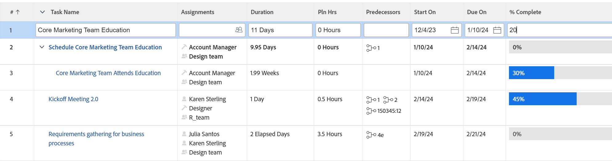

# Redigera objekt i en lista i [!DNL Adobe Workfront]

<!--Audited: 11/2024-->

Du kan redigera objekt textbundet när de visas i en lista eller rapport. När du redigerar informationen om objekt som visas i en lista eller rapport uppdateras objektet omedelbart.

När du infogar redigering av ett fält i ett anpassat formulär som inte är kopplat till objektet, läggs det anpassade formuläret automatiskt till objektet. Om fältet finns i flera anpassade formulär bifogas det anpassade formulär som uppdaterades senast till objektet.

Mer information om listor finns i [Kom igång med listor i [!DNL Adobe Workfront]](../../../workfront-basics/navigate-workfront/use-lists/view-items-in-a-list.md).

De flesta objekt som visas i listor eller rapporter går att redigera i [!DNL Adobe Workfront], men det finns vissa begränsningar, som:

* Du kan inte redigera beräknade fält eller [!DNL Workfront] inbyggda fält som är beräkningar.
* Du kan bara redigera fält som är direkt kopplade till objekten i listan. Du kan inte redigera fält som tillhör objekt som är kopplade till objekten i listan.

  Du kan till exempel redigera status för en uppgift i en uppgiftsrapport, men du kan inte redigera namnet på projektet som uppgiften är kopplad till i samma rapport. Du kan bara redigera namnet på projektet i en projektrapport.
* Du kan inte infoga redigeringsfält när vyn för en lista inte visar standardvalutan.

  Mer information om hur du visar standardvalutan finns i avsnittet [Redigera rapporter med unika valutor](../../../reports-and-dashboards/reports/creating-and-managing-reports/create-financial-data-reports-unique-exchange-rates.md#editing-reports-with-unique-currencies) i artikeln [Skapa rapporter om finansiella data med unika valutakurser](../../../reports-and-dashboards/reports/creating-and-managing-reports/create-financial-data-reports-unique-exchange-rates.md).
* Du kan inte redigera flaggor och ikoner som visas i en lista.
* Du kan inte infoga redigeringsrapportfält som har hämtats från andra rapporter.

## Åtkomstkrav

+++ Expandera om du vill visa åtkomstkrav för funktionerna i den här artikeln.

Du måste ha följande åtkomst för att kunna utföra stegen i den här artikeln:

<table style="table-layout:auto"> 
 <col> 
 <col> 
 <tbody> 
  <tr> 
   <td role="rowheader">Adobe Workfront</td> 
   <td> 
Alla
 </td> 
  </tr> 
  <tr> 
   <td role="rowheader">Adobe Workfront-licens*</td> 
   <td> 
    
Nytt:

   <ul><li>
Medarbetare eller högre 
</li>
   </ul>

Aktuell:

   <ul><li>
Begäran eller senare
</li>
    </ul></td> 
  </tr> 
  <tr> 
   <td role="rowheader">Konfigurationer på åtkomstnivå</td> 
   <td> 
[!UICONTROL Edit] behörighet till området som listan finns i
 
Om du till exempel vill kunna infoga redigeringsåtgärder i ett projekt behöver du [!UICONTROL Edit] åtkomst till projekt.
</td> 
  </tr> 
  <tr> 
   <td role="rowheader">Objektbehörigheter</td> 
   <td> 
[!UICONTROL Manage]
 
Du måste också ha behörighet att redigera vissa fält, t.ex. anpassade fält, status.
  </td> 
  </tr> 
 </tbody> 
</table>

*Mer information finns i [Åtkomstkrav i Workfront-dokumentation](/help/quicksilver/administration-and-setup/add-users/access-levels-and-object-permissions/access-level-requirements-in-documentation.md).

+++

## Redigera objekt textbundet

1. Gå till en lista med objekt som du vill redigera.

   Listan ska visa fält som tillhör de objekt eller fält som tillhör de objekt som är kopplade till objekten i listan.

1. Leta reda på objektet som du vill redigera och klicka sedan i ett fält i listan.

   >[!TIP]
   >
   >Om du har flera sidor kan du söka efter ett objekt med:
   >
   >   * **Sidnumrering**: Klicka på bakåt- och framåtpilarna för att navigera mellan sidorna.
   >     Området [!UICONTROL pagination] är placerat längst ned till höger i listan och är fortfarande fäst när du bläddrar igenom listan.
   >   * **Snabbfilter**: Klicka på filterikonen eller skriv Alt+F för att öppna snabbfiltret och ange sedan text för att endast visa objekt som innehåller den angivna texten.
   >     Snabbfiltret finns i listverktygsfältet. Mer information finns i [Använda snabbfiltret i en lista](../../../workfront-basics/navigate-workfront/use-lists/apply-quick-filter-list.md).

   Om fältet kan redigeras blir fältet och alla andra fält som visas i listan redigerbara celler.

   

1. Redigera informationen i cellen och tryck sedan på [!UICONTROL Enter].

   >[!NOTE]
   >
   >Om ett anpassat fält har konfigurerats för att tillåta formatering kan du fet, kursiv eller understruken text när fältet redigeras i en uppdaterad lista.
   >Mer information om hur du konfigurerar formatering för ett anpassat fält finns i [Skapa ett anpassat formulär](/help/quicksilver/administration-and-setup/customize-workfront/create-manage-custom-forms/form-designer/design-a-form/design-a-form.md).
   >Mer information om uppdaterade listor finns i avsnittet&quot;Skillnaden mellan de uppdaterade och de äldre listorna&quot; i artikeln [Kom igång med listor i [!DNL Adobe Workfront]](../../../workfront-basics/navigate-workfront/use-lists/view-items-in-a-list.md).

1. Tryck på [!UICONTROL Tab] för att gå till nästa redigerbara cell.
1. (Villkorligt) Om du inte kan spara redigeringarna och cellen visas med röda konturer, klickar du i fältet för att granska valideringsmeddelandet som visas bredvid cellen och gör lämpliga uppdateringar.

   Det här inträffar oftast när fel format används eller när ett obligatoriskt fält har lämnats tomt.

1. När du har ändrat alla celler trycker du på [!UICONTROL Enter] för att spara ändringarna.
