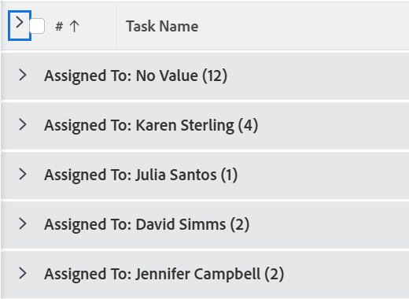
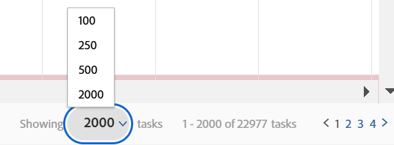

# Ändra hur en lista visas

I [!DNL Adobe Workfront] kan du anpassa hur en lista visas för dig. Andra användare som visar listan kan inte se dina ändringar.

Du kan göra följande anpassningar:

* Antalet objekt som visas
* Kolumnbredd eller -ordning
* Om grupperingarna är expanderade eller komprimerade

>[!NOTE]
>
>De ändringar du gör ovan återställs när du loggar ut från [!DNL Workfront] eller stänger webbläsaren. Dessa ändringar kan också återställas efter 8 timmar.

Förutom de tillfälliga anpassningarna ovan kan du även justera vilka kolumner listan sorterar efter, som [!DNL Workfront] behåller även efter att du har loggat ut eller stängt webbläsaren. Om någon ändrar sorteringsalternativen i en listvy behålls dock inte den tidigare sorteringsmarkeringen.

Mer information om hur du ändrar informationen som visas i listan finns i [Rapportera element: filter, vyer och grupperingar](../../../reports-and-dashboards/reports/reporting-elements/reporting-elements-filters-views-groupings.md).

## Åtkomstkrav

Du måste ha följande åtkomst för att kunna utföra stegen i den här artikeln:

<table style="table-layout:auto"> 
 <col> 
 <col> 
 <tbody> 
  <tr> 
   <td role="rowheader"><strong>[!DNL Adobe Workfront] plan*</strong></td> 
   <td> 
Alla
 </td> 
  </tr> 
  <tr> 
   <td role="rowheader"><strong>[!DNL Adobe Workfront] licens*</strong></td> 
   <td> 
[!UICONTROL Request] eller högre
 </td> 
  </tr> 
  <tr> 
   <td role="rowheader"><strong>Konfigurationer på åtkomstnivå*</strong></td> 
   <td> 
[!UICONTROL View] behörighet till området som listan finns i
 
Om du till exempel vill ändra vyn för ett projekt behöver du [!UICONTROL View] åtkomst till Projekt.
 
Obs! Om du fortfarande inte har åtkomst frågar du [!DNL Workfront]-administratören om de anger ytterligare begränsningar för din åtkomstnivå. Mer information om hur en [!DNL Workfront] -administratör kan ändra din åtkomstnivå finns i <a href="../../../administration-and-setup/add-users/configure-and-grant-access/create-modify-access-levels.md" class="MCXref xref">Skapa eller ändra anpassade åtkomstnivåer</a>.
 </td> 
  </tr> 
  <tr> 
   <td role="rowheader"><strong>Objektbehörigheter</strong></td> 
   <td> 
[!UICONTROL View] eller högre behörigheter för vyn som används i listan
 
Mer information om hur du begär ytterligare åtkomst finns i <a href="../../../workfront-basics/grant-and-request-access-to-objects/request-access.md" class="MCXref xref">Begär åtkomst till objekt </a>.
 </td> 
  </tr> 
 </tbody> 
</table>

&#42;Kontakta [!DNL Workfront]-administratören om du vill ta reda på vilken plan, licenstyp eller åtkomst du har.

## Ändra hur en lista visas

1. Gå till listan i [!DNL Workfront] som du vill ändra.

   <!--
   
 
   <MadCap:conditionalText data-mc-conditions="QuicksilverOrClassic.Draft mode">
   By default, groupings are collapsed.
   </MadCap:conditionalText>
     

   -->

1. (Valfritt och villkorligt) Om grupperingarna i listan är komprimerade och du vill visa mer information, klickar du på önskad gruppering för att expandera listan och visa den information som finns i den.

   eller

   Om du vill expandera alla grupperingar klickar du på pilen till höger om kryssrutan i kolumnrubriken.

   

1. (Valfritt och villkorligt) Om du vill visa ett visst antal objekt på skärmen klickar du på den nedrullningsbara menyn **[!UICONTROL Showing]** i skärmens nedre högra hörn och väljer sedan att visa **100**-, **250**-, **500**-, **[!UICONTROL All]**- eller **2000** -objekt.

   

   >[!TIP]
   >
   >Som standard visas 2 000 objekt för uppdaterade listor och 100 objekt för äldre listor. Om listan innehåller fler än 2 000 objekt kan du inte visa alla objekt på en sida.
   >
   >
   >För bästa prestanda i stora listor, där objekt innehåller formaterade textfält, rekommenderar vi att du begränsar det här talet till 250.
   >
   >
   >Mer information om de två listtyperna finns i avsnittet [Skillnaden mellan de uppdaterade och de äldre listorna](../../../workfront-basics/navigate-workfront/use-lists/view-items-in-a-list.md#updated) i artikeln [Kom igång med listor i [!DNL Adobe Workfront]](../../../workfront-basics/navigate-workfront/use-lists/view-items-in-a-list.md).

   Resultatet av listan sidnumreras för att visa det valda antalet objekt per sida. Du kommer åt resultaten på andra sidor genom att klicka på bakåt- och framåtpilarna eller välja en viss sida.

1. Om du vill ändra storlek på en kolumns bredd för du muspekaren över linjen som skiljer två kolumner åt och drar den sedan till önskad bredd genom att klicka.

   Kolumnens storlek ändras tills du rensar cacheminnet i webbläsaren eller tills du ändrar dess storlek manuellt igen.

1. Om du vill ändra ordningen på kolumnerna i en lista för du musen över en kolumnrubrik för att visa handverktyget och drar sedan kolumnen dit du vill att den ska visas.

   Kolumnens position sparas tills du uppdaterar sidan.\
   Mer information om hur du anpassar bredden och ordningen på kolumnerna i en lista finns i artikeln [Ändra kolumnbredd och ordning](../../../reports-and-dashboards/reports/reporting-elements/modify-column-width-order.md).

1. Om du vill justera sorteringsordningen för en lista klickar du på en kolumnrubrik för att markera den, trycker sedan på och håller ned CMD-tangenten (på [!DNL Mac]) eller CTRL-tangenten (på [!DNL Windows]) på tangentbordet och väljer upp till två ytterligare kolumnrubriker för att sortera efter dem.

   Listan sorteras efter var och en av de markerade kolumnerna i den ordning som du har markerat.

   Alla ändringar du gör i listan sparas direkt.

   >[!NOTE]
   >
   >Om du sorterar grupper i [!UICONTROL Groups]-området i [!UICONTROL Setup] delas inte hierarkivyn för grupper och deras undergrupper upp när du ändrar sättet som listan sorteras på. Undergrupper hålls ihop med sina överordnade grupper. Listan sorteras först efter grupper på den översta nivån. Under varje överordnad grupp sorteras sedan listan med undergrupper på samma nivå tillsammans.
