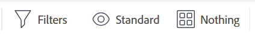
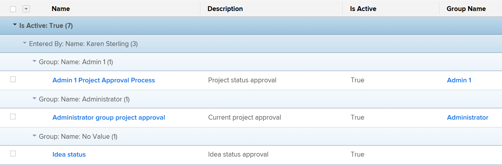
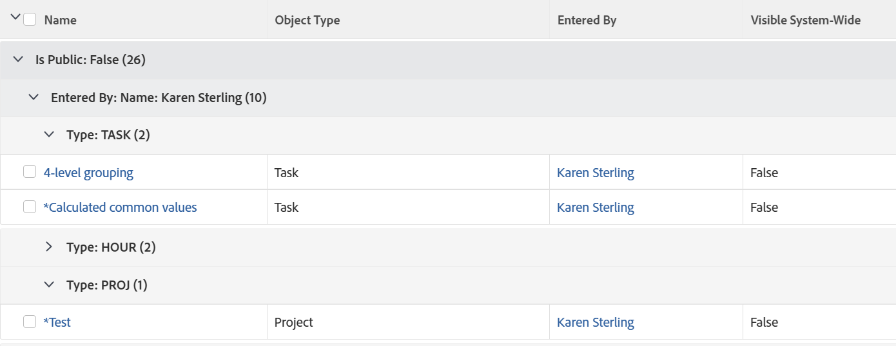

# Kom igång med listor i [!DNL Adobe Workfront]

<!--
{{highlighted-preview}}
-->

Du kan visa listor med objekt i [!DNL Adobe Workfront] om du vill ha information om dem, t.ex. start- och förfallodatum, användare som är tilldelade dem och andra objekt som är kopplade till dem.

Nedan följer några av listorna i [!DNL Workfront]:

* Listar uppdatera automatiskt var femte minut för att uppdatera information som andra användare i systemet uppdaterar någon annanstans.
* Vissa områden i [!DNL Workfront] är förkonfigurerade med standardlistor med objekt.

  Du kan anpassa de flesta av dessa förkonfigurerade listor.

* A [!DNL Workfront] administratören kan skapa anpassade listor som ska användas i olika områden i [!DNL Workfront].

  Mer information om hur du skapar listor på systemnivå finns i artikeln [Skapa, redigera och dela standardfilter, vyer och grupperingar](../../../administration-and-setup/set-up-workfront/configure-system-defaults/create-and-share-default-fvgs.md).

## Åtkomstkrav

Du måste ha följande åtkomst för att kunna utföra stegen i den här artikeln:

<table style="table-layout:auto"> 
 <col> 
 <col> 
 <tbody> 
  <tr> 
   <td role="rowheader"><strong>[!DNL Adobe Workfront] plan*</strong></td> 
   <td> 
Alla
 </td> 
  </tr> 
  <tr> 
   <td role="rowheader"><strong>[!DNL Adobe Workfront] licens*</strong></td> 
   <td> 
[!UICONTROL Request] eller högre
 </td> 
  </tr> 
  <tr> 
   <td role="rowheader"><strong>Konfigurationer på åtkomstnivå*</strong></td> 
   <td> 
[!UICONTROL View] eller bättre åtkomst till filter, vyer, grupperingar
 
För objekt i [!UICONTROL Setup] måste du ha administratörsbehörighet för objektet eller [!UICONTROL System Administrator] åtkomstnivå.
 
Obs! Om du fortfarande inte har åtkomst kan du fråga [!DNL Workfront] om de anger ytterligare begränsningar för din åtkomstnivå. För information om hur en [!DNL Workfront] administratören kan ändra din åtkomstnivå, se <a href="../../../administration-and-setup/add-users/configure-and-grant-access/create-modify-access-levels.md" class="MCXref xref">Skapa eller ändra anpassade åtkomstnivåer</a>.
 </td> 
  </tr> 
  <tr> 
   <td role="rowheader"><strong>Objektbehörigheter</strong></td> 
   <td> 
[!UICONTROL View] eller högre behörigheter med åtkomst till delning
 
Mer information om hur du begär ytterligare åtkomst finns i <a href="../../../workfront-basics/grant-and-request-access-to-objects/request-access.md" class="MCXref xref">Begär åtkomst till objekt </a>.
 </td>
  </tr> 
 </tbody> 
</table>

Kontakta din [!DNL Workfront] administratör.

## Objektlistor

Nedan finns några typer av objektlistor som du kan hitta i [!DNL Workfront] och vissa områden där de visas som standard när du har behörighet att visa ett objekt.

>[!NOTE]
>
>* Den här listan är inte heltäckande. Var och en av de här objektlistorna kan också visas i en rapport eller på en kontrollpanel. En projektrapport eller en kontrollpanel som innehåller en projektrapport visar till exempel även en lista med projekt.
>* I den här listan betyder &quot;select&quot; att du måste klicka på objektets namn, inte kryssrutan till vänster om namnet.

<table style="table-layout:auto"> 
 <col> 
 <col> 
 <thead> 
  <tr> 
   <th><strong>[!DNL Workfront] list</strong></th> 
   <th><strong>Objektlistans plats</strong></th> 
  </tr> 
 </thead> 
 <tbody> 
  <tr> 
   <td>Förteckning över portföljer</td> 
   <td> 
    <ul> 
     <li> 
[!UICONTROL Portfolios]
 </li> 
    </ul> </td> 
  </tr> 
  <tr> 
   <td>Lista över program</td> 
   <td> 
    <ul> 
     <li> 
[!UICONTROL Portfolios] &gt;[!UICONTROL select a portfolio] &gt;[!UICONTROL Programs]
 </li> 
     <li data-mc-conditions="QuicksilverOrClassic.Quicksilver"> 
[!UICONTROL Programs]
 </li> 
    </ul> </td> 
  </tr> 
  <tr> 
   <td>Lista över projekt</td> 
   <td> 
    <ul> 
     <li> 
[!UICONTROL Projects]
 </li> 
     <li> 
[!UICONTROL Portfolios] &gt;[!UICONTROL select a portfolio] &gt;[!UICONTROL Projects]
 </li> 
     <li> 
[!UICONTROL Portfolios] &gt;[!UICONTROL select a portfolio] &gt;[!UICONTROL Programs] &gt;[!UICONTROL select a program] &gt;[!UICONTROL Projects]
 </li> 
    </ul> </td> 
  </tr> 
  <tr> 
   <td>Lista över uppgifter</td> 
   <td> 
    <ul> 
     <li> 
[!UICONTROL Projects] &gt;[!UICONTROL select a project] &gt; [!UICONTROL Tasks]
 </li> 
     <li> 
[!UICONTROL Projects] &gt;[!UICONTROL select a project] &gt;[!UICONTROL Tasks] &gt;[!UICONTROL select a task] &gt;[!UICONTROL Subtasks]
 </li> 
     <li> 
[!UICONTROL Projects] &gt;[!UICONTROL select a project] &gt;[!UICONTROL Tasks] &gt;[!UICONTROL select a task] &gt; [!UICONTROL Predecessors*]
 </li> 
    </ul> </td> 
  </tr> 
  <tr> 
   <td>Lista över problem</td> 
   <td> 
    <ul> 
     <li> 
[!UICONTROL Projects] &gt; [!UICONTROL select] ett projekt &gt;[!UICONTROL Issues]
 </li> 
     <li> 
[!UICONTROL Projects] &gt;[!UICONTROL select a project] &gt;[!UICONTROL Tasks] &gt;[!UICONTROL select a task] &gt; [!UICONTROL Issues]
 </li> 
     <li> 
[!UICONTROL Projects] &gt;[!UICONTROL select a project] &gt;[!UICONTROL Tasks] &gt;[!UICONTROL select a task] &gt;[!UICONTROL Subtasks] &gt;[!UICONTROL select a task] &gt; [!UICONTROL Issues]
 </li> 
    </ul> </td> 
  </tr> 
  <tr> 
   <td>Förteckning över rapporter</td> 
   <td> 
    <ul> 
     <li> 
  [!UICONTROL Reports]  
 </li> 
    </ul> </td> 
  </tr> 
  <tr> 
   <td>Lista över kontrollpaneler</td> 
   <td> 
    <ul> 
     <li> 
[!UICONTROL Dashboards]
 </li> 
    </ul> </td> 
  </tr> 
  <tr> 
   <td>Lista med iterationer</td> 
   <td> 
    <ul> 
     <li> 
[!UICONTROL Teams] &gt; [!UICONTROL Iterations]
 </li> 
    </ul> </td> 
  </tr> 
  <tr> 
   <td>Lista över användare</td> 
   <td> 
    <ul> 
     <li> 
[!UICONTROL Users]
 </li> 
    </ul> </td> 
  </tr> 
  <tr> 
   <td>Förteckning över dokument</td> 
   <td> 
    <ul> 
     <li> 
[!UICONTROL Documents]
 </li> 
     <li> 
[!UICONTROL Portfolios] &gt;[!UICONTROL select a portfolio] &gt; [!UICONTROL Documents]
 </li> 
     <li> 
[!UICONTROL Portfolios] &gt; [!UICONTROL select a portfolio] &gt;[!UICONTROL Programs] &gt;[!UICONTROL select a program] &gt;[!UICONTROL Documents]
 </li> 
     <li> 
[!UICONTROL Projects] &gt;[!UICONTROL select a project] &gt;[!UICONTROL Documents]
 </li> 
     <li> 
[!UICONTROL Projects] &gt;[!UICONTROL select a project] &gt;[!UICONTROL Tasks] &gt;[!UICONTROL select a task] &gt; [!UICONTROL Documents]
 </li> 
     <li> 
[!UICONTROL Projects] &gt; [!UICONTROL select] ett projekt &gt; [!UICONTROL Issues] &gt;[!UICONTROL select an issue] &gt; [!UICONTROL Documents]
 </li> 
    </ul> </td> 
  </tr> 
  <tr> 
   <td>Lista över tidrapporter</td> 
   <td> 
    <ul> 
     <li> 
[!UICONTROL Timesheet] s &gt; [!UICONTROL All Timesheets]*
 </li> 
    </ul> </td> 
  </tr> 
  <tr> 
   <td>Lista över faktureringstariffer</td> 
   <td> 
    <ul> 
     <li> 
[!UICONTROL Projects] &gt;[!UICONTROL select a project] &gt;[!UICONTROL Billing Rates*]
 </li> 
    </ul> </td> 
  </tr> 
  <tr> 
   <td>Lista över faktureringsposter</td> 
   <td> 
    <ul> 
     <li> 
[!UICONTROL Projects] &gt; [!UICONTROL select a project] &gt; [!UICONTROL Billing Records]
 </li> 
    </ul> </td> 
  </tr> 
  <tr> 
   <td>Förteckning över risker</td> 
   <td> 
    <ul> 
     <li> 
[!UICONTROL Projects] &gt;[!UICONTROL select a project] &gt;[!UICONTROL Risks]
 </li> 
    </ul> </td> 
  </tr> 
  <tr> 
   <td>Lista över utgifter</td> 
   <td> 
    <ul> 
     <li> 
[!UICONTROL Projects] &gt;[!UICONTROL select] ett projekt &gt;[!UICONTROL Expenses]
 </li> 
     <li> 
[!UICONTROL Projects] &gt; [!UICONTROL select a project] &gt;[!UICONTROL Tasks] &gt;[!UICONTROL select a task] &gt;[!UICONTROL Expenses]
 </li> 
    </ul> </td> 
  </tr> 
  <tr> 
   <td>Lista över timposter</td> 
   <td> 
    <ul> 
     <li> 
[!UICONTROL Projects] &gt;[!UICONTROL select] ett projekt
 </li> 
     <li> 
[!UICONTROL Projects] &gt;[!UICONTROL select a project] &gt;[!UICONTROL Tasks] &gt;[!UICONTROL select a task] &gt;[!UICONTROL Hours]
 </li> 
     <li> 
[!UICONTROL Projects] &gt;[!UICONTROL select] ett projekt &gt;[!UICONTROL Issues] &gt;[!UICONTROL select] ett problem &gt;[!UICONTROL Hours]
 </li>
    </ul> </td> 
  </tr>
  <tr> 
   <td class="preview">Lista över anpassade formulär</td> 
   <td> 
    <ul> 
     <li class="preview"> 
[!UICONTROL Setup] &gt;[!UICONTROL Custom Forms]

     <!--Remove the following note box when this goes to Production. Or do this when the Preview highlighting becomes available.-->
     
<b>ANMÄRKNING</b>: Detta är för närvarande endast tillgängligt i förhandsvisningsmiljön
 </li> 
    </ul> </td> 
  </tr> 
  <tr> 
    <td>Lista över grupper eller undergrupper</td> 
   <td> 
    <ul> 
     <li> 
[!UICONTROL Setup] &gt;[!UICONTROL Groups]
 </li>
     <li> 
[!UICONTROL Setup] &gt;[!UICONTROL Groups] &gt;[!UICONTROL select the parent group] &gt;[!UICONTROL Subgroups] </li> 
    </ul> </td> 
  </tr> 
  <tr> 
   <td>Lista över team</td> 
   <td> 
    <ul> 
     <li> 
[!UICONTROL Setup] &gt;[!UICONTROL Teams]
 </li> 
    </ul> </td> 
  </tr>
  <tr> 
   <td>Förteckning över företag</td> 
   <td> 
    <ul> 
     <li> 
[!UICONTROL Setup] &gt;[!UICONTROL Companies]
 </li> 
    </ul> </td> 
  </tr>
  <tr> 
   <td>Lista över tidsplaner</td> 
   <td> 
    <ul> 
     <li> 
[!UICONTROL Setup] &gt;[!UICONTROL Schedules]
 </li> 
    </ul> </td> 
  </tr>
  <tr> 
   <td>Lista över layoutmallar</td> 
   <td> 
    <ul> 
     <li> 
[!UICONTROL Setup] &gt;[!UICONTROL Layout Templates]
 </li> 
    </ul> </td> 
  </tr>
 </tbody> 
</table>

Du kan inte anpassa listan i det angivna området. A [!DNL Workfront] administratören kan skapa en anpassad lista på systemnivå eller så kan du skapa en rapport för det här objektet om åtkomstnivån tillåter dig att redigera rapporter.

## Listelement

En lista innehåller vissa element som definierar dess format och den information som visas. Du kan hitta flera element i systemlistan som är tillgängliga som standard. Du kan också skapa anpassade element som passar dina behov.

>[!NOTE]
>
>När du väljer ett nytt filter, en ny vy eller en ny gruppering i en lista behålls markeringen även om du loggar ut från [!DNL Workfront] eller stänga webbläsaren.

Här följer några element i en lista:

<table style="table-layout:auto"> 
 <col> 
 <col> 
 <thead> 
  <tr> 
   <th><strong>Element</strong></th> 
   <th><strong>Förklaring</strong></th> 
  </tr> 
 </thead> 
 <tbody> 
  <tr> 
   <td><strong>[!UICONTROL Filter]</strong></td> 
   <td> 
Med filter tas onödig information bort från listan baserat på de kriterier du anger. 
 
Mer information finns i <a href="../../../reports-and-dashboards/reports/reporting-elements/filters-overview.md" class="MCXref xref">Översikt över filter</a>.
 </td> 
  </tr> 
  <tr> 
   <td><strong>[!UICONTROL View]</strong></td> 
   <td> 
Vyer definierar vilka fält (kolumner) som visas på skärmen.
 
Mer information finns i <a href="../../../reports-and-dashboards/reports/reporting-elements/views-overview.md" class="MCXref xref">Översikt över vyer i [!DNL Adobe Workfront]</a>.
 </td> 
  </tr> 
  <tr> 
   <td><strong>[!UICONTROL Grouping]</strong></td> 
   <td> 
Grupperingar separerar objekten i listan i områden baserat på de villkor du anger.
 
Problemen i en lista kan till exempel visas i avsnitt efter status eller prioritet.
 
Du kan ha upp till tre lager med grupperingar i en standardgruppering, och du kan lägga till ett fjärde lager om du konfigurerar en gruppering i textläge.
 
Mer information om grupperingar finns i <a href="../../../reports-and-dashboards/reports/reporting-elements/groupings-overview.md" class="MCXref xref">Översikt över grupperingar i [!DNL Adobe Workfront]</a>.
 
Mer information om textläge finns i <a href="../../../reports-and-dashboards/reports/text-mode/understand-text-mode.md" class="MCXref xref">Översikt över textläge</a>.
 </td> 
  </tr> 
 </tbody> 
</table>

Dessa element visas som standard överst i varje lista. De är kladdiga och rör sig inte när du bläddrar igenom listan. För musen över ikonen för varje element för att identifiera dem.

Du kan anpassa listelement i följande områden och dela dem med andra användare:

* En systemstandardlista finns i avsnittet [Kom igång med listor i [!DNL Adobe Workfront]](#default-workfront-lists) i den här artikeln
* Alla rapporter som delas med dig

Byggelementen för listor är desamma som byggelementen för rapporter.

Mer information om hur du skapar och anpassar element i listor och rapporter finns i [Rapportelement: filter, vyer och grupperingar](../../../reports-and-dashboards/reports/reporting-elements/reporting-elements-filters-views-groupings.md).

## Liståtgärder

Du kan slutföra följande åtgärder i en lista:

<table style="table-layout:auto"> 
 <col> 
 <col> 
 <thead> 
  <tr> 
   <th><strong>Åtgärd</strong></th> 
   <th><strong>Information</strong></th> 
  </tr> 
 </thead> 
 <tbody> 
  <tr> 
   <td><strong>Inline edit</strong> </td> 
   <td> 
Redigera objekt och deras information direkt i listan.
 
Mer information finns i <a href="../../../workfront-basics/navigate-workfront/use-lists/inline-edit-objects.md" class="MCXref xref">Redigera objekt i en lista i [!DNL Adobe Workfront]</a>.
 </td> 
  </tr> 
  <tr data-mc-conditions="QuicksilverOrClassic.Quicksilver"> 
   <td><strong>Uppdatera med [!UICONTROL Summary]</strong> </td> 
   <td> 
Uppdatera aktiviteter och ärenden på projektnivå med [!UICONTROL Summary] -panelen.
 
Tips! Sammanfattningen är inte tillgänglig för alla objekt och är inte tillgänglig i Aktivitets- eller problemrapporter.
 
Mer information finns i <a href="../../../workfront-basics/the-new-workfront-experience/summary-overview.md" class="MCXref xref">Sammanfattning</a>.
 </td> 
  </tr> 
  <tr> 
   <td><strong>Anpassa listvisning</strong> </td> 
   <td> 
Anpassa utseendet på en lista, kolumnordning, sorteringsordning för objekt eller antal objekt som visas.
 
Obs! Ändringar som du gör i antalet objekt som ska visas på en sida återställs när du loggar ut från [!DNL Workfront] eller stänga webbläsaren. Ändringarna kan också ångras efter 8 timmar.
 
Mer information finns i <a href="../../../workfront-basics/navigate-workfront/use-lists/modify-list-display.md" class="MCXref xref">Ändra hur en lista visas</a>.
 </td> 
  </tr> 
  <tr> 
   <td><strong>Snabbfilter</strong> </td> 
   <td> 
Använd ett snabbfilter för att bara hitta objekt som är viktiga för dig så att du snabbt kan granska, uppdatera eller dela dem med andra.
 
Viktigt: Du kan söka efter objekt som innehåller ett sökord med hjälp av snabbfiltret, oavsett om objektet är synligt på skärmen eller kommer att visas när du bläddrar längst ned på sidan. När du använder webbläsarens sökfunktioner kan du bara hitta objekt som redan är synliga på skärmen. Om listan innehåller flera sidor söker snabbfiltren bara efter objekten på den aktuella sidan.
 
Mer information finns i <a href="../../../workfront-basics/navigate-workfront/use-lists/apply-quick-filter-list.md" class="MCXref xref">Använda snabbfiltret på en lista</a>.
 </td> 
  </tr> 
  <tr> 
   <td><strong>Exportera</strong> </td> 
   <td> 
Exportera en lista med objekt från [!DNL Workfront]. Om en lista innehåller fler än 2 000 objekt är det enda sättet att granska alla objekt på en sida att exportera listan.
 
Mer information om hur du exporterar en lista finns i <a href="../../../workfront-basics/navigate-workfront/use-lists/export-lists.md" class="MCXref xref">Exportera en lista</a>. Mer information om exportformat och -begränsningar finns i <a href="../../../reports-and-dashboards/reports/creating-and-managing-reports/export-data.md" class="MCXref xref">Exportera data</a>.
 </td> 
  </tr> 
 </tbody> 
</table>

### Verktygsfältet Lista

I följande tabell visas många av de ikoner som är tillgängliga i verktygsfältet och vad som händer när du klickar på dem:

<table style="table-layout:auto"> 
 <col> 
 <col> 
 <col> 
 <tbody> 
  <tr> 
   <td><strong>Ikon</strong></td> 
   <td><strong>Beskrivning</strong></td> 
   <td><strong>Vid klickning</strong></td> 
  </tr> 
  <tr> 
   <td>  </td> 
   <td>[!UICONTROL Add item or user]</td> 
   <td>Öppna fler alternativ, inklusive att lägga till ett nytt objekt eller en ny användare.</td> 
  </tr> 
  <tr> 
   <td>  </td> 
   <td>[!UICONTROL Insert task above]</td> 
   <td> 
Infoga en uppgift ovanför den markerade uppgiften.
 
Detta är endast tillgängligt för uppgifter. 
 </td> 
  </tr> 
  <tr> 
   <td>  </td> 
   <td>[!UICONTROL Insert task below]</td> 
   <td> 
Infoga en uppgift under den valda uppgiften.
 
Detta är endast tillgängligt för uppgifter. 
 </td> 
  </tr> 
  <tr> 
   <td>  </td> 
   <td>[!UICONTROL Edit]</td> 
   <td>Redigera det markerade objektet.</td> 
  </tr> 
  <tr> 
   <td>  </td> 
   <td>[!UICONTROL Copy]</td> 
   <td>Kopiera det markerade objektet.</td> 
  </tr> 
  <tr> 
   <td>  </td> 
   <td>[!UICONTROL Delete]</td> 
   <td>Ta bort det markerade objektet.</td> 
  </tr> 
  <tr> 
   <td>  </td> 
   <td>[!UICONTROL Add to]</td> 
   <td> 
Öppna dialogrutan för att lägga till det markerade problemet i en iteration.
 
Detta är endast tillgängligt för utgåvor.
 </td> 
  </tr> 
  <tr> 
   <td>  </td> 
   <td>[!UICONTROL Share]</td> 
   <td>Dela det markerade objektet.</td> 
  </tr> 
  <tr> 
   <td>  </td> 
   <td>[!UICONTROL Indent and outdent tasks] </td> 
   <td> 
Dra in eller dra ut den markerade uppgiften. 
 
Detta är endast tillgängligt för uppgifter. 
 </td> 
  </tr> 
  <tr> 
   <td></a> </td> 
   <td>[!UICONTROL More]</td> 
   <td>Öppna ytterligare alternativ för det markerade objektet.</td> 
  </tr> 
  <tr> 
   <td> 
  
 </td> 
   <td> 
[!UICONTROL Quick filter] 
 </td> 
   <td> 
Öppna sökrutan för snabbfilter för att hitta objekt i den visade listan.
 </td> 
  </tr> 
  <tr> 
   <td>  </td> 
   <td>[!UICONTROL Export]</td> 
   <td>Exportera listan till PDF, Excel eller tabbavgränsade filer.</td> 
  </tr> 
  <tr> 
   <td>  </td> 
   <td>[!UICONTROL Agile View]</td> 
   <td>Visa listan i vyn Agile. Detta är endast tillgängligt för uppgifter.</td> 
  </tr> 
  <tr> 
   <td>  </td> 
   <td>[!UICONTROL Gantt Chart]</td> 
   <td> 
Visa listan i [!UICONTROL Gantt Chart] vy.
 
Detta är endast tillgängligt för projekt och uppgifter.
 </td> 
  </tr> 
  <tr data-mc-conditions=""> 
   <td>  
  
 </td> 
   <td>[!UICONTROL Filter] nedrullningsbar meny</td> 
   <td> 
Visa en lista med filter och ytterligare alternativ för att hantera filter, inklusive att skapa ett. 
 
På en liten skärm ersätts filternamnet av filterikonen. En blå punkt visas på filterikonen när du använder något annat filter än "[!UICONTROL All]."
 </td> 
  </tr> 
  <tr data-mc-conditions=""> 
   <td>  
  
 </td> 
   <td>[!UICONTROL View] nedrullningsbar meny</td> 
   <td> 
Visa en lista med vyer och ytterligare alternativ för att hantera vyer, inklusive att skapa en. 
 
På en liten skärm ersätts visningsnamnet av [!UICONTROL view] -ikon. En blå punkt visas på [!UICONTROL View] ikon när du använder någon annan vy än[!UICONTROL Standard]."
 </td> 
  </tr> 
  <tr data-mc-conditions=""> 
   <td>  
  
 </td> 
   <td>[!UICONTROL Grouping] nedrullningsbar meny</td> 
   <td> 
Visa en lista med grupperingar och ytterligare alternativ för att hantera grupperingar, inklusive att skapa en. 
 
På en liten skärm ersätts grupperingsnamnet av [!UICONTROL grouping] -ikon. En blå punkt visas på [!UICONTROL Grouping] -ikon när du använder någon annan gruppering än "[!UICONTROL Nothing]."
 </td> 
  </tr> 
  <tr data-mc-conditions=""> 
   <td>  </td> 
   <td> 
[!UICONTROL Plan mode]
 </td> 
   <td> 
Välj om du vill spara de ändringar du gör i en uppgiftslista automatiskt eller manuellt. 
 
Mer information om hur du redigerar uppgifter i en lista finns i <a href="/help/quicksilver/manage-work/tasks/manage-tasks/edit-tasks-in-a-list.md" class="MCXref xref">Redigera uppgifter i en lista</a>. 
 
Detta är endast tillgängligt för uppgifter.
 </td> 
  </tr> 
  <tr> 
   <td>  </td> 
   <td>[!UICONTROL Summary]</td> 
   <td> 
Visa eller dölj [!UICONTROL Summary] för det markerade objektet.
 
Detta är endast tillgängligt för uppgifter och ärenden.
 
Mer information om [!UICONTROL Summary] i den nya [!DNL Adobe Workfront] upplevelse, se <a href="/help/quicksilver/workfront-basics/the-new-workfront-experience/summary-overview.md" class="MCXref xref">Sammanfattning</a>.
 </td> 
  </tr> 
  <tr> 
   <td>  </td> 
   <td>[!UICONTROL Remove]</td> 
   <td>Ta bort något från listan. Som gruppadministratör som hanterar grupp- eller undergruppsmedlemskap tar du bort en gruppmedlem enligt anvisningarna i <a href="/help/quicksilver/administration-and-setup/manage-groups/create-and-manage-groups/view-and-manage-a-groups-memberships.md" class="MCXref xref">Visa och hantera medlemskap i en grupp</a>.</td> 
  </tr> 
  <tr> 
   <td>  </td> 
   <td>[!UICONTROL Comment] /[!UICONTROL Update]</td> 
   <td> 
Skriv en kommentar eller uppdatering.
 </td> 
  </tr> 
 </tbody> 
</table>

## Skillnaden mellan listor och rapporter

Både listor och rapporter är stödraster som innehåller information om en typ av objekt.

I följande tabell beskrivs likheterna och skillnaderna mellan listor och rapporter:

<table style="table-layout:auto"> 
 <col> 
 <col> 
 <col> 
 <thead> 
  <tr> 
   <th><strong>Funktionalitet</strong> </th> 
   <th><strong>Lista</strong> </th> 
   <th><strong>Rapport</strong> </th> 
  </tr> 
 </thead> 
 <tbody> 
  <tr> 
   <td> 
Alla kan skapa dem
 </td> 
   <td>✓* </td> 
   <td> </td> 
  </tr> 
  <tr> 
   <td> 
Endast en [!DNL Workfront] administratörer och användare med [!UICONTROL Plan] licens kan skapa dem
 </td> 
   <td> </td> 
   <td>✓**</td> 
  </tr> 
  <tr> 
   <td> 
En standarduppsättning är tillgänglig från [!DNL Workfront]
 </td> 
   <td>✓</td> 
   <td>✓</td> 
  </tr> 
  <tr> 
   <td> 
Anpassningsbart i standardläge
 </td> 
   <td>✓</td> 
   <td>✓</td> 
  </tr> 
  <tr> 
   <td> 
Anpassningsbart i textläge
 </td> 
   <td>✓</td> 
   <td>✓</td> 
  </tr> 
  <tr> 
   <td> 
Du kan dela dem med andra användare
 </td> 
   <td>✓</td> 
   <td>✓</td> 
  </tr> 
  <tr> 
   <td> 
Du kan dela dem i hela systemet
 </td> 
   <td>✓</td> 
   <td> ✓ </td> 
  </tr> 
  <tr> 
   <td> 
Du kan dela dem utanför systemet
 </td> 
   <td> </td> 
   <td>✓ </td> 
  </tr> 
  <tr> 
   <td> 
Du kan exportera till PDF, [!DNL Excel]och tabbavgränsade format
 </td> 
   <td>✓</td> 
   <td> ✓ </td> 
  </tr> 
  <tr> 
   <td> 
Du kan schemalägga dem för leverans i ett e-postmeddelande
 </td> 
   <td> </td> 
   <td>✓ </td> 
  </tr> 
  <tr> 
   <td> 
Du kan lägga till i en layoutmall
 </td> 
   <td>✓</td> 
   <td> </td> 
  </tr> 
  <tr> 
   <td> 
Du kan lägga till dem i anpassade avsnitt 
 </td> 
   <td> </td> 
   <td>✓</td> 
  </tr> 
  <tr> 
   <td> 
Du kan lägga till dem på en kontrollpanel
 </td> 
   <td> ✓** </td> 
   <td>✓</td> 
  </tr> 
  <tr> 
   <td> 
Du kan använda uppmaningar för att anpassa vad de visar
 </td> 
   <td> </td> 
   <td>✓</td> 
  </tr> 
  <tr> 
   <td> 
Du kan visa dem i ett diagram
 </td> 
   <td> </td> 
   <td>✓</td> 
  </tr> 
  <tr> 
   <td> 
Du kan infoga redigeringsobjekt i dem
 </td> 
   <td>✓</td> 
   <td>✓</td> 
  </tr> 
 </tbody> 
</table>

Du måste ha tillgång till filter, vyer och grupperingar för att kunna skapa dem. Mer information finns i [Bevilja åtkomst till filter, vyer och grupperingar](../../../administration-and-setup/add-users/configure-and-grant-access/grant-access-fvg.md).

Du måste ha tillgång till filter, vyer och grupperingar samt rapporter, kontrollpaneler och kalendrar för att kunna skapa dem. Mer information finns i [Ge åtkomst till rapporter, instrumentpaneler och kalendrar](../../../administration-and-setup/add-users/configure-and-grant-access/grant-access-reports-dashboards-calendars.md).

Du kan bara anpassa listor för rapporter som placeras på en kontrollpanel om rapportens skapare har konfigurerat listelementen så att de visas på kontrollpanelen.

>[!NOTE]
>
>Du kan inte lägga till en lista på en kontrollpanel utan att först skapa en rapport och lägga till den på kontrollpanelen.

Mer information om hur du skapar en rapport finns i [Skapa en anpassad rapport](../../../reports-and-dashboards/reports/creating-and-managing-reports/create-custom-report.md). Mer information om hur du skapar anpassade avsnitt finns i [Skapa anpassade flikar eller avsnitt](../../../workfront-basics/manage-your-account-and-profile/configuring-your-user-profile/create-custom-tabs.md).

## Skillnaden mellan de uppdaterade och de äldre listorna

Det finns två typer av listor i [!DNL Workfront]:

* Äldre listor

  

* Uppdaterade listor

  

Båda listtyperna visas i [!DNL Adobe Workfront].

Alla listor och rapporter i [!DNL Adobe Workfront] är uppdaterade listor, utom följande:

* Listor i [!UICONTROL Setup] area
* Listor i [!UICONTROL Reports] area

I följande tabell visas några av skillnaderna mellan äldre och uppdaterade listor i [!DNL Workfront]:

<!--
 [Legacy does not equal Classic. Legacy lists appear in NWE and Classic. Updated lists appear in NWE and Classic.]
-->

<table style="table-layout:auto"> 
 <col> 
 <col> 
 <tbody> 
  <tr> 
   <td><b>Äldre listor</b></td> 
   <td><b>Uppdaterade listor</b></td> 
  </tr> 
  <tr> 
   <td> 
Äldre teckensnitt, kolumnrubriker, blått grupperingsfärgschema
 </td> 
   <td> 
Uppdaterade teckensnitt, kolumnrubriker, grå grupperingsfärgschema
 </td> 
  </tr> 
  <tr> 
   <td> 
Långsammare redigering
 </td> 
   <td> 
Snabbare redigering
 </td> 
  </tr> 
  <tr> 
   <td> 
Visa <strong>100</strong> objekt som standard
 </td> 
   <td> 
Visa <strong>Alla</strong> eller upp till <strong>2000</strong> objekt som standard
 </td> 
  </tr> 
  <tr> 
   <td> 
Använd CTRL+F för att hitta objekt i en lista
 </td> 
   <td> 
Använd snabbfilter för att snabbt hitta information i en stor lista
 
Mer information om hur du använder snabbfilter i listor finns i <a href="../../../workfront-basics/navigate-workfront/use-lists/apply-quick-filter-list.md" class="MCXref xref">Använda snabbfiltret på en lista</a>.
 </td> 
  </tr> 
  <tr> 
   <td>Du kan inte infoga redigering av anpassade fält med formatering av formaterad text.</td> 
   <td> 
Text i anpassade fält med formatering kan konfigureras för fet stil, kursiv stil, understrykning, punkter, numrering, hyperlänkar och blockcitattecken.
 
Mer information finns i <a href="../../../administration-and-setup/customize-workfront/create-manage-custom-forms/create-or-edit-a-custom-form.md" class="MCXref xref">Skapa eller redigera ett anpassat formulär</a>.
 </td> 
  </tr> 
  <tr> 
   <td>Villkorsstyrd formatering kan ändra textfärgen på länkar i en lista</td> 
   <td>Det går inte att använda textfärgändringar på länkar i en lista</td> 
  </tr> 
 </tbody> 
</table>
