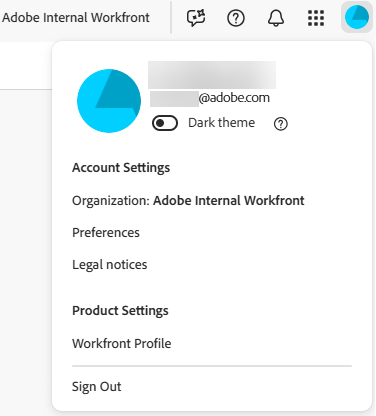

# [!DNL Adobe Unified Experience] för [!DNL Workfront]

<!--Audited: 10/2024-->

Om du får åtkomst till [!DNL Workfront] via [!DNL Adobe CX Enterprise] får du en smidig, enhetlig upplevelse för att hantera alla dina [!DNL Adobe]-program. Med en identitetshantering kan du logga in på ett och samma ställe, utan flera URL:er eller inloggnings-ID:n.

## Åtkomstkrav

+++ Expandera om du vill visa åtkomstkrav för funktionerna i den här artikeln. 

<table style="table-layout:auto"> 
 <col> 
 <col> 
 <tbody> 
  <tr> 
   <td role="rowheader"><strong>Adobe Workfront package</strong></td> 
   <td> 
Alla
 </td> 
  </tr> 
  <tr> 
   <td role="rowheader"><strong>Adobe Workfront-licens</strong></td> 
   <td> 
Medarbetare eller högre
 
   
Begäran eller senare
 </td> 
  </tr> 
 </tbody> 
</table>

Mer information finns i [Åtkomstkrav i Workfront-dokumentation](/help/quicksilver/administration-and-setup/add-users/access-levels-and-object-permissions/access-level-requirements-in-documentation.md).

+++

## Förutsättningar

Organisationens instans av [!DNL Workfront] måste vara registrerad för [!DNL Adobe Business Platform] eller [!DNL Adobe Admin Console].

Om du har frågor om introduktion till [!DNL Adobe Admin Console] kan du läsa [[!DNL Adobe Unified Experience] Vanliga frågor](/help/quicksilver/workfront-basics/navigate-workfront/workfront-navigation/unified-experience-faq.md/).

## Adobe Identity Management System (IMS)

Som en del av övergången till Adobe Unified Experience använder er organisation nu Adobe Identity Management System för att autentisera användare. Det innebär att du loggar in på Workfront via Adobe i stället för direkt till Workfront. Adobe IMS kräver också att Workfront-administratörer hanterar användarhantering i Adobe Admin Console i stället för i Workfront.

Information om hur du loggar in på Workfront i Adobe Unified Experience finns i [Logga in på Adobe CX Enterprise](#log-in-to-adobe-cx-enterprise) i den här artikeln.

Mer information om användarhantering i Adobe Admin Console finns i artikeln [Hantera användare i Adobe Admin Console](/help/quicksilver/administration-and-setup/add-users/create-and-manage-users/admin-console.md).

## Logga in på [!DNL Adobe CX Enterprise]

1. Öppna ett webbläsarfönster och gå till <https://experience.adobe.com>.
1. På skärmen [!UICONTROL **Logga in**] skriver du din e-postadress och klickar på **[!UICONTROL Continue]**.

   ![Logga in på [!DNL Adobe CX Enterprise]](assets/aec-login-page.png)

>[!NOTE]
>
>Om en webbläsarflik förfaller på en sida där Workfront är öppet och du har en aktiv Workfront-session på en annan webbläsarflik, kan du läsa in den föråldrade fliken igen för att öppna Workfront-sidan igen.

## Åtkomst [!DNL Workfront]

När du har loggat in på [!DNL Adobe CX Enterprise] kan du visa alla [!DNL Workfront]-organisationer och miljöer som du har tillgång till genom att klicka på organisationsväljaren i det övre navigeringsområdet. Välj den [!DNL Workfront]-organisation eller miljö som du vill arbeta i. Miljöer kan innehålla [!UICONTROL Preview] och [!UICONTROL Sandbox] om din organisation använder dem.

![Visa [!DNL Workfront] organisationer och miljöer](assets/wf-org-instance-switcher-2026.png)

>[!NOTE]
>
>Första gången du loggar in på [!DNL Adobe CX Enterprise] blir organisationen som standard den första i alfabetisk lista. Nästa gång du loggar in blir organisationen som standard den senaste du besökte.

[!DNL Workfront] visas i listan över [!DNL Adobe CX Enterprise] produkter som du har tillgång till. Du kan välja [!DNL Workfront] på snabbåtkomstmenyn på startsidan för [!DNL CX Enterprise] eller använda produktväljaren  för att ändra program när som helst.

![Välj [!DNL Workfront] för att komma åt programmet](assets/cx-enterprise-home-2026.png)

## Navigera [!DNL Workfront]

Använd ikonen [!UICONTROL Main Menu]  till vänster om navigeringsfältet i [!DNL Workfront] för att navigera till sidor som du har tillgång till. Vilka alternativ som är tillgängliga i [!UICONTROL Main Menu] beror på:

* **Layoutmallskonfigurationer**: Information om hur en [!DNL Workfront] -administratör kan ändra [!UICONTROL Main Menu] från en layoutmall finns i [&#x200B; Anpassa [!UICONTROL Main Menu] med hjälp av en layoutmall &#x200B;](/help/quicksilver/administration-and-setup/customize-workfront/use-layout-templates/customize-main-menu.md) .
* **Licenstyp**: Information om standardkonfigurationerna för olika licenstyper finns i [Förstå navigeringen för en [!UICONTROL Light] -licensanvändare &#x200B;](/help/quicksilver/workfront-basics/navigate-workfront/workfront-navigation/reviewer-global-navigation-bar.md) eller [Förstå navigeringen för en [!UICONTROL Work] -licensanvändare](/help/quicksilver/workfront-basics/navigate-workfront/workfront-navigation/worker-global-navigation-bar.md) .

## Få åtkomst till din profil och dina inställningar

Du kommer åt din profil och dina inställningar genom att klicka på Adobe-kontomenyn (din profilbild) i det övre navigeringsområdet.

Med den här menyn kan du:

* Välj **[!UICONTROL Dark theme]**-formatering för [!DNL Adobe CX Enterprise].
* Ange **[!UICONTROL Preferences]** för [!DNL Adobe CX Enterprise], inklusive inställningar för primärt och sekundärt språk.

  >[!NOTE]
  >
  >Datuminställningarna baseras på de primära språkinställningarna. Om du till exempel väljer **Engelska (USA)** visas datum i formatet MM/DD/YYY, medan du väljer **Engelska (Storbritannien)** visas datum i formatet DD/MM/YYYY.

* Få åtkomst till din **[!UICONTROL [!DNL Workfront] Profile]**. När du är med i profilen klickar du på **[!UICONTROL More]**-menyn  och väljer **[!UICONTROL Edit]**. Mer information om profilen finns i [Konfigurera mina inställningar](/help/quicksilver/workfront-basics/manage-your-account-and-profile/configuring-your-user-profile/configure-my-settings.md).
* **[!UICONTROL Sign out]** av [!DNL Adobe CX Enterprise].

## Hantera ditt lösenord

>[!NOTE]
>
>Om du ändrar ditt lösenord ändras det för alla dina [!DNL Adobe CX Enterprise]-program.

Lösenordet hanteras inte i [!DNL Workfront].

Om din organisation använder ett separat program för att hantera lösenord ändrar du lösenordet genom den leverantören.

Om ditt lösenord hanteras av [!DNL Adobe] kan du ändra lösenordet i ditt Adobe-konto.

[Läs den här artikeln om hur du ändrar ditt Adobe-lösenord.](https://helpx.adobe.com/se/account/individual/sign-in-and-security/security-and-recovery/reset-adobe-password.html){target="_blank"}

Kontakta administratören om du vill ha mer information om hur du ändrar ditt lösenord.

