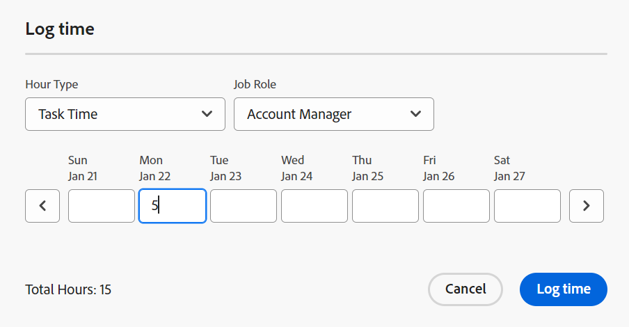
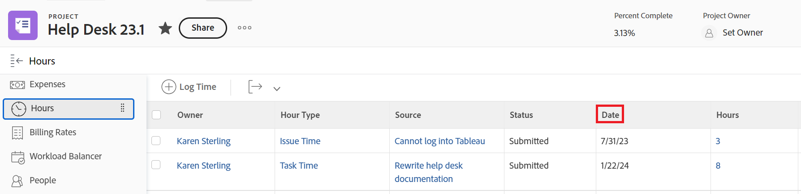

# Översikt över projekt-, uppgifts- och utgivningsdatum i [!DNL Adobe Workfront]

<!--

(NOTE: consider expanding on this article with ALL dates for PTIs - Hand off dates, Approval Dates, etc) 

-->

I den här artikeln finns definitioner för de vanligaste datumen som är associerade med projekt, uppgifter och problem i [!DNL Adobe Workfront]. Bilderna här är exempel på var datumen visas i Workfront och de är inte fullständiga. Det finns andra områden som visar datumen. Alla datum visas också i projekt, uppgifter och utgivningsrapporter och listor.

Mer information om rapporter och listor finns i följande artiklar:

* [Kom igång med listor i [!DNL Adobe Workfront]](../../../workfront-basics/navigate-workfront/use-lists/view-items-in-a-list.md)
* [Kom igång med rapporter](../../../reports-and-dashboards/reports/reporting/get-started-reports-workfront.md)

Mer information om projekt-, aktivitets- och problemfält finns i [Ordlista för [!DNL Adobe Workfront] terminologi](../../../workfront-basics/navigate-workfront/workfront-navigation/workfront-terminology-glossary.md).

## [!UICONTROL Planned Start Date]

The [!UICONTROL Planned Start Date] är det datum då ett projekt, en uppgift eller en utgåva planeras att starta.

Beroende på [!UICONTROL Task Constraint]kanske du inte kan redigera [!UICONTROL Planned Start Date] för en uppgift. Beroende på [!UICONTROL Schedule Mode] i projektet kanske du inte kan redigera [!UICONTROL Planned Start Date] av ett projekt.

Mer information finns i [Översikt [!UICONTROL Planned Start Date]](../../../manage-work/projects/planning-a-project/project-planned-start-date.md).

## [!UICONTROL Planned Completion Date]

The [!UICONTROL Planned Completion Date] eller [!UICONTROL Due On] datum är det datum då ett projekt, en uppgift eller en utgåva planeras att slutföras.

Beroende på [!UICONTROL Task Constraint]kanske du inte kan redigera [!UICONTROL Planned Completion Date] för en uppgift. Beroende på [!UICONTROL Schedule Mode] i projektet kanske du inte kan redigera [!UICONTROL Planned Completion Date] av ett projekt.

The [!UICONTROL Planned Completion Date] visas som Förfallodatum i vissa områden i [!DNL Workfront].

Mer information finns i följande artiklar:

* [Översikt över uppgiften [!UICONTROL Planned Completion Date]](../../../manage-work/tasks/task-information/task-planned-completion-date.md)
* [Ställ in projektet [!UICONTROL Planned Completion Date]](../../../manage-work/projects/planning-a-project/project-planned-completion-date.md)
* [Översikt över problemet [!UICONTROL Planned Completion Date]](../../../manage-work/issues/issue-information/issue-planned-completion-date.md)

## [!UICONTROL Entry Date]

The [!UICONTROL Entry Date] är det datum då ett projekt, en uppgift eller ett problem skapades i Workfront.

The [!UICONTROL Entry Date] påverkar inte tidslinjen för projekt, uppgifter eller problem, men det är viktigt för spårnings- och rapporteringsändamål. [!DNL Workfront] genererar automatiskt [!UICONTROL Entry Date] när objektet skapas och du inte kan redigera det manuellt.

## [!UICONTROL Actual Start Date]

The [!UICONTROL Actual Start Date] är det datum då en användare faktiskt börjar arbeta med ett projekt, en uppgift eller ett problem. The [!UICONTROL Actual Start Date] är tom när projektet, aktiviteten eller utgåvan skapas.

Du kan ange manuellt när arbetet påbörjas med en uppgift eller ett problem, eller [!UICONTROL Actual Start Date] fylls i automatiskt när aktiviteten eller utgivningsstatusen ändras från [!UICONTROL New] till [!UICONTROL In Progress] eller [!UICONTROL Complete]. The [!UICONTROL Actual Start Date] för ett projekt sammanfaller med datumet då den första aktiviteten i projektet startar.

>[!TIP]
>
>The [!UICONTROL Actual Start Date] matchar inte en [!UICONTROL Planned Start Date] för ett projekt, en uppgift eller ett fel eftersom användaren kan börja arbeta senare eller tidigare än det planerade datumet.

Mer information finns i [Översikt [!UICONTROL Actual Start Date]](../../../manage-work/projects/planning-a-project/project-actual-start-date.md).

>[!NOTE]
>
>The [!UICONTROL Must Start On] aktiviteten eller begränsningarna Fasta datum påverkar [!UICONTROL Planned Start Date] för en uppgift, inte [!UICONTROL Actual Start Date]. Detta uppdaterar [!UICONTROL Planned Start Date] till ett datum som du anger. The [!UICONTROL Actual Start Date] uppdateras oberoende av [!UICONTROL Planned Start Date], enligt beskrivningen ovan.

## [!UICONTROL Actual Completion Date]

The [!UICONTROL Actual Completion Date] är det datum som en användare faktiskt slutför ett projekt, en uppgift eller ett problem. The [!UICONTROL Actual Completion Date] är tom när projektet, aktiviteten eller utgåvan skapas.

Du kan ange manuellt när arbetet har slutförts för en uppgift eller ett problem, eller [!UICONTROL Actual Complete Date] fylls i automatiskt när något av följande inträffar:

* Status för projekt, uppgift eller utleverans ändras till [!UICONTROL Complete], [!UICONTROL Closed], eller [!UICONTROL Resolved].
* Aktivitets- eller projektprocenten slutförd är 100 %.

The [!UICONTROL Actual Completion Date] för ett projekt sammanfaller med datumet då du slutförde den sista uppgiften i projektet.

>[!TIP]
>
>The [!UICONTROL Actual Completion Date] matchar inte [!UICONTROL Planned Completion Date].

Mer information finns i [Översikt [!UICONTROL Actual Completion Date]](../../../manage-work/projects/planning-a-project/project-actual-completion-date.md).

## [!UICONTROL Commit Date]

The [!UICONTROL Commit Date] är det datum då en användare som har tilldelats en aktivitet eller ett problem förbinder sig att slutföra uppgiften eller problemet. Detta skiljer sig från [!UICONTROL Planned Completion Date], eftersom det är en mer realistisk uppskattning av det slutdatum som endast anges av den användare som ansvarar för arbetet. Mer information finns i [[!UICONTROL Commit Date] översikt](../../../manage-work/projects/updating-work-in-a-project/overview-of-commit-dates.md).

>[!NOTE]
>
>Ändra [!UICONTROL Commit Date] påverkar [!UICONTROL Projected Completion Date] men inte [!UICONTROL Planned Completion Date] för en uppgift eller ett problem. Projektledaren kan använda de ändringar som en tilldelad gör på [!UICONTROL Commit Date] för att uppdatera [!UICONTROL Planned Completion Date] för en uppgift eller ett problem.

## [!UICONTROL Projected Start Date]

The [!UICONTROL Projected Start Date] är ett realtidsdatum när projektet, uppgiften eller utgåvan inträffar och alla förseningar beaktas. Detta är ett mer korrekt startdatum för projektet, aktiviteten eller utgåvan än [!UICONTROL Planned Start Date]. The [!UICONTROL Planned Start Date] tar inte hänsyn till förseningar eller tidigare datum.

När du först planerar ett projekt, [!UICONTROL Planned Start Date] och [!UICONTROL Projected Start Date] uppgifterna och projektet är identiska. Eftersom förseningar kan inträffa eller uppgifter kan slutföras tidigare, kan [!UICONTROL Projected Start Date] kan bli annorlunda än [!UICONTROL Planned Start Date].

För en uppgift: [!UICONTROL Projected Start Date] kan också skilja sig från [!UICONTROL Planned Start Date] när någon av dess föregångare ligger efter schemat.

>[!TIP]
>
>Du kan visa [!UICONTROL Projected Start Date] för en utgåva endast i en lista eller rapport.

Mer information finns i [Översikt [!UICONTROL Projected Start Date]](../../../manage-work/projects/planning-a-project/project-projected-start-date.md).

## [!UICONTROL Projected Completion Date]

The [!UICONTROL Projected Completion Date] är en beräknad indikator i realtid för när projektet, uppgiften eller utgåvan ska slutföras. När projektet, aktiviteten eller utgåvan har markerats som Slutfört visas [!UICONTROL Projected Completion Date] Ändringar av datumet för [!UICONTROL Actual Completion Date].

Om allt blir som planerat [!UICONTROL Projected Completion date] ska matcha [!UICONTROL Planned Completion Date]. I annat fall på grund av fördröjningar för föregående aktiviteter [!UICONTROL Projected Completion Date] kan skilja sig från [!UICONTROL Planned Completion Date].

Mer information finns i [Översikt över [!UICONTROL Projected Completion Date] för projekt, uppgifter och ärenden](../../../manage-work/projects/planning-a-project/project-projected-completion-date.md).

## [!UICONTROL Hour Entry Date]

När du loggar tid för projekt, uppgifter och utleveranser för att ange hur mycket faktisk tid (i timmar) du tillbringar med att arbeta med projektet, aktiviteten eller problemet, blir tiden du loggar [!UICONTROL Actual Hours] av projektet, uppgiften eller utgåvan.

Datumet då du loggar tiden är [!UICONTROL Hour Entry Date] fält på timinmatningen. I vissa timlistor och rapporter visas Timinmatningsdatum som datum.

>[!TIP]
>
>The [!UICONTROL Hour Entry Date] skiljer sig från [!UICONTROL Entry Date] på så sätt att det inte är datumet då timloggen skapades, utan det datum som du vill associera timmarna till.

Du kan logga och visa tiden i följande områden i Workfront:

* Logga och visa tiden i [!UICONTROL project], [!UICONTROL task], eller [!UICONTROL issue Updates] eller i [!UICONTROL Hours] -avsnitt. När du loggar in i [!UICONTROL Hours] kan du ange timanmälningsdatum och användaren som timmarna tillhör manuellt.

  

  Mer information finns i [Loggtid](../../../timesheets/create-and-manage-timesheets/log-time.md).

  >[!TIP]
  >
  >Vi rekommenderar att du loggar in på arbetsuppgifter och problem i stället för överordnade uppgifter eller projekt. Den tid som är inloggad på arbetsuppgifterna sammanställs med de överordnade uppgifterna och projektet som [!UICONTROL Actual Hours] för de överordnade aktiviteterna och projektet. Tid för inloggningsproblem räknas upp till projektet som [!UICONTROL Actual Hours] för projektet.

* Logga tid i uppdateringsflödet för en uppgift eller ett problem.

  

* Visa [!UICONTROL Hour Entry Dates] i timrapporter och listor.

  
