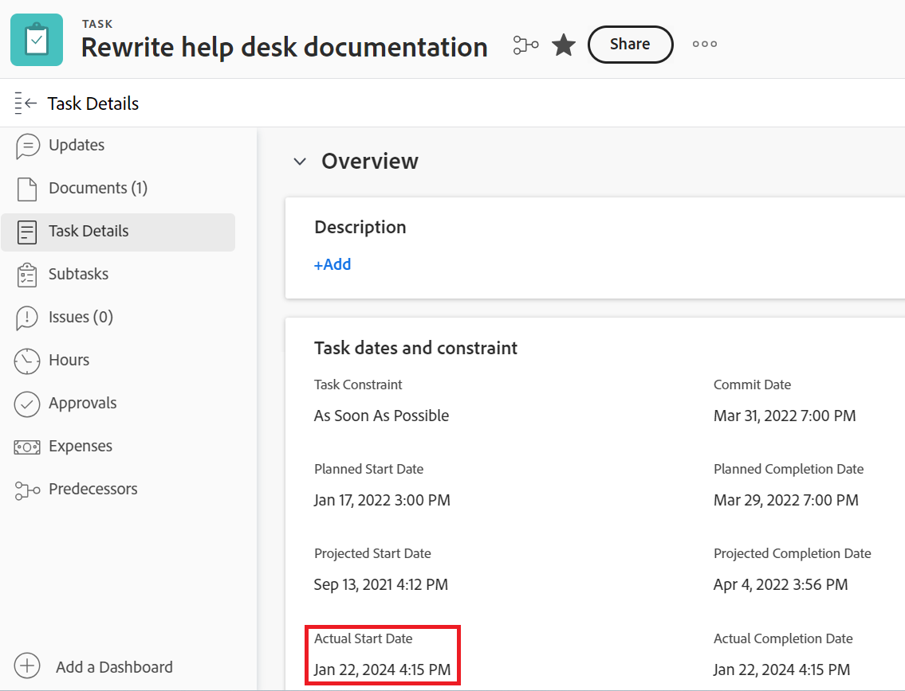
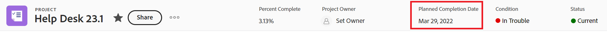
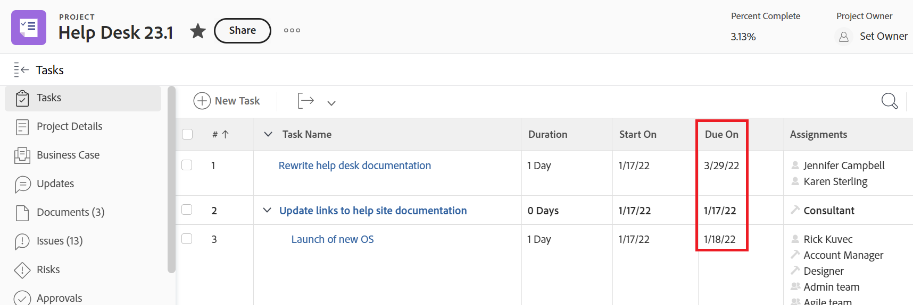
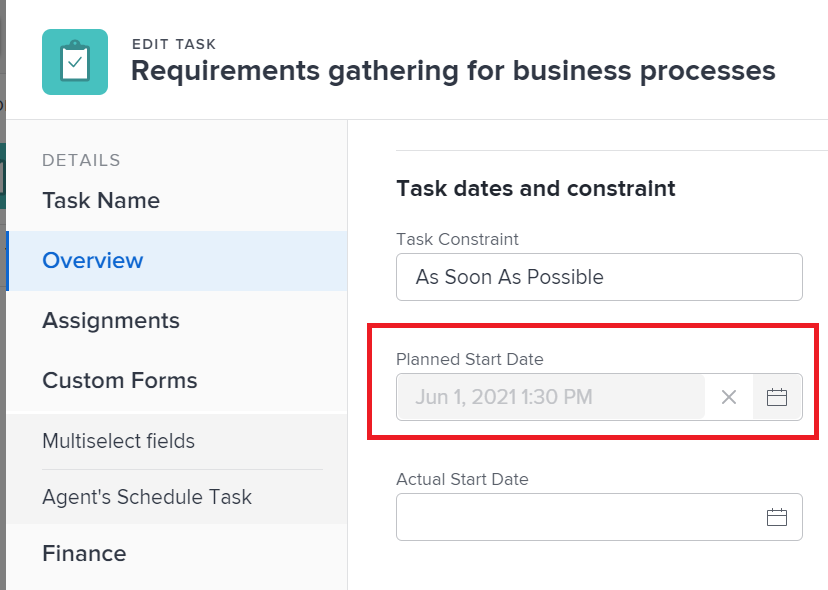

# Översikt över projekt-, uppgifts- och utfärdandedatum i [!DNL Workfront]

<!-- Audited: 05/2024 -->

<!--consider expanding on this article with ALL dates for PTIs - Hand off dates, Approval Dates, etc-->

<!-- there are dates below that need definition - ask Product-->

Den här artikeln innehåller definitioner för de vanligaste datumen som är associerade med projekt, uppgifter och utgåvor i [!DNL Adobe Workfront]. Bilderna här är exempel på var datumen visas i Workfront och de är inte fullständiga. Det finns andra områden som visar datumen. Alla datum visas också i projekt, uppgifter och utgivningsrapporter och listor.

Mer information om rapporter och listor finns i följande artiklar:

* [Kom igång med listor i  [!DNL Adobe Workfront]](../../../workfront-basics/navigate-workfront/use-lists/view-items-in-a-list.md)
* [Kom igång med rapporter](../../../reports-and-dashboards/reports/reporting/get-started-reports-workfront.md)

Mer information om projekt-, aktivitets- och problemfält finns i [Ordlista för  [!DNL Adobe Workfront] terminologi](../../../workfront-basics/navigate-workfront/workfront-navigation/workfront-terminology-glossary.md).

## [!UICONTROL Actual Start Date]

[!UICONTROL Actual Start Date] är det datum då en användare faktiskt börjar arbeta med ett projekt, en uppgift eller ett problem. [!UICONTROL Actual Start Date] är tom när projektet, aktiviteten eller utgåvan skapas.

Du kan ange manuellt när arbetet påbörjades med en uppgift eller ett problem, eller så fylls [!UICONTROL Actual Start Date] automatiskt i när uppgifts- eller utgivningsstatusen ändras från [!UICONTROL New] till [!UICONTROL In Progress] eller [!UICONTROL Complete]. [!UICONTROL Actual Start Date] för ett projekt sammanfaller med datumet då den första aktiviteten i projektet startar.

>[!TIP]
>
>[!UICONTROL Actual Start Date] kanske inte matchar en [!UICONTROL Planned Start Date] för ett projekt, en aktivitet eller ett problem eftersom användaren kan börja arbeta senare eller tidigare än det planerade datumet.

Mer information finns i [Översikt över projektet [!UICONTROL Actual Start Date]](../../../manage-work/projects/planning-a-project/project-actual-start-date.md).

>[!NOTE]
>
>[!UICONTROL Must Start On]-aktiviteten eller begränsningarna Fasta datum påverkar [!UICONTROL Planned Start Date] för en aktivitet, inte [!UICONTROL Actual Start Date]. Detta uppdaterar [!UICONTROL Planned Start Date] till ett datum som du anger. [!UICONTROL Actual Start Date] uppdateras oberoende av [!UICONTROL Planned Start Date], vilket beskrivs ovan.

## [!UICONTROL Actual Completion Date]

[!UICONTROL Actual Completion Date] är det datum som en användare faktiskt slutför ett projekt, en uppgift eller ett problem. [!UICONTROL Actual Completion Date] är tom när projektet, aktiviteten eller utgåvan skapas.

Du kan ange manuellt när arbetet har slutförts för en uppgift eller ett problem, eller så fylls [!UICONTROL Actual Completion Date] automatiskt i när något av följande inträffar:

* Projektet, aktiviteten eller utgivningsstatusen ändras till [!UICONTROL Complete], [!UICONTROL Closed] eller [!UICONTROL Resolved].
* Aktivitets- eller projektprocenten slutförd är 100 %.

[!UICONTROL Actual Completion Date] för ett projekt sammanfaller med datumet när du slutförde den senaste aktiviteten i projektet.

>[!TIP]
>
>[!UICONTROL Actual Completion Date] kanske inte matchar [!UICONTROL Planned Completion Date].

Mer information finns i [Översikt över projektet [!UICONTROL Actual Completion Date]](../../../manage-work/projects/planning-a-project/project-actual-completion-date.md).

## Slutförandedatum för godkännandesökväg

Slutförandedatum för godkännandesökväg är det datum då godkännande av ett projekt, en uppgift eller en utgåva beviljades och objektets status ändrades.

Slutförandedatumet för godkännandesökvägen visas i projekt-, uppgifts- och utgivningslistor och rapporter.

## Startdatum för godkännandesökväg

Startdatum för godkännandesökväg är det datum då projektet, aktiviteten eller utgivningsstatusen ändrades till Väntande godkännande och projektgodkännandebegäran skickades till godkännarna.

Startdatumet för godkännandesökvägen visas i projekt-, uppgifts- och utgivningslistor och rapporter.

<!--## Auto Closure Date -->

## Budgeterat slutförandedatum

Det här är ett inaktuellt fält för projekt. All information som det här fältet kan visa i en lista eller rapport är relaterad till en funktion som Workfront har tagit bort. Det går inte att uppdatera det här fältet.

Fältet visas i projektrapporter och listor.

## Budgeterat startdatum

Det här är ett inaktuellt fält för projekt. All information som det här fältet kan visa är relaterad till en funktion som Workfront har tagit bort. Det går inte att uppdatera det här fältet.

Fältet visas i projektrapporter och listor.

## [!UICONTROL Commit Date]

[!UICONTROL Commit Date] är det datum då en användare som har tilldelats en aktivitet eller ett problem bekräftar att uppgiften eller problemet ska slutföras. Detta skiljer sig från [!UICONTROL Planned Completion Date], eftersom det är en mer realistisk uppskattning av det slutförandedatum som bara anges av den användare som ansvarar för arbetet. Mer information finns i [[!UICONTROL Commit Date] - översikt](../../../manage-work/projects/updating-work-in-a-project/overview-of-commit-dates.md).

>[!NOTE]
>
>Om du ändrar [!UICONTROL Commit Date] påverkas [!UICONTROL Projected Completion Date] men inte [!UICONTROL Planned Completion Date] för en aktivitet eller ett problem. Projektledaren kan använda de ändringar som en tilldelad gör på [!UICONTROL Commit Date] för att uppdatera [!UICONTROL Planned Completion Date] för en aktivitet eller ett problem.

<!--## Completion Pending Date-->

## Begränsningsdatum

Om du använder en uppgiftsbegränsning som är kopplad till ett visst datum, blir det datumet begränsningsdatumet för uppgiften.

Följande uppgiftsbegränsningar uppdaterar fältet Begränsningsdatum:

* Måste börja på
* Måste avslutas
* Starta senast
* Starta tidigast

>[!TIP]
>
>En aktivitet med en begränsning på fasta datum har inget villkorsdatum.
>

Begränsningsdatumet visas i en uppgiftslista eller rapport.

## Konverterat utgivningsdatum

Det datum då utgåvan som konverterades till projektet eller uppgiften skapades.

Datumet för den konverterade utfärdandeposten visas i projekt- och uppgiftslistor och rapporter.

## Förfallodatum

Det datum då en uppgift eller ett problem ska slutföras. Förfallodatumet för en aktivitet eller utgåva är samma datum som det planerade slutförandedatumet.

Aktiviteten och utleverans av förfallodatum visas i uppgiftslistor och utgivningslistor och rapporter.

Mer information finns i avsnittet [Planerat slutförandedatum](#planned-completion-date) i den här artikeln.

## Förfaller den

Det datum då projektet ska vara klart. Förfallodatumet för ett projekt är samma datum som projektets planerade slutförandedatum.

Projektets förfallodatum visas i projektlistor och rapporter.

Mer information finns i avsnittet [Planerat slutförandedatum](#planned-completion-date) i den här artikeln.

## [!UICONTROL Entry Date]

[!UICONTROL Entry Date] är det datum då ett projekt, en aktivitet eller ett problem skapades i [!DNL Workfront].

[!UICONTROL Entry Date] påverkar inte tidslinjen för projekt, aktiviteter eller problem, men det är viktigt för spårnings- och rapportsyften. [!DNL Workfront] genererar automatiskt [!UICONTROL Entry Date] när objektet skapas och du kan inte redigera det manuellt.

## Beräknat förfallodatum

Uppgiften och det beräknade förfallodatumet för projektet visar ett mer realistiskt datum när projektet eller uppgiften ska slutföras.

De beräknade datumen är bättre i linje med projektets och uppgiftens verklighet, eftersom de tar hänsyn till vad som påverkar det faktiska slutförandet av projektet eller uppgiften. Beräknade förfallodatum liknar beräknade slutförandedatum.

Mer information finns i [Översikt över beräknade och beräknade datum](/help/quicksilver/manage-work/tasks/task-information/differentiate-projected-estimated-dates.md).

Det beräknade förfallodatumet för projektet och aktiviteten visas i projekt- och uppgiftslistor och rapporter.

## Beräknat startdatum

Uppgiften och det beräknade startdatumet för projektet visar ett mer realistiskt datum när projektet eller aktiviteten kunde starta.

De beräknade datumen är bättre i linje med projektets och uppgiftens verklighet, eftersom de tar hänsyn till vad som påverkar projektets eller uppgiftens verkliga början. Beräknade startdatum liknar planerade startdatum.

Mer information finns i [Översikt över beräknade och beräknade datum](/help/quicksilver/manage-work/tasks/task-information/differentiate-projected-estimated-dates.md).

De beräknade startdatumen för projektet och aktiviteten visas i projekt- och uppgiftslistor och rapporter.

<!--## Exchange Rate Date-->

## Fast slutdatum

Projektets begärande eller ägare identifierar det fasta slutdatumet för ett projekt när affärsärendet slutförs. Det är det datum då de rekommenderar att projektet måste slutföras.

Detta är en manuell uppskattning som inte tar hänsyn till hur arbetsuppgifterna i projektet faktiskt fortskrider.

Det fasta slutdatumet för ett projekt visas både i projektets Business Case-avsnitt och i projektlistor och rapporter.

## Fast startdatum

Projektets begärande eller ägare identifierar projektets fasta startdatum när affärsärendet slutförs. Det är det datum då de rekommenderar att projektet ska starta.

Detta är en manuell uppskattning som inte tar hänsyn till hur arbetsuppgifterna i projektet faktiskt fortskrider.

Det fasta startdatumet för ett projekt visas både i projektets Business Case-avsnitt och i projektlistor och rapporter.

## Leveransdatum

Det datum då en uppgift blir tillgänglig för arbete. Detta innebär att alla begränsningar, godkännanden och beroenden har slutförts och att användarna kan börja arbeta med uppgiften.

Leveransdatumet är en beräkning och kan inte anges manuellt.

Mer information om leveransdatum finns i [Översikt över datum för aktivitetsleverans](/help/quicksilver/manage-work/tasks/task-information/handoff-task-date.md).

Leveransdatumet för en uppgift visas i uppgiftslistor och rapporter.

## Senaste räkenskapsuppdateringsdatum

Det datum då någon av den ekonomiska informationen för ett projekt uppdaterades. Detta inkluderar uppdatering av finansiella fält i avsnittet Ekonomi eller Affärsfall i projektet.

Det senaste datumet för finansiell uppdatering visas i projektlistor och rapporter.

## Senaste uppdateringsdatum

Det datum då projektet, aktiviteten eller utgåvan senast uppdaterades. En uppdatering betraktas som en ändring som utlöser ett projekt, en uppgift eller ett problem som ska sparas. Detta inkluderar statusändringar, villkorsändringar, tidslinjer, ekonomi eller andra fält.

Det senaste uppdateringsdatumet visas i projekt-, uppgifts- och utgivningslistor och rapporter.

## [!UICONTROL Hour Entry Date]

När du loggar tid för projekt, uppgifter och utleveranser för att ange hur mycket faktisk tid (i timmar) du tillbringar med att arbeta med projektet, aktiviteten eller utleveransen, blir den tid du loggar [!UICONTROL Actual Hours] för projektet, aktiviteten eller utgåvan.

Datumet som du loggar tiden för är fältet [!UICONTROL Hour Entry Date] på timposten.

Inmatningsdatumet för timma visas i timlistor och rapporter.

>[!TIP]
>
>En timmes [!UICONTROL Entry Date] skiljer sig från [!UICONTROL Entry Date] för ett annat Workfront-objekt, eftersom det inte är datumet då timloggen skapades, utan det datum som du vill att timmarna ska associeras med.
>
>Du kan till exempel logga timmar för en uppgift den 5 september, men associera timmarna med den 1 september. Timmens anmälningsdatum är 1 september.

Mer information om hur du loggar tid i Workfront finns i [Loggtid](../../../timesheets/create-and-manage-timesheets/log-time.md).

>[!TIP]
>
>Vi rekommenderar att du loggar in på arbetsuppgifter och problem i stället för överordnade uppgifter eller projekt. Den tid som är inloggad på arbetsuppgifterna sammanställs till de överordnade aktiviteterna och projektet som [!UICONTROL Actual Hours] för de överordnade aktiviteterna och projektet. Tidsloggade problem sammanställs till projektet som [!UICONTROL Actual Hours] för projektet.

## [!UICONTROL Planned Completion Date]

Datumet [!UICONTROL Planned Completion Date] eller [!UICONTROL Due On] är det datum då ett projekt, en aktivitet eller ett ärende planeras att slutföras.

Beroende på [!UICONTROL Task Constraint] kanske du inte kan redigera [!UICONTROL Planned Completion Date] för en aktivitet. Beroende på [!UICONTROL Schedule Mode] för projektet kanske du inte kan redigera [!UICONTROL Planned Completion Date] för ett projekt.

[!UICONTROL Planned Completion Date] visas som förfallodatum i vissa områden i [!DNL Workfront].

Mer information finns i följande artiklar:

* [Översikt över uppgiften [!UICONTROL Planned Completion Date]](../../../manage-work/tasks/task-information/task-planned-completion-date.md)
* [Ange projektet [!UICONTROL Planned Completion Date]](../../../manage-work/projects/planning-a-project/project-planned-completion-date.md)
* [Översikt över utgåvan [!UICONTROL Planned Completion Date]](../../../manage-work/issues/issue-information/issue-planned-completion-date.md)

## Planerad datumjustering

Det här är en automatisk indikator som Workfront tilldelar projekt, uppgifter och utleveranser för att visa när ett objekt kommer att slutföras i förhållande till det planerade slutförandedatumet.

Följande är möjliga värden för den planerade datumjusteringsindikatorn:

* Kommer att utföras på det planerade slutförandedatumet
* Kommer att utföras före planerat slutförandedatum
* Utför efter planerat slutförandedatum

Den planerade datumjusteringen visas i projekt-, uppgifts- och utgivningslistor och rapporter.

## [!UICONTROL Planned Start Date]

[!UICONTROL Planned Start Date] är det datum då ett projekt, en aktivitet eller ett problem planeras starta.

Beroende på [!UICONTROL Task Constraint] kanske du inte kan redigera [!UICONTROL Planned Start Date] för en aktivitet. Beroende på [!UICONTROL Schedule Mode] för projektet kanske du inte kan redigera [!UICONTROL Planned Start Date] för ett projekt.

Mer information finns i [Översikt över projektet [!UICONTROL Planned Start Date]](../../../manage-work/projects/planning-a-project/project-planned-start-date.md).

## [!UICONTROL Projected Completion Date]

[!UICONTROL Projected Completion Date] är en beräknad realtidsindikator för när projektet, aktiviteten eller utgåvan ska slutföras. När projektet, aktiviteten eller utgåvan har markerats som Slutförd ändras [!UICONTROL Projected Completion Date] till datumet för [!UICONTROL Actual Completion Date].

Om allt blir jämnt och som planerat ska [!UICONTROL Projected Completion date] matcha [!UICONTROL Planned Completion Date]. I annat fall kan [!UICONTROL Projected Completion Date] skilja sig från [!UICONTROL Planned Completion Date] på grund av fördröjningarna för föregående aktiviteter.

Mer information finns i [Översikt över [!UICONTROL Projected Completion Date] för projekt, uppgifter och problem](../../../manage-work/projects/planning-a-project/project-projected-completion-date.md).

## [!UICONTROL Projected Start Date]

[!UICONTROL Projected Start Date] är ett realtidsdatum när projektet, aktiviteten eller utgåvan börjar och tar hänsyn till alla förseningar. Detta är ett mer korrekt startdatum för projektet, aktiviteten eller utgåvan än [!UICONTROL Planned Start Date]. [!UICONTROL Planned Start Date] tar inte hänsyn till fördröjningar eller tidigare datum.

När du först planerar ett projekt är [!UICONTROL Planned Start Date] och [!UICONTROL Projected Start Date] för aktiviteterna och projektet identiska. Eftersom förseningar kan inträffa eller uppgifter kan slutföras tidigare kan [!UICONTROL Projected Start Date] skilja sig från [!UICONTROL Planned Start Date].

För en aktivitet kan en [!UICONTROL Projected Start Date] också skilja sig från dess [!UICONTROL Planned Start Date] när en av dess föregångare körs bakom schemat.

>[!TIP]
>
>Du kan bara visa [!UICONTROL Projected Start Date] för ett problem i en lista eller rapport.

Mer information finns i [Översikt över projektet [!UICONTROL Projected Start Date]](../../../manage-work/projects/planning-a-project/project-projected-start-date.md).

<!--## Rejection Date-->

## Slack

Uppgifter kan ibland börja och slutföras sent utan att det påverkar projektets slutförandedatum.

I Slack-datumet visas det exakta datumet när en åtgärd definitivt kan påverka projektets slutförandedatum.

Mer information om Slack för datum för en uppgift finns i [Översikt över aktivitetsdatum i Slack](/help/quicksilver/manage-work/tasks/task-information/task-slack-date.md).

Datum för aktiviteten Slack visas i uppgiftslistor och rapporter.

## Starta den

Det datum då projektet planeras att starta. Startdatum för ett projekt är samma datum som projektets planerade startdatum.

Det här fältet visas i projektlistor och rapporter.

Mer information finns i avsnittet [Planerat startdatum](#planned-start-date) i den här artikeln.

