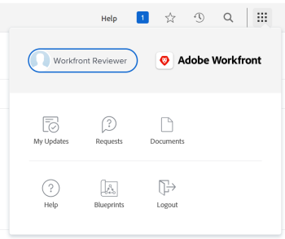

# Förstå navigeringen för en [!UICONTROL Review]-licensanvändare

[!UICONTROL Main Menu] ändras med den åtkomstnivå som du har tilldelats av din [!DNL Adobe Workfront]-administratör. Som standard får du bara åtkomst till de områden som har funktioner som är tillåtna på din åtkomstnivå. Mer information om komponenterna i standardlayouten för varje åtkomstnivå finns i [Om standardlayouten [!DNL Adobe Workfront] &#x200B;](../../../administration-and-setup/customize-workfront/use-layout-templates/about-the-default-wf-layout.md).

## Förstå standardvärdet [!UICONTROL Main Menu] för en [!UICONTROL Reviewer]

Som [!UICONTROL Reviewer] är ditt huvudansvar att granska, kommentera och godkänna arbetet. De områden som är synliga för dig i [!UICONTROL Main Menu] gör att du kan göra det.

Följande områden ingår i standardlayouten för en [!UICONTROL Reviewer]:

* **[!UICONTROL My Updates]**: Området **[!UICONTROL Home]** som är tillgängligt för användare på alla åtkomstnivåer ersätts som standard av **[!UICONTROL My Updates]** för användare med en granskningslicenstyp. Som [!UICONTROL Reviewer] är du inte klar med arbetet. Du behöver bara visa information om det arbete du behöver för att granska, kommentera eller godkänna. I området **[!UICONTROL My Updates]** kan du utföra dessa åtgärder. Det här är standardlandningsområdet för nya Granska-användare.

  >[!TIP]
  >
  >Din [!DNL Workfront]- eller gruppadministratör kan tilldela dig en layoutmall som kan ändra din standardstartsida. Om du använder en layoutmall kan du även visa både [!UICONTROL Home] och [!UICONTROL Updates] som en [!UICONTROL Review]-licensanvändare.

* **[!UICONTROL Requests]**: Du kan skicka och granska förfrågningar som du eller andra användare från ditt företag har skickat in här.
* **[!UICONTROL Documents]**: Du kan överföra dokument eller granska dokument som delas med dig här.
* **[!UICONTROL Blueprints]**: Granska befintliga utkast i systemet och begär att en ska installeras, om [!DNL Workfront] -administratören konfigurerade begärandekön för utkast. Mer information finns i [Översikt över utkast](../../../administration-and-setup/blueprints/blueprints-overview.md).

## Anpassa din standardinställning för [!UICONTROL Main Menu]

Administratören för [!DNL Workfront] kan ändra standardlayouten för [!DNL Workfront] genom att tilldela dig en layoutmall. Mer information om hur du arbetar med layoutmallar finns i [Anpassa [!UICONTROL Main Menu] med en layoutmall](../../../administration-and-setup/customize-workfront/use-layout-templates/customize-main-menu.md).
