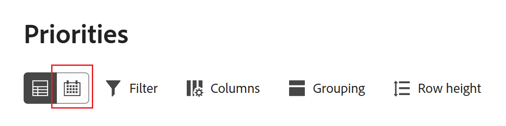

# Hantera ditt arbete i Prioritetskalendern

Håll ordning på ditt material med en tydlig, visuell kalender. Med Prioritetskalendern kan du

* Använd filter för att hitta ditt material
* Använd anpassade fält som status och fokusnivå för att identifiera högprioriterat arbete
* Använd färger för snabb sortering

>[!IMPORTANT]
>
>Projekt måste ha statusen Aktuell eller en status som är lika med aktuell för att kunna visa projekt samt deras underordnade uppgifter och ärenden.

## Åtkomstkrav

+++ Expandera om du vill visa åtkomstkrav för funktionerna i den här artikeln.

<table style="table-layout:auto"> 
 <col> 
 </col> 
 <col> 
 </col> 
 <tbody> 
  <tr> 
   <td role="rowheader">Adobe Workfront package</td> 
   <td> 
Any
 </td> 
  </tr> 
  <tr> 
   <td role="rowheader">Adobe Workfront license</td> 
   <td> 
   
Reviewer or higher

   
Light or higher
 
   </td> 
  </tr> 
  <tr> 
   <td role="rowheader">Konfigurationer på åtkomstnivå</td> 
   <td> 
Visa eller redigera åtkomst för objektet som uppdateringen är aktiverad för
</td> 
  </tr> 
  <tr> 
   <td role="rowheader">Objektbehörigheter</td> 
   <td> 
Visa åtkomst till objektet
</td> 
  </tr> 
 </tbody> 
</table>

+++

## View your work in the calendar

Prioriteter visar arbetsuppgifter som tilldelats dig. Det går inte att se arbetsobjekt som tilldelats ditt team i prioriteringskalendern.

{{step1-to-priorities}}

1. Klicka på ikonen **Kalender** längst upp i arbetslistan.
   
1. Markera ett eller flera filter om du vill begränsa arbetsobjekten.

   +++Expandera om du vill se detaljerad information om tillgängliga filter
   <table>
    <tbody>
    <tr>
    <th>Filter</th>
    <th>Beskrivning</th>
    </tr>
        <tr>
        <td>Att arbeta med den</td>
        <td>Visar objekt som du arbetar med.</td>
        </tr>
        <tr>
        <td>Klar att börja</td>
        <td>Displays items with 
        <ul>
        <li>No incomplete predecessors or task constraints</li>
        
and

        <li>The Planned Start Date is in the past or up to two weeks in the future</li>
        </ul>
        </td>
        </tr>
        <tr>
        <td>Not ready</td>
        <td>Displays items that have
        <ul>
        <li>Ofullständiga föregående aktiviteter eller aktivitetsbegränsningar som förhindrar att objektet bearbetas</li>
        
or

        <li>The Planned Start Date more than two weeks in the future.</li>
        </ul>
        </td>
        </tr>
        <tr>
        <td>Requested</td>
        <td>Displays issues that you have not started work on.</td>
        </tr>
        <td>Klar</td>
        <td>Visar det arbete som utförts de senaste två veckorna. Det här filteralternativet inkluderar inte godkännanden.</td>
        </tr>
        <tr>
        <td>Projekt</td>
        <td>Visar projekt som innehåller uppgifter eller ärenden som du har tilldelats.</td>
        </tr>
        <tr>
        <td>Förfallodatum</td>
        <td>Visar arbetet efter planerat slutförandedatum.</td>
        </tr>
        <tr>
        <td>Status</td>
        <td>Displays tasks or issues in new, in progress, and complete statuses.</td>
        </tr>
        <tr>
        <td>My Focus</td>
        <td>Displays tasks or issues in that have assigned focus levels. Focus levels are assigned and managed by the individual user.</td>
        </tr>
    </tbody>
    </table>

   +++

1. Klicka på arbetsobjektsfältet i kalendern för att öppna sidsammanfattningen. Med sidsammanfattningen kan du

   * Visa och redigera information om projekt och arbetsuppgift
   * Göra och visa kommentarer
   * Visa och överföra dokument
   * Create a proof
   * Navigera till projektsidan i Workfront
   * Navigera till sidan med information om arbetsobjekt i Prioriteringar
   * Loggtid
   * Lägga till snabblänkar

1. (Valfritt) Klicka på **Skapa ny** om du vill lägga till en ny arbetsuppgift i kalendern. Mer information finns i [Skapa en ny uppgift eller ett nytt problem i Prioriteter](/help/quicksilver/workfront-basics/priorities/create-task-issue-priorities.md).

## Konfigurera kalendern

{{step1-to-priorities}}

1. Klicka på ikonen **Kalender** längst upp i arbetslistan.
   
1. Klicka på ikonen **Inställningar** i kalenderns högra hörn.

1. På fliken **Stapelstil** väljer du upp till 5 fält som ska visas i arbetsobjektsfältet i kalendern.
   

1. **** ****
   
