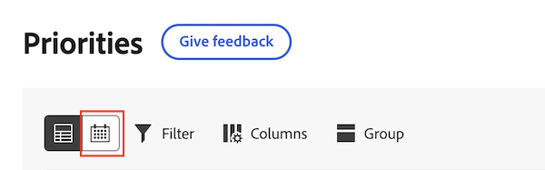

# Hantera ditt arbete i Prioritetskalendern

Informationen på den här sidan hänvisar till funktioner som ännu inte är allmänt tillgängliga. Den är bara tillgänglig i sandlådemiljön för förhandsgranskning.

Håll ordning på ditt material med en tydlig, visuell kalender. Med Prioritetskalendern kan du

* Använd filter för att hitta ditt material
* Använd anpassade fält som status och fokusnivå för att identifiera högprioriterat arbete
* Använd färger för snabb sortering

## Åtkomstkrav

+++ Expandera om du vill visa åtkomstkrav för funktionerna i den här artikeln.

Du måste ha följande åtkomst för att kunna utföra stegen i den här artikeln:

<table style="table-layout:auto"> 
 <col> 
 </col> 
 <col> 
 </col> 
 <tbody> 
  <tr> 
   <td role="rowheader"><strong>Adobe Workfront</strong></td> 
   <td> 
Alla
 </td> 
  </tr> 
  <tr> 
   <td role="rowheader"><strong>Adobe Workfront-licens*</strong></td> 
   <td> 
   
Aktuell: Granskare eller senare

   
Nytt: Ljus eller högre
 
   </td> 
  </tr> 
  <tr> 
   <td role="rowheader"><strong>Konfigurationer på åtkomstnivå</strong></td> 
   <td> 
Visa eller redigera åtkomst för objektet som uppdateringen är aktiverad för
</td> 
  </tr> 
  <tr> 
   <td role="rowheader"><strong>Objektbehörigheter</strong></td> 
   <td> 
Visa åtkomst till objektet
</td> 
  </tr> 
 </tbody> 
</table>

*Mer information finns i [Åtkomstkrav i Workfront-dokumentation](/help/quicksilver/administration-and-setup/add-users/access-levels-and-object-permissions/access-level-requirements-in-documentation.md).

+++

## Visa ditt arbete i kalendern

{{step1-to-priorities}}

1. Klicka på kalenderikonen högst upp i arbetslistan.
   
1. Markera ett eller flera filter om du vill begränsa arbetsobjekten.

   +++Expandera för att se detaljerad information om tillgängliga filter
   <table>
    <tbody>
    <tr>
    <th>Filter</th>
    <th>Beskrivning</th>
    </tr>
        <tr>
        <td>Att arbeta med den</td>
        <td>Visar objekt som du arbetar med</td>
        </tr>
        <tr>
        <td>Klar att börja</td>
        <td>Visar objekt med 
        <ul>
        <li>Inga ofullständiga föregångare eller aktivitetsbegränsningar</li>
        
och

        <li>Det planerade startdatumet har passerat eller är upp till två veckor i framtiden</li>
        </ul>
        </td>
        </tr>
        <tr>
        <td>Inte klar</td>
        <td>Visar objekt som har
        <ul>
        <li>Ofullständiga föregående aktiviteter eller aktivitetsbegränsningar som förhindrar att objektet bearbetas</li>
        
eller

        <li>Det planerade startdatumet är mer än två veckor i framtiden</li>
        </ul>
        </td>
        </tr>
        <tr>
        <td>Begärd</td>
        <td>Visar problem som du inte har börjat arbeta med</td>
        </tr>
        <td>Klar</td>
        <td>Visar det arbete som utförts de senaste två veckorna. Det här filteralternativet inkluderar inte godkännanden.</td>
        </tr>
        <tr>
        <td>Projekt</td>
        <td>Visar projekt som innehåller uppgifter eller ärenden som du har tilldelats</td>
        </tr>
        <tr>
        <td>Förfallodatum</td>
        <td>Visar arbete efter planerat slutförandedatum</td>
        </tr>
        <tr>
        <td>Status</td>
        <td>Visar uppgifter eller problem i nya, pågående och slutförda statusar</td>
        </tr>
        <tr>
        <td>Mitt fokus</td>
        <td>Visar aktiviteter eller problem med tilldelade fokusnivåer. Fokusnivåer tilldelas och hanteras av den enskilda användaren.</td>
        </tr>
    </tbody>
    </table>

+++

1. Klicka på arbetsobjektsfältet i kalendern för att öppna sidsammanfattningen. Med sidsammanfattningen kan du

* Visa och redigera information om projekt och arbetsuppgift
* Göra och visa kommentarer
* Visa och överföra dokument
* Skapa ett korrektur
* Navigera till projektsidan i Workfront
* Navigera till sidan med information om arbetsobjekt i Prioriteringar
* Loggtid
* Lägga till snabblänkar

1. (Valfritt) Klicka på **Skapa ny** om du vill lägga till en ny arbetsuppgift i kalendern. Mer information finns i [Skapa en ny uppgift eller ett nytt problem i Prioriteter](/help/quicksilver/workfront-basics/priorities/create-task-issue-priorities.md).

## Konfigurera kalendern

{{step1-to-priorities}}

1. Klicka på kalenderikonen högst upp i arbetslistan.
   
1. Klicka på ikonen **Inställningar** i kalenderns högra hörn.

1. På fliken **Stapelstil** väljer du upp till 5 fält som ska visas i arbetsobjektsfältet i kalendern.
   

1. På fliken **Färg** väljer du hur du vill att dina arbetsobjekt ska visas. Om du till exempel väljer Projekt visas dina arbetsobjekt i enlighet med den färg som tilldelats projektet i arbetslistan.
   

