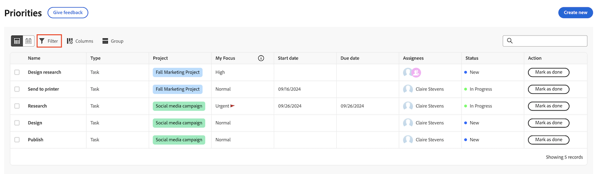

# Filtrera och gruppera ditt arbete med prioritet

Du kan använda filter för att hitta det du söker efter och sedan använda en gruppering för att ordna det.

Prioriteter visar arbetsuppgifter som tilldelats dig. Du kan inte se arbetsobjekt som tilldelats ditt team i listan Prioriteter.

## Åtkomstkrav

+++ Expandera om du vill visa åtkomstkrav för funktionerna i den här artikeln.

Du måste ha följande åtkomst för att kunna utföra stegen i den här artikeln:

<table style="table-layout:auto"> 
 <col> 
 </col> 
 <col> 
 </col> 
 <tbody> 
  <tr> 
   <td role="rowheader"><strong>Adobe Workfront</strong></td> 
   <td> 
Alla
 </td> 
  </tr> 
  <tr> 
   <td role="rowheader"><strong>Adobe Workfront-licens*</strong></td> 
   <td> 
   
Aktuell: Begäran eller senare

   
Nytt: Medarbetare eller högre
 
   </td> 
  </tr> 
  <tr> 
   <td role="rowheader"><strong>Konfigurationer på åtkomstnivå</strong></td> 
   <td> 
Visa eller redigera åtkomst för objektet som uppdateringen är aktiverad för
</td> 
  </tr> 
  <tr> 
   <td role="rowheader"><strong>Objektbehörigheter</strong></td> 
   <td> 
Visa åtkomst till objektet
</td> 
  </tr> 
 </tbody> 
</table>

*Mer information finns i [Åtkomstkrav i Workfront-dokumentation](/help/quicksilver/administration-and-setup/add-users/access-levels-and-object-permissions/access-level-requirements-in-documentation.md).

+++

## Filtrera arbetet med standardfilter

Du kan filtrera uppgifter och ärenden som tilldelats dig.

{{step1-to-priorities}}

1. Klicka på **Filter** i det övre vänstra hörnet i arbetslistan.
1. klicka på **Standardfilter**.
1. Markera ett eller flera filter om du vill begränsa arbetsobjekten.
   

+++Expandera för att se detaljerad information om tillgängliga filter
<table>
  <tbody>
   <tr>
   <th>Filter</th>
   <th>Beskrivning</th>
   </tr>
    <tr>
      <td>Att arbeta med den</td>
      <td>Visar objekt som du arbetar med</td>
    </tr>
    <tr>
      <td>Klar att börja</td>
      <td>Visar objekt med 
      <ul>
      <li>Inga ofullständiga föregångare eller aktivitetsbegränsningar</li>
      
och

      <li>Det planerade startdatumet har passerat eller är upp till två veckor i framtiden</li>
      </ul>
      </td>
    </tr>
    <tr>
      <td>Inte klar</td>
      <td>Visar objekt som har
       <ul>
      <li>Ofullständiga föregående aktiviteter eller aktivitetsbegränsningar som förhindrar att objektet bearbetas</li>
      
eller

      <li>Det planerade startdatumet är mer än två veckor i framtiden</li>
      </ul>
       </td>
    </tr>
    <tr>
      <td>Begärd</td>
      <td>Visar problem som du inte har börjat arbeta med</td>
    </tr>
      <td>Klar</td>
      <td>Visar det arbete som utförts de senaste två veckorna. Det här filteralternativet inkluderar inte godkännanden.</td>
    </tr>
    <tr>
    <td>Projekt</td>
    <td>Visar projekt som innehåller uppgifter eller ärenden som du har tilldelats</td>
    </tr>
    <tr>
    <td>Förfallodatum</td>
    <td>Visar arbete efter planerat slutförandedatum</td>
    </tr>
    <tr>
    <td>Status</td>
    <td>Visar uppgifter eller problem i nya, pågående och slutförda statusar</td>
    </tr>
    <tr>
    <td>Mitt fokus</td>
    <td>Visar aktiviteter eller problem med tilldelade fokusnivåer. Fokusnivåer tilldelas och hanteras av den enskilda användaren.</td>
    </tr>
  </tbody>
</table>

+++

1. (Valfritt) Klicka på **Tillbaka till standard** om du vill återställa markeringen.

## Filtrera arbetet med smarta filter

Använd naturligt språk för att snabbt filtrera arbetet.

>[!NOTE]
>
>Den här funktionen är endast tillgänglig för kunder som har en enhetlig Adobe Experience med hjälp av AI Assistant. Mer information om AI-assistenten finns i [Översikt över AI-assistenten](/help/quicksilver/workfront-basics/ai-assistant/ai-assistant-overview.md).

{{step1-to-priorities}}

1. Klicka på **Filter** i det övre vänstra hörnet i arbetslistan.
1. Klicka på **Smarta filter**.
1. Skriv hur du vill filtrera materialet.

   Du kan skriva saker som

   * Visa mig sena uppgifter
   * Visa mina topprioriteringar
   * Visa arbete som förfaller idag

## Gruppera ditt arbete

{{step1-to-priorities}}

1. Klicka på **Grupper** längst upp till vänster i arbetslistan.
1. Välj en grupp för att ordna din arbetslista
   

+++Expandera för att se detaljerad information om tillgängliga grupper

| Grupp | Beskrivning |
|-----------|-------------|
| Projekt | Detta grupperar objekt efter projekt. |
| Mitt fokus | Detta grupperar objekt baserat på den fokusnivå som du tilldelar. |
| Vecka förfaller | Den här gruppen objekt baserat på vilken vecka de förfaller. Förfallodatum avgörs av planerat slutförandedatum. |
| Status | Detta grupperar objekt efter följande statusar: Nytt, Pågår, Fullständigt.  Obs! Du kan inte använda anpassade statusvärden i prioriteter just nu. |

+++

### Dra och släpp arbetsobjekt vid gruppering efter Min prioritet eller Status

Du kan dra och släppa enskilda arbetsobjekt mellan kategorier när du grupperar efter Min prioritet eller Status.

1. Gruppera ditt arbete efter **status** eller **Min prioritet**.
2. Håll markören över arbetsobjektet för att hitta flyttningsikonen och dra den till önskad kategori.
   

## Sortera materialet

### Sortera i grupper

Om du vill sortera ditt arbete i en grupp öppnar du **Grupp** och klickar på **Sortera stigande** eller **Sortera fallande**.

### Sortera kolumner

Om du vill sortera enskilda kolumner går du till kolumnen och klickar på nedpilen.

### Expandera eller komprimera alla gruppavsnitt

Om du vill expandera eller komprimera alla gruppavsnitt öppnar du **Grupp** och klickar på **Expandera alla** eller **Komprimera alla**.

