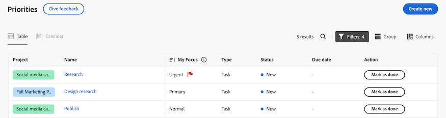
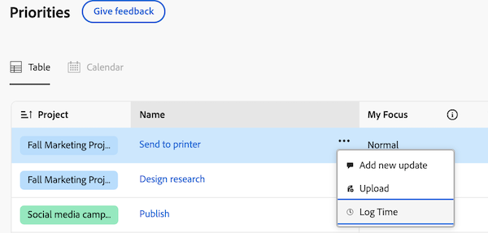

# Kom igång med prioriteringar

Prioriteringarna kommer att vara tillgängliga i förhandsgranskningen 2024-10-3

Prioriteringarna är en smidig, intuitiv upplevelse som är skräddarsydd för uppgiftsägare. Prioriteringarna kommer att introduceras i faser, med början i arbetslistan.

Prioriteringar ger

* Hantera och prioritera rutinuppgifter: Ordna dag och vecka med konsoliderad navigering för bättre tydlighet
* Större produktivitet: Kom åt projektsammanhang och utför uppgifter snabbare med färre klick
* Personaliserade funktioner: Dra nytta av unika funktioner som utformats för uppgiftsägare

## Hitta och ordna ditt material

I Prioriteringar kan du filtrera och gruppera ditt arbete så att du kan hantera deadlines och prioritera det som är viktigt för dig. Du kan också snabbt identifiera brådskande arbete med kolumnen Mitt fokus.

### Hitta ditt material med filter

Hitta det viktigaste arbetet med filter. Du kan filtrera uppgifter och ärenden som tilldelats dig på följande sätt:

<table>
  <tbody>
   <tr>
   <th>Filter</th>
   <th>Beskrivning</th>
   </tr>
    <tr>
      <td>Arbetar på</td>
      <td>Visar objekt som du arbetar med</td>
    </tr>
    <tr>
      <td>Klar att börja</td>
      <td>Visar objekt med 
      <ul>
      <li>Inga ofullständiga föregångare eller aktivitetsbegränsningar</li>
      
och

      <li>Det planerade startdatumet har passerat eller är upp till två veckor i framtiden</li>
      </ul>
      </td>
    </tr>
    <tr>
      <td>Inte klar</td>
      <td>Visar objekt som har
       <ul>
      <li>Ofullständiga föregående aktiviteter eller aktivitetsbegränsningar som förhindrar att objektet bearbetas</li>
      
eller

      <li>Det planerade startdatumet är mer än två veckor i framtiden</li>
      </ul>
       </td>
    </tr>
    <tr>
      <td>Begärd</td>
      <td>Visar problem som du inte har börjat arbeta med</td>
    </tr>
      <td>Klar</td>
      <td>Visar det arbete som utförts de senaste två veckorna. Det här filteralternativet inkluderar inte godkännanden.</td>
    </tr>
    <tr>
    <td>Projekt</td>
    <td>Visar projekt som innehåller uppgifter eller ärenden som du har tilldelats</td>
    </tr>
    <tr>
    <td>Förfallodatum</td>
    <td>Visar arbete efter planerat slutförandedatum</td>
    </tr>
    <tr>
    <td>Status</td>
    <td>Visar uppgifter eller problem i nya, pågående och slutförda statusar</td>
    </tr>
  </tbody>
</table>

### Ordna ditt arbete med grupper

När du har filtrerat ditt arbete kan du gruppera objekt baserat på

* Ingen
* Vecka förfaller
* Status
* Projekt

<!--For more information, see [Find and organize your work in Priorities]().-->

### Prioritera viktiga arbetsuppgifter med Mitt fokus

Mitt fokus är en kolumn i arbetslistan som hjälper dig att prioritera ditt arbete. Värdet My Focus (Mitt fokus) är personligt och påverkar inte projekt, uppgifter eller data. Du kan använda följande fokusnivåer:

* Urgent
* Primär
* Sekundär
* Normal (standard)

När du har tilldelat fokusnivåer till dina arbetsobjekt kan du sortera kolumnen så att brådskande objekt visas högst upp i arbetslistan.

<!--For more information, see [Prioritize important work items with My Focus]().-->

### Använd kalendervyn [!BADGE Kommer snart]{type=Informative}

I kalendervyn visas dina uppgifter och problem. Du kan välja mellan en dag-, vecka- eller månadsvy. Du kan även filtrera objekt på ungefär samma sätt som i arbetslistan.

## Arbeta med uppgifter och problem

I Prioriteter kan du uppdatera arbetsobjekten så att du håller dina uppgifter aktuella, loggar tid för att spåra arbetstiden korrekt, överför resurser utan att behöva navigera till ett projekt och lägga till snabblänkar för enkel åtkomst till resurser som du använder ofta.

### Lägga till och visa uppdateringar

Lägg till en uppdatering för en uppgift eller ett problem för att kommunicera dina framsteg till andra.

I uppdateringsavsnittet visas systemuppdateringar och upp till 200 av de senaste uppdateringarna som användare har gjort under de senaste 90 dagarna.

<!--For more information, see [Add and view updates in Priorities]().-->

### Loggtid

Du kan logga tiden för arbetsobjekt för att ange hur många timmar du ska arbeta med dem. Du kan också logga tid som inte är relaterad till arbetet, som semester, sjuktid eller tid som du tillbringar i möten. Den tid du loggar visas i tidrapporten.

<!--For more information, see [Log time in Priorities]().-->

### Överför filer

Ladda upp filer direkt till uppgiftens eller ärendets dokumentområde utan att behöva navigera till ett projekt. När du överför en fil från Prioriteter kan du

* Välj en befintlig mapp
* Överför filen med en uppdateringsdataströmkommentar
* Lägg till ytterligare filer
* Importera filer från sammankopplade dokumentintegreringar

<!--For more information, see [Upload files in Priorities]().-->

### Visa dokument [!BADGE Kommer snart]{type=Informative}

På fliken Dokument kan du visa alla filer som hör till ett arbetsobjekt. Du kan filtrera dokument efter namn, filtyp eller person och sortera efter namn och överföringsdatum.

Du kan också öppna dokumentet eller korrekturet.

### Lägga till snabblänkar

Du kan bädda in länkar som används ofta på arbetsobjektets informationssida. Snabblänkar gör att du snabbt kan besöka eller kopiera länken.

<!--For more information, see [Add and manage quick links in Priorities]().-->

### Granska och godkänn resurser [!BADGE Kommer snart]{type=Informative}

Möjligheten att granska och godkänna mediefiler finns på prioriteringsplanen.

För närvarande rekommenderar vi att du använder widgetarna Väntar på mitt godkännande och Alla godkännanden i Nytt hem.

Mer information finns i [Lägg till, redigera och ta bort widgetar i Nytt hem](/help/quicksilver/workfront-basics/using-home/new-home/add-edit-remove-widgets-in-new-home.md).

## Använd Fånga upp mig för att se vad du missade [!BADGE Kommer snart]{type=Informative}

Använd funktionen Fånga mig upp för att se vad du missade. Jag kommer att sammanfatta uppdateringar, överförda dokument, godkännanden och andra betydande ändringar av dina projekt inom följande tidsramar: 24 timmar, 3 dagar, 7 dagar.

## Överväganden

* Workfront-administratörer kan för närvarande inte anpassa prioriteringar med hjälp av layoutmallen.
* Att komma åt uppgifter i prioriteter är tillgängligt på flera flikar. Vi planerar att lägga till fler flikar i framtiden, som dokument, underaktiviteter, godkännanden osv. Meddela oss om att du behöver dessa objekt genom att skicka feedback med knappen **Ge feedback** .

