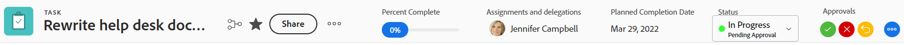
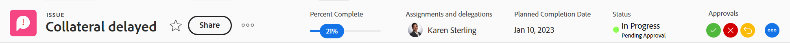
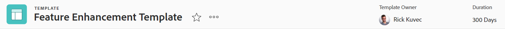
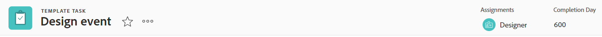
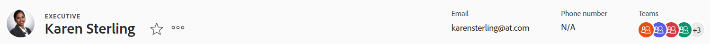
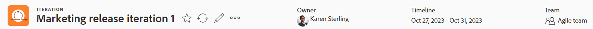
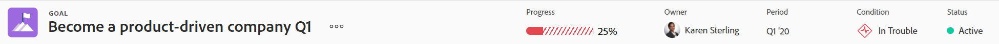

# Översikt över objektrubriker

Du kan snabbt visa information om objekt i [!DNL Adobe Workfront] när du granskar deras sidhuvud.

Förutom objektets namn kan rubriken innehålla objektets ägare, status eller procent färdigt.

[!DNL Workfront] prioriterar objektets namn och tilldelar så mycket utrymme som möjligt i rubriken. När ett objektnamn är för långt kortas det av. Om du vill visa ett objekts fullständiga namn hovrar du över det.

## Åtkomst till ett objekts sidhuvud

Åtkomsten av huvudet för ett objekt i [!DNL Workfront] är identisk för alla objekt som har det.

Så här kommer du åt ett projekts huvud:

1. Gå till ett projekt.\
   Sidhuvudet visas högst upp på sidan och innehåller namnet på projektet.

   

## Översikt över rubriken [!UICONTROL Home]

Följande rubriker är tillgängliga i Hem:

* Aktivitet: Mer information om hur du kan använda den här rubriken finns i [Översikt över uppgiftsrubriken](#task-header-overview) i den här artikeln.
* Problem: Mer information om hur du kan använda den här rubriken finns i [Översikt över utgåvans huvud](#issue-header-overview) i den här artikeln.

## Anpassningsbara rubriker

[!DNL Workfront]- eller gruppadministratören kan anpassa huvudet för projekt, uppgifter och utgåvor med hjälp av en layoutmall.

I den här artikeln beskrivs standardrubrikerna för alla objekt, inklusive projekt, uppgifter och ärenden.

Mer information om hur du anpassar information i ett objekts huvud finns i [Anpassa objektrubriker med hjälp av en layoutmall](../../administration-and-setup/customize-workfront/use-layout-templates/customize-object-headers.md).

## Översikt över projekthuvud

Projekthuvudet visar som standard följande information:

<table style="table-layout:auto"> 
 <col> 
 <col> 
 <thead> 
  <tr> 
   <th>Rubrikinformation</th> 
   <th>Anteckningar</th> 
  </tr> 
 </thead> 
 <tbody> 
  <tr> 
   <td role="rowheader">Bläddra igenom med överordnade objekt</td> 
   <td>Om projektet är associerat med ett program eller en portfölj visas de i det synliga hörnet i det övre vänstra hörnet av sidhuvudet. Om du klickar på namnet på det överordnade objektet öppnas det överordnade objektet.</td> 
  </tr> 
  <tr data-mc-conditions=""> 
   <td role="rowheader">Objektikon </td> 
   <td> 
Den lila [!UICONTROL Project]-ikonen  visas till vänster om projektnamnet.
 </td> 
  </tr> 
  <tr> 
   <td role="rowheader">Projektets namn</td> 
   <td>Du kan redigera projektnamnet i rubriken.</td> 
  </tr> 
  <tr> 
   <td role="rowheader">Namn på objekttypen</td> 
   <td> 
Texten [!UICONTROL PROJECT] visas ovanför projektnamnet i rubriken.
 </td> 
  </tr> 
  <tr> 
   <td role="rowheader">Åtgärdsområdet för uppgiften</td> 
   <td> 
Intill projektets namn visas åtgärdsområdet.
 
  
  </td> 
  </tr> 
  <tr> 
   <td role="rowheader">[!UICONTROL Percent Complete]</td> 
   <td>Du kan inte redigera projektprocenten komplett i sidhuvudet.</td> 
  </tr> 
  <tr> 
   <td role="rowheader">[!UICONTROL Project Owner]</td> 
   <td> 
Du kan redigera [!UICONTROL Project Owner] i sidhuvudet.
 </td> 
  </tr> 
  <tr> 
   <td role="rowheader">[!UICONTROL Planned Completion Date] </td> 
   <td> 
Du kan redigera projektet [!UICONTROL Planned Completion Date] och tiden i huvudet om projektet är schemalagt från [!UICONTROL Completion Date]. Om projektet är schemalagt från [!UICONTROL Start Date] uppdateras den här informationen från aktiviteterna i projektet.
 </td> 
  </tr> 
  <tr> 
   <td role="rowheader">[!UICONTROL Condition] </td> 
   <td> 
När du ställer in [!UICONTROL Condition Type] för projektet på Manuell kan du uppdatera projektet [!UICONTROL Condition] i sidhuvudet.
</td> 
  </tr> 
  <tr> 
   <td role="rowheader">[!UICONTROL Status]</td> 
   <td>Du kan redigera projektet [!UICONTROL Status] i huvudet.</td> 
  </tr> 
  <tr> 
   <td role="rowheader">Området [!UICONTROL Approvals]</td> 
   <td> 
När du är en av godkännarna använder du följande ikoner för att hantera godkännandena för projektet:
 
  </img> [!UICONTROL Approve]
 
  </img> [!UICONTROL Reject]
 
  </img> [!UICONTROL Recall]
 
Om du inte är godkännare klickar du på ikonen [!UICONTROL More]  för att visa information om det aktuella godkännandesteget.
 
Mer information om godkännanden finns i <a href="../../review-and-approve-work/manage-approvals/approval-process-in-workfront.md" class="MCXref xref">Översikt över godkännandeprocessen</a>.
 </td> 
  </tr> 
 </tbody> 
</table>

## Översikt över aktivitetshuvud

Uppgiftshuvudet innehåller som standard följande information:

<table style="table-layout:auto"> 
 <col> 
 <col> 
 <thead> 
  <tr> 
   <th>Rubrikinformation</th> 
   <th>Anteckningar</th> 
  </tr> 
 </thead> 
 <tbody> 
  <tr> 
   <td role="rowheader">Bläddra igenom med överordnade objekt</td> 
   <td> 
Uppgiftens överordnade objekt visas i den synliga sökvägen. Om du klickar på namnet på det överordnade objektet öppnas det överordnade objektet.
 
Mer information finns i <a href="../../workfront-basics/the-new-workfront-experience/breadcrumb-overview.md" class="MCXref xref">Översikt över vägbeskrivningar</a>.
 </td> 
  </tr> 
  <tr data-mc-conditions=""> 
   <td role="rowheader">Objektikon </td> 
   <td> 
Den gröna [!UICONTROL Task]-ikonen  visas till vänster om aktivitetsnamnet.
 </td> 
  </tr> 
  <tr> 
   <td role="rowheader">Namn på uppgiften</td> 
   <td>Du kan redigera aktivitetsnamnet i rubriken.</td> 
  </tr> 
  <tr> 
   <td role="rowheader">Namn på objekttypen</td> 
   <td> 
Texten [!UICONTROL TASK] visas ovanför aktivitetsnamnet i rubriken.
 </td> 
  </tr> 
  <tr> 
   <td role="rowheader">Åtgärdsområdet för uppgiften</td> 
   <td> 
Området [!UICONTROL actions] visas bredvid aktivitetens namn.
 
  
 
Om ikonen Beroende visas kan du klicka på den för att visa eventuella föregående eller efterföljande aktiviteter för uppgiften.
 </td> 
  </tr> 
  <tr> 
   <td role="rowheader">[!UICONTROL Percent Complete]</td> 
   <td>Du kan redigera procentandelen slutförd aktivitet i sidhuvudet.</td> 
  </tr> 
  <tr> 
   <td role="rowheader">[!UICONTROL Assignments]</td> 
   <td>Du kan redigera tilldelningarna för en uppgift i sidhuvudet.</td> 
  </tr> 
  <tr> 
   <td role="rowheader"> 
[!UICONTROL Work on It], [!UICONTROL Done] eller knappen [!UICONTROL Start Task]
 </td> 
   <td> 
Om uppgiften har tilldelats dig kan du klicka på knappen [!UICONTROL Work on It]  eller [!UICONTROL Start Task] för att ange att du nu arbetar med uppgiften eller på knappen [!UICONTROL Done] för att ange att du har slutfört uppgiften.
 
Mer information om hur du ersätter knappen [!UICONTROL Work On It] med en [!UICONTROL Start Task]-knapp finns i <a href="../../people-teams-and-groups/create-and-manage-teams/work-on-it-button-to-start-button.md" class="MCXref xref">Ersätt knappen [!UICONTROL Work On It] med en [!UICONTROL Start]-knapp</a>.
 </td> 
  </tr> 
  <tr> 
   <td role="rowheader">[!UICONTROL Planned Completion Date]</td> 
   <td> 
Du kan redigera aktiviteten [!UICONTROL Planned Completion Date]  och tiden  i sidhuvudet.
 
Tips! Observera att [!UICONTROL Commit Date] inte visas i sidhuvudet. Du kan visa den på sidan [!UICONTROL Details].
 </td> 
  </tr> 
  <tr> 
   <td role="rowheader">[!UICONTROL Status]</td> 
   <td>Du kan redigera uppgiften [!UICONTROL Status] i huvudet.</td> 
  </tr> 
  <tr> 
   <td role="rowheader">Området [!UICONTROL Approvals]</td> 
   <td> 
När du är en av godkännarna använder du följande ikoner för att hantera godkännandena för uppgiften:
 
  </img> [!UICONTROL Approve]
 
  </img> [!UICONTROL Reject]
 
  </img> [!UICONTROL Recall]
 
Om du inte är godkännare klickar du på ikonen [!UICONTROL More]  för att visa information om det aktuella godkännandesteget.
 
Mer information om godkännanden finns i <a href="../../review-and-approve-work/manage-approvals/approval-process-in-workfront.md" class="MCXref xref">Översikt över godkännandeprocessen</a>.
 </td> 
  </tr> 
 </tbody> 
</table>

## Översikt över problemrubriken

Ärenderubriken innehåller som standard följande information:

<table style="table-layout:auto"> 
 <col> 
 <col> 
 <thead> 
  <tr> 
   <th>Rubrikinformation</th> 
   <th>Anteckningar</th> 
  </tr> 
 </thead> 
 <tbody> 
  <tr> 
   <td role="rowheader">Bläddra igenom med överordnade objekt</td> 
   <td> 
De överordnade objekten för utgåvan visas i den synliga sökvägen. Om du klickar på namnet på det överordnade objektet öppnas det överordnade objektet.
 
Mer information finns i <a href="../../workfront-basics/the-new-workfront-experience/breadcrumb-overview.md" class="MCXref xref">Översikt över vägbeskrivningar</a>.
 </td> 
  </tr> 
  <tr> 
   <td role="rowheader">Objektikon </td> 
   <td> 
Den rosa ikonen [!UICONTROL Issue]  visas till vänster om problemnamnet.
 </td> 
  </tr> 
  <tr> 
   <td role="rowheader">Namn på utgåvan</td> 
   <td>Du kan redigera problemnamnet i rubriken.</td> 
  </tr> 
  <tr> 
   <td role="rowheader">Namn på objekttypen</td> 
   <td> 
Texten [!UICONTROL ISSUE] visas ovanför problemnamnet i rubriken.
 </td> 
  </tr> 
  <tr> 
   <td role="rowheader">Åtgärdsområdet för problemet</td> 
   <td> 
Området [!UICONTROL actions] visas bredvid namnet på utgåvan.
 
  
 
Om ikonen [!UICONTROL Dependency] visas kan du klicka på den för att visa eventuella föregående eller efterföljande för problemet.
  </td> 
  </tr> 
  <tr> 
   <td role="rowheader">[!UICONTROL Percent Complete]</td> 
   <td> 
Du kan redigera hur många procent av utgåvan som är färdig i huvudet.
 </td> 
  </tr> 
  <tr> 
   <td role="rowheader">[!UICONTROL Assignments]</td> 
   <td>Du kan redigera tilldelningarna för ett problem i huvudet.</td> 
  </tr> 
  <tr> 
   <td role="rowheader">[!UICONTROL Work on It], [!UICONTROL Done],  eller [!UICONTROL Start Issue], knapp</td> 
   <td>Om problemet har tilldelats dig kan du klicka på knappen [!UICONTROL Work on It]  eller [!UICONTROL Start Issue] för att ange att du arbetar med problemet, eller på knappen [!UICONTROL Done] för att ange att du har slutfört problemet.Mer information om hur du ersätter knappen [!UICONTROL Work On It] med en [!UICONTROL Start Task]-knapp finns i  <a href="../../people-teams-and-groups/create-and-manage-teams/work-on-it-button-to-start-button.md" class="MCXref xref">Ersätt knappen [!UICONTROL Work On It] med en [!UICONTROL Start]-knapp</a>.</td> 
  </tr> 
  <tr> 
   <td role="rowheader">[!UICONTROL Planned Completion Date]</td> 
   <td> 
Du kan redigera utgåvan [!UICONTROL Planned Completion Date] och time i sidhuvudet.
 
Tips! Observera att [!UICONTROL Commit Date] inte visas i sidhuvudet. Du kan visa den på sidan [!UICONTROL Details].
 </td> 
  </tr> 
  <tr> 
   <td role="rowheader">[!UICONTROL Status]</td> 
   <td>Du kan redigera utgåvan [!UICONTROL Status] i huvudet.</td> 
  </tr> 
  <tr> 
   <td role="rowheader">Området [!UICONTROL Approvals]</td> 
   <td> 
När du är en av godkännarna använder du följande ikoner för att hantera godkännandena för utgåvan:
 
  [!UICONTROL Approve]
 
  [!UICONTROL Reject]
 
  [!UICONTROL Recall]
 
Om du inte är godkännare klickar du på ikonen [!UICONTROL More]  för att visa information om det aktuella godkännandesteget.
 
Mer information om godkännanden finns i <a href="../../review-and-approve-work/manage-approvals/approval-process-in-workfront.md" class="MCXref xref">Översikt över godkännandeprocessen</a>.
 </td> 
  </tr> 
 </tbody> 
</table>

## Översikt över programrubriken

Programhuvudet visar följande information:

<table style="table-layout:auto"> 
 <col> 
 <col> 
 <thead> 
  <tr> 
   <th>Rubrikinformation</th> 
   <th>Anteckningar</th> 
  </tr> 
 </thead> 
 <tbody> 
  <tr> 
   <td role="rowheader">Breadcrumb med namnet Portfolio</td> 
   <td> 
Du kan komma åt [!UICONTROL Portfolio] från rubriken för [!UICONTROL Program]. Om du klickar på namnet på det överordnade objektet öppnas det överordnade objektet.
 
Mer information finns i <a href="../../workfront-basics/the-new-workfront-experience/breadcrumb-overview.md" class="MCXref xref">Översikt över vägbeskrivningar</a>.
 </td> 
  </tr> 
  <tr> 
   <td role="rowheader">Objektikon </td> 
   <td> 
Den orange [!UICONTROL Program]-ikonen  visas till vänster om programnamnet.
 </td> 
  </tr> 
  <tr> 
   <td role="rowheader">Programmets namn</td> 
   <td>Du kan redigera programnamnet i sidhuvudet.</td> 
  </tr> 
  <tr> 
   <td role="rowheader">Namn på objekttypen</td> 
   <td> 
Om programmet är markerat som [!UICONTROL Active] visas texten [!UICONTROL PROGRAM] ovanför programnamnet i sidhuvudet.
 </td> 
  </tr> 
  <tr> 
   <td role="rowheader">Aktiveringsstatus</td> 
   <td> 
Om programmet är inaktiverat visas texten [!UICONTROL PROGRAM DEACTIVATED] ovanför programnamnet i rubriken.
 </td> 
  </tr> 
  <tr> 
   <td role="rowheader">Programmets verksamhetsområde</td> 
   <td> 
Området [!UICONTROL actions] visas bredvid namnet på programmet.
 
  
 </td> 
  </tr> 
  <tr> 
   <td role="rowheader">[!UICONTROL Percent Complete]</td> 
   <td> 
Du kan inte redigera [!UICONTROL Percent Complete] för programmet i sidhuvudet. Den här informationen uppdateras från projekten i programmet.
 
Tips! Som standard är procentandelen slutförd av programmet ett genomsnitt av de procent slutförda värdena för projekten i en [!UICONTROL Current] eller [!UICONTROL Approved Status] som tillhör programmet.
 </td> 
  </tr> 
  <tr> 
   <td role="rowheader">[!UICONTROL Program Manager]</td> 
   <td> 
Du kan redigera [!UICONTROL Program Manager] i sidhuvudet. Detta är samma som [!UICONTROL Program Owner].
 </td> 
  </tr> 
  <tr> 
   <td role="rowheader">[!UICONTROL Planned Completion Date]</td> 
   <td>Du kan inte redigera programmet [!UICONTROL Planned Completion Date] i huvudet. Den här informationen uppdateras från [!UICONTROL Planned Completion Date] av projekten i programmet.</td> 
  </tr> 
  <tr> 
   <td role="rowheader">[!UICONTROL Active Projects Condition]</td> 
   <td>Detta är en beräkning av hur många procent av de aktiva projekten i programmet som har [!UICONTROL Condition] inställt som [!UICONTROL On Target], [!UICONTROL At Risk] eller [!UICONTROL In Trouble].</td> 
  </tr> 
 </tbody> 
</table>

## Portfolio header overview {#portfolio-header-overview}

Portföljrubriken innehåller följande information:

<table style="table-layout:auto"> 
 <col> 
 <col> 
 <thead> 
  <tr> 
   <th>Rubrikinformation</th> 
   <th>Anteckningar</th> 
  </tr> 
 </thead> 
 <tbody> 
  <tr> 
   <td role="rowheader">Objektikon </td> 
   <td> 
Den blå [!UICONTROL Portfolio]-ikonen  visas till vänster om portföljnamnet.
 </td> 
  </tr> 
  <tr> 
   <td role="rowheader">Portföljens namn</td> 
   <td>Du kan redigera portföljnamnet i rubriken.</td> 
  </tr> 
  <tr> 
   <td role="rowheader">Namn på objekttypen</td> 
   <td> 
Om portföljen är markerad som aktiv visas texten [!UICONTROL PORTFOLIO] ovanför portföljnamnet i rubriken.
 </td> 
  </tr> 
  <tr> 
   <td role="rowheader">Aktiveringsstatus</td> 
   <td> 
Om portföljen inaktiveras visas texten [!UICONTROL PORTFOLIO DEACTIVATED] ovanför portföljnamnet i rubriken.
 </td> 
  </tr> 
  <tr> 
   <td role="rowheader">Portföljens [!UICONTROL actions]-område</td> 
   <td> 
Området [!UICONTROL actions] visas bredvid namnet på portföljen.
 
  
</td> 
  </tr> 
  <tr> 
   <td role="rowheader">[!UICONTROL Portfolio Manager]</td> 
   <td>Du kan redigera [!UICONTROL Portfolio Manager] i sidhuvudet. Detta är samma som [!UICONTROL Portfolio Owner].</td> 
  </tr> 
  <tr> 
   <td role="rowheader">[!UICONTROL On Time]</td> 
   <td>Detta är en beräkning av hur stor procentandel av projekten i portföljen som för närvarande är i tid.</td> 
  </tr> 
  <tr> 
   <td role="rowheader">[!UICONTROL On Budget]</td> 
   <td>Detta är en beräkning av hur stor procentandel av projekten i portföljen som för närvarande ligger i budgeten.</td> 
  </tr> 
  <tr> 
   <td role="rowheader">[!UICONTROL Aligned]</td> 
   <td>Detta är en beräkning av hur stor procentandel av projekten i portföljen som justeras mot portföljen.</td> 
  </tr> 
  <tr> 
   <td role="rowheader">[!UICONTROL ROI]</td> 
   <td>Detta är [!UICONTROL Return on Investment]-beräkningen för alla projekt i portföljen.</td> 
  </tr> 
  <tr> 
   <td role="rowheader">[!UICONTROL Net Value]</td> 
   <td>Detta är [!UICONTROL Net Value]-beräkningen för alla projekt i portföljen.</td> 
  </tr> 
 </tbody> 
</table>

## Översikt över mallsidhuvud {#template-header-overview}

Mallhuvudet visar följande information:

<table style="table-layout:auto"> 
 <col> 
 <col> 
 <thead> 
  <tr> 
   <th>Rubrikinformation</th> 
   <th>Anteckningar</th> 
  </tr> 
 </thead> 
 <tbody> 
  <tr> 
   <td role="rowheader">Objektikon </td> 
   <td> 
Den gröna [!UICONTROL Template]-ikonen  visas till vänster om mallnamnet.
 </td> 
  </tr> 
  <tr> 
   <td role="rowheader">Mallens namn</td> 
   <td>Du kan redigera mallnamnet i sidhuvudet.</td> 
  </tr> 
  <tr> 
   <td role="rowheader">Namn på objekttypen</td> 
   <td> 
Om mallen är markerad som aktiv visas texten [!UICONTROL TEMPLATE] ovanför mallnamnet i sidhuvudet.
 </td> 
  </tr> 
  <tr> 
   <td role="rowheader">Aktiveringsstatus</td> 
   <td> 
Om mallen inaktiveras visas texten [!UICONTROL TEMPLATE DEACTIVATED] ovanför mallnamnet i rubriken.
 </td> 
  </tr> 
  <tr> 
   <td role="rowheader">Mallens åtgärdsområde</td> 
   <td> 
Intill mallens namn visas åtgärdsområdet.
 
  
 </td> 
  </tr> 
  <tr> 
   <td role="rowheader">[!UICONTROL Template Owner]</td> 
   <td>Du kan redigera fältet [!UICONTROL Template Owner] i rubriken.</td> 
  </tr> 
  <tr> 
   <td role="rowheader">[!UICONTROL Duration]</td> 
   <td>Mallens varaktighet. Du kan inte redigera det här fältet i sidhuvudet.</td> 
  </tr> 
 </tbody> 
</table>

## Översikt över huvud för mallaktivitet

Malluppgiftshuvudet visar följande information:

<table style="table-layout:auto"> 
 <col> 
 <col> 
 <thead> 
  <tr> 
   <th>Rubrikinformation</th> 
   <th>Anteckningar</th> 
  </tr> 
 </thead> 
 <tbody> 
  <tr> 
   <td role="rowheader">Bläddra efter överordnade objekt</td> 
   <td> 
De överordnade objekten för malluppgiften visas i den synliga sökvägen. Om du klickar på namnet på ett överordnat objekt öppnas det överordnade objektet.
 
Mer information finns i <a href="../../workfront-basics/the-new-workfront-experience/breadcrumb-overview.md" class="MCXref xref">Översikt över vägbeskrivningar</a>.
 </td> 
  </tr> 
  <tr> 
   <td role="rowheader">Objektikon </td> 
   <td> 
Den gröna [!UICONTROL Task]-ikonen  visas till vänster om mallens aktivitetsnamn.
 </td> 
  </tr> 
  <tr> 
   <td role="rowheader">Namn på malluppgiften</td> 
   <td>Du kan redigera namnet på malluppgiften i sidhuvudet.</td> 
  </tr> 
  <tr> 
   <td role="rowheader">Namn på objekttypen</td> 
   <td> 
Texten [!UICONTROL TEMPLATE TASK] visas ovanför malluppgiftsnamnet i sidhuvudet.
 </td> 
  </tr> 
  <tr> 
   <td role="rowheader">Åtgärdsområdet för malluppgiften</td> 
   <td> 
Intill malluppgiftens namn visas åtgärdsområdet.
 
  
 </td> 
  </tr> 
  <tr> 
   <td role="rowheader">[!UICONTROL Assignments]</td> 
   <td>Du kan redigera [!UICONTROL Assignments] för mallaktiviteten i sidhuvudet.</td> 
  </tr> 
  <tr> 
   <td role="rowheader">[!UICONTROL Completion Day]</td> 
   <td>Detta är den dag då malluppgiften ska slutföras.</td> 
  </tr> 
 </tbody> 
</table>

## Översikt över rubriker i faktureringspost

Faktureringsposthuvudet visar följande information:

<table style="table-layout:auto"> 
 <col> 
 <col> 
 <thead> 
  <tr> 
   <th>Rubrikinformation</th> 
   <th>Anteckningar</th> 
  </tr> 
 </thead> 
 <tbody> 
  <tr> 
   <td role="rowheader">Bläddra efter överordnade objekt</td> 
   <td> 
De överordnade objekten för faktureringsposten visas i den synliga sökvägen. Om du klickar på namnet på ett överordnat objekt öppnas det överordnade objektet.
 
Mer information finns i <a href="../../workfront-basics/the-new-workfront-experience/breadcrumb-overview.md" class="MCXref xref">Översikt över vägbeskrivningar</a>.
 </td> 
  </tr> 
  <tr> 
   <td role="rowheader">Objektikon </td> 
   <td> 
Den blå [!UICONTROL Billing Record]-ikonen  visas till vänster om faktureringspostens namn.
 </td> 
  </tr> 
  <tr> 
   <td role="rowheader">Namn på faktureringsposten</td> 
   <td>Du kan redigera namnet på faktureringsposten i rubriken.</td> 
  </tr> 
  <tr> 
   <td role="rowheader">Namn på objekttypen</td> 
   <td> 
Texten [!UICONTROL BILLING RECORD] visas ovanför faktureringspostens namn i rubriken.
 </td> 
  </tr> 
  <tr> 
   <td role="rowheader">Åtgärdsområdet i faktureringsposten</td> 
   <td> 
Bredvid namnet på faktureringsposten visas [!UICONTROL More]-menyn  där du kan välja följande alternativ:
 
    <ul> 
     <li> 
[!UICONTROL Edit]
 </li> 
     <li> 
 
 </li> 
    </ul> </td> 
  </tr> 
  <tr> 
   <td role="rowheader">[!UICONTROL Billing Record Total]</td> 
   <td>Detta är det totala beloppet för faktureringsposten. Du kan inte redigera det här fältet.</td> 
  </tr> 
  <tr> 
   <td role="rowheader">[!UICONTROL Billing Date]</td> 
   <td>Detta är det datum då faktureringsposten skapades, såvida den inte ändrades manuellt när faktureringsposten skapades. Du kan redigera [!UICONTROL Billing Date] i sidhuvudet.</td> 
  </tr> 
  <tr> 
   <td role="rowheader">[!UICONTROL Status]</td> 
   <td> 
När faktureringsposten har statusen [!UICONTROL Billed] kan du inte längre redigera den.
 
Du kan redigera status för faktureringsposten i rubriken.
 </td> 
  </tr> 
 </tbody> 
</table>

## Översikt över användarhuvudet

I användarhuvudet visas följande information:

<table style="table-layout:auto"> 
 <col> 
 <col> 
 <thead> 
  <tr> 
   <th>Rubrikinformation</th> 
   <th>Anteckningar</th> 
  </tr> 
 </thead> 
 <tbody> 
  <tr> 
   <td role="rowheader">Användarens profilbild</td> 
   <td>Du kan inte uppdatera profilbilden i sidhuvudet.</td> 
  </tr> 
  <tr> 
   <td role="rowheader">Användarens namn och titel</td> 
   <td> 
 Användarens titel visas med versaler ovanför namnet. Du kan inte redigera namnet på användaren i rubriken.
 </td> 
  </tr> <!--
   <tr> 
    <td role="rowheader">Name of the object type</td> 
    <td> 
The name of the object type does not display.
 </td> 
   </tr>
  --> 
  <tr> 
   <td role="rowheader">Aktiveringsstatus</td> 
   <td> 
Om användaren har inaktiverats tonas all text och profilbilden i huvudet ned.
 </td> 
  </tr> 
  <tr> 
   <td role="rowheader">Användarens åtgärdsområde</td> 
   <td> 
Intill användarens namn visas åtgärdsområdet.
 
  
</td> 
  </tr> 
  <tr> 
   <td role="rowheader">E-postadress</td> 
   <td>Du kan inte redigera e-postadressen i rubriken. Detta är vanligtvis också användarnamnet.</td> 
  </tr> 
  <tr> 
   <td role="rowheader">Telefonnummer</td> 
   <td>Du kan inte redigera telefonnumret i sidhuvudet.</td> 
  </tr> 
  <tr> 
   <td role="rowheader">Team</td> 
   <td> 
Du kan visa de team som användaren tillhör. För musen över en teamavatar för att visa teamets namn. Du kan inte redigera teamen i huvudet.
 </td> 
  </tr> 
 </tbody> 
</table>

## Översikt över teamrubriken

Teamhuvudet innehåller följande information:

<table style="table-layout:auto"> 
 <col> 
 <col> 
 <thead> 
  <tr> 
   <th>Rubrikinformation</th> 
   <th>Anteckningar</th> 
  </tr> 
 </thead> 
 <tbody> 
  <tr> 
   <td role="rowheader">Objektikon </td> 
   <td> 
Den lila [!UICONTROL Team]-ikonen  visas till vänster om teamnamnet.
 </td> 
  </tr> 
  <tr> 
   <td role="rowheader">Namn på teamet</td> 
   <td>Du kan redigera teamnamnet i rubriken.</td> 
  </tr> 
  <tr> 
   <td role="rowheader">Namn på objekttypen</td> 
   <td> 
Texten [!UICONTROL TEAM] visas ovanför teamnamnet i rubriken.
 </td> 
  </tr> 
  <tr> 
   <td role="rowheader">Teamets åtgärdsområde</td> 
   <td> 
Området [!UICONTROL actions] visas bredvid teamets namn.
 
  
</td> 
  </tr> 
  <tr> 
   <td role="rowheader">Profilbilder för teammedlemmar</td> 
   <td>Profilbilderna för teammedlemmarna. För musen över en bild för att visa användarens namn.</td> 
  </tr> 
  <tr> 
   <td role="rowheader">Beskrivning</td> 
   <td>Det här är en kort beskrivning av teamets medlemmar. Du kan inte redigera beskrivningen av teamet i huvudet.</td> 
  </tr> 
 </tbody> 
</table>

## Översikt över iterationshuvud

I iterationshuvudet visas följande information:

<table style="table-layout:auto"> 
 <col> 
 <col> 
 <thead> 
  <tr> 
   <th>Rubrikinformation</th> 
   <th>Anteckningar</th> 
  </tr> 
 </thead> 
 <tbody> 
  <tr> 
   <td role="rowheader">Objektikon </td> 
   <td> 
Den orange [!UICONTROL Iteration]-ikonen  visas till vänster om iterationsnamnet.
 </td> 
  </tr> 
  <tr> 
   <td role="rowheader">Namnet på upprepningen</td> 
   <td>Du kan redigera upprepningsnamnet i sidhuvudet.</td> 
  </tr> 
  <tr> 
   <td role="rowheader">Namn på objekttypen</td> 
   <td> 
Texten [!UICONTROL ITERATION] visas ovanför upprepningsnamnet i rubriken.
 </td> 
  </tr> 
  <tr> 
   <td role="rowheader">Åtgärdsområdet för upprepningen</td> 
   <td> 
Åtgärdsområdet visas i det övre högra hörnet av sidhuvudet.
 
  
</td> 
  </tr> 
  <tr> 
   <td role="rowheader">Ägare</td> 
   <td>Det här är upprepningens [!UICONTROL Owner]. Du kan inte redigera [!UICONTROL Owner] i rubriken.</td> 
  </tr> 
  <tr> 
   <td role="rowheader">[!UICONTROL Timeline]</td> 
   <td>[!UICONTROL Timeline] visar start- och slutdatum för upprepningen. Du kan inte redigera [!UICONTROL Timeline] i rubriken.</td> 
  </tr> 
  <tr> 
   <td role="rowheader">[!UICONTROL Team]</td> 
   <td>Du kan inte redigera teamet för iterationen i huvudet. Om du klickar på teamnamnet kommer du till teamsidan.</td> 
  </tr> 
 </tbody> 
</table>

## Översikt över grupprubriken

Grupprubriken innehåller följande information:

<table style="table-layout:auto"> 
 <col> 
 <col> 
 <thead> 
  <tr> 
   <th>Rubrikinformation</th> 
   <th>Anteckningar</th> 
  </tr> 
 </thead> 
 <tbody> 
  <tr> 
   <td role="rowheader">Objektikon </td> 
   <td> 
Den orange [!UICONTROL Group]-ikonen  visas till vänster om gruppnamnet.
 </td> 
  </tr> 
  <tr> 
   <td role="rowheader">Gruppens namn</td> 
   <td>Du kan redigera gruppnamnet i sidhuvudet.</td> 
  </tr> 
  <tr> 
   <td role="rowheader">Namn på objekttypen</td> 
   <td> 
Texten [!UICONTROL GROUP] visas ovanför gruppnamnet i rubriken.
 </td> 
  </tr> 
  <tr> 
   <td role="rowheader">Området [!UICONTROL actions] i gruppen</td> 
   <td> 
Bredvid gruppens namn visas [!UICONTROL More]-menyn  som gör att du kan välja följande alternativ:
 
    <ul> 
     <li> 
[!UICONTROL Edit]
 </li> 
     <li> 
[!UICONTROL Copy]
 </li> 
     <li> 
[!UICONTROL Delete]
 </li> 
    </ul> </td> 
  </tr> 
  <tr> 
   <td role="rowheader">[!UICONTROL Business Leader]</td> 
   <td>Du kan redigera [!UICONTROL Business Leader] i sidhuvudet.</td> 
  </tr> 
  <tr> 
   <td role="rowheader">[!UICONTROL Licenses in use] </td> 
   <td> 
I rutan [!UICONTROL Licenses in use] visas antalet [!UICONTROL Plan] - och [!UICONTROL Work] licensanvändare i gruppen och dess undergrupper. Du kan klicka på numren för att se den här informationen för alla fem licenstyperna.
 
Mer information finns i <a href="../../administration-and-setup/manage-groups/create-and-manage-groups/view-number-licenses-allocated-used-group.md" class="MCXref xref">Visa antalet licenser som allokerats och använts i en grupp i den nya [!DNL Adobe Workfront] upplevelsen </a>.
 </td> 
  </tr> 
  <tr> 
   <td role="rowheader">[!UICONTROL Group Administrators]</td> 
   <td>Du kan redigera gruppadministratörer i sidhuvudet.</td> 
  </tr> 
 </tbody> 
</table>

## Översikt över dokumenthuvudet

I dokumentrubriken visas följande information:

<table style="table-layout:auto"> 
 <col> 
 <col> 
 <thead> 
  <tr> 
   <th>Rubrikinformation</th> 
   <th>Anteckningar</th> 
  </tr> 
 </thead> 
 <tbody> 
  <tr> 
   <td role="rowheader">Bläddra igenom med överordnade objekt</td> 
   <td> 
De överordnade objekten för dokumentet visas i vägbeskrivningsfilen. Om du klickar på namnet på ett överordnat objekt öppnas det överordnade objektet.
 
Mer information finns i <a href="../../workfront-basics/the-new-workfront-experience/breadcrumb-overview.md" class="MCXref xref">Översikt över vägbeskrivningar</a>.
 </td> 
  </tr> 
  <tr> 
   <td role="rowheader">Objektikon </td> 
   <td> 
Den blå [!UICONTROL Document]-ikonen  visas till vänster om dokumentnamnet.
 </td> 
  </tr> 
  <tr> 
   <td role="rowheader">Dokumentets namn</td> 
   <td>Du kan redigera dokumentnamnet i sidhuvudet.</td> 
  </tr> 
  <tr> 
   <td role="rowheader">Namn på objekttypen</td> 
   <td> 
Texten [!UICONTROL DOCUMENT] visas ovanför dokumentnamnet i sidhuvudet.
 </td> 
  </tr> 
  <tr> 
   <td role="rowheader">Dokumentets åtgärdsområde</td> 
   <td> 
Intill dokumentets namn visas åtgärdsområdet.
 
  
</td> 
  </tr> 
  <tr> 
   <td role="rowheader">Godkännandeområdet [!UICONTROL Decision]</td> 
   <td> Området [!UICONTROL Decisions] visas i det övre högra hörnet av dokumenthuvudet. Det här området skiljer sig åt beroende på godkännandefasen och om du är godkännare, granskare eller ingen av dem. <ul><li> 
Om du är godkännare kan du använda följande ikoner för att hantera godkännanden för dokumentet:
 
  [!UICONTROL Approve]
 
  [!UICONTROL Recall]
 
  [!UICONTROL Reject]
 
Mer information om godkännandebeslut finns i <a href="../../review-and-approve-work/manage-approvals/approving-work.md" class="MCXref xref">Godkänna arbete</a>.</li><li>
Om du är granskare kan du klicka på knappen Slutför min granskning för att ange att du har granskat dokumentet.

Mer information om hur du granskar ett dokument finns i <a href="../../review-and-approve-work/document-reviews-and-approvals/review-and-approve-documents/review-a-document.md" class="MCXref xref">Granska ett dokument</a>.
</li><li>I annat fall visas den aktuella gransknings- och godkännandestatusen för dokumentet i det här området.</li><ul>
 </td> 
  </tr> 
 </tbody> 
</table>

## Översikt över företagshuvud {#company-header-overview}

Följande information visas i företagshuvudet:

<table style="table-layout:auto"> 
 <col> 
 <col> 
 <thead> 
  <tr> 
   <th>Rubrikinformation</th> 
   <th>Anteckningar</th> 
  </tr> 
 </thead> 
 <tbody> 
  <tr> 
   <td role="rowheader">Objektikon </td> 
   <td> 
Den blå [!UICONTROL Company]-ikonen  visas till vänster om företagsnamnet.
 </td> 
  </tr> 
  <tr> 
   <td role="rowheader">Företagets namn</td> 
   <td>Du kan redigera namnet på företaget i rubriken.</td> 
  </tr> 
  <tr> 
   <td role="rowheader">Namn på objekttypen</td> 
   <td> 
Texten [!UICONTROL COMPANY] visas ovanför företagsnamnet i rubriken.
 </td> 
  </tr> 
  <tr> 
   <td role="rowheader">Företagets åtgärdsområde</td> 
   <td> 
Bredvid företagets namn visas [!UICONTROL More]-menyn  som gör att du kan välja följande alternativ:
 
    <ul> 
     <li> 
[!UICONTROL Edit]
 </li> 
     <li> 
[!UICONTROL Delete Company]
 </li> 
    </ul> </td> 
  </tr> 
 </tbody> 
</table>

## Översikt över planhuvud

Planer är objekt för [!DNL Workfront Scenario Planner]. Mer information om [!DNL Scenario Planner] finns i [Översikt [!DNL Scenario Planner] Översikt](../../scenario-planner/scenario-planner-overview.md).

I planhuvudet visas följande information:

<table style="table-layout:auto"> 
 <col> 
 <col> 
 <thead> 
  <tr> 
   <th>Rubrikinformation</th> 
   <th>Anteckningar</th> 
  </tr> 
 </thead> 
 <tbody> 
  <tr> 
   <td role="rowheader">Tillbaka till planer</td> 
   <td>Om du klickar på den här länken kommer du till listan [!UICONTROL Plans].</td> 
  </tr> 
  <tr> 
   <td role="rowheader">Objektikon </td> 
   <td> 
Den blå [!UICONTROL Plan]-ikonen  visas till vänster om planens namn.
 </td> 
  </tr> 
  <tr> 
   <td role="rowheader">Namn på planen</td> 
   <td>Du kan redigera plannamnet i rubriken.</td> 
  </tr> 
  <tr> 
   <td role="rowheader">Namn på objekttypen</td> 
   <td> 
Texten [!UICONTROL PLAN] visas ovanför plannamnet i rubriken.
 </td> 
  </tr> 
  <tr> 
   <td role="rowheader">Planens åtgärdsområde</td> 
   <td> 
Bredvid namnet på planen visas åtgärdsområdet.
 
  
</td> 
  </tr> 
  <tr> 
   <td role="rowheader">Ytterligare planåtgärder</td> 
   <td> 
Under plannamnet och åtgärdsområdet kan du utföra följande åtgärder:
 
    <ul> 
     <li> 
<strong>[!UICONTROL Show conflicts]</strong>: Om du klickar på den här växeln visas eller döljs konflikterna i initiativen.
 </li> 
     <li> 
<strong>[!UICONTROL Compare scenarios]</strong>: Om du klickar på den här länken visas en jämförelse sida vid sida av de scenarier du har skapat.
 </li> 
     <li> 
<strong>[!UICONTROL Scenario selection]</strong>: I den här listrutan kan du kopiera ett scenario eller välja att visa ett annat scenario.
 </li> 
    </ul> </td> 
  </tr> 
  <tr> 
   <td role="rowheader">Jobbrollinformation</td> 
   <td>I rutan [!UICONTROL Job Role] kan du se hur många jobbroller som är tillgängliga för planen jämfört med hur många som krävs. Om du klickar i rutan kan du justera tillgängliga jobbroller.</td> 
  </tr> 
  <tr> 
   <td role="rowheader">[!UICONTROL Financial] information</td> 
   <td>I rutan [!UICONTROL Financial] kan du se budget, kostnad och utnyttjandeprocent för planen. Om du klickar i rutan kan du justera budgetbeloppet och avgöra om personkostnader ingår i planen.</td> 
  </tr> 
  <tr> 
   <td role="rowheader">[!UICONTROL Net Value]</td> 
   <td>I rutan [!UICONTROL Net Value] kan du se planens nettovärde baserat på den budget och de kostnader som du har angett för planen.</td> 
  </tr> 
  <tr> 
   <td role="rowheader">[!UICONTROL Shared with] information</td> 
   <td>De användare som har tillgång till att visa eller hantera planen visas i det övre högra hörnet av sidhuvudet. När du hovrar över profilbilderna visas deras namn.</td> 
  </tr> 
  <tr> 
   <td role="rowheader">[!UICONTROL Go to Publish]</td> 
   <td>När du klickar på [!UICONTROL Go to Publish] kan du skapa eller uppdatera ett projekt som är länkat till ett projekt i det scenario du visar.</td> 
  </tr> 
 </tbody> 
</table>

## Översikt över målrubriken

Du kan skapa strategiska mål när ditt företag har tillgång till Workfront-mål. Mer information om [!DNL Workfront Goals] finns i [Kom igång med [!DNL Adobe Workfront Goals]](../../workfront-goals/goal-management/getting-started-with-wf-goals.md).

Målrubriken innehåller följande information:

<table style="table-layout:auto"> 
 <col> 
 <col> 
 <thead> 
  <tr> 
   <th>Rubrikinformation</th> 
   <th>Anteckningar</th> 
  </tr> 
 </thead> 
 <tbody> 
  <tr> 
   <td role="rowheader">Objektikon </td> 
   <td> 
Den lila [!UICONTROL Goal]-ikonen  visas till vänster om målnamnet.
 </td> 
  </tr> 
  <tr> 
   <td role="rowheader">Målets namn</td> 
   <td>Du kan redigera målnamnet i rubriken.</td> 
  </tr> 
  <tr> 
   <td role="rowheader">Namn på objekttypen</td> 
   <td> 
Texten [!UICONTROL GOAL] visas ovanför målnamnet i rubriken.
 </td> 
  </tr> 
  <tr> 
   <td role="rowheader">Målets åtgärdsområde</td> 
   <td> 
Intill målets namn visas åtgärdsområdet.
 
  

   Du kan utföra följande åtgärder från målets åtgärdsområde:
   <ul><li>[!UICONTROL Edit]</li>
   <li>[!UICONTROL Copy goal]</li>
   <li>[!UICONTROL Delete goal]</li>
   <li>[!UICONTROL Share]</li>
   <li>[!UICONTROL Activate] eller [!UICONTROL Deactivate]</li>
   <li>[!UICONTROL Close] eller [!UICONTROL Reopen]</li>
   </td> 
  </tr> 
  <tr> 
   <td role="rowheader">[!UICONTROL Progress]</td> 
   <td>Procentandel av förloppsmålet som anger hur mycket av målet som har slutförts. Du kan inte uppdatera målförloppet. Workfront beräknar den baserat på förloppet för varje förloppsindikator för målet.</td> 
  </tr> 
  <tr> 
   <td role="rowheader">[!UICONTROL Owner]</td> 
   <td>Detta är ägaren till målet. Du kan uppdatera målägaren manuellt. Användare, team, grupper eller er organisation kan vara målägare.</td> 
  </tr> 
  <tr> 
   <td role="rowheader">[!UICONTROL Period]</td> 
   <td>Den tidsram inom vilken målet måste slutföras. </td> 
  </tr> 
  <tr> 
   <td role="rowheader">[!UICONTROL Condition]</td> 
   <td>Målvillkoret anger om målet ska slutföras i tid eller om det släpar efter </td> 
  </tr> 
  <tr> 
   <td role="rowheader">[!UICONTROL Status]</td> 
   <td>Anger om målet är aktivt, nytt eller stängt. Du kan inte uppdatera målstatusen manuellt. Mer information finns i <a href="../../workfront-goals/goal-management/goal-status-overview.md" class="MCXref xref">Översikt över målstatus i [!DNL Adobe Workfront Goals]</a></td> 
  </tr> 
 </tbody> 
</table>