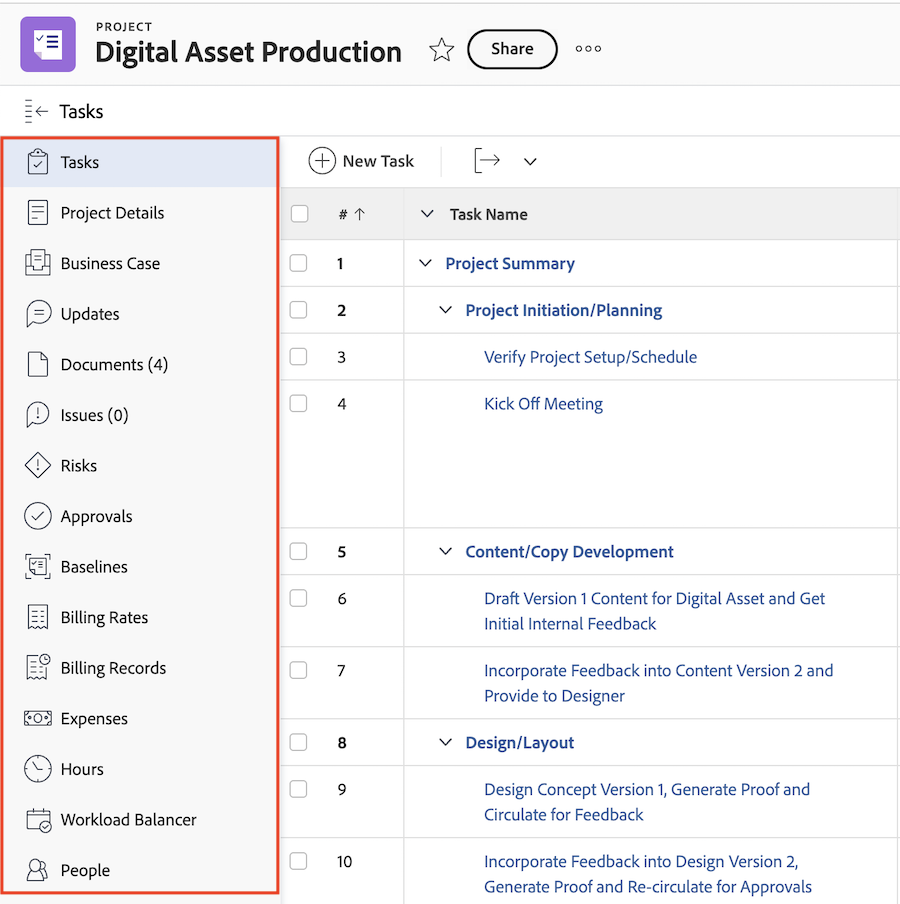

# Navigering till vänster i [!DNL Adobe Workfront]

De flesta områden och objekt i WF använder en enkel navigeringspanel på skärmens vänstra sida. Nedan följer några fördelar med navigering i den vänstra panelen:

* Det ger bättre hantering av skärmutrymme.
* Dina [!DNL Workfront] Administratören kan dölja alla avsnitt på den vänstra panelen förutom objektets detaljer med hjälp av layoutmallar.

   Mer information om hur du använder layoutmallar finns i artikeln [Skapa och hantera layoutmallar](../../administration-and-setup/customize-workfront/use-layout-templates/create-and-manage-layout-templates.md).

* Du kan enkelt ändra ordningen på avsnitten i den vänstra navigeringen utan att öppna ytterligare skärmar genom att dra och släppa dem i den ordning du vill ha dem.

   Mer information finns i följande avsnitt i den här artikeln: [Använda den vänstra navigeringspanelen](#use-the-left-navigation-panel).

* Du kan anpassa den vänstra panelen genom att lägga till en kontrollpanel.

## Åtkomstkrav

Du måste ha följande åtkomst för att kunna utföra stegen i den här artikeln:

<table style="table-layout:auto"> 
 <col> 
 </col> 
 <col> 
 </col> 
 <tbody> 
  <tr> 
   <td role="rowheader"><strong>[!DNL Adobe Workfront] plan*</strong></td> 
   <td> 
Alla
 </td> 
  </tr> 
  <tr> 
   <td role="rowheader"><strong>[!DNL Adobe Workfront] licens*</strong></td> 
   <td> 
[!UICONTROL Request] eller högre
 </td> 
  </tr> 
 </tbody> 
</table>

&#42;Om du vill ta reda på vilken plan eller licenstyp du har kontaktar du [!DNL Workfront] administratör.

## Standardavsnitt i den vänstra navigeringspanelen

Mer information om objekt och områden finns i den vänstra panelen för olika objekt och områden i Adobe Workfront.

Beroende på vilket objekt eller område du har navigerat till, är de avsnitt som visas på den vänstra panelen olika.

Den vänstra panelen är tillgänglig för följande objekt:

* Projekt
* Uppgift
* Problem
* Portfolio
* Program
* Mall
* Malluppgift
* Upprepning
* Användare
* Team
* Grupp
* Mål

>[!IMPORTANT]
>
>Om den vänstra panelen bara visar ett avsnitt som standard, till exempel **[!UICONTROL All Projects]** i **[!UICONTROL Projects]** area—a [!DNL Workfront] administratören måste lägga till minst ett anpassat avsnitt i det här området när du skapar en layoutmall och tilldela dig till den mallen innan den vänstra panelen visas i det området.\
>För information om hur en [!DNL Workfront] administratören anpassar den vänstra panelen i en layoutmall, se [Anpassa den vänstra panelen med en layoutmall](../../administration-and-setup/customize-workfront/use-layout-templates/customize-left-panel.md).

Den vänstra panelen är tillgänglig för följande områden:

* [Standardavsnitt i [!UICONTROL Dashboards] area](#default-sections-in-the-dashboards-area)
* [Standardavsnitt i [!UICONTROL Requests] area](#default-sections-in-the-requests-area)
* [Standardavsnitt i [!UICONTROL Resourcing] area](#default-sections-in-the-resourcing-area)
* [Standardavsnitt i [!UICONTROL Projects] area](#default-sections-in-the-projects-area)
* [Standardavsnitt i [!UICONTROL Timesheets] area](#default-sections-in-the-timesheets-area)
* [Standardavsnitt i [!DNL Goals] area](#default-sections-in-the-goals-area)

### Standardavsnitt i [!UICONTROL Dashboards] area

Följande avsnitt visas i den vänstra panelen för **[!UICONTROL Dashboards]** område:

<table style="table-layout:auto">
    <tr>
        <td><strong>[!UICONTROL My Dashboards]</strong></td>
        <td>Visar de instrumentpaneler som du har skapat.</td>
    </tr>
    <tr>
        <td><strong>[!UICONTROL Shared Dashboards]</strong></td>
        <td>Visar de instrumentpaneler som har skapats av andra användare och delats med dig.</td>
    </tr>
    <tr>
        <td><strong>[!UICONTROL All Dashboards]</strong></td>
        <td>Visar kontrollpaneler som du eller andra användare har skapat och som du har behörighet att åtminstone visa.</td>
    </tr>
</table>

Mer information om hur du använder den vänstra panelen i området Kontrollpaneler finns i avsnittet [Använda den vänstra navigeringspanelen](#use-the-left-navigation-panel) i den här artikeln.

### Standardavsnitt i [!UICONTROL Requests] area

<table style="table-layout:auto">
    <tr>
        <td><strong>[!UICONTROL Submitted]</strong></td>
        <td>Visar begäranden som du eller andra användare har skickat och som du har behörighet att åtminstone visa. Använd filtren i det övre högra hörnet av listan över förfrågningar för att visa dina förfrågningar eller förfrågningar som andra har skickat och du har tillgång till för att visa.</td>
    </tr>
    <tr>
        <td><strong>[!UICONTROL Drafts]</strong></td>
        <td>Visar begäranden som du har startat men inte skickat in än. [!DNL Workfront] sparar automatiskt alla nya begäranden i mappen Utkast när du har valt ditt köämne.</td>
    </tr>
</table>

Så här använder du den vänstra panelen i dialogrutan [!UICONTROL Requests] -området, se avsnittet [Använda den vänstra navigeringspanelen](#use-the-left-navigation-panel) i den här artikeln.

### Standardavsnitt i [!UICONTROL Resourcing] area

Följande avsnitt visas i den vänstra panelen för **[!UICONTROL Resourcing]** område:

<table style="table-layout:auto"> 
 <col> 
 <col> 
 <tbody> 
  <tr> 
   <td role="rowheader"><strong>Planering</strong></td> 
   <td>Visar resursplaneraren. Använd det här området för att planera dina resurser i flera projekt. Mer information om hur du använder resursplaneraren finns i <a href="../../resource-mgmt/resource-planning/get-started-resource-planning.md" class="MCXref xref">Kom igång med resursplanering</a>.</td> 
  </tr> 
  <tr> 
   <td role="rowheader"><strong>[!UICONTROL Workload Balancer]</strong></td> 
   <td>Visar arbetsbelastningsutjämnaren. I det här området kan du tilldela verkliga arbeten till dina resurser.  
   Mer information om hur du använder schemaläggningsresurser finns i <a href="../../resource-mgmt/workload-balancer/assign-work-in-workload-balancer.md" class="MCXref xref">Översikt över tilldelning av arbete i belastningsutjämnaren</a>.</td> 
  </tr> 
  <tr> 
   <td role="rowheader"><strong>Användning</strong></td> 
   <td>Visar användningsrapporten. Mer information om hur du läser användningsrapporten finns i <a href="../../reports-and-dashboards/reports/using-built-in-reports/resource-utilization-report.md" class="MCXref xref">Översikt över resursanvändningsrapporten</a>.</td> 
  </tr> 
  <tr> 
   <td role="rowheader"><strong>Resurspooler</strong></td> 
   <td>Visar alla resurspooler i Workfront. Mer information om resurspooler finns i <a href="../../resource-mgmt/resource-planning/resource-pools/work-with-resource-pools.md" class="MCXref xref"> Översikt över resurspooler </a>.</td>
  </tr> 
 </tbody> 
</table>

Så här använder du den vänstra panelen i dialogrutan [!UICONTROL Resourcing] -området, se avsnittet [Använda den vänstra navigeringspanelen](#use-the-left-navigation-panel) i den här artikeln.

### Standardavsnitt i [!UICONTROL Projects] area

Följande avsnitt visas i den vänstra panelen för **[!UICONTROL Projects]** område:

<table style="table-layout:auto">
    <tr>
        <td><strong>[!UICONTROL All Projects]</strong></td>
        <td>Visar alla projekt som du har tillgång till för att visa. Använd [!UICONTROL Filter] nedrullningsbar meny för att ändra vilka projekt du vill visa</td>
    </tr>
    <tr>
        <td><strong>[!UICONTROL Custom sections]</strong></td>
        <td>Du kan visa alla anpassade avsnitt som [!DNL Workfront] administratören har lagt till i den vänstra panelen för [!UICONTROL Projects] i layoutmallen. Anpassade avsnitt har namn som har anpassats för din miljö.</td>
    </tr>
</table>

Så här använder du den vänstra panelen i dialogrutan [!UICONTROL Projects] -området, se avsnittet [Använda den vänstra navigeringspanelen](#use-the-left-navigation-panel) i den här artikeln.

### Standardavsnitt i [!UICONTROL Timesheets] area

Följande avsnitt visas i den vänstra panelen för **[!UICONTROL Timesheets]** område:

<table style="table-layout:auto">
    <tr>
        <td><strong>[!UICONTROL My Timesheets]</strong></td>
        <td>Visar alla dina aktiva tidrapporter som standard. Om du vill visa skickade eller stängda tidrapporter väljer du [!UICONTROL Submitted] eller [!UICONTROL All] från [!UICONTROL Filter] nedrullningsbar meny.</td>
    </tr>
    <tr>
        <td><strong>[!UICONTROL Timesheets I Approve]</strong></td>
        <td>Visar tidrapporter som har skickats in för godkännande som standard. Om du vill visa aktiva eller alla tidrapporter där du är godkännare väljer du [!UICONTROL Active] eller App från listrutan Filter.</td>
    </tr>
    <tr>
        <td><strong>[!UICONTROL All Timesheets]</strong></td>
        <td>Visar alla tidrapporter som du har tillgång till, baserat på de filter som har valts i det vänstra filterområdet.</td>
    </tr>
</table>

Så här använder du den vänstra panelen i dialogrutan [!UICONTROL Timesheets] -området, se avsnittet [Använda den vänstra navigeringspanelen](#use-the-left-navigation-panel) i den här artikeln.

### Standardavsnitt i [!DNL Goals] area

>[!NOTE]
>
>För att nå målen krävs ytterligare en licens. Mer information om [!DNL Workfront Goals], se [[!DNL Adobe Workfront Goals] översikt](../../workfront-goals/goal-management/wf-goals-overview.md).

Följande avsnitt visas i den vänstra panelen för **[!UICONTROL Goals]** område:

<table style="table-layout:auto">
    <tr>
        <td><strong>[!UICONTROL Goal List]</strong></td>
        <td>Visar alla mål som du har tillgång till för att visa. Mer information finns i <a href="../../workfront-goals/goal-review-and-workfront-goals-sections/manage-goals-in-goal-list.md">Hantera mål i [!UICONTROL Goal List] av [!DNL Adobe Workfront Goals]</a>.</td>
    </tr>
    <tr>
        <td><strong>[!UICONTROL Graphs]</strong></td>
        <td>Visar målens prestanda i diagram. Mer information finns i <a href="../../workfront-goals/goal-review-and-workfront-goals-sections/review-goal-graphs.md">Granska diagram för att förstå målutvecklingstrender i [!DNL Adobe Workfront] Mål</a>.</td>
    </tr>
    <tr>
        <td><strong>[!UICONTROL Goal Alignment]</strong></td>
        <td>Visar justeringen av mål mot varandra i en hierarki. Mer information finns i <a href="../../workfront-goals/goal-alignment/goal-alignment-overview.md">Översikt över måljustering i [!DNL Adobe Workfront Goals]</a>.</td>
    </tr>
    </table>

<!--
   Drafted - removed from UI 
   <table>
    <tr>
        <td><strong>[!UICONTROL Pulse]</strong></td>
        <td>Displays a quick overview of all active goals and their progress. For more information, see <a href="../../workfront-goals/goal-review-and-workfront-goals-sections/review-goals-in-pulse.md">Review goals in the [!UICONTROL [!DNL Adobe Workfront Goals] Pulse] section</a>.
        
This section has been removed from the Preview environment.

        </td>
    </tr>
    <tr>
        <td><strong>[!UICONTROL Check-in]</strong></td>
        <td>Displays a quick overview of your active goals and their progress. For more information, see <a href="../../workfront-goals/goal-review-and-workfront-goals-sections/check-in-goals.md">Update goal progress in [!DNL Adobe Workfront Goals]</a>.
        
This section has been removed from the Preview environment.

        </td>
    </tr>
</table>
-->
Så här använder du den vänstra panelen i dialogrutan [!UICONTROL Goals] -området, se avsnittet [Använda den vänstra navigeringspanelen](#use-the-left-navigation-panel) i den här artikeln.

## Använda den vänstra navigeringspanelen

Att söka efter och redigera information i den vänstra panelen liknar för dessa objekt. Vilka alternativ som är tillgängliga på den vänstra panelen varierar beroende på vilket objekt du öppnar.

Mer information om vilka avsnitt som är tillgängliga för specifika områden finns i [[!UICONTROL Default sections] i den vänstra navigeringspanelen](#default-sections-in-the-left-navigation-panel).

1. Klicka på **[!UICONTROL Main menu]** icon och sedan klicka på namnet på ett objekt för att komma åt det.

   Objektsidan visas.

1. (Villkorligt) Om du har markerat ett område som innehåller en lista med objekt, t.ex. **[!UICONTROL Projects]** eller **[!UICONTROL Portfolios]**—du måste göra följande för att komma åt den vänstra panelnavigeringen:

   1. Klicka på ett objekt i listan.
   1. (Valfritt) I den vänstra panelnavigeringen kan du markera ett annat objekt, till exempel **[!UICONTROL Tasks]** eller **[!UICONTROL Issues]** i ett projekt - i den vänstra panelen för att komma åt en lista med objekt och klicka sedan på namnet på det specifika objektet.\

      Objektsidan visas.

1. Klicka på något av avsnitten i den vänstra panelen på objektsidan om du vill visa eller redigera informationen i det avsnittet.

   Du måste ha behörighet att redigera objektet innan du kan redigera informationen.

   

1. (Valfritt) Klicka på **[!UICONTROL Show More]** längst ned på den vänstra panelen om du vill visa fler avsnitt.

   >[!NOTE]
   >
   >Det här alternativet är inte tillgängligt om alla avsnitt visas i den vänstra panelen som standard.

1. (Valfritt) Om du vill lägga till en snabblänk för kontrollpanelen klickar du på **[!UICONTROL Add Dashboard]** längst ned på den vänstra panelen gör du följande:

   1. Ange ett namn för instrumentpanelen i dialogrutan **[!UICONTROL Quick link name]** fält.
   1. Börja skriva namnet på en befintlig kontrollpanel i dialogrutan **[!UICONTROL Choose a Dashboard]** klickar du på kontrollpanelen när den visas i listan.

      >[!TIP]
      >
      >Du måste skapa kontrollpanelen innan den visas i listan.

   1. Klicka på **[!UICONTROL Add]**.

      Kontrollpanelens länk visas längst ned på den vänstra panelen.

1. (Valfritt) Om du vill ändra ordningen på ett avsnitt i den vänstra panelen klickar du på **[!UICONTROL Drag]** icon  till höger om ett avsnitt och dra det uppåt eller nedåt.

   

1. (Valfritt) Om du vill stänga den vänstra panelen klickar du på **[!UICONTROL Collapse]** icon .

   >[!NOTE]
   >
   >När du komprimerar den vänstra panelen [!DNL Workfront] behåller dina inställningar även när du navigerar till andra [!DNL Workfront] -objekt. Klicka på knappen **[!UICONTROL Expand]** icon .
