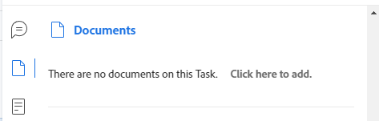

# [!UICONTROL Summary] översikt

<!--The highlighted information on this page refers to functionality not yet generally available. It is available only in the Preview environment for all customers or in Production for customers who enabled fast releases. 

For information about fast releases, see [Enable or disable fast releases for your organization](/help/quicksilver/administration-and-setup/set-up-workfront/configure-system-defaults/enable-fast-release-process.md).

For information about the current release schedule, see [Second Quarter 2024 release overview](/help/quicksilver/product-announcements/product-releases/24-q2-release-activity/24-q2-release-overview.md). -->

Du kan använda panelen [!UICONTROL Summary] för att granska och uppdatera information om arbetsobjekt direkt från en lista med uppgifter, utgåvor, dokument eller från andra områden i [!DNL Adobe Workfront] som visar uppgifter och problem.

Din Workfront- eller gruppadministratör kan ändra områdena och fälten som visas på sammanfattningspanelen. De kan lägga till upp till 16 fält på panelen Sammanfattning.

>[!IMPORTANT]
>
>Vi rekommenderar att du lägger till fält som du måste uppdatera ofta på panelen Sammanfattning, så att du enkelt kan komma åt dem och uppdatera dem utan att komma åt objektets huvudsida.
>
>Du kan till exempel lägga till följande fält som uppdateras ofta i panelerna för uppgifter och ärenden:
>
>* Status
>* Procent färdigt
>* Bekräftelsedatum
>* Planerat slutförandedatum
>* Villkor

I följande tabell visas de områden där du kan hitta och använda panelen [!UICONTROL Summary]:

<table style="table-layout:auto"> 
 <col data-mc-conditions=""> 
 <tbody> 
  <tr> 
   <td><b>Uppgifter</b></td> 
  </tr> 
  <tr> 
   <td> 
Uppgiftslistor i en
 
    <ul> 
     <li>Projekt</li> 
     <li>Underuppgift</li> 
    </ul> </td> 
  </tr> 
  <tr> 
   <td>Uppgifter i [!UICONTROL Unassigned]- och [!UICONTROL Assigned]-arbetsytorna i [!UICONTROL Workload Balancer]</td> 
  </tr> 
   <tr> 
   <td>Uppgifter i en [!UICONTROL Timesheet]</td> 
  </tr> 
  <tr data-mc-conditions=""> 
   <td><b>Problem</b></td> 
  </tr> 
  <tr data-mc-conditions=""> 
   <td> 
Ärendelistor i en
 
    <ul> 
     <li>Projekt</li> 
     <li>Uppgift</li> 
     <li>Underuppgift</li> 
    </ul> </td> 
  </tr> 
  <tr data-mc-conditions=""> 
   <td>Problem i området [!UICONTROL Assigned Work] i [!UICONTROL Workload Balancer]</td> 
  </tr> 
  <tr data-mc-conditions=""> 
   <td>Problem i avsnittet [!UICONTROL Submitted] i området [!UICONTROL Requests]</td> 
  </tr> 
</tr> 
   <tr> 
   <td>Problem i en [!UICONTROL Timesheet]</td> 
  </tr>

<tr data-mc-conditions=""> 
   <td><b>Dokument</b></td> 
  </tr> 
  <tr data-mc-conditions=""> 
   <td>[!UICONTROL Documents] area</td> 
  </tr> 
  <tr data-mc-conditions=""> 
   <td>[!UICONTROL Documents] del av ett objekt (projekt, uppgift, utgåva, program, portfölj, mall, malluppgift, användare)</td> 
  </tr> 
 </tbody> 
</table>

<!--

Workfront administrators can customize the Summary in the Layout Template. For more information, see <a href="../../administration-and-setup/customize-workfront/use-layout-templates/create-and-manage-layout-templates.md" class="MCXref xref">Create and manage layout templates</a>.

-->

I den här artikeln beskrivs hur du får åtkomst till och använder panelen [!UICONTROL Summary] för uppgifter och problem i listor.

Mer information om hur du får åtkomst till [!UICONTROL Summary] i [!UICONTROL Workload Balancer] finns i [Uppdatera arbetsobjekt i [!UICONTROL Workload Balancer] med [!UICONTROL Summary]](../../resource-mgmt/workload-balancer/update-items-in-summary-panel-in-workload-balancer.md).

Mer information om hur du får åtkomst till [!UICONTROL Summary] för dokument finns i [[!UICONTROL Summary] för dokumentöversikt &#x200B;](../../documents/managing-documents/summary-for-documents.md).

## Visa panelen [!UICONTROL Summary] i en lista över uppgifter eller problem

1. Gå till en uppgift eller ett ärende och välj ett objekt i listan.
1. Klicka på ikonen **[!UICONTROL Summary]** 

   eller

   Klicka på ikonen **[!UICONTROL Open Summary]**  i avsnittet [!UICONTROL Submitted] i området [!UICONTROL Requests].

   När du har öppnat sammanfattningen förblir den öppen när du klickar på eller väljer andra uppgifter eller ärenden och är öppen tills du stänger den manuellt.

   >[!TIP]
   >
   >Du kan bara markera en uppgift eller en utgåva i taget om du vill visa information om dem på panelen [!UICONTROL Summary].

   

1. (Valfritt) Gör något av följande om du vill stänga panelen [!UICONTROL Summary]:

   * Klicka på ikonen **[!UICONTROL Open Summary]**  i en aktivitets- eller problemlista

     eller

     Klicka på ikonen **X** i det övre högra hörnet av panelen [!UICONTROL Summary].

   * Klicka på ikonen [!UICONTROL Submitted] [!UICONTROL Requests]Stäng sammanfattning med text **[!UICONTROL Close Summary]** i avsnittet .

     eller

     Klicka på ikonen **X** i det övre högra hörnet av sammanfattningspanelen.

## [!UICONTROL Percent Complete]

Använd den blå förloppsbubblan högst upp i [!UICONTROL Summary] för att uppdatera procentandelen färdigt för den aktivitet eller utgåva som du har valt. Ange ett tal eller dra bubblan till rätt procenttal.

När du drar och släpper bubblan på panelen Sammanfattning uppdateras Procent färdigt i steg om en punkt. Du kan inte ange ett decimaltal.

## [!UICONTROL Updates]

Använd avsnittet [!UICONTROL Updates] i [!UICONTROL Summary] om du vill visa de senaste uppdateringarna och göra uppdateringar för den uppgift eller det problem du valde. Klicka på **[!UICONTROL See all]** om du vill gå direkt till fliken [!UICONTROL Updates] för uppgiften.

## [!UICONTROL Documents]

Använd avsnittet [!UICONTROL Documents] i [!UICONTROL Summary] om du vill visa dokument som är kopplade till uppgiften eller utgåvan som du har valt. Klicka på miniatyrbilden för att öppna en dokumentförhandsvisning. Om du vill gå direkt till fliken [!UICONTROL Documents] för aktiviteten eller problemet klickar du på rubriken **[!UICONTROL Documents]**.

## [!UICONTROL Details]

Använd avsnittet [!UICONTROL Details] i [!UICONTROL Summary] om du vill visa högnivåinformation om arbetsobjekt, göra tilldelningar eller lägga till startdatum. Klicka på **[!UICONTROL See all]** om du vill gå direkt till fliken [!UICONTROL Details] för uppgiften eller problemet.

## [!UICONTROL Subtasks]

Det här avsnittet är bara tillgängligt för uppgifter. Använd [!UICONTROL Subtasks]-delen av [!UICONTROL Summary] för att visa [!UICONTROL New], [!UICONTROL In Progress] och [!UICONTROL Closed] underaktiviteter för den aktivitet du har valt. Klicka på listrutan **[!UICONTROL Status]** för att växla mellan statusar. Om du vill gå direkt till fliken [!UICONTROL Subtasks] för aktiviteten klickar du på &#x200B; **[!UICONTROL Subtasks]** .

Om du inte har lagt till några underaktiviteter i aktiviteten klickar du på **[!UICONTROL Add one here]** för att gå direkt till fliken [!UICONTROL Subtasks] för aktiviteten.

## [!UICONTROL Hours]

Använd avsnittet [!UICONTROL Hours] i [!UICONTROL Summary] om du vill logga timmar på den aktivitet eller det problem du valde. Klicka på **[!UICONTROL Log Time]** och ange dina timmar. Om du vill gå direkt till fliken Timmar för uppgiften eller problemet klickar du på rubriken **[!UICONTROL Hours]**.

Timantalet i [!UICONTROL Summary] visar timmarna du loggar. Andra användare har olika timsummor i [!UICONTROL Summary] beroende på hur lång tid de loggar in på uppgiften.

Om det inte finns någon planerad [!UICONTROL hours] för aktiviteten eller problemet och du har loggat tid visas timraden med rött.

## Godkännanden

Använd avsnittet [!UICONTROL Approvals] i [!UICONTROL Summary] om du vill visa godkännanden som är kopplade till uppgiften eller utgåvan som du valde. Om du inte har lagt till några godkännanden väljer du ett befintligt godkännande i listrutan eller klickar på **[!UICONTROL Create single-use approval process]** för att gå direkt till fliken [!UICONTROL Approvals] för uppgiften eller problemet.

Om du vill gå direkt till fliken [!UICONTROL Approvals] för aktiviteten eller problemet klickar du på rubriken **[!UICONTROL Approvals]**.

