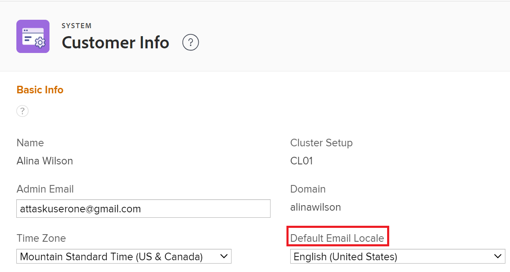

# Ändra format för datum i [!DNL Adobe Workfront]

<!--this article used to be called "Change the date format in Adobe Workfront when using Chrome". The team decieded to make it more generic and hide the steps. Also see drafted content below-->

Du kan ändra datumformat i [!DNL Adobe Workfront], till exempel [!UICONTROL Planned Completion Date], [!UICONTROL Actual Completion Date] eller [!UICONTROL Projected Completion Date].

Du kan till exempel ändra ett datumformat från _DD/MM/ÅÅÅÅ_ till _MM/DD/ÅÅÅÅ_ eller vice versa.
Du kan också ändra datumformatet från _MM/DD/ÅÅ_ till _MÅNAD DD, ÅÅÅÅ_.

Du kan ändra datumformat i Workfront på följande sätt, beroende på vilka ändringar du vill se och var du vill se ändringarna.

* Om du vill ändra alla datumformat för alla sidor i [!DNL Workfront] beroende på plats och språk måste du ändra språkinställningarna i webbläsaren.

  Om standardspråket i webbläsaren till exempel är *[!UICONTROL English (United States)]* visas datumen i följande format:

   * MM/DD/ÅÅÅ
   * Mån DD, ÅÅÅ

  Om du vill ändra språkinställningarna i [!DNL Chrome] eller någon annan webbläsare måste du ändra inställningarna för den webbläsaren. Stegen för att ändra en webbläsares inställningar varierar från webbläsare till webbläsare. Gå till [!UICONTROL Help], [!UICONTROL Preferences] eller [!UICONTROL Settings] i din webbläsare och lär dig hur du ändrar inställningarna.

* Om du bara vill ändra datumformatet i rapporter och vyer måste du uppdatera inställningen [!UICONTROL Field Format] i området [!UICONTROL Advanced Options] i en kolumn när du skapar rapporten eller vyn. Detta ändrar inte datumformatet beroende på plats eller språk. Det ändrar datumformatet i kontexten för samma plats eller språk.

  

  Mer information finns i [Skapa en anpassad rapport](../../reports-and-dashboards/reports/creating-and-managing-reports/create-custom-report.md).

* Om du vill ändra datumformatet i alla utgående e-postmeddelanden för hela organisationen måste du uppdatera inställningen [!UICONTROL Default Email Locale] i området [!UICONTROL Customer Info] i [!UICONTROL Setup].

  

  Mer information finns i [Konfigurera grundläggande information för systemet](../../administration-and-setup/get-started-wf-administration/configure-basic-info.md).

* Om du vill ändra formatet för alla datum i alla utgående e-postmeddelanden för en enskild användare måste du uppdatera inställningen [!UICONTROL Email Locale] i rutan [!UICONTROL Edit Person] när du redigerar en användarprofil.

  

  Mer information finns i [Redigera en användares profil](../../administration-and-setup/add-users/create-and-manage-users/edit-a-users-profile.md).

<!--drafted because we should not document steps for a third-party application

To change your language settings in Chrome:

1. Click the 3-dots in the top right corner of your Chrome interface, then click **Settings**.
1. On the left area of the Settings page, expand **Advanced**, then click **Languages**.  
   Or  
   Search for *language*&nbsp;at the top of the Settings page, then click **Languages**.

1. In the **Language** list, locate the language and region that use your preferred date format.

   **Example:** If you speak English and you want the date format to be MM/DD/YYYY, you would select **English (United States)**. If you speak English and you want the date format to be DD/MM/YYY, you would select **English (United Kingdom)**.

1. (Conditional) If the language and region you want to use are not visible in the list, click **Add languages** to add it to the list.
1. Click the 3-dot menu next to the language and region you want to use, then click **Move to the top**.
1. Return to the Workfront interface, then refresh the page.  
   The date format is now updated in projects and other areas of Workfront that use MM/DD/YYYY or DD/MM/YYYY format when displaying dates.

   -->
