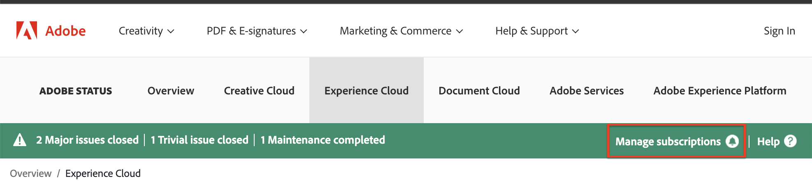

# Statuswebbplatsen [!DNL Adobe Workfront]

<!-- Audited: 1/2024 -->

## Översikt över statuswebbplatsen

Du kan visa hälsa för plattformen [!DNL Workfront], inklusive incidenter, schemalagda underhållsfönster och aktuell status för alla [!DNL Workfront]-kluster genom att gå till webbplatsen [!DNL Workfront Status].

Du har tillgång till följande information på statuswebbplatsen:

* Systemprestandastatistik i realtid
* Planerad underhållsplanering
* Information om skyddsåtgärder som används av [!DNL Workfront] för att skydda användardata
* Namngivna säkerhetslägen

## Visa [!DNL Adobe Workfront] statusuppdateringar

Du kan visa statusuppdateringar på [!DNL Adobe]-statuswebbplatsen.

1. Skriv [status.adobe.com](https://status.adobe.com/) i webbläsaren för att komma åt statuswebbplatsen.

1. Välj **[!UICONTROL Experience Cloud]**.
1. Rulla ned och välj **[!UICONTROL Adobe Workfront]** i listan över lösningar.

## Prenumerera eller hantera din prenumeration

Så här prenumererar du på statuswebbplatsen eller för att hantera din prenumeration efter att du redan har prenumererat:

1. Gå till [status.adobe.com](https://status.adobe.com/).
1. Välj **[!UICONTROL Manage subscriptions]** i statusfältet.
   
1. Om du har ett befintligt konto loggar du in på kontot, annars skapar du ett nytt konto.
1. Klicka på knappen **[!UICONTROL Create subscriptions]**.
1. Välj **[!UICONTROL Adobe Workfront]** under rubriken **[!UICONTROL Experience Cloud]** och klicka sedan på **[!UICONTROL Continue]**.
1. Välj inställningar för region och händelsetyp och klicka sedan på **[!UICONTROL Continue]**.
1. Klicka på **[!UICONTROL Done]** för att bekräfta prenumerationen.

## Förstå namngivna sårbarheter

### Vad är en namngiven sårbarhet? {#what-is-a-named-vulnerability}

När det gäller datasäkerhet är en sårbarhet en svaghet som gör det möjligt för en angripare att minska stabiliteten, säkerheten eller integriteten i ett system.

Sårbarhets-forskare och utvecklare namnger sina projekt internt så att det blir enkelt att referera till dem (till exempel [!DNL ShellShock], [!DNL Heartbleed], [!DNL POODLE] och [!DNL WannaCry]/[!DNL Petya]). När en sårbarhet har stor spridning blir dessa namn offentliga när sårbarheterna avslöjas.

### Hur visar jag namngivna sårbarheter som identifierats av [!DNL Workfront?]? {#how-do-i-view-named-vulnerabilities-identified-by-workfront}

1. Gå till [status.adobe.com](https://status.adobe.com/) och klicka sedan på **[!UICONTROL Security]**.

## Varför är detta viktigt? {#why-is-this-important}

Alla säkerhetsmedvetna nätverksadministratörer bör känna till statuswebbplatsen och de namngivna säkerhetsluckor som identifieras av Workfront.

När sårbarheter med stor påverkan avslöjas är det av största vikt att dina leverantörer är medvetna om och skyddar dina data.

Statuswebbplatsen innehåller en aktuell logg över sådana sårbarheter som du kan nå när som helst, där du kan undvika att vänta på att logga in en biljett eller kontakta din kontohanterare för att få tillgång till informationen.
