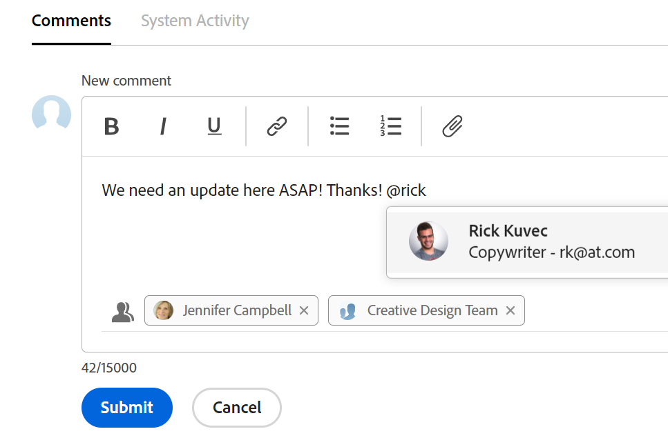

# Tagga andra för uppdateringar

<!--take "Beta" references out when we remove the beta-->

Den markerade informationen på den här sidan avser funktioner som ännu inte är allmänt tillgängliga. Den är bara tillgänglig i förhandsvisningsmiljön.

>[!NOTE]
>
>Vi håller på att omarbeta kommentarsfunktionerna i Adobe Workfront.
>
>Mer information om de nya kommentarfunktionerna finns i [Ny kommentarsfunktion](../../product-announcements/betas/new-commenting-experience-beta/unified-commenting-experience.md).
>
>Du kommer åt den nya funktionen för följande objekt:
> * Frågor, projekt, uppgifter och dokument.
>
>     Detta är tillgängligt när du aktiverar kommenteringsfunktionen Beta.
>
>     Den här funktionen är bara tillgänglig för uppdateringsavsnittet och är inte tillgänglig för följande områden:
>
>     * Startsida
>     * Panelen Sammanfattning i listor
>     * Sammanfattningspanelen i tidrapporter
>
> * Mål, kort i området för anslagstavlor
>
>   Den nya kommentarsupplevelsen är den enda upplevelsen för att nå målen och kort. Du måste ha ytterligare en licens för att få tillgång till Workfront Goals. Mer information finns i [Krav för användning av Workfront-mål](../../workfront-goals/goal-management/access-needed-for-wf-goals.md).
>
>     Du kan lägga till och visa uppdateringar av kort i styrelsegena när du aktiverar avsnitten Kommentarer och Systemaktivitet på ett kort. Mer information finns i [Lägga till ett ad hoc-kort till en anslagstavla](../../agile/get-started-with-boards/add-card-to-board.md).

Du kan tagga användare när de gör en uppdatering av ett objekt om du vill dra deras uppmärksamhet till ett objekt som de annars kanske inte följer.
I stället för att inkludera de användarna i objektet genom att tilldela dem eller få dem att prenumerera på det, kan du tagga dem på uppdateringen och dela dem med dem. Taggade användare får ett meddelande om den uppdatering du anger.

>[!NOTE]
>
>Användaren måste aktivera ett personligt meddelande i sin profil för att kunna ta emot e-postmeddelandet. Mer information finns i [Aktivera eller inaktivera egna händelsemeddelanden](../../workfront-basics/using-notifications/activate-or-deactivate-your-own-event-notifications.md).
>

Mer information om hur du lägger till uppdateringar till Workfront-objekt finns i [Uppdatera arbete](../../workfront-basics/updating-work-items-and-viewing-updates/update-work.md).

>[!NOTE]
>
>När ett problem konverteras till ett projekt eller en uppgift kopieras uppdateringarna till det nya projektet eller den nya uppgiften, men det är inte de taggade användarna. Om du vill fortsätta konversationen måste du tagga deltagarna igen.

## Åtkomstkrav

Du måste ha följande åtkomst för att kunna utföra stegen i den här artikeln:

<table style="table-layout:auto"> 
 <col> 
 </col> 
 <col> 
 </col> 
 <tbody> 
  <tr> 
   <td role="rowheader"><strong>Adobe Workfront-plan*</strong></td> 
   <td> 
Alla
 </td> 
  </tr> 
  <tr> 
   <td role="rowheader"><strong>Adobe Workfront-licens*</strong></td> 
   <td> 
Begär eller högre för frågor och dokument. Granska eller högre för alla andra objekt
 </td> 
  </tr> 
  <tr> 
   <td role="rowheader"><strong>Konfigurationer på åtkomstnivå*</strong></td> 
   <td> 
begärande eller högre för frågor och dokument, Granskare eller högre för alla andra objekt
 
   
<b>ANMÄRKNING</b>

Om du fortfarande inte har åtkomst frågar du Workfront-administratören om de anger ytterligare begränsningar för din åtkomstnivå. Information om hur en Workfront-administratör kan ändra åtkomstnivån finns i <a href="../../administration-and-setup/add-users/configure-and-grant-access/create-modify-access-levels.md" class="MCXref xref">Skapa eller ändra anpassade åtkomstnivåer</a>.
 </td>
</tr> 
  <tr> 
   <td role="rowheader"><strong>Objektbehörigheter</strong></td> 
   <td> 
Visa åtkomst till objektet
 
Mer information om hur du begär ytterligare åtkomst finns i <a href="../../workfront-basics/grant-and-request-access-to-objects/request-access.md" class="MCXref xref">Begär åtkomst till objekt </a>.
 </td> 
  </tr> 
 </tbody> 
</table>

*Kontakta Workfront-administratören om du vill veta vilken plan, licenstyp eller åtkomst du har.

## Tagga andra för uppdateringar

Om du taggar andra i en uppdatering varierar beroende på vilken upplevelse och vilket objekt du väljer.

### Tagga andra om uppdateringar i det aktuella uppdateringsavsnittet

1. Börja uppdatera en arbetsuppgift enligt beskrivningen i [Uppdatera arbete](../../workfront-basics/updating-work-items-and-viewing-updates/update-work.md).
1. I **Meddela** börjar du skriva namnet på den användare eller det team som du vill inkludera och klickar sedan på namnet när det visas i listrutan.

   eller

   Skriv @-symbolen i **Starta en ny uppdatering** börjar du skriva namnet på den användare eller det team som du vill inkludera i uppdateringen och klickar sedan på namnet när det visas i listrutan.

   >[!TIP]
   >
   >Om du vill identifiera rätt användare när det finns användare med liknande eller identiska namn ska du lägga märke till avataren, användarens primära roll eller användarens e-postadress. Användarna måste vara associerade med minst en jobbroll för att kunna visa den när du taggar dem i en uppdatering.

   

1. (Valfritt) Aktivera **Privat till mitt företag** i uppdateringsrutans nedre högra hörn. Detta gör uppdateringen synlig endast för användare i ditt företag. The **Privat till mitt företag** är bara tillgängligt när ett företag anges i din Workfront-profil.

   >[!NOTE]
   >
   >Taggade användare utanför företaget kan fortfarande få ett meddelande eller e-postmeddelande i appen, även om de inte ser de privata kommentarerna på fliken Uppdateringar. Vi rekommenderar att du inte taggar externa användare vid en uppdatering om du inte vill dela informationen med dem.

1. (Valfritt) Om du vill lägga till flera användare och team upprepar du steg 2.

   >[!NOTE]
   >
   >Alla användare och teammedlemmar som visas i fältet Notify (Meddela) får ett meddelande i appen för uppdateringen och kan få ett e-postmeddelande, beroende på konfigurationen av deras e-postmeddelandeinställningar. Användare som taggar sig i en kommentar eller svarar får ett meddelande om kommentaren eller svaret och kan se sitt namn i fältet Meddela för resten av tråden, men de får inget annat meddelande om de inte taggar sig igen. Mer information finns i [Aktivera eller inaktivera egna händelsemeddelanden](../../workfront-basics/using-notifications/activate-or-deactivate-your-own-event-notifications.md) och [Konfigurera händelsemeddelanden för alla i systemet](../../administration-and-setup/manage-workfront/emails/configure-event-notifications-for-everyone-in-the-system.md).

1. Klicka **Uppdatera**.\
   Användare som ingår i uppdateringen får automatiskt behörigheten Visa för objektet och kan visa och svara på uppdateringar som gjorts för objektet.

   Du kan se vilka som har taggats i varje svar högst upp i uppdateringstråden. Dessa användare, tillsammans med alla användare som prenumererar på objektet, får ett meddelande varje gång en uppdatering eller ett svar görs för objektet.

   

   Mer information om de ytterligare funktioner som är tillgängliga när du uppdaterar en arbetsuppgift finns i [Uppdatera arbete](../../workfront-basics/updating-work-items-and-viewing-updates/update-work.md).

### Tagga andra om uppdateringar i kommenteringsfunktionen Beta

Du kan tagga andra vid uppdateringar i kommenteringsfunktionen Beta. Du kan också ta bort användare som är taggade av misstag när du redigerar en kommentar.

1. Börja uppdatera en arbetsuppgift enligt beskrivningen i [Uppdatera arbete](../../workfront-basics/updating-work-items-and-viewing-updates/update-work.md).
1. I **Tagga personer eller team** börjar du skriva namnet på den användare eller det team som du vill inkludera och klickar sedan på namnet när det visas i listrutan.

   eller

   Skriv @-symbolen i **Skriv en kommentar** börjar du skriva namnet på den användare eller det team som du vill inkludera i uppdateringen och klickar sedan på namnet när det visas i listrutan.

   >[!TIP]
   >
   >Om du vill identifiera rätt användare när det finns användare med liknande eller identiska namn ska du lägga märke till avataren, användarens primära roll eller användarens e-postadress. Användarna måste vara associerade med minst en jobbroll för att kunna visa den när du taggar dem i en uppdatering.

   

1. (Valfritt) Aktivera **Privat till mitt företag** i uppdateringsrutans nedre högra hörn. Detta gör uppdateringen synlig endast för användare i ditt företag. The **Privat till mitt företag** är bara tillgängligt när ett företag anges i din Workfront-profil.

   >[!NOTE]
   >
   >* Det här alternativet visas bara när användaren är associerad med ett företag.
   >* Taggade användare utanför företaget kan fortfarande få ett meddelande eller e-postmeddelande i appen, även om de inte ser de privata kommentarerna på fliken Uppdateringar. Vi rekommenderar att du inte taggar externa användare vid en uppdatering om du inte vill dela informationen med dem.

1. (Valfritt) Om du vill lägga till flera användare och team upprepar du steg 2. <!--insure this stays accurate-->

   >[!NOTE]
   >
   >Alla användare och teammedlemmar som visas i fältet&quot;Tagga personer eller team&quot; får ett meddelande i appen för uppdateringen och kan få ett e-postmeddelande, beroende på konfigurationen av deras e-postaviseringsinställningar. Användare som taggar sig i en kommentar eller svarar får ett meddelande om kommentaren eller svaret och kan se sitt namn i listan som medlem i tråden för resten av tråden, men de får inget annat meddelande om de inte taggar sig igen. Mer information finns i [Aktivera eller inaktivera egna händelsemeddelanden](../../workfront-basics/using-notifications/activate-or-deactivate-your-own-event-notifications.md) och [Konfigurera händelsemeddelanden för alla i systemet](../../administration-and-setup/manage-workfront/emails/configure-event-notifications-for-everyone-in-the-system.md).

1. Klicka **Skicka**.\
   Användare som ingår i uppdateringen får automatiskt behörigheten Visa för objektet och kan visa och svara på uppdateringar som gjorts för objektet.

   I området Medlemmar ser du vilka som har taggats i varje svar under uppdateringstexten. Dessa användare, tillsammans med alla användare som prenumererar på objektet, får ett meddelande varje gång en uppdatering eller ett svar görs för objektet.
1. (Valfritt) Klicka på antalet **Medlemmar** ingår i uppdateringen för att visa en lista över enheter som den uppdatering du angav delas med.

   

   Mer information om de ytterligare funktioner som är tillgängliga när du uppdaterar en arbetsuppgift finns i [Uppdatera arbete](../../workfront-basics/updating-work-items-and-viewing-updates/update-work.md).

1. (Valfritt) Klicka på **Mer** meny  till höger om ikonen Gilla och klicka sedan på **Redigera**. Ta bort någon av de taggade användarna och klicka sedan på **Skicka**. Du kan bara redigera en kommentar inom 15 minuter efter att du har skrivit in den. Du kan bara redigera kommentarer som du har lagt till.