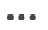
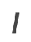
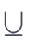
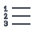
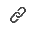
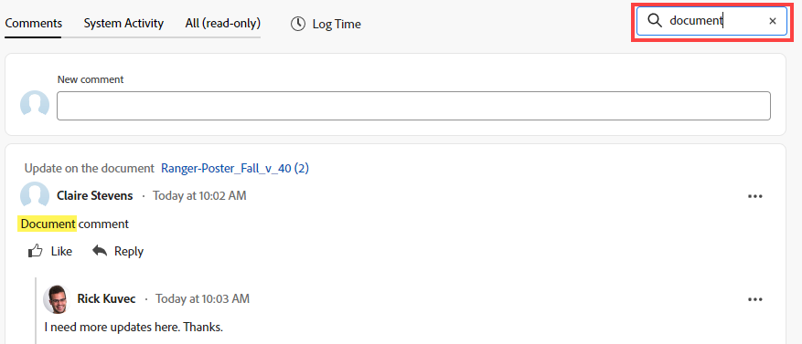
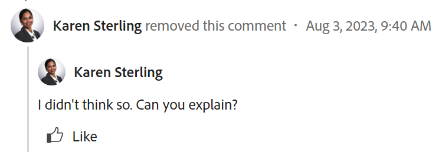

# Uppdatera arbete

<!-- Audited: 4/2025 -->

<!--The highlighted information on this page refers to functionality not yet generally available. It is available only in the Preview environment for all customers. After the monthly releases to Production, the same features are also available in the Production environment for customers who enabled fast releases.    

For information about fast releases, see [Enable or disable fast releases for your organization](/help/quicksilver/administration-and-setup/set-up-workfront/configure-system-defaults/enable-fast-release-process.md). -->

<!--info for April 11: hide the "Important" box below-->

<!--
>[!IMPORTANT]
>
>We are currently redesigning the commenting experience in Adobe Workfront.
>
>Depending on what objects you access the commenting experience for, you might see the following functionality for the Updates section:
>* The new experience
>* The legacy experience
>* The new and the legacy experience
>
>For more information about the new commenting experience and its availability, see [New commenting experience](../../product-announcements/betas/new-commenting-experience-beta/unified-commenting-experience.md). 
>
>The legacy commenting experience has been removed from projects, tasks, issues, and documents in the Preview environment. 
>
>The new commenting experience is available only for the Updates section of Workfront objects, and it is not available when you access updates from the following areas:
>
> * Home
> * Summary panel in lists
> * Summary panel in timesheets 
> * Summary panel in the Workload Balancer
>
>The new commenting experience is available in the Summary panel in lists, timesheets, and the Workload Balancer in the Preview environment and in the Production environment for customers who have opted for the fast release process. 
-->

Du kan lägga till en uppdatering till ett Adobe Workfront-objekt genom att lägga till en kommentar för att informera andra om objektets status eller förlopp, eller be om mer information eller ytterligare resurser.

Mer information om vilka objekt du kan lägga till uppdateringar till i Workfront finns i [Översikt över uppdateringsavsnitt](/help/quicksilver/workfront-basics/updating-work-items-and-viewing-updates/updates-tab-overview.md).

I den här artikeln beskrivs hur du kan kommentera projekt, uppgifter och problem. Användare som har tilldelats eller prenumererar på objektet kan visa din uppdatering. Du kan också tagga användare så att de uppmärksammas på uppdateringen.

Att lägga till kommentarer till andra Workfront-objekt liknar att uppdatera projekt, uppgifter och problem.

Mer information om hur du kommenterar kort, mål och poster i Workfront Planning finns även i följande artiklar:

* [Hantera målkommentarer i Adobe Workfront-mål](../../workfront-goals/goal-management/manage-goal-comments.md).

* [Lägga till ett ad hoc-kort till en anslagstavla](/help/quicksilver/agile/get-started-with-boards/add-card-to-board.md)

* [Använd anslutna kort på ritytor](/help/quicksilver/agile/get-started-with-boards/connected-cards.md)

* [Hantera postkommentarer](/help/quicksilver/planning/records/manage-record-comments.md)

## Åtkomstkrav

+++ Expandera om du vill visa åtkomstkrav för funktionerna i den här artikeln.

<table style="table-layout:auto"> 
 <col> 
 </col> 
 <col> 
 </col> 
 <tbody> 
  <tr> 
   <td role="rowheader"><strong>Adobe Workfront package</strong></td> 
   <td> 
Alla
 </td> 
  </tr> 
  <tr> 
   <td role="rowheader"><strong>Adobe Workfront-licens</strong></td> 
   <td> 
För ärenden och dokument:

<ul><li>
Medarbetare eller högre
</li>
   <li>
Begäran eller senare
</li></ul>

För alla andra objekt:

   <ul><li>
Ljus eller högre
</li>
   <li>
Granska eller högre
</li></ul>

</td> 
  </tr> 
  <tr> 
   <td role="rowheader"><strong>Konfigurationer på åtkomstnivå</strong></td> 
   <td> 
Visa eller redigera åtkomst för objektet som uppdateringen är aktiverad för
</td> 
  </tr> 
  <tr> 
   <td role="rowheader"><strong>Objektbehörigheter</strong></td> 
   <td> 
Visa åtkomst till objektet
</td> 
  </tr> 
 </tbody> 
</table>

Mer information finns i [Åtkomstkrav i Workfront-dokumentation](/help/quicksilver/administration-and-setup/add-users/access-levels-and-object-permissions/access-level-requirements-in-documentation.md).

+++

<!--Old:
<table style="table-layout:auto"> 
 <col> 
 </col> 
 <col> 
 </col> 
 <tbody> 
  <tr> 
   <td role="rowheader"><strong>Adobe Workfront plan</strong></td> 
   <td> 
Any
 </td> 
  </tr> 
  <tr> 
   <td role="rowheader"><strong>Adobe Workfront license*</strong></td> 
   <td> 
   
New: Contributor or higher for issues and documents: Light or higher for all other objects

   
Current: Request or higher for issues and documents; Review or higher for all other objects

   </td> 
  </tr> 
  <tr> 
   <td role="rowheader"><strong>Access level configurations</strong></td> 
   <td> 
View or Edit access for the object the update is on
</td> 
  </tr> 
  <tr> 
   <td role="rowheader"><strong>Object permissions</strong></td> 
   <td> 
View access to the object
</td> 
  </tr> 
 </tbody> 
</table>
-->

## Att tänka på när du kommenterar objekt

* Du kan lägga till kommentarer till de flesta objekt i Adobe Workfront under Uppdateringar. Mer information om vilka objekt som visar uppdateringsavsnittet finns i [Översikt över uppdateringsavsnittet](../updating-work-items-and-viewing-updates/updates-tab-overview.md).

* Du kan lägga till kommentarer till Workfront-objekt från andra program som är integrerade med Workfront eller från Workfront mobilapp.

  Alla program som är integrerade med Workfront kan inte lägga till kommentarer i Workfront-objekt.

  Alla funktioner som är tillgängliga i uppdateringsavsnittet för ett objekt i Workfront är inte tillgängliga i andra program vid åtkomst till Workfront-objekt från programmet. Funktioner för RTF eller privata kommentarer till ett företag kanske inte är tillgängliga när du lägger till kommentarer till ett Workfront-objekt från ett tredjepartsprogram.

* Du kan informera om förloppet för ett Workfront-objekt (projekt, uppgift eller problem) när du kommenterar objektet. Användare som har tilldelats eller prenumererar på objektet kan få ett meddelande om uppdateringen. Alla som har behörighet att visa objektet kan visa din uppdatering.

* Du kan tagga användare så att de uppmärksammas på uppdateringen. Taggade användare får ett meddelande i appen och ett e-postmeddelande om uppdateringen.

  >[!TIP]
  >
  >Kommentarägare taggas automatiskt. Mer information finns i [Tagga andra om uppdateringar](../../workfront-basics/updating-work-items-and-viewing-updates/tag-others-on-updates.md).

* Du kan lägga till en kommentar i ett objekt som du kan visa, eller så kan du logga in som Workfront- eller gruppadministratör och lägga till en kommentar för en annan användares räkning. Mer information finns i [Logga in som en annan användare](../../administration-and-setup/add-users/create-and-manage-users/log-in-as-another-user.md).

* Du kan lägga till en uppdatering till projekt, uppgifter och utgåvor från följande områden i Workfront:

   * Från ett Workfront-objekt, i uppdateringsavsnittet (för projekt, uppgifter och ärenden)
   * Från hemområdet (för uppgifter och ärenden)

     Mer information finns i [Hantera ditt arbete med widgeten Mitt arbete](/help/quicksilver/workfront-basics/using-home/using-the-home-area/my-work-widget.md).
   * I panelen Sammanfattning i följande områden (för uppgifter, utgåvor och dokument):

      * En lista med objekt
      * En tidrapport
      * Startsida
      * Utjämning av arbetsbelastning

     Mer information finns i följande artiklar:

      * [Sammanfattning](/help/quicksilver/workfront-basics/the-new-workfront-experience/summary-overview.md)
      * [Uppdatera arbetsobjekt i belastningsutjämnaren med hjälp av sammanfattningen](/help/quicksilver/resource-mgmt/workload-balancer/update-items-in-summary-panel-in-workload-balancer.md)

<!--info for April 11: hide the section below: add an update to a work item-->

<!--
## Add an update to a work item

Adding an update to a work item differs depending on what version of the Updates section you use.

You can add updates to the following objects: 

* Projects
* Tasks
* Issues
* Programs
* Portfolios
* Templates
* Template tasks
* Users
* Timesheets
* Teams
* Goals
* Cards in the Boards area
* Iterations
-->

<!--info for April 11: hide the section below completely:-->

<!--
### Add an update to a work item in the legacy Updates section

>[!IMPORTANT]
>
>The information on this page describes how you update projects, tasks, and issues.

1. Go to the work item for which you want to provide an update (such as a project, task, or issue).
1. Click the **Updates** section.
1. (Conditional) If it is enabled, click the **New commenting** option in the upper-right corner of the Updates section to disable it and enable the legacy commenting experience.
1. Click **Start a new update,** then type your update.  
1. (Optional) Use the options in the Rich Text toolbar to format your text, add emojis, links, or images to your update, to enhance your content. For more information, see the [Use Rich Text in a Workfront update](#use-rich-text-in-a-workfront-update) section in this article.
1. (Optional) Update any of the following information about the work item:

   <table style="table-layout:auto"> 
    <col> 
    <col> 
    <tbody> 
     <tr> 
      <td role="rowheader"><strong>Notify</strong></td> 
      <td>Identify users who must be notified of the update. Users assigned or subscribed to the object automatically receive notification when an update is made. 
For information about how to include others on an update, see <a href="../../workfront-basics/updating-work-items-and-viewing-updates/tag-others-on-updates.md" class="MCXref xref">Tag others on updates</a>.
</td> 
     </tr> 
     <tr> 
      <td role="rowheader"><strong>Commit Date</strong></td> 
      <td>In the date picker, select the date that you commit to complete the work item. For information about Commit Date, see <a href="../../manage-work/projects/updating-work-in-a-project/overview-of-commit-dates.md" class="MCXref xref">Commit Date overview</a>.</td> 
     </tr> 
     <tr> 
      <td role="rowheader"><strong>Condition</strong></td> 
      <td>Select a new condition for the task or issue. For information about selecting a condition, see <a href="../../manage-work/projects/updating-work-in-a-project/update-condition-for-tasks-and-issues.md" class="MCXref xref">Update Condition for tasks and issues</a>.</td> 
     </tr> 
     <tr> 
      <td role="rowheader"><strong>Status</strong></td> 
      <td>Click the arrow beside the current status, then select the desired status from the drop-down menu. For information about setting a Status, see <a href="../../manage-work/projects/updating-work-in-a-project/update-task-status.md" class="MCXref xref">Update task status</a>.
Updating the status of a work item does not automatically change the status of a project. Depending on how your project is set up, you might make updates to the project status separately. For more information on the various project update types, see <a href="../../manage-work/projects/manage-projects/select-project-update-type.md" class="MCXref xref">Select the project Update Type </a>.

<b>NOTE</b>
      
      You cannot change the status of a work item while it is in a Pending Approval status.
</td> 
     </tr> 
     <tr> 
      <td role="rowheader"><strong>Completion Bar</strong></td> 
      <td>(Only available on tasks) Indicate the percentage of work completed by sliding the progress bar to the desired percentage. You can also double-click the completion bar and enter the percent complete.</td> 
     </tr> 
     <tr> 
      <td role="rowheader"><strong>Private to my company</strong></td> 
      <td> 
Disable this option to prevent users outside your company from having access to view this update.
 
      
<b>NOTE</b>

      
This option displays only when the user is associated with a Company.

      
This option is not available in all areas where you can add updates from. For example, this is not available in third-party applications where you can add updates from. 

      </td> 
     </tr> 
    </tbody> 
   </table>

1. Click **Update** to add the update to the Workfront object.

   >[!NOTE]
   >
   >A small pop-up window will appear for seven seconds after clicking **Update**, allowing you to undo the update and return to the editing pane before the update is posted. The update is posted if you dismiss the undo pop-up, wait for it to disappear, or navigate away from the page. 
   >
   >If your Workfront administrator selects the "Never allow users to delete comments" setting in your access level, you cannot undo a comment. For more information, see [Create and modify custom access levels](../../administration-and-setup/add-users/configure-and-grant-access/create-modify-access-levels.md).

1. To reply to an update, see [Reply to updates](../../workfront-basics/updating-work-items-and-viewing-updates/reply-to-updates.md).
-->

<!--info for April 11: reword the title of this section to: "Add an update to a work item"; take out the step that says you need to enable the "New commenting" toggle (I think it is step 3??)-->

## Lägga till en kommentar i en arbetsuppgift

I den här artikeln beskrivs hur du kan uppdatera projekt, uppgifter eller problem. Det liknar att uppdatera de flesta andra objekt.

1. Leta reda på objektet som du vill lägga till en kommentar i och klicka sedan på dess namn för att öppna objektets sida.
1. Klicka på **Uppdateringar** i den vänstra panelen.
Fliken **Kommentarer** är markerad som standard.

1. Börja skriva en kommentar i rutan **Ny kommentar**.

   

   >[!TIP]
   >
   >Om du navigerar bort från uppdateringsavsnittet innan du är klar med att skriva och skicka en kommentar, kommer kommentaren på sidan att vara i utkastläge även efter att du loggat ut och loggat in igen. Alla bilder som läggs till i kommentaren sparas också i utkastet. Utkast sparas i 7 dagar efter vilka de tas bort och kan inte återställas. Kommentarerna är bara synliga för användaren som skriver dem.

1. (Valfritt) Om du vill ångra eller göra om en ändring använder du följande kortkommandon:
   * CTRL + Z (⌘ + z för Mac) för att ångra en ändring
   * CTRL + Y (⌘+y för Mac) för att göra om en ändring

1. (Valfritt) I området **Tagga personer eller team** kan du börja skriva namnet eller e-postadressen för en användare, eller ett team som du vill inkludera i kommentaren, eller markera den när den visas i listan.
1. (Valfritt) Använd alternativen i verktygsfältet RTF för att formatera texten, lägga till känslolägesikoner, länkar eller bilder till uppdateringen för att förbättra innehållet. Mer information finns i avsnittet [Använd RTF i en Workfront-uppdatering](#use-rich-text-in-a-workfront-update) i den här artikeln.

   >[!TIP]
   >
   >Om en annan användare skickar en kommentar till samma objekt som du uppdaterar finns det en röd linje med en ny indikator som informerar dig om de nyare kommentarerna.
   >
   >Indikatorn visas först när kommentaren har skickats för objektet, inte när kommentaren fortfarande är sammansatt.
   >
   >Indikatorn&quot;Nytt&quot; visas bara när både användaren som angav en ny uppdatering och användaren som håller på att uppdatera använder den nya kommentarfunktionen.
   >

1. Klicka på **Skicka** för att lägga till uppdateringen till Workfront-objektet.
1. (Valfritt) Om du vill redigera en kommentar klickar du på menyn **Mer**  i kommentarens övre högra hörn och sedan på **Redigera**.

   >[!IMPORTANT]
   >
   >Du kan bara redigera kommentaren inom 15 minuter från det att du skickat in den.

1. Redigera informationen i kommentaren, lägg till eller ta bort bilder eller ta bort någon av de taggade användarna. En&quot;redigerad&quot; indikator läggs till till vänster om datumstämpeln som visas när kommentaren angavs.

   >[!TIP]
   >
   >Kommentarer från det aktuella året visar inte året i datumstämpeln. Om du hovrar över en tidsstämpel visas hela datumet, inklusive året.

   

   >[!TIP]
   >
   >* Ett e-postmeddelande skapas för att meddela användare om din uppdatering endast när du skickar den ursprungliga uppdateringen. Inget e-postmeddelande genereras när du har redigerat uppdateringen.
   >* Datumstämpeln bredvid kommentaren är datumet för den ursprungliga kommentaren, inte datumet för den senaste redigeringen.
   >* När du lägger till en kommentar för en annan användares räkning (när du loggar in som en annan användare som Workfront- eller gruppadministratör) kan du inte redigera kommentaren om du är inloggad som den andra användaren. Du kan bara redigera kommentaren efter att du har loggat ut som användare och loggat in som du själv.

1. (Valfritt) Klicka på **Svara** eller börja skriva en kommentar i området **Lägg till svar ...** för att svara på en befintlig kommentar och följ sedan stegen 3-7 ovan. <!--(**************insure this stays accurate***********)--> Mer information om hur du svarar på en uppdatering finns i [Svara på uppdateringar](../../workfront-basics/updating-work-items-and-viewing-updates/reply-to-updates.md).

1. (Villkorligt och valfritt) Om andra användare har lagt till kommentarer som visas utanför det synliga området i uppdateringsavsnittet medan du lade till dina kommentarer, klickar du på **Visa** i den blå **nya kommentarsbanderollen** längst ned på skärmen för att visa dessa kommentarer.

   

   Ytterligare kommentarer visas längst ned på skärmen.

1. (Valfritt) Klicka på ikonen **Gilla** . Ikonen uppdateras med antalet gilla-markeringar.
1. (Villkorligt och valfritt) Om du har tagit med ytterligare personer i kommentaren klickar du på antalet medlemmar som ingår i uppdateringen för att visa en lista över entiteter som kommentaren du angav delas med.

   

   >[!TIP]
   >
   >Namnen på de två första taggade enheterna visas bredvid deras avatarer. Om fler än två enheter är taggade visas bara namnet på den första och antalet ytterligare enheter.

1. (Valfritt) Klicka på en kommenterares namn för att se deras namn, roll och e-postadress i en informationsruta. Klicka på kommentarens namn igen i informationsrutan för att öppna användarprofilen.
1. (Valfritt) Klicka på fliken **Systemaktivitet** för att visa uppdateringar som loggats av systemet. När objektet eller något av dess underordnade objekt uppdateras, genererar Workfront en anteckning om den uppdateringen och visar den på fliken Systemaktivitet.

   Mer information finns i [Översikt över uppdateringsavsnittet](../updating-work-items-and-viewing-updates/updates-tab-overview.md).

   >[!TIP]
   >
   >Du kan inte lägga till en kommentar i en systemuppdatering. Alla svar som gjordes på systemaktivitetsposter i den tidigare kommentarsfunktionen lades dock till i fliken Systemaktivitet som skrivskyddade. De gamla kommentarerna togs bort från Workfront den 11 april 2024.

1. (Valfritt) Klicka på fliken **Alla** om du vill visa både användarkommentarer och systemaktivitetskommentarer på ett och samma ställe. Det här är en flik som bara är för visning.

   >[!TIP]
   >
   >Du kan inte svara på kommentarer eller tagga andra användare i befintliga kommentarer på fliken Alla. Om du vill svara på en kommentar på fliken Alla klickar du på **Svara i kommentarer** för att öppna kommentaren på fliken Kommentarer.

## Använda RTF i en Workfront-kommentar{#use-rich-text-in-a-workfront-comment}

Du kan förbättra dina kommentarer genom att använda RTF eller lägga till olika objekt i det, som känslolägesikoner, länkar eller bilder.

1. Gå till området **Uppdateringar** för ett Workfront-objekt, öppna fliken **Kommentarer** och börja skriva en kommentar.
1. (Valfritt) Om du vill lägga till RTF-formatering i kommentaren använder du alla attribut i verktygsfältet **RTF** när du skriver.

   

   | **Attribut** | **Verktygsfältsknapp** | **Mac kortkommandon** | **Windows-kortkommandon** |
   |---|---|---|---|
   | Fet |  | ⌘+b | Ctrl+B |
   | Kursiv |  | ⌘+i | Ctrl+I |
   | Understruken |  | ⌘+u | Ctrl+U |
   | Hyperlänk |  |  Så här öppnar du rutan Lägg till länkar: ⌘+K   Så här klistrar du in en länk över den markerade texten: ⌘+V  |  Så här öppnar du rutan Lägg till länkar: Ctrl+K   Så här klistrar du in en länk över den markerade texten: Ctrl+V  |
   | Punktlista |  | ⌘+Skift+8 | Ctrl+Skift+8 |
   | Numrerad lista |  | ⌘+Skift+7 | Ctrl+Skift+7 |

   <!--| Block Quote | |⌘+Shift+9 | Ctrl+Shift+9   This is not available in the new commenting experience.   |-->

   <!--remove the last row when we remove legacy from the system-->

   Om du vill avbryta textformateringen avmarkerar du attributet i verktygsfältet **RTF** .

   <!-- in the table above: take "Create Links" verbiage from the hyperlink when the old commenting is removed and the commenting beta is the only way to comment - with October 2023-->

   >[!NOTE]
   >
   >* Formateringen visas även i e-postmeddelanden som användare får med din uppdatering.
   >* RTF-formatering som används på en uppdatering i ett e-postmeddelande visas inte på uppdateringen när den visas på fliken Uppdateringar.
   >* Om din organisation använder Workfront med Internet Explorer förlorar all formaterad text som klistras in i en uppdatering sin RTF-formatering och visas som oformaterad text. Du kan formatera om texten med attributen i verktygsfältet RTF.
   >* RTF-formatering är inte tillgängligt för uppdateringar som gjorts i tidrapporteraren eller för antecknings- och senaste villkorsobjekt som visas i en rapport.

   <!--1. (Optional and conditional) If you want to include text from previous updates or from other sources and distinguish it from your own update, you can mark it as a Block Quote. Click the **Block Quote** icon  and type the text you want to quote. The quoted text displays marked with a vertical gray line. Click the **Block Quote** icon again to return to normal formatting. This is not available in the new commenting experience.-->

   <!--remove this picture below and the bullet above when we remove legacy-->

   <!---->

1. (Valfritt) Klicka på ikonen **emoji**  för att lägga till känslolägesikoner i uppdateringen.

   >[!NOTE]
   >
   >* Workfront ersätter inte skiljetecken som :) med emojis.
   >* Emojis är inte tillgängligt för objekten Anteckning och Senaste villkor som visas i en rapport.
   >* Funktionen emoji i Workfront använder Unicode-tecken och visas därför bara i webbläsare och operativsystem som stöder Unicode-kodpunkter. Användare på en annan plattform, webbläsare eller operativsystemversion än din har kanske inte tillgång till samma känslolägen.
   >* En oanvändbar emoji representeras av en svart eller vit ruta.
   >* Windows 7 har bara stöd för svartvita känslolägesikoner.
   >* E-mojis som tillämpas på en uppdatering som görs via e-post visas inte på uppdateringen när den visas i uppdateringsområdet.

1. (Valfritt) Så här lägger du till en URL-länk till ytterligare informationskällor:

   1. Klicka i uppdateringen där du vill infoga en länk.
   1. Klicka på ikonen **Hyperlänk** **Hyperlänk** i verktygsfältet  .

   1. I rutan **Skapa länk**, under **URL**, skriver eller klistrar du in URL:en för den källa som du vill länka till.

   1. Skriv eller klistra in länktexten under **Text som ska visas**.
   1. Klicka på **Spara**.

1. (Valfritt) Koppla en bild till en uppdatering.

   >[!WARNING]
   >
   >Du kan inte bifoga en bild till uppdateringsområdet för följande objekt:
   >
   >* Mål
   >* Ad hoc-kort i styrelser
   >* Poster i Workfront Planning. Mer information finns i [Kom igång med Adobe Workfront Planning](/help/quicksilver/planning/general/planning-overview.md)
   >

   Gör något av följande om du vill bifoga en bild till din uppdatering:

   * Spara bilden på datorn och dra och släpp den i området Ny kommentar.
   * Kopiera en skärmbild från datorn och klistra sedan in den i kommentaren.
   * Klicka på ikonen **Lägg till bild**  och bläddra till bilden på datorn.

   >[!IMPORTANT]
   >
   >
   >* Du kan inte lägga till bilder till mål eller ad hoc-kort i ritytor.
   >
   >* Din Workfront-administratör måste aktivera tillägg av bilder i avsnittet Inställningar för uppdatering av feeds i Workfront-gränssnittsområdet innan du kan se ikonerna för bilden eller Lägg till bilaga. Mer information finns i [Konfigurera inställningar för användaruppdateringar](../../administration-and-setup/set-up-workfront/system-tracked-update-feeds/configure-preferences-user-updates.md).
   >* Största bildfilsstorlek är 7 MB. Bildfiltyper som stöds är .jpg, .gif och .png.
   >* Bilder är tillgängliga från uppdateringsavsnittet för ett objekt och är även tillgängliga i området Dokument under huvudmenyn.
   >Du kan kopiera en skärmbild från datorn med en tangentbordskombination, eller till exempel funktionen Skriv ut skärm (på Windows-datorer).
   >* Du kan klistra in bilden genom att högerklicka i den nya kommentaren och sedan klicka på **Klistra in** eller genom att trycka på CTRL + V för Windows (eller ⌘ + V för Mac) på tangentbordet.
   >* Du kan skicka en uppdatering med en bild och utan text.
   >* När du tar bort en kommentar som innehåller en bild tas bilden bort både från uppdateringsavsnittet och från dokumentområdet. Bilden tas också bort från dokumentområdet när du redigerar en kommentar och tar bort bilden.
   >* När någon tar bort en bild som är kopplad till en kommentar från dokumentområdet tas den även bort från kommentaren.

   <!--remove the statement above about legacy, when we remove the legacy environment.-->

1. (Valfritt) Gör något av följande om du vill visa en bild i den befintliga uppdateringen:

   * Klicka på ikonen **Förhandsvisa**  på miniatyrbilden för att öppna bilden i full storlek på en ny flik i webbläsaren.
   * Klicka på ikonen **Hämta**  på miniatyrbilden av bilden för att hämta den.

1. Klicka på **Skicka** för att lägga till din kommentar.

## Söka efter en uppdatering

Du kan söka efter en kommentar eller ett svar i uppdateringsavsnittet för ett objekt.

1. Gå till avsnittet **Uppdateringar** för ett objekt.
1. Börja skriva ett nyckelord <!--or a user's name --> i rutan **Sök** i det övre högra hörnet av fliken **Kommentarer**.

   <!--Add this tip or note instead of the note below - when it'll be possible: You can search for users who have been tagged or for comment owners.-->

   >[!NOTE]
   >
   >Du kan bara söka efter ord som tillhör texten i en kommentar eller ett svar. Du kan inte söka efter namn på användare eller team som taggats i en uppdatering.

   

   Nyckelordet <!--or user--> som du sökte efter markeras och kommentarerna som innehåller det visas högst upp i uppdateringsavsnittet.

   Workfront söker igenom hela objektets uppdateringsström, utanför kommentarerna som visas på skärmen.

1. Klicka på ikonen **x** i sökfältet för att rensa sökresultaten och återgå till alla kommentarer.

<!-- when we release search to production, check above and make sure you don't have to add that the users tagged/ owners are also searchable-->

## Kopiera kommentarer

Du kan kopiera en kommentar på flera olika sätt.

Du kan kopiera en länk till kommentaren eller kopiera innehållet i kommentaren för att använda den i en ny uppdatering.

<!--Copying an update differs depending on which commenting experience you use.-->

<!--info for April 11: take the sentence above out and reword the section title below to: Copy an update-->

### Kopiera en kommentar

Du kan kopiera information från en befintlig kommentar genom att göra något av följande:

* [Offertsvar](#quote-reply)
* [Kopiera länk](#copy-link)
* [Kopiera brödtext](#copy-body-text)

#### Offertsvar

Alternativet Offertsvar kopierar den ursprungliga kommentaren till ett nytt svar som en blockcitat.

1. Gå till kommentaren eller svaret som du vill kopiera.
1. Klicka på menyn **Mer** och klicka sedan på **Offertsvar**.

   En ny kommentarsruta öppnas och det citerade svaret inkluderas i den nya kommentaren och markeras som ett blockcitat.

   

1. Fortsätt lägga till uppdateringen och klicka på **Skicka** för att lägga till kommentaren.

#### Kopiera länk till en kommentar

Alternativet Kopiera länk kopierar kommentaren eller länken till Urklipp så att du kan dela kommentaren eller hela tråden med andra användare.

1. Gå till kommentaren vars länk du vill kopiera.

1. Klicka på menyn **Mer** och sedan på **Kopiera länk**.

1. Klistra in länken som du kopierade i föregående steg i ett e-postmeddelande eller i ett annat program för att dela den med andra. Den delade länken öppnar kommentaren som du delade länken från.

   >[!TIP]
   >
   >När du delar länken för en konversation på ett underordnat objekt från ett objekt med högre rankning, öppnar länken tråden i uppdateringsområdet för det högre rankade objektet.
   >
   >Om du till exempel kopierar länken till en uppgiftskommentar från projektets uppdateringsområde, öppnas projektsidan.

#### Kopiera brödtext

Alternativet Kopiera brödtext kopierar texten från en viss kommentar till Urklipp.

1. Gå till kommentaren eller svaret som du vill kopiera.
1. Klicka på menyn **Mer** och sedan på **Kopiera brödtext**.

<!--info for April 11: hide the entire section below - notice that there are several sub-sub sections below this main section - hide them all, all the way up to "Delete an update"-->

<!--
### Copy an update in the legacy commenting experience

* [Copy the update](#copy-the-update) 
* [Copy the thread link](#copy-the-thread-link) 
* [Copy the update link](#copy-the-update-link)
* [Quote Reply](#quote-reply)

   >[!TIP]
   >
   >When you copy and share the link of a conversation on a child object from a higher-ranking object, the link opens the thread in the child object's Updates area. 
   >
   >For example, if you copy the link of a task comment from the project's Updates area, the comment opens the task page.

#### Copy the update {#copy-the-update}

This option copies the text from a specific update to the clipboard.

1. Go to the update or reply you want to copy.
1. Click the **More** menu, then click **Copy body text**.

   

#### Copy the thread link {#copy-the-thread-link}

This option copies the full thread link to the clipboard so you can share the thread with other users.

1. Go to the update thread you want to copy.

1. Click the **More** menu, then click **Copy thread link**.

    

1. Paste the link you copied in the previous step in an email or another application to share it with others. The shared link opens the comment you shared the link from. 

#### Copy the update link {#copy-the-update-link}

This option copies a specific update link to the clipboard. When you share the update link, the user who follows it sees a border around the update.

1. Go to the update or reply you want to copy.
1. Click the **More** menu next to the individual update, then click **Copy update link**.

   

1. Paste the link you copied in the previous step in an email or another application to share it with others. The shared link opens the comment you shared the link from. 

#### Quote Reply  

The Quote Reply option copies the original comment to a new reply as a block quote. 

1. Go to the update or reply you want to copy.
1. Click the **More** menu, then click **Quote Reply**.

   A new comment box opens and the quoted reply is included in the new comment and marked as a block quote.

1. Continue adding your update and click **Reply** to add the comment.
-->

## Ta bort en kommentar eller ett svar

Beroende på vilken åtkomst din Workfront-administratör ger kan du ta bort kommentarer som du har lagt till i uppdateringsavsnittet för ett objekt.

Mer information finns i [Skapa eller ändra anpassade åtkomstnivåer](../../administration-and-setup/add-users/configure-and-grant-access/create-modify-access-levels.md#creating-a-new-access-from-scratch) i artikeln [Skapa eller ändra anpassade åtkomstnivåer](../../administration-and-setup/add-users/configure-and-grant-access/create-modify-access-levels.md).

Ingen Workfront-användare (inklusive Workfront-administratören) kan ta bort uppdateringar som gjorts av en annan användare. Om en användares åtkomstnivå tillåter att användaren tar bort sina egna uppdateringar, kan Workfront-administratören logga in som den användaren och ta bort de uppdateringar han/hon har gjort. Mer information finns i [Skapa eller ändra anpassade åtkomstnivåer](../../administration-and-setup/add-users/configure-and-grant-access/create-modify-access-levels.md#creating-a-new-access-from-scratch) och [Logga in som en annan användare](../../administration-and-setup/add-users/create-and-manage-users/log-in-as-another-user.md).

1. Gå till kommentaren eller svaret som du vill ta bort.
1. Klicka på menyn **Mer** bredvid kommentaren eller svaret som du vill ta bort och klicka sedan på **Ta bort**.

   

1. Klicka på **Ta bort** i det meddelande som visas.

   >[!NOTE]
   >
   >Om du tar bort en uppdatering med en bifogad bild tas både kommentaren och bilden bort. Mer information finns i avsnittet [Använd RTF i en Workfront-uppdatering](#use-rich-text-in-a-workfront-update) i den här artikeln.

   När kommentaren som du tar bort har tillhörande svar, finns det en indikation på att kommentaren togs bort med namnet på den användare som tog bort den.

    har tagits bort

   Borttagna kommentarer tas bort direkt från Workfront. En användare som använder uppdateringsavsnittet ser en kommentar som tas bort av en annan användare i realtid.

## Granska systemuppdateringar

I uppdateringsavsnittet för ett Workfront-objekt visas två typer av information:

* **Användaruppdateringar:** Användaruppdateringar är kommentarer som du och andra användare i ditt system anger. Användaruppdateringarna visas på flikarna Kommentarer och Alla i uppdateringsavsnittet.

  

* **Systemuppdateringar:** Systemet uppdaterar postborttagning av uppgifter eller problem, lägger till eller tar bort dokumentversioner, bifogar eller tar bort en godkännandebegäran samt redigeringar eller ändringar som gjorts i objektet. Systemuppdateringar visas på flikarna Systemaktivitet och Alla i uppdateringsavsnittet.

  

  Workfront-administratörer kan avgöra vad som spåras i systemuppdateringar, vilket förklaras i [Systemspårade uppdateringar](../../administration-and-setup/set-up-workfront/system-tracked-update-feeds/system-tracked-update-feeds.md). Du kan även filtrera bort systemuppdateringar eller aktiviteter så att du bara ser användaruppdateringar för alla objekt.

  Följande objekt har inga systemgenererade uppdateringar:

   * Team
   * Mall
   * Malluppgift
   * Ad hoc-kort i styrelsen

Mer information om användar- och systemuppdateringar och hur de visas i uppdateringsavsnittet för Workfront-objekt finns i [Översikt över uppdateringsavsnittet](../updating-work-items-and-viewing-updates/updates-tab-overview.md).

<!--
After the monthly releases to Production, the same features are also available in the Production environment for customers who enabled fast releases.   
For information about fast releases, see [Enable or disable fast releases for your organization](../../administration-and-setup/set-up-workfront/configure-system-defaults/enable-fast-release-process.md)  
-->

<!-- with October 26 release: add somewhere this, and decide where we need to keep information about the legacy commenting. Should we create an article about iterations comments like we have for goals and cards?!:

>[!NOTE]
>
>Iterations display the legacy commenting experience.-->

<!--old message, before Auhust 17: 

>[!NOTE]
>
>We are currently redesigning the commenting experience in Adobe Workfront.
>
>For more information about the new commenting experience, see [New commenting experience](../../product-announcements/betas/new-commenting-experience-beta/unified-commenting-experience.md). 
>
>You can access the new experience for the following objects:
> * Issues, projects, tasks, and documents.
>
>     This is available when you enable the commenting Beta experience.
>
>     This functionality is available only for the Updates section, and it is not available for the following areas:
>
>     * Home
>     * Summary panel in lists
>     * Summary panel in timesheets
>
> * Goals, cards in the Boards area
>
>   The new commenting experience is the only experience for goals and cards. You must have an additional license to access Workfront Goals. For more information, see [Requirements to use Workfront Goals](../../workfront-goals/goal-management/access-needed-for-wf-goals.md). 
>
>     You can add and view updates to cards in the Boards area when you enable the Comments and System Activity sections on a card. For more information, see [Add an ad hoc card to a board](../../agile/get-started-with-boards/add-card-to-board.md).
-->
