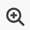

# Uppdatera arbete

{{highlighted-preview}}

<!-- Audited: 1/2024 -->

<!--take "legacy" and "new commenting" references out when we remove the legacy - April 2024???-->

<!--The highlighted information on this page refers to functionality not yet generally available. It is available only in the Preview environment for all customers. 

For information about the current release schedule, see [First Quarter 2024 release overview](../../product-announcements/product-releases/24-q1-release-activity/24-q1-release-overview.md). -->

<!--
After the monthly releases to Production, the same features are also available in the Production environment for customers who enabled fast releases.   
For information about fast releases, see [Enable or disable fast releases for your organization](../../administration-and-setup/set-up-workfront/configure-system-defaults/enable-fast-release-process.md)  
-->

>[!IMPORTANT]
>
>Vi håller på att omarbeta kommentarsfunktionerna i Adobe Workfront.
>
>Beroende på vilka objekt du har tillgång till kommentarfunktionerna för kan du se följande funktionalitet för uppdateringsavsnittet:
>* Den nya upplevelsen
>* Den gamla upplevelsen
>* Det nya och gamla gränssnittet
>
>Mer information om den nya kommentarsfunktionen och dess tillgänglighet finns på [Ny kommentarsfunktion](../../product-announcements/betas/new-commenting-experience-beta/unified-commenting-experience.md).
>
>Den nya kommentarsupplevelsen är bara tillgänglig för uppdateringsavsnittet för Workfront-objekt och är inte tillgänglig när du öppnar uppdateringar från följande områden:
>
> * Startsida
> * Panelen Sammanfattning i listor
> * Sammanfattningspanelen i tidrapporter
> * Panelen Sammanfattning i Utjämning av arbetsbelastning
>
>Den nya kommentarsfunktionen är tillgänglig på panelen Sammanfattning i listor, tidrapporter och arbetsbelastningsutjämnaren i förhandsvisningsmiljön.

<!-- with October 26 release: add somewhere this, and decide where we need to keep information about the legacy commenting. Should we create an article about iterations comments like we have for goals and cards?!:

>[!NOTE]
>
>Iterations display the legacy commenting experience.-->

<!--old message, before Auhust 17: 

>[!NOTE]
>
>We are currently redesigning the commenting experience in Adobe Workfront.
>
>For more information about the new commenting experience, see [New commenting experience](../../product-announcements/betas/new-commenting-experience-beta/unified-commenting-experience.md). 
>
>You can access the new experience for the following objects:
> * Issues, projects, tasks, and documents.
>
>     This is available when you enable the commenting Beta experience.
>
>     This functionality is available only for the Updates section, and it is not available for the following areas:
>
>     * Home
>     * Summary panel in lists
>     * Summary panel in timesheets
>
> * Goals, cards in the Boards area
>
>   The new commenting experience is the only experience for goals and cards. You must have an additional license to access Workfront Goals. For more information, see [Requirements to use Workfront Goals](../../workfront-goals/goal-management/access-needed-for-wf-goals.md). 
>
>     You can add and view updates to cards in the Boards area when you enable the Comments and System Activity sections on a card. For more information, see [Add an ad hoc card to a board](../../agile/get-started-with-boards/add-card-to-board.md).
-->

## Att tänka på när du uppdaterar arbete

* Du kan lägga till kommentarer till de flesta objekt i Adobe Workfront under Uppdateringar. Mer information om vilka objekt som visas i uppdateringsavsnittet finns i [Översikt över uppdateringsavsnittet](../updating-work-items-and-viewing-updates/updates-tab-overview.md).

* Du kan lägga till kommentarer till Workfront-objekt från andra program som är integrerade med Workfront eller från Workfront mobilapp.

  Alla program som är integrerade med Workfront kan inte lägga till kommentarer i Workfront-objekt.

  Alla funktioner som är tillgängliga i uppdateringsavsnittet för ett objekt i Workfront är inte tillgängliga i andra program vid åtkomst till Workfront-objekt från programmet. Funktioner för RTF eller privata kommentarer till ett företag kanske inte är tillgängliga när du lägger till kommentarer till ett Workfront-objekt från ett tredjepartsprogram.

* Du kan informera om förloppet för ett Workfront-objekt (projekt, uppgift eller problem) när du kommenterar objektet. Användare som har tilldelats eller prenumererar på objektet kan få ett meddelande om uppdateringen. Alla som har behörighet att visa objektet kan visa din uppdatering.

* Du kan tagga användare så att de uppmärksammas på uppdateringen. Taggade användare får ett meddelande i appen och ett e-postmeddelande om uppdateringen.

  >[!TIP]
  >
  >   I den nya kommentarsfunktionen taggas kommentarägare automatiskt. Mer information finns i [Tagga andra för uppdateringar](../../workfront-basics/updating-work-items-and-viewing-updates/tag-others-on-updates.md).
  <!--take the "in the new commenting experience" out when this is the only experience-->

* Du kan lägga till en kommentar i ett objekt som du kan visa, eller så kan du logga in som Workfront- eller gruppadministratör och lägga till en kommentar för en annan användares räkning. Mer information finns i [Logga in som en annan användare](../../administration-and-setup/add-users/create-and-manage-users/log-in-as-another-user.md).

* Du kan lägga till en uppdatering till projekt, uppgifter och utgåvor från följande områden i Workfront:

   * Från ett Workfront-objekt, i uppdateringsavsnittet
   * Från hemområdet (för uppgifter och ärenden)
   * Från panelen Sammanfattning i en lista över objekt, en tidrapport eller från arbetsbelastningsutjämnaren (för uppgifter och ärenden)

Informationen på den här sidan beskriver hur du kan kommentera Workfront-objekt och hur du uppdaterar projekt, uppgifter och problem när du lägger till kommentarer till dem.

<!--take this out (below) when we remove legacy out of the application-->

Mer information om att kommentera mål finns i [Hantera målkommentarer i Adobe Workfront-mål](../../workfront-goals/goal-management/manage-goal-comments.md). Du måste ha ytterligare en licens för att få tillgång till Workfront Goals.

Mer information om hur du kommenterar kort i området för anslagstavlor finns i [Lägga till ett ad hoc-kort till en anslagstavla](../../agile/get-started-with-boards/add-card-to-board.md).

## Åtkomstkrav

Du måste ha följande åtkomst för att kunna utföra stegen i den här artikeln:

<table style="table-layout:auto"> 
 <col> 
 </col> 
 <col> 
 </col> 
 <tbody> 
  <tr> 
   <td role="rowheader"><strong>Adobe Workfront</strong></td> 
   <td> 
Alla
 </td> 
  </tr> 
  <tr> 
   <td role="rowheader"><strong>Adobe Workfront-licens</strong></td> 
   <td> 
   
Aktuell: Begär eller högre för utgåvor och dokument; Granska eller högre för alla andra objekt

   
Nytt: Medarbetare eller högre för problem och dokument: Ljus eller högre för alla andra objekt
 
   </td> 
  </tr> 
  <tr> 
   <td role="rowheader"><strong>Konfigurationer på åtkomstnivå</strong></td> 
   <td> 
Visa eller redigera åtkomst för objektet som uppdateringen är aktiverad för
</td> 
  </tr> 
  <tr> 
   <td role="rowheader"><strong>Objektbehörigheter</strong></td> 
   <td> 
Visa åtkomst till objektet
</td> 
  </tr> 
 </tbody> 
</table>

Mer information om tabellen finns i [Åtkomstkrav i Workfront-dokumentation](/help/quicksilver/administration-and-setup/add-users/access-levels-and-object-permissions/access-level-requirements-in-documentation.md).

## Lägga till en uppdatering i en arbetsuppgift

Hur du lägger till en uppdatering för en arbetsuppgift varierar beroende på vilken version av uppdateringsavsnittet du använder.

Du kan lägga till uppdateringar för följande objekt:

* Projekt
* Uppgifter
* Problem
* Program
* Portfolio
* Mallar
* Malluppgifter
* Användare
* Tidrapporter
* Team
* Mål
* Kort i området Varv
* Iterationer

### Lägga till en uppdatering för en arbetsuppgift i det äldre uppdateringsavsnittet

>[!IMPORTANT]
>
>Informationen på den här sidan beskriver hur du uppdaterar projekt, uppgifter och problem.

1. Gå till den arbetsuppgift som du vill uppdatera (till exempel ett projekt, en uppgift eller en utgåva) för.
1. Klicka på **Uppdateringar** -avsnitt.
1. (Villkorligt) Om det är aktiverat klickar du på **Nya kommentarer** i det övre högra hörnet av uppdateringsavsnittet för att inaktivera det och aktivera den tidigare kommentarfunktionen.
1. Klicka **Starta en ny uppdatering,** skriv sedan in uppdateringen.
1. (Valfritt) Använd alternativen i verktygsfältet RTF för att formatera texten, lägga till känslolägesikoner, länkar eller bilder till uppdateringen för att förbättra innehållet. Mer information finns i [Använda RTF i en Workfront-uppdatering](#use-rich-text-in-a-workfront-update) i den här artikeln.
1. (Valfritt) Uppdatera någon av följande information om arbetsuppgiften:

   <table style="table-layout:auto"> 
    <col> 
    <col> 
    <tbody> 
     <tr> 
      <td role="rowheader"><strong>Meddela</strong></td> 
      <td>Identifiera användare som måste meddelas om uppdateringen. Användare som tilldelas eller prenumererar på objektet får automatiskt ett meddelande när en uppdatering görs. 
Mer information om hur du inkluderar andra i en uppdatering finns i <a href="../../workfront-basics/updating-work-items-and-viewing-updates/tag-others-on-updates.md" class="MCXref xref">Tagga andra för uppdateringar</a>.
</td> 
     </tr> 
     <tr> 
      <td role="rowheader"><strong>Bekräftelsedatum</strong></td> 
      <td>I datumväljaren väljer du det datum då du ska slutföra arbetsuppgiften. Mer information om implementeringsdatum finns i <a href="../../manage-work/projects/updating-work-in-a-project/overview-of-commit-dates.md" class="MCXref xref">Genomför datumöversikt</a>.</td> 
     </tr> 
     <tr> 
      <td role="rowheader"><strong>Villkor</strong></td> 
      <td>Välj ett nytt villkor för uppgiften eller utgåvan. Mer information om hur du väljer ett villkor finns i <a href="../../manage-work/projects/updating-work-in-a-project/update-condition-for-tasks-and-issues.md" class="MCXref xref">Uppdatera villkor för aktiviteter och ärenden</a>.</td> 
     </tr> 
     <tr> 
      <td role="rowheader"><strong>Status</strong></td> 
      <td>Klicka på pilen bredvid aktuell status och välj önskad status i listrutan. Mer information om hur du anger en status finns i <a href="../../manage-work/projects/updating-work-in-a-project/update-task-status.md" class="MCXref xref">Uppdatera aktivitetsstatus</a>.
När du uppdaterar statusen för en arbetsuppgift ändras inte automatiskt statusen för ett projekt. Beroende på hur projektet är konfigurerat kan du göra uppdateringar av projektstatusen separat. Mer information om olika typer av projektuppdateringar finns i <a href="../../manage-work/projects/manage-projects/select-project-update-type.md" class="MCXref xref">Välj typ av projektuppdatering </a>.

<b>ANMÄRKNING</b>

   Du kan inte ändra status för en arbetsuppgift när den har statusen Väntande godkännande.
</td>
   </tr> 
     <tr> 
      <td role="rowheader"><strong>Slutförandefält</strong></td> 
      <td>(Endast tillgängligt för uppgifter) Ange hur stor del av arbetet som har slutförts genom att dra förloppsindikatorn till önskad procentandel. Du kan också dubbelklicka på det avslutande fältet och ange ett procenttal som är färdigt.</td> 
     </tr> 
     <tr> 
      <td role="rowheader"><strong>Privat till mitt företag</strong></td> 
      <td> 
Inaktivera det här alternativet om du inte vill att användare utanför företaget ska kunna visa den här uppdateringen.
 
      
<b>ANMÄRKNING</b>

      
Det här alternativet visas bara när användaren är associerad med ett företag.

      
Det här alternativet är inte tillgängligt i alla områden där du kan lägga till uppdateringar från. Detta är till exempel inte tillgängligt i tredjepartsprogram där du kan lägga till uppdateringar från. 

      </td> 
     </tr> 
    </tbody> 
   </table>

1. Klicka **Uppdatera** för att lägga till uppdateringen i Workfront-objektet.

   >[!NOTE]
   >
   >Ett litet popup-fönster visas i sju sekunder efter klickningen **Uppdatera** så att du kan ångra uppdateringen och gå tillbaka till redigeringsrutan innan uppdateringen har publicerats. Uppdateringen publiceras om du stänger popup-fönstret Ångra, väntar på att det ska försvinna eller navigerar bort från sidan.
   >
   >Om Workfront-administratören väljer inställningen Tillåt aldrig att användare tar bort kommentarer på din åtkomstnivå kan du inte ångra en kommentar. Mer information finns i [Skapa och ändra anpassade åtkomstnivåer](../../administration-and-setup/add-users/configure-and-grant-access/create-modify-access-levels.md).

1. Information om hur du svarar på en uppdatering finns i [Svara på uppdateringar](../../workfront-basics/updating-work-items-and-viewing-updates/reply-to-updates.md).

### Lägga till en uppdatering av en arbetsuppgift med hjälp av den nya kommentarsfunktionen

1. Leta reda på objektet som du vill uppdatera (projekt, uppgift eller utgåva) och klicka sedan på namnet för att öppna objektets sida.
1. Klicka  **Uppdateringar** till vänster.
1. (Villkorligt) Om **Nya kommentarer** är inaktiverat, klicka för att aktivera det.

   Detta möjliggör den nya kommentarsfunktionen. The **Kommentar** -fliken är markerad som standard.

1. Börja skriva en kommentar i **Ny kommentar** box.

   

   Exempel på en ny kommentarsruta i förhandsvisningsmiljön:
   

   

   Exempel på en ny kommentarsruta i produktionsmiljön:
   

   >[!TIP]
   >
   >Om du navigerar bort från uppdateringsavsnittet innan du är klar med att skriva och skicka en kommentar, kommer kommentaren på sidan att vara i utkastläge även efter att du loggat ut och loggat in igen. Alla bilder som läggs till i kommentaren sparas också i utkastet. Utkast sparas i 7 dagar efter vilka de tas bort och kan inte återställas. Kommentarerna är bara synliga för användaren som skriver dem.

1. (Valfritt) Om du vill ångra eller göra om en ändring använder du följande kortkommandon:
   * CTRL + Z ( ⌘ + z för Mac) för att ångra en ändring
   * CTRL + Y ( ⌘+y för Mac) för att göra om en ändring
1. (Valfritt) I dialogrutan **Tagga personer eller team** börjar du skriva namnet på eller e-postadressen till en användare, eller ett team som du vill inkludera i kommentaren, och markerar det sedan när det visas i listan.
1. (Valfritt) Använd alternativen i verktygsfältet RTF för att formatera texten, lägga till känslolägesikoner, länkar eller bilder till uppdateringen för att förbättra innehållet. Mer information finns i [Använda RTF i en Workfront-uppdatering](#use-rich-text-in-a-workfront-update) i den här artikeln.

   >[!TIP]
   >
   >Om en annan användare skickar en kommentar till samma objekt som du uppdaterar finns det en röd linje med en ny indikator som informerar dig om de nyare kommentarerna.
   >
   >Indikatorn visas först när kommentaren har skickats för objektet, inte när kommentaren fortfarande är sammansatt.
   >
   >Indikatorn&quot;Nytt&quot; visas bara när både användaren som angav en ny uppdatering och användaren som håller på att uppdatera använder den nya kommentarfunktionen.
   >

1. Klicka **Skicka** för att lägga till uppdateringen i Workfront-objektet.
1. (Valfritt) Om du vill redigera en kommentar klickar du på **Mer** meny  i kommentarens övre högra hörn och klicka sedan på **Redigera**.

   >[!IMPORTANT]
   >
   >Du kan bara redigera kommentaren inom 15 minuter från det att du skickat in den.

1. Redigera informationen i kommentaren, lägg till eller ta bort bilder eller ta bort någon av de taggade användarna. En&quot;redigerad&quot; indikator läggs till till vänster om datumstämpeln som visas när kommentaren angavs.

   >[!TIP]
   >
   >Kommentarer från det aktuella året visar inte året i datumstämpeln. Om du hovrar över en tidsstämpel visas hela datumet, inklusive året.

   

   >[!TIP]
   >
   >* Ett e-postmeddelande skapas för att meddela användare om din uppdatering endast när du skickar den ursprungliga uppdateringen. Inget e-postmeddelande genereras när du har redigerat uppdateringen.
   >* Datumstämpeln bredvid kommentaren är datumet för den ursprungliga kommentaren, inte datumet för den senaste redigeringen.
   >* När du lägger till en kommentar för en annan användares räkning (när du loggar in som en annan användare som Workfront- eller gruppadministratör) kan du inte redigera kommentaren om du är inloggad som den andra användaren. Du kan bara redigera kommentaren efter att du har loggat ut som användare och loggat in som du själv.

1. (Valfritt) Klicka på **Svara** eller börja skriva en kommentar i **Lägg till svar ...** för att svara på en befintlig kommentar, följ sedan stegen 4-8 ovan. <!--(**************insure this stays accurate***********)--> Mer information om hur du svarar på en uppdatering finns i [Svara på uppdateringar](../../workfront-basics/updating-work-items-and-viewing-updates/reply-to-updates.md).

1. (Villkorligt och valfritt) Om andra användare har lagt till kommentarer som visas utanför det synliga området i uppdateringsavsnittet medan du lade till dina kommentarer, klickar du på **Visa** inuti den blå **banner för nya kommentarer** längst ned på skärmen för att visa dessa kommentarer.

   

   Ytterligare kommentarer visas längst ned på skärmen.

   >[!NOTE]
   >
   >   Indikatorn&quot;nya kommentarer&quot; och knappen&quot;Visa&quot; visas bara när både de användare som har öppnat de nya uppdateringarna och de användare som för närvarande tittar på uppdateringsavsnittet använder den nya kommentarsfunktionen.

1. (Valfritt) Klicka på **Gilla** icon. Ikonen uppdateras med antalet gilla-markeringar.
1. (Villkorligt och valfritt) Om du har tagit med ytterligare personer i kommentaren klickar du på antalet medlemmar som ingår i uppdateringen för att visa en lista över entiteter som kommentaren du angav delas med.

   

   >[!TIP]
   >
   >Namnen på de två första taggade enheterna visas bredvid deras avatarer. Om fler än två enheter är taggade visas bara namnet på den första och antalet ytterligare enheter.

1.  (Valfritt) Klicka på en kommenterares namn för att se deras namn, roll och e-postadress i en informationsruta. Klicka på kommentarens namn igen i informationsrutan för att öppna användarprofilen.
1. (Valfritt) Klicka på **Systemaktivitet** för att visa uppdateringar som loggats av systemet. När objektet eller något av dess underordnade objekt uppdateras, genererar Workfront en anteckning om den uppdateringen och visar den på fliken Systemaktivitet.

   Mer information finns i [Översikt över uppdateringsavsnittet](../updating-work-items-and-viewing-updates/updates-tab-overview.md).

   >[!TIP]
   >
   >Du kan inte lägga till en kommentar i en systemuppdatering. Alla svar som görs på systemaktivitetsposter i den tidigare kommentarsfunktionen fylls i på fliken Systemaktivitet som skrivskyddade.

1. (Valfritt) Klicka på **Alla** om du vill visa både användarkommentarer och systemaktivitetskommentarer på ett och samma ställe. Det här är en flik som bara är för visning.

   >[!TIP]
   >
   >Du kan inte svara på kommentarer eller tagga andra användare i befintliga kommentarer på fliken Alla. Om du vill svara på en kommentar på fliken Alla klickar du **Svara i kommentarer** om du vill öppna kommentaren på fliken Kommentarer.

## Använda RTF i en Workfront-uppdatering{#use-rich-text-in-a-workfront-update}

<!--October 2023: remove this top note when we get to parity with the current version, OR change the note to mention that some options are ONLY available in the Beta version and not the current one.-->

>[!NOTE]
>
>Följande information beskriver hur du använder RTF i den nya kommentarsfunktionen, om inte annat anges.

Du kan förbättra dina uppdateringar genom att använda RTF eller lägga till olika objekt i den, som känslolägesikoner, länkar eller bilder.

1. Gå till **Uppdateringar** i ett Workfront-objekt och börja skriva en kommentar.
1. (Valfritt) Om du vill lägga till RTF-formatering i uppdateringen använder du attribut på **RTF** när du skriver.

   

   <!--October 2023: the individual icons in the toolbar will need replacing-->

   | **Attribut** | **Knappen Verktygsfält** | **Mac kortkommandon** | **Kortkommandon i Windows** |
   |---|---|---|---|
   | Fet |  | Jesse+b | Ctrl+B |
   | Kursiv |  | Jesse+i | Ctrl+I |
   | Understruken |  | Jesse+u | Ctrl+U |
   | Hyperlänk |  |  Så här öppnar du rutan Lägg till länkar:¥+K   Så här klistrar du in en länk över den markerade texten: +V  |  Så här öppnar du rutan Lägg till länkar: Ctrl+K   Så här klistrar du in en länk över den markerade texten: Ctrl+V  |
   | Punktlista |  | Jesse+Shift+8 | Ctrl+Skift+8 |
   | Numrerad lista |  | Jesse+Shift+7 | Ctrl+Skift+7 |
   | Blockcitat |  | ¥+Shift+9 |  Ctrl+Skift+9   Detta är inte tillgängligt i den nya kommentarsfunktionen.   |

   <!--remove the last row when we remove legacy from the system-->

   Om du vill avbryta formateringen av text avmarkerar du attributet på **RTF** verktygsfält.

   <!-- in the table above: take "Create Links" verbiage from the hyperlink when the old commenting is removed and the commenting beta is the only way to comment - with October 2023-->

   >[!NOTE]
   >
   >* Formateringen visas även i e-postmeddelanden som användare får med din uppdatering.
   >* RTF-formatering som används på en uppdatering i ett e-postmeddelande visas inte på uppdateringen när den visas på fliken Uppdateringar.
   >* Om din organisation använder Workfront med Internet Explorer förlorar all formaterad text som klistras in i en uppdatering sin RTF-formatering och visas som oformaterad text. Du kan formatera om texten med attributen i verktygsfältet RTF.
   >* RTF-formatering är inte tillgängligt för uppdateringar som gjorts i tidrapporteraren eller för antecknings- och senaste villkorsobjekt som visas i en rapport.

1. (Valfritt och villkorligt) Om du vill ta med text från tidigare uppdateringar eller från andra källor och skilja den från din egen uppdatering, kan du markera den som en blockoffert. Klicka på **Blockcitat** icon  och skriv den text du vill citera. Den citerade texten visas markerad med en lodrät grå linje. Klicka på **Blockcitat** om du vill återgå till normal formatering. Detta är inte tillgängligt i den nya kommentarsfunktionen.

   <!--remove this picture below and the bullet above when we remove legacy-->

   

1. (Valfritt) Klicka på **emoji** icon  för att lägga till känslolägesikoner i uppdateringen.

   >[!NOTE]
   >
   >* Workfront ersätter inte skiljetecken som :) med emojis.
   >* Emojis är inte tillgängligt för objekten Anteckning och Senaste villkor som visas i en rapport.
   >* Funktionen emoji i Workfront använder Unicode-tecken och visas därför bara i webbläsare och operativsystem som stöder Unicode-kodpunkter. Användare på en annan plattform, webbläsare eller operativsystemversion än din har kanske inte tillgång till samma känslolägen.
   >* En oanvändbar emoji representeras av en svart eller vit ruta.
   >* Windows 7 har bara stöd för svartvita känslolägesikoner.
   >* E-mojis som tillämpas på en uppdatering som görs via e-post visas inte på uppdateringen när den visas i uppdateringsområdet.

1. (Valfritt) Så här lägger du till en URL-länk till ytterligare informationskällor:

   1. Klicka i uppdateringen där du vill infoga en länk.
   1. På **RTF** klickar du på **Hyperlänk** icon .

   1. I **Skapa länk** ruta som visas, under **URL** skriver eller klistrar du in URL-adressen för den källa som du vill länka till.

   1. Under **Text som ska visas** skriver du eller klistrar in länktexten.
   1. Klicka **Spara**.

1. (Valfritt) Gör något av följande om du vill bifoga en bild till uppdateringen:

   * Spara bilden på datorn och dra och släpp den i området Ny kommentar.
   * Kopiera en skärmbild från datorn och klistra sedan in den i kommentaren. Detta är inte tillgängligt i den gamla kommentarsfunktionen.
   * Klicka på **Lägg till bild** icon  och bläddra till bilden på datorn.

   >[!NOTE]
   >
   >* Din Workfront-administratör måste aktivera tillägg av bilder i avsnittet Inställningar för uppdatering av feeds i Workfront-gränssnittsområdet innan du kan se ikonerna för bilden eller Lägg till bilaga. Mer information finns i [Konfigurera inställningar för användaruppdateringar](../../administration-and-setup/set-up-workfront/system-tracked-update-feeds/configure-preferences-user-updates.md).
   >* Största bildfilsstorlek är 7 MB. Bildfiltyper som stöds är .jpg, .gif och .png.
   >* Bilder är tillgängliga från uppdateringsavsnittet för ett objekt och är även tillgängliga i området Dokument under huvudmenyn.
   >* Du kan klistra in bilden genom att högerklicka i den nya kommentaren eller genom att trycka på CTRL + V för Windows (eller Δ+ V för Mac) på tangentbordet.
   >* Du kan skicka en uppdatering med en bild och utan text.
   >* När du tar bort en kommentar som innehåller en bild, finns följande scenarier beroende på vilken upplevelse du väljer:
   >
   >     * I den gamla kommentarsfunktionen finns bilden kvar i området Dokument men visas inte längre i uppdateringsavsnittet.
   >     * I den nya kommentarsfunktionen tas bilden bort både från uppdateringsavsnittet och från dokumentområdet. Bilden tas också bort från dokumentområdet när du redigerar en kommentar och tar bort bilden.
   >* När någon tar bort en bild som är kopplad till en kommentar från dokumentområdet tas den även bort från kommentaren.

   <!--remove the statement above about legacy, when we remove the legacy environment.-->

1. (Valfritt) Gör något av följande om du vill visa en bild i den befintliga uppdateringen:

   * Klicka på **Förhandsgranska** icon  på miniatyrbilden för att öppna bilden i full storlek på en ny flik i webbläsaren.
   * Klicka på **Ladda ned** icon  på miniatyrbilden för att hämta bilden.

1. Klicka **Skicka** för att lägga till din kommentar.

## Söka efter en uppdatering

>[!NOTE]
>
>Den här funktionen är bara tillgänglig för fliken Kommentarer i den nya kommentarsupplevelsen. Detta är inte tillgängligt för fliken Systemaktivitet i uppdateringsavsnittet.

Du kan söka efter en kommentar eller ett svar i uppdateringsavsnittet för ett objekt.

1. Gå till **Uppdateringar** del av ett objekt.
1. Börja skriva ett nyckelord <!--or a user's name --> i **Sök** i det övre högra hörnet av **Kommentar** -fliken.

   <!--Add this tip or note instead of the note below - when it'll be possible: You can search for users who have been tagged or for comment owners.-->

   >[!NOTE]
   >
   >Du kan bara söka efter ord som tillhör texten i en kommentar eller ett svar. Du kan inte söka efter namn på användare eller team som taggats i en uppdatering.

   

   Exempel på sökning i förhandsvisningsmiljön:
   

   

   Exempel på sökning i produktionsmiljön:
   

   Nyckelordet <!--or user--> som du sökte efter markeras och kommentarerna som innehåller den visas högst upp i uppdateringsavsnittet.

   Workfront söker igenom hela objektets uppdateringsström, utanför kommentarerna som visas på skärmen.

1. Klicka på **x** -ikonen i sökfältet för att rensa sökresultaten och återgå till alla kommentarer.

<!-- when we release search to production, check above and make sure you don't have to add that the users tagged/ owners are also searchable-->

## Kopiera uppdateringsinformation

Du kan kopiera en uppdatering på flera olika sätt. När du har kopierat en länk kan du dela länken med andra för att dirigera dem till uppdateringen.

Kopieringen av en uppdatering skiljer sig åt beroende på vilken kommentarsfunktion du använder.

### Kopiera en uppdatering i den nya kommentarsfunktionen

Information om vilka funktioner som är tillgängliga för den nya kommentarsfunktionen och för vilka objekt finns i [Ny kommentarsfunktion](../../product-announcements/betas/new-commenting-experience-beta/unified-commenting-experience.md).

<!--when we remove and deprecate the legacy stream, add screen shots in the sections below- October 2023-->

Du kan kopiera information från en befintlig kommentar genom att göra något av följande:

* [Kopiera länk](#copy-link)
* [Kopiera brödtext](#copy-body-text)
* [Offertsvar](#quote-reply-1)

#### Kopiera länk

Alternativet Kopiera länk kopierar kommentaren eller länken till Urklipp så att du kan dela kommentaren eller hela tråden med andra användare.

1. Gå till den uppdatering vars länk du vill kopiera.

1. Klicka på **Mer** menyn och klicka sedan på **Kopiera länk**.

1. Klistra in länken som du kopierade i föregående steg i ett e-postmeddelande eller i ett annat program för att dela den med andra. Den delade länken öppnar kommentaren som du delade länken från.

   >[!TIP]
   >
   >När du delar länken för en konversation på ett underordnat objekt från ett objekt med högre rankning, öppnar länken tråden i uppdateringsområdet för det högre rankade objektet.
   >
   >Om du till exempel kopierar länken till en uppgiftskommentar från projektets uppdateringsområde, öppnas projektsidan.

#### Kopiera brödtext

Alternativet Kopiera brödtext kopierar texten från en specifik uppdatering till Urklipp.

1. Gå till den uppdatering eller det svar som du vill kopiera.
1. Klicka på **Mer** menyn och klicka sedan på **Kopiera brödtext**.

#### Offertsvar

Alternativet Offertsvar kopierar den ursprungliga kommentaren till ett nytt svar som en blockcitat.

1. Gå till den uppdatering eller det svar som du vill kopiera.
1. Klicka på **Mer** menyn och klicka sedan på **Offertsvar**.

   En ny kommentarsruta öppnas och det citerade svaret inkluderas i den nya kommentaren och markeras som ett blockcitat.

   

   <!--ensure the screen shot above is correct - missing he block quote icon in rich text -->

1. Fortsätt lägga till uppdateringen och klicka på **Skicka** för att lägga till kommentaren.

### Kopiera en uppdatering i det gamla kommentargränssnittet

<!--remove legacy when removed from the UI-->

* [Kopiera uppdateringen](#copy-the-update)
* [Kopiera trådlänken](#copy-the-thread-link)
* [Kopiera uppdateringslänken](#copy-the-update-link)
* [Offertsvar](#quote-reply)

  >[!TIP]
  >
  >När du kopierar och delar länken för en konversation på ett underordnat objekt från ett objekt med högre rankning, öppnar länken kopplingen i det underordnade objektets uppdateringsområde.
  >
  >Om du t.ex. kopierar länken till en uppgiftskommentar från projektets uppdateringsområde, öppnar kommentaren uppgiftssidan.

#### Kopiera uppdateringen {#copy-the-update}

Med det här alternativet kopieras texten från en specifik uppdatering till Urklipp.

1. Gå till den uppdatering eller det svar som du vill kopiera.
1. Klicka på **Mer** menyn och klicka sedan på **Kopiera brödtext**.

   

#### Kopiera trådlänken {#copy-the-thread-link}

Med det här alternativet kopieras den fullständiga trådlänken till Urklipp så att du kan dela tråden med andra användare.

1. Gå till uppdateringstråden som du vill kopiera.

1. Klicka på **Mer** menyn och klicka sedan på **Kopiera trådlänk**.

   

1. Klistra in länken som du kopierade i föregående steg i ett e-postmeddelande eller i ett annat program för att dela den med andra. Den delade länken öppnar kommentaren som du delade länken från.

#### Kopiera uppdateringslänken {#copy-the-update-link}

Med det här alternativet kopieras en specifik uppdateringslänk till Urklipp. När du delar uppdateringslänken ser användaren som följer den en ram runt uppdateringen.

1. Gå till den uppdatering eller det svar som du vill kopiera.
1. Klicka på **Mer** -menyn intill den enskilda uppdateringen och klicka sedan på **Kopiera uppdateringslänk**.

   

1. Klistra in länken som du kopierade i föregående steg i ett e-postmeddelande eller i ett annat program för att dela den med andra. Den delade länken öppnar kommentaren som du delade länken från.

#### Offertsvar

Alternativet Offertsvar kopierar den ursprungliga kommentaren till ett nytt svar som ett blockcitat.

1. Gå till den uppdatering eller det svar som du vill kopiera.
1. Klicka på **Mer** menyn och klicka sedan på **Offertsvar**.

   En ny kommentarsruta öppnas och det citerade svaret inkluderas i den nya kommentaren och markeras som ett blockcitat.

1. Fortsätt lägga till uppdateringen och klicka på **Svara** för att lägga till kommentaren.

## Ta bort en uppdatering eller ett svar

Beroende på vilken åtkomst din Workfront-administratör ger kan du ta bort uppdateringar som du har lagt till på fliken Uppdateringar för ett objekt. Mer information finns i [Skapa eller ändra anpassade åtkomstnivåer](../../administration-and-setup/add-users/configure-and-grant-access/create-modify-access-levels.md#creating-a-new-access-from-scratch) i artikeln [Skapa eller ändra anpassade åtkomstnivåer](../../administration-and-setup/add-users/configure-and-grant-access/create-modify-access-levels.md).

Ingen Workfront-användare (inklusive Workfront-administratören) kan ta bort uppdateringar som gjorts av en annan användare. Om en användares åtkomstnivå tillåter att användaren tar bort sina egna uppdateringar, kan Workfront-administratören logga in som den användaren och ta bort de uppdateringar han/hon har gjort. Mer information finns i [Skapa eller ändra anpassade åtkomstnivåer](../../administration-and-setup/add-users/configure-and-grant-access/create-modify-access-levels.md#creating-a-new-access-from-scratch) och [Logga in som en annan användare](../../administration-and-setup/add-users/create-and-manage-users/log-in-as-another-user.md).

1. Gå till den uppdatering eller det svar som du vill ta bort.
1. Klicka på **Mer** -menyn bredvid den uppdatering eller det svar som du vill ta bort och klicka sedan på **Ta bort**. <!--October 2023 - replace screen shot here-->

   

1. Klicka på **Ta bort**.

   >[!NOTE]
   >
   >Om du tar bort en uppdatering med en bifogad bild tas både kommentaren och bilden bort. Mer information finns i [Använda RTF i en Workfront-uppdatering](#use-rich-text-in-a-workfront-update) i den här artikeln.

   När kommentaren som du tar bort har tillhörande svar, finns det en indikation på att kommentaren togs bort med namnet på den användare som tog bort den.

   

   Borttagna kommentarer tas bort direkt från Workfront. En användare som använder uppdateringsavsnittet ser en kommentar som tas bort av en annan användare i realtid.

   <!--when we remove the beta, take out the first part of the sentence above about only when commenting in beta experience. Leave the rest though-->

<!--this is no longer needed - adding timesheet comments is just like adding comments to any other object now

## Add an update on a Timesheet

1. Go to a Timesheet on which you want to make an update.
1. Click the Timesheet to open it.
1. At the bottom of the Timesheet, click **Include a comment**.
1. In the box that displays at the bottom of the Timesheet, type an update.

   

1. (Conditional) To save your update without submitting the Timesheet for approval, click **Save for Later**.

   Or

   To save your update and submit the Timesheet for approval, click **Submit for Approval**.

   Or

   If your Timesheet is not set up with an approver, click **Save and Close Timesheet** to save your update.

-->

## Aktivera eller inaktivera systemuppdateringar

<!--update this section when we remove legacy, to just point to the article in green below and rename this section as "Review system activity updates" or something-->

<!--October 2023: when the new stream goes to all objects production, consider updating this article also, to say there is no System Activity tab to be disabled for objects anymore: help\quicksilver\administration-and-setup\set-up-workfront\system-tracked-update-feeds\system-tracked-update-feeds.md-->

>[!NOTE]
>
>Det går inte att inaktivera systemuppdateringar när den nya kommentarfunktionen används.
>Informationen i det här avsnittet gäller endast de funktioner som är tillgängliga i det äldre uppdateringsavsnittet. &lt;!—remove this section when we remove legacy from system->
>Mer information om systemuppdateringar i den nya kommentarsfunktionen finns i [Översikt över uppdateringsavsnittet](../updating-work-items-and-viewing-updates/updates-tab-overview.md).

I uppdateringsavsnittet för ett Workfront-objekt visas två typer av information:

* **Användaruppdateringar:** Användaruppdateringar är kommentarer som du och andra användare i ditt system anger. <!--October 2023 - new screen shot -->

  

* **Systemuppdateringar:** Systemuppdateringarna registrerar borttagning av resurser, tillägg eller borttagning av versioner, bifogning eller borttagning av en godkännandebegäran samt ändringar som gjorts i dokumenten i objektet. <!--October 2023 - new screen shot -->

  

  Beroende på din Workfront-licens kan systemuppdateringar vara aktiverade som standard. Workfront-administratörer kan avgöra vad som spåras i systemuppdateringar, vilket förklaras i [Systemspårade uppdateringar](../../administration-and-setup/set-up-workfront/system-tracked-update-feeds/system-tracked-update-feeds.md). Du kan även filtrera bort systemuppdateringar eller aktiviteter så att du bara ser användaruppdateringar för alla objekt.

  Följande objekt har inga systemgenererade uppdateringar:

   * Team
   * Mall
   * Malluppgift

Så här aktiverar eller inaktiverar du systemuppdateringar:

1. Klicka på **Uppdateringar** på ett objekt.
1. Klicka **Visa systemuppdateringar** för att skjuta växeln åt vänster (inaktiverad) eller åt höger (aktiverad).

   

   Det här alternativet är beständigt för alla objekt i Workfront och behåller sin plats även om du loggar ut från Workfront.

   >[!TIP]
   >
   >   Objekt som inte registrerar systemuppdateringar har inte alternativet Visa systemuppdateringar i uppdateringsområdet.

   <!--when Anna adds the new updates stream to ALL objects, she will remove the System Activity tab from the objects that don't record system updates - add another line to the TIP above to say: The System Activity tab is not available for objects that don't record system-generated updates.*************** OR: maybe make this part of the statement where we list which objects these are, above???  -->

