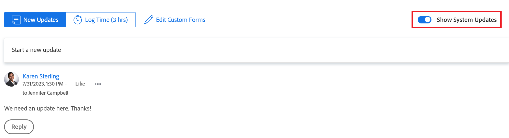

# Uppdatera arbete

<!-- Drafted for commenting experience: 

The highlighted information on this page refers to functionality not yet generally available. It is available only in the Preview environment for a limited number of objects. -->

Du kan lägga till en uppdatering för ett Adobe Workfront-objekt (projekt, uppgift eller problem) för att informera om objektets förlopp. Användare som är tilldelade eller prenumererade till objektet kan visa din uppdatering. Du kan också tagga användare så att de uppmärksammas på uppdateringen.

Du kan lägga till uppdateringar till ett objekt från följande områden i Workfront:

* Från ett Workfront-objekt, i uppdateringsavsnittet
* Från hemområdet (för uppgifter och ärenden)
* Från panelen Sammanfattning i en lista över objekt (för uppgifter och ärenden)
* Från tidrapporten (för uppgifter och ärenden)

## Åtkomstkrav

<!--
drafted for P&P release:
<table style="table-layout:auto"> 
 <col> 
 </col> 
 <col> 
 </col> 
 <tbody> 
  <tr> 
   <td role="rowheader"><strong>Adobe Workfront plan*</strong></td> 
   <td> 
Any
 </td> 
  </tr> 
  <tr> 
   <td role="rowheader"><strong>Adobe Workfront license*</strong></td> 
   <td> 
Current license: Contributor or higher for issues and documents: Light or higher for all other objects
 
   Or
   
Legacy  license: Request or higher for issues and documents; Review or higher for all other objects

   </td> 
  </tr> 
  <tr> 
   <td role="rowheader"><strong>Access level configurations*</strong></td> 
   <td> 
View or Edit access for the object the update is on
 
<b>NOTE</b>
   
   If you still don't have access, ask your Workfront administrator if they set additional restrictions in your access level. For information on how a Workfront administrator can modify your access level, see <a href="../../administration-and-setup/add-users/configure-and-grant-access/create-modify-access-levels.md" class="MCXref xref">Create or modify custom access levels</a>.
 </td> 
  </tr> 
  <tr> 
   <td role="rowheader"><strong>Object permissions</strong></td> 
   <td> 
View access to the object
 
For information on requesting additional access, see <a href="../../workfront-basics/grant-and-request-access-to-objects/request-access.md" class="MCXref xref">Request access to objects </a>.
 </td> 
  </tr> 
 </tbody> 
</table>
-->
Du måste ha följande åtkomst för att kunna utföra stegen i den här artikeln:

<table style="table-layout:auto"> 
 <col> 
 </col> 
 <col> 
 </col> 
 <tbody> 
  <tr> 
   <td role="rowheader"><strong>Adobe Workfront-plan*</strong></td> 
   <td> 
Alla
 </td> 
  </tr> 
  <tr> 
   <td role="rowheader"><strong>Adobe Workfront-licens*</strong></td> 
   <td> 
Begär eller högre för frågor och dokument. Granska eller högre för alla andra objekt
 </td> 
  </tr> 
  <tr> 
   <td role="rowheader"><strong>Konfigurationer på åtkomstnivå*</strong></td> 
   <td> 
Visa eller redigera åtkomst för objektet som uppdateringen är aktiverad för
 
<b>ANMÄRKNING</b>

Om du fortfarande inte har åtkomst frågar du Workfront-administratören om de anger ytterligare begränsningar för din åtkomstnivå. Information om hur en Workfront-administratör kan ändra åtkomstnivån finns i <a href="../../administration-and-setup/add-users/configure-and-grant-access/create-modify-access-levels.md" class="MCXref xref">Skapa eller ändra anpassade åtkomstnivåer</a>.
 </td>
</tr> 
  <tr> 
   <td role="rowheader"><strong>Objektbehörigheter</strong></td> 
   <td> 
Visa åtkomst till objektet
 
Mer information om hur du begär ytterligare åtkomst finns i <a href="../../workfront-basics/grant-and-request-access-to-objects/request-access.md" class="MCXref xref">Begär åtkomst till objekt </a>.
 </td> 
  </tr> 
 </tbody> 
</table>

&#42;Kontakta Workfront-administratören om du vill veta vilken plan, licenstyp eller åtkomst du har.

## Lägga till en uppdatering i en arbetsuppgift

<!--drafted for the commenting experience - change the NOTE at the top of this paragraph with every new release to other objects

Adding an update to a work item differs depending on what environment and what object you choose. 

### Add an update to a work item in the Production environment

>[!NOTE]
>
>The following functionality is available for all objects except for goals, in the Production and Preview environements. You must have an additional license to access Workfront Goals. For information about commenting on goals, see [Manage goal comments in Adobe Workfront Goals](../../workfront-goals/goal-management/manage-goal-comments.md)

-->

1. Gå till den arbetsuppgift som du vill uppdatera (till exempel ett projekt, en uppgift eller en utgåva) för.
1. Klicka på **Uppdateringar** -avsnitt.
1. Klicka **Starta en ny uppdatering,** skriv sedan in uppdateringen.

1. (Valfritt) Om du vill lägga till formaterad text i uppdateringen använder du attribut på **RTF** när du skriver.

   | **Attribut** | **Verktygsfältsknapp** | **Mac kortkommandon** | **Kortkommandon för PC** |
   |---|---|---|---|
   | Fet |  | Jesse+b | Ctrl+B |
   | Kursiv |  | Jesse+i | Ctrl+I |
   | Understruken |  | Jesse+u | Ctrl+U |
   | Hyperlänk |  | Jesse+K | Ctrl+K |
   | Punktlista |  | Jesse+Shift+8 | Ctrl+Skift+8 |
   | Numrerad lista |  | Jesse+Shift+7 | Ctrl+Skift+7 |
   | Blockcitat |  | ¥+Shift+9 | Ctrl+Skift+9 |

   Om du vill avbryta formateringen av text avmarkerar du attributet på **RTF** verktygsfält.

   >[!NOTE]
   >
   >* Formateringen visas även i e-postmeddelanden som användare får med din uppdatering.
   >* RTF-formatering som används på en uppdatering i ett e-postmeddelande visas inte på uppdateringen när den visas på fliken Uppdateringar.
   >* Om din organisation använder Workfront med Internet Explorer förlorar all formaterad text som klistras in i en uppdatering sin RTF-formatering och visas som oformaterad text. Du kan formatera om texten med attributen i verktygsfältet RTF.
   >* RTF-formatering är inte tillgängligt för uppdateringar som gjorts i tidrapporteraren eller för antecknings- och senaste villkorsobjekt som visas i en rapport.

1. (Valfritt) Om du vill ta med text från tidigare uppdateringar eller från andra källor och skilja den från din egen uppdatering, kan du markera den som en blockoffert. Klicka på **Blockcitat** icon  och skriv den text du vill citera. Den citerade texten visas markerad med en lodrät grå linje. Klicka på **Blockcitat** om du vill återgå till normal formatering.

   

1. (Valfritt) Lägg till eventuella känslolägesikoner i uppdateringen.

   >[!NOTE]
   >
   >* Workfront ersätter inte skiljetecken som :) med emojis.
   >* E-mojis är inte tillgängligt för uppdateringar som gjorts i tidrapporteringsområdet eller för antecknings- och senaste villkorsobjekt som visas i en rapport.
   >* Funktionen emoji i Workfront använder Unicode-tecken och visas därför bara i webbläsare och operativsystem som stöder Unicode-kodpunkter. Användare på en annan plattform, webbläsare eller operativsystemversion än din har kanske inte tillgång till samma känslolägen.
   >* En oanvändbar emoji representeras av en svart eller vit ruta.
   >* Windows 7 har bara stöd för svartvita känslolägesikoner.
   >* E-mojis som tillämpas på en uppdatering som görs via e-post visas inte på uppdateringen när den visas i uppdateringsområdet.

1. (Valfritt) Så här lägger du till en URL-länk till ytterligare informationskällor:

   1. Klicka på den plats i uppdateringen där du vill infoga en länk.
   1. På **RTF** klickar du på **Hyperlänk** ikon. 

   1. I **Skapa länk** ruta som visas, under **URL** skriver eller klistrar du in URL-adressen för den källa som du vill länka till.

   1. Under **Text som ska visas** skriver du eller klistrar in länktexten.
   1. Klicka **Spara**.

1. (Valfritt) Om du vill bifoga en bild till uppdateringen klickar du på **Bild** icon  och bläddra till bilden på datorn.\
   eller\
   Dra bilden till uppdateringsområdet.

   >[!NOTE]
   >
   >* Workfront-administratören måste aktivera bildtillägg innan du kan se bildikonen.
   >* Största bildfilsstorlek är 7 MB. Bildfiltyper som stöds är .jpg, .gif och .png.
   >* Bilder är bara tillgängliga från fliken Uppdateringar på ett objekt och är inte tillgängliga på fliken Dokument.
   >* Du kan skicka en uppdatering med en bild och utan text.

1. (Valfritt) Ange något av följande:

   <table style="table-layout:auto"> 
    <col> 
    <col> 
    <tbody> 
     <tr> 
      <td role="rowheader"><strong>Meddela</strong></td> 
      <td>Identifiera de användare som måste meddelas om uppdateringen. Användare som tilldelas eller prenumererar på objektet får automatiskt ett meddelande när en uppdatering görs. 
Mer information om hur du inkluderar andra i en uppdatering finns i <a href="../../workfront-basics/updating-work-items-and-viewing-updates/tag-others-on-updates.md" class="MCXref xref">Tagga andra för uppdateringar</a>.
</td> 
     </tr> 
     <tr> 
      <td role="rowheader"><strong>Bekräftelsedatum</strong></td> 
      <td>I datumväljaren väljer du det datum då du ska slutföra arbetsuppgiften. Mer information om implementeringsdatum finns i <a href="../../manage-work/projects/updating-work-in-a-project/overview-of-commit-dates.md" class="MCXref xref">Genomför datumöversikt</a>.</td> 
     </tr> 
     <tr> 
      <td role="rowheader"><strong>Villkor</strong></td> 
      <td>Välj ett nytt villkor för uppgiften eller utgåvan. Mer information om hur du väljer ett villkor finns i <a href="../../manage-work/projects/updating-work-in-a-project/update-condition-for-tasks-and-issues.md" class="MCXref xref">Uppdatera villkor för aktiviteter och ärenden</a>.</td> 
     </tr> 
     <tr> 
      <td role="rowheader"><strong>Status</strong></td> 
      <td>Klicka på pilen bredvid aktuell status och välj önskad status i listrutan. Mer information om hur du anger en status finns i <a href="../../manage-work/projects/updating-work-in-a-project/update-task-status.md" class="MCXref xref">Uppdatera aktivitetsstatus</a>.
När du uppdaterar statusen för en arbetsuppgift ändras inte automatiskt statusen för ett projekt. Beroende på hur projektet är konfigurerat kan du behöva göra uppdateringar av projektstatusen separat. Mer information om olika typer av projektuppdateringar finns i <a href="../../manage-work/projects/manage-projects/select-project-update-type.md" class="MCXref xref">Välj typ av projektuppdatering </a>.

<b>ANMÄRKNING</b>

   Du kan inte ändra status för en arbetsuppgift när den har statusen Väntande godkännande.
</td>
   </tr> 
     <tr> 
      <td role="rowheader"><strong>Slutförandefält</strong></td> 
      <td>(Endast tillgängligt för uppgifter) Ange hur stor del av arbetet som har slutförts genom att dra förloppsindikatorn till önskad procentandel. Du kan också dubbelklicka på det avslutande fältet och ange ett procenttal som är färdigt.</td> 
     </tr> 
     <tr> 
      <td role="rowheader"><strong>Privat till mitt företag</strong></td> 
      <td> 
Inaktivera det här alternativet om du inte vill att användare utanför företaget ska kunna visa den här uppdateringen.
 </td> 
     </tr> 
    </tbody> 
   </table>

1. Klicka **Uppdatera** för att lägga till uppdateringen i Workfront-objektet.

   >[!NOTE]
   >
   >Ett litet popup-fönster visas i sju sekunder efter att du klickat **Uppdatera** så att du kan ångra uppdateringen och gå tillbaka till redigeringsrutan innan uppdateringen har publicerats. Uppdateringen publiceras om du stänger popup-fönstret Ångra, väntar på att det ska försvinna eller navigerar bort från sidan.
   >
   >Om Workfront-administratören väljer inställningen Tillåt aldrig att användare tar bort kommentarer på åtkomstnivån kan du inte ångra en kommentar. Mer information finns i [Skapa och ändra anpassade åtkomstnivåer](../../administration-and-setup/add-users/configure-and-grant-access/create-modify-access-levels.md).

1. Information om hur du svarar på en uppdatering finns i [Svara på uppdateringar](../../workfront-basics/updating-work-items-and-viewing-updates/reply-to-updates.md).

<!--
### Add an update to a work item in the Preview environment

>[!NOTE]
>
> In the Preview environment, the following functionality is available only for issues, after opting in the Beta program for the new commenting experience.
> 
> In the Production environment, the following functionality is available for goals. You must have an additional license to access Workfront Goals. For information about commenting on goals, see [Manage goal comments in Adobe Workfront Goals](../../workfront-goals/goal-management/manage-goal-comments.md). 

1. Locate the object you want to add comments to, then click its name to open the object's page.
1. Click  **Updates** in the left panel. 
1. Activate the **Beta** toggle in the upper-right corner of the Updates area. This switches the Updates area to the new commenting experience. 
1. Click the **Comments** tab in the upper-left corner of the Updates area.
1. Start entering a comment in the **New comment** box. 
   
   

   >[!TIP]
   >
   >Navigating away from the Updates section before you finish typing and submitting a comment keeps the comment on the page in draft mode even after you log off and log back on. Drafted comments are only visible to the user entering them.

1. (Optional) In the **Tag people or teams** area, start typing the name or the email of a user, or a team that you would like to include in this comment, then select it when it displays in the list. 
1. (Optional) To add rich text formatting to your update, use any attributes on the **Rich Text** toolbar as you type.

   | **Attribute** |**Toolbar Button** |**Mac Shortcut Keys** |**PC Shortcut Keys** |
   |---|---|---|---|
   | Bold | |⌘+b |Ctrl+B |
   | Italics | |⌘+i |Ctrl+I |
   | Underline | |⌘+u |Ctrl+U |
   | Hyperlink | |⌘+K |Ctrl+K |
   | Bulleted List | |⌘+Shift+8 |Ctrl+Shift+8 |
   | Numbered List | |⌘+Shift+7 |Ctrl+Shift+7 |
   | Block Quote | |⌘+Shift+9 |Ctrl+Shift+9 |

    To stop formatting text, deselect the attribute on the **Rich Text** toolbar.

   >[!NOTE]
   >
   >* Formatting also displays in any email notification users receive containing your update.
   >* Rich Text formatting applied to an update in an email does not display on the update when viewed in the Updates tab.  
   >* If your organization uses Workfront with Internet Explorer, any formatted text pasted into an update loses its Rich Text formatting and displays as plain text. You can reformat the text using the attributes on the Rich Text toolbar.
   >* Rich Text formatting is not available for updates made in the Timesheets area or for Note and Last Condition objects viewed in a report.

   ************ HIDE THIS ********* 1. (Optional) If you want to include text from previous updates or from other sources and distinguish it from your own update, you can mark it as a Block Quote. Click the **Block Quote** icon  and type the text you want to quote. The quoted text displays marked with a vertical gray line. Click the **Block Quote** icon again to return to normal formatting.

   ********  HIDE THIS ******** 1. (Optional) Add any emojis to your update.

   >[!NOTE]
   >
   >* Workfront does not replace punctuation emoticons such as :) with emojis.
   >* Emojis are not available for updates made in the Timesheets area or for Note and Last Condition objects viewed in a report.
   >* The emoji feature in Workfront utilizes Unicode characters and, as such, displays only on browsers and operating systems that support Unicode code points. Users on a platform, browser, or operating system version different than yours might not have access to the same emojis.
   >* An unsupported emoji is represented by a black or white box.
   >* Windows 7 supports only black and white emojis.  
   >* Emojis that are applied to an update made via email do not display on the update when viewed in the Updates area.

1. (Optional) To add a URL link to additional information sources:

   1. Click in your update where you want to insert a link.
   1. On the **Rich Text** toolbar, click the **Hyperlink** icon.   

   1. In the **Create Link** box that appears, under **URL**, type or paste the URL of the source to which you want to link.
   
   1. Under **Text to display**, type or paste the link text.
   1. Click **Save**.   
1. Click **Submit**. 
1. (Optional) Click **Reply** to reply to an existing comment, then follow the steps 5-7 above. (**************insure this stays accurate***********)
1. (Optional) Click the **Like** icon to like a comment that someone else added. The icon updates with the number of likes.

1. (Optional) Click the **System Activity** tab to view updates logged by the system. When a goal is updated, Workfront generates a note about that update that and displays it in the System Activity tab. Workfront also records a system update when a result, activity, or project is added to the goal or when it is updated. 

1. (Conditional and Optional) If you included additional people in your comment, click on the number of members included in the update to display a list of entities that the comment you entered is shared with. 

   

-->

## Kopiera uppdateringsinformation

Du kan kopiera en uppdatering på flera olika sätt. När du har kopierat en länk kan du dela länken med andra för att dirigera dem till uppdateringen.

* [Kopiera uppdateringen](#copy-the-update)
* [Kopiera trådlänken](#copy-the-thread-link)
* [Kopiera uppdateringslänken](#copy-the-update-link)

### Kopiera uppdateringen {#copy-the-update}

Med det här alternativet kopieras texten från en specifik uppdatering till Urklipp.

1. Gå till den uppdatering eller det svar som du vill kopiera.
1. Klicka på **Mer** menyn och klicka sedan på **Kopiera brödtext**.

   

### Kopiera trådlänken {#copy-the-thread-link}

Med det här alternativet kopieras den fullständiga trådlänken till Urklipp så att du kan dela tråden med andra användare.

1. Gå till uppdateringstråden som du vill kopiera.
1. Klicka på **Mer** menyn och klicka sedan på **Kopiera trådlänk**.

   

### Kopiera uppdateringslänken {#copy-the-update-link}

Med det här alternativet kopieras en specifik uppdateringslänk till Urklipp. När du delar uppdateringslänken ser användaren som följer den en ram runt uppdateringen.

1. Gå till den uppdatering eller det svar som du vill kopiera.
1. Klicka på **Mer** -menyn intill den enskilda uppdateringen och klicka sedan på **Kopiera uppdateringslänk**.

   

## Ta bort en uppdatering eller ett svar

Beroende på vilken åtkomst din Workfront-administratör ger kan du ta bort uppdateringar som du har lagt till på fliken Uppdateringar för ett objekt. Mer information finns i [Skapa eller ändra anpassade åtkomstnivåer](../../administration-and-setup/add-users/configure-and-grant-access/create-modify-access-levels.md#creating-a-new-access-from-scratch) i artikeln [Skapa eller ändra anpassade åtkomstnivåer](../../administration-and-setup/add-users/configure-and-grant-access/create-modify-access-levels.md).

Ingen Workfront-användare (inklusive Workfront-administratören) kan ta bort uppdateringar som gjorts av en annan användare. Om en användares åtkomstnivå tillåter att användaren tar bort sina egna uppdateringar, kan Workfront-administratören logga in som den användaren och ta bort de uppdateringar han/hon har gjort. Mer information finns i [Skapa eller ändra anpassade åtkomstnivåer](../../administration-and-setup/add-users/configure-and-grant-access/create-modify-access-levels.md#creating-a-new-access-from-scratch) och [Logga in som en annan användare](../../administration-and-setup/add-users/create-and-manage-users/log-in-as-another-user.md).

1. Gå till den uppdatering eller det svar som du vill ta bort.
1. Klicka på **Mer** -menyn bredvid den uppdatering eller det svar som du vill ta bort och klicka sedan på **Ta bort**.

   

1. Klicka på **Bekräfta**.

>[!NOTE]
>
>Om du tar bort en uppdatering med en bifogad bild tas både kommentaren och bilden bort.

## Lägga till en uppdatering i en tidrapport

1. Gå till en tidrapport som du vill uppdatera.
1. Klicka på tidrapporten för att öppna den.
1. Klicka på längst ned i tidrapporten **Inkludera en kommentar**.
1. Skriv en uppdatering i rutan som visas längst ned i tidrapporten.

   

1. (Villkorligt)Om du vill spara uppdateringen utan att skicka in tidrapporten för godkännande klickar du på **Spara senare**.

   eller

   Om du vill spara uppdateringen och skicka in tidrapporten för godkännande klickar du på **Skicka för godkännande**.

   eller

   Om din tidrapport inte har konfigurerats med en godkännare klickar du på **Spara och stäng tidrapport** för att spara uppdateringen.

## Aktivera eller inaktivera systemuppdateringar

På fliken Uppdateringar för ett Workfront-objekt visas två typer av information:

* **Användaruppdateringar:** Användaruppdateringar är kommentarer som du och andra användare i ditt system anger.

   

* **Systemuppdateringar:** Systemuppdateringarna registrerar borttagning av resurser, tillägg eller borttagning av versioner, bifogning eller borttagning av en godkännandebegäran samt ändringar som gjorts i dokumenten i objektet.

   

Beroende på din Workfront-licens kan systemuppdateringar vara aktiverade som standard. Workfront-administratörer kan avgöra vad som spåras i systemuppdateringar, vilket förklaras i [Systemspårade uppdateringar](../../administration-and-setup/set-up-workfront/system-tracked-update-feeds/system-tracked-update-feeds.md). Du kan även filtrera bort systemuppdateringar eller aktiviteter så att du bara ser användaruppdateringar för alla objekt.

Mer information om skillnaden mellan användar- och systemuppdateringar finns i [Systemspårade uppdateringar](../../administration-and-setup/set-up-workfront/system-tracked-update-feeds/system-tracked-update-feeds.md).

Så här aktiverar eller inaktiverar du systemuppdateringar:

1. Klicka på **Uppdateringar** på ett objekt.
1. Klicka **Visa systemuppdateringar** för att skjuta växeln åt vänster (inaktiverad) eller åt höger (aktiverad).

   

   Det här alternativet är beständigt för alla objekt i Workfront och behåller sin plats även om du loggar ut från Workfront.
