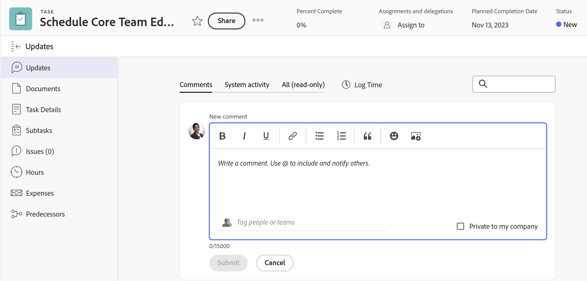
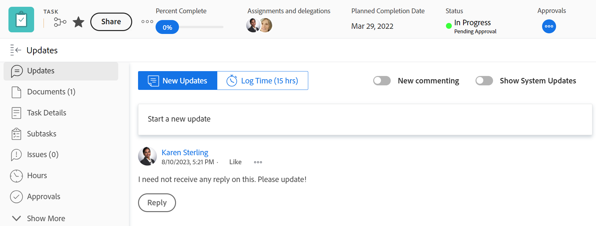

# Översikt över uppdateringsavsnittet

<!-- Audited: 1/2024 -->

<!--
The highlighted information on this page refers to functionality not yet generally available. It is available only in the Preview environment for all customers or in Production for customers who enabled fast releases. 

For information about fast releases, see [Enable or disable fast releases for your organization](/help/quicksilver/administration-and-setup/set-up-workfront/configure-system-defaults/enable-fast-release-process.md).

For information about the current release schedule, see [Second Quarter 2024 release overview](/help/quicksilver/product-announcements/product-releases/24-q2-release-activity/24-q2-release-overview.md).
-->

I uppdateringsavsnittet för ett objekt visas kommentarer som användare gör på objektet eller systemuppdateringar som spårar ändringar i objektet.

<!--
>[!IMPORTANT]
>
>We are currently redesigning the commenting experience in Adobe Workfront.
>
>Depending on what objects you access the commenting experience for, you might see the following functionality for the Updates section:
>* The new experience
>* The legacy experience
>* The new and the legacy experience
>
>For more information about the new commenting experience and its availability, see [New commenting experience](../../product-announcements/betas/new-commenting-experience-beta/unified-commenting-experience.md). 
>
> The legacy commenting experience has been removed from projects, tasks, issues, and documents in the Preview environment. 
>
>The new commenting experience is available only for the Updates section of Workfront objects, and it is not available when you access updates from the following areas:
>
> * Home
> * Summary panel in lists
> * Summary panel in timesheets 
> * Summary panel in the Workload Balancer
>
>The new commenting experience is available in the Summary panel in lists, timesheets, and the Workload Balancer in the Preview environment and in the Production environment for customers who have opted for the fast release process.
-->

## Översikt över uppdateringsavsnittet

I uppdateringsavsnittet för ett objekt visas systemuppdateringar och upp till 200 av de senaste uppdateringarna som användare har gjort under de senaste 90 dagarna.

<!--Info for April 11: Add the following right under the screen shot above:-->

Följande objekt har ett uppdateringsavsnitt där du kan lägga till kommentarer eller granska systemuppdateringar:

* Projekt
* Uppgifter
* Problem
* Program
* Portföljer
* Mallar
* Malluppgifter
* Användare
* Tidrapporter
* Team
* Mål
* Iterationer

Följande objekt har områden där du kan lägga till kommentarer och granska systemuppdateringar:

* Kort på anslagstavlor
* Poster i Workfront Planning

<!--info for April 11: remove all the information below, all the way down to the following section: -->

<!--
Depending on what objects you access the commenting experience for, you might find the following experience for the Updates section:

* Both the new and legacy commenting experience for the following objects: 

  * Project
  * Task (this includes Stories)
  * Issue
  * Document

    >[!TIP]
    >
    >Use the New commenting option to display the new commenting experience (when you enable it) or the legacy commenting experience (when you disable it). The new commenting experience is the default. For more information, see [New commenting experience](../../product-announcements/betas/new-commenting-experience-beta/unified-commenting-experience.md). 

* Only the new commenting experience for the objects listed below. There is no option to enable the legacy commenting experience for these objects:   

  * Goal

    >[!NOTE]
    >
    >You must have an additional license to Adobe Workfront Goals to be able to access this area of Workfront. For more information, see [Requirements to use Workfront Goals](../../workfront-goals/goal-management/access-needed-for-wf-goals.md). 

  * Card on a board
  * Team
  * Template
  * Template Task
  * Timesheet
  * Program
  * Portfolio
  * User

* Only the legacy commenting experience for the following objects:

  * Iterations

    There is no option to enable the new commenting experience for iterations. For more information, see [Manage iteration comments](/help/quicksilver/agile/use-scrum-in-an-agile-team/iterations/manage-iteration-updates.md). 
-->

<!--Info for April 11: reword the section title below to: Overview of the Updates section; and remove the preview tags-->

### Översikt över flikarna i uppdateringsavsnittet

I uppdateringsavsnittet visas information på följande flikar:

* **Kommentarer**: Visar kommentarer som gjorts av användare och svar på dessa kommentarer. Använd fliken Kommentarer för att lägga till nya kommentarer eller svara på befintliga kommentarer. Mer information om hur du uppdaterar objekt finns i [Uppdatera arbete](../updating-work-items-and-viewing-updates/update-work.md).
* **Systemaktivitet**: Visar systemuppdateringar som är informationsmeddelanden som Workfront skapar för att registrera vissa händelser för ett objekt. Till exempel hämtas ändringar i status, namn eller anpassade fält med systemuppdateringar. Din Workfront- eller gruppadministratör kan aktivera systemuppdateringar för dina objekt. Alla svar som har gjorts på systemaktivitetsposter i den tidigare kommentarfunktionen fylls i på aktivitetsfliken i som skrivskyddade. Mer information finns i [Konfigurera systemuppdateringar](../../administration-and-setup/set-up-workfront/system-tracked-update-feeds/configure-system-updates.md).
* **Alla (skrivskyddade)**: Visar både användarkommentarer och systemaktivitetskommentarer på ett ställe. Det här är en flik som bara är för visning. Du kan inte svara på kommentarer eller tagga andra användare i befintliga kommentarer på fliken Alla. Om du vill svara på en viss kommentar använder du länken från fliken Alla till fliken Kommentarer. Mer information om hur du uppdaterar objekt finns i [Uppdatera arbete](../updating-work-items-and-viewing-updates/update-work.md).

  >[!NOTE]
  >
  >Flikarna för kommentarer och systemaktivitet uppdateras i realtid. Du måste uppdatera fliken Alla om du vill visa de senaste uppdateringarna.

### Likheter och skillnader mellan uppdateringsområdena för olika objekt

Det finns skillnader mellan hur kommentarer och uppdateringar visas för olika objekt.

* Följande objekt har liknande upplevelser på alla tre flikarna i uppdateringsavsnittet:

   * Projekt
   * Uppgifter
   * Problem
   * Program
   * Portföljer
   * Användare
   * Tidrapporter

* Följande objekt har ingen aktivitetsflik för System eller en Alla-flik, och upplevelsen på fliken Kommentarer matchar alla andra objekt:

   * Team
   * Mall
   * Malluppgift

* Följande objekt har ingen aktivitetsflik för System eller en Alla-flik, och upplevelsen på fliken Kommentarer skiljer sig från upplevelsen på alla andra objekt:

   * Iterationer
   * Ad hoc-kort i styrelserutan

     Mer information om uppdateringar på kort finns i [Lägga till ett ad hoc-kort till en anslagstavla](/help/quicksilver/agile/get-started-with-boards/add-card-to-board.md).

* Följande objekt har en aktivitetsflik i System och har ingen Alla-flik:

   * Anslutna kort i området för anslagstavlor

     Mer information finns i [Använda anslutna kort på kort](/help/quicksilver/agile/get-started-with-boards/connected-cards.md).

* Följande objekt har fliken Historik som ersätter fliken Systemaktivitet:

   * Poster i Workfront Planning

     Mer information finns i [Översikt över avsnittet Historik](/help/quicksilver/planning/records/history-section-overview.md).

* Följande objekt har ingen Alla-flik och upplevelsen på fliken Kommentarer matchar upplevelsen på de flesta objekt:

   * Mål

     Mer information om uppdateringar av mål finns i [Hantera målkommentarer](/help/quicksilver/workfront-goals/goal-management/manage-goal-comments.md).

<!-- info for April 11: hide the entire section below: -->

<!--
### Overview of the legacy Updates section 

The legacy Updates section shows the following information:

* **User updates**: Comments made by users and replies to those comments. 
* **System updates**: Informational messages that Workfront creates to record certain events on an objects. For example, you can capture changes in status, name, or custom fields with system updates. Your Workfront or group administrator can enable system updates for your objects. For more information, see [Configure system updates](../../administration-and-setup/set-up-workfront/system-tracked-update-feeds/configure-system-updates.md).

The following objects don't record system updates:

* Team
* Template
* Template Task
* Iterations
-->

## Uppdateringar som också visas på objekt med högre rankning

Kommentarer, svar eller systemuppdateringar för vissa objekt visas också i uppdateringsavsnittet för objekt med högre rankning.

När du till exempel lägger till en uppdatering för en uppgift visas uppdateringen i uppdateringsavsnittet för uppgiften och i uppdateringsavsnittet för projektet som innehåller uppgiften.

I följande tabell visas de objekt vars kommentarer också visas på de objekt som ligger högst upp i listan:

<table style="table-layout:auto"> 
 <col> 
 <col> 
 <thead> 
  <tr> 
   <th><strong>Objekt där den ursprungliga uppdateringen lades till</strong> </th> 
   <th> 
<strong>Objekt med högre rankning där den ursprungliga uppdateringen också visas</strong> 
 </th> 
  </tr> 
 </thead> 
 <tbody> 
  <tr> 
   <td>Problem</td> 
   <td>Projekt</td> 
  </tr> 
  <tr> 
   <td>Uppgift</td> 
   <td>Projekt</td> 
  </tr> 
  <tr> 
   <td>Projekt</td> 
   <td>Program, Portfolio</td> 
  </tr> 
  <tr data-mc-conditions=""> 
   <td>Dokument </td> 
   <td>Objekt där dokumentet är bifogat, Projekt </td> 
  </tr> 
 </tr> 
  <tr data-mc-conditions=""> 
   <td>Korrektur </td> 
   <td>Dokument </td> 
  </tr>

<tr> 
   <td>Program</td> 
   <td>Portfolio</td> 
  </tr> 
  <tr> 
   <td>Användare</td> 
   <td>Team</td> 
  </tr> 
  <tr> 
   <td>Tidrapport</td> 
   <td>
Användare, team

   
<b>ANMÄRKNING</b>

   
Tidrapportkommentarer visas i uppdateringsavsnittet för den användare som gör kommentaren och uppdateringsavsnittet i sin hemgrupp.

   </td> 
  </tr> 
  <tr> 
   <td>Malluppgift</td> 
   <td>Mall</td> 
  </tr> 
  <tr> 
   <td>Artikel</td> 
   <td>Iteration, Team</td> 
  </tr> 
  <tr> 
   <td>Upprepning</td> 
   <td>Team</td> 
  </tr>

<tr> 
   <td>Resultat</td> 
   <td>Mål</td> 
  </tr> 
  <tr> 
   <td>Aktivitet</td> 
   <td>Mål</td> 
  </tr> 
 </tbody> 
</table>

<!--info for April 11: hide the note below-->

<!--
>[!NOTE]
>
>Replies added to system updates do not roll up to the parent object. Only direct replies on a child object and replies added to existing updates roll up to parent objects.
>
>For information about the object hierarchy in Adobe Workfront, see [Understand objects in Adobe Workfront](../../workfront-basics/navigate-workfront/workfront-navigation/understand-objects.md).
>
> It is not possible to reply to system updates in the new commenting experience. For more information, see [New commenting experience](../../product-announcements/betas/new-commenting-experience-beta/unified-commenting-experience.md).
-->

## Begränsningar i uppdateringsavsnittet

Det finns vissa begränsningar i uppdateringsavsnittet för ett team och när du anger uppdateringar för andra användares räkning.

### Överväganden för användare och team

Tänk på följande när du visar uppdateringar för användare och team:

* Du kan inte lägga till nya kommentarer i uppdateringsavsnittet i ett team.

* Du kan lägga till ett svar på en uppdatering som du visar i ett team. Svaret visas i teamets uppdateringsavsnitt samt i uppdateringsavsnittet för det objekt det tillhör.

* I uppdateringsavsnittet för användare och team kan du visa de uppdateringar som har gjorts under de senaste 90 dagarna.

  Om du vill se alla uppdateringar som gjorts för en användare eller ett team, utöver 90-dagarsgränsen, kan du skapa en rapport för anteckningar. Rapporten ska inte ha något tidsfilter som visar alla uppdateringar som gjorts för användare eller team. Mer information finns i [Skapa en anpassad rapport](../../reports-and-dashboards/reports/creating-and-managing-reports/create-custom-report.md).

* Uppdateringsavsnittet för team fylls i med kommentarer som lagts till i följande objekt:

   * Användare
   * Artiklar
   * Tidrapporter
   * Iterationer

* Fliken Systemuppdateringar i uppdateringsområdet för användare fylls i av uppdateringar till andra objekt. Nedan följer uppdateringar som visas på fliken Systemuppdateringar i användarens profil när fälten spåras i området Uppdateringsfeeds i installationsprogrammet:

   * Lägga till, ta bort och andra dokumentuppdateringar
   * Timtillägg, borttagning, tillägg för och andra timinguppdateringar
   * Uppdateringar av anpassade fält
   * Uppdateringar av användarprofilen (uppdateringar av användarens avatar, mobilnummer, prata med mig om fält, titel)
   * Lägga till användare, ta bort, ändra åtkomstnivå, ändringar i inbyggda användarfält
   * Ekonomisk information från uppgifter och projekt.

### Begränsningar när du skriver kommentarer för en annan användares räkning

Adobe Workfront-administratörer och gruppadministratörer kan logga in som andra användare och utföra åtgärder i Workfront som att skriva kommentarer.

Mer information finns i [Logga in som en annan användare](../../administration-and-setup/add-users/create-and-manage-users/log-in-as-another-user.md).

Tänk på följande när du loggar in som en annan användare och lägger till kommentarer:

* Alla kommentarer som görs för en annan användares räkning anges i kommentaren.

* En gruppadministratör kan kommentera för en annan persons räkning, men kan inte ta bort kommentaren. Det är bara en Adobe Workfront-administratör som kan ta bort en kommentar som de har gjort för en annan användares räkning.

* En Workfront- eller gruppadministratör kan bara redigera en kommentar som de har lagt till för en annan användares räkning när de loggar ut som användare och sedan loggar in som sig själva. De kan inte ta bort en kommentar för en annan användares räkning.

## Visa systemuppdateringar för arbetsobjekt med journalpostrapporten

Journalanmälningsrapporten innehåller systemuppdateringar från uppdateringsområdet för projekt, uppgifter och utgåvor.

I rapporten kan du se:

* Hur många statusändringar som har gjorts
* När en uppgift eller ett problem har tagits bort
* Hur värden i viktiga anpassade fält ändrades under ett projekt
* Vilka viktiga datum som har ändrats under ett projekt
* Om prioritet ändras under ett projekt
* Om ägaren till ett projekt har ändrats

Mer information finns i [Rapport om uppdateringsområdet med en journalpostrapport](../../reports-and-dashboards/reports/creating-and-managing-reports/create-journal-entry-report.md).
