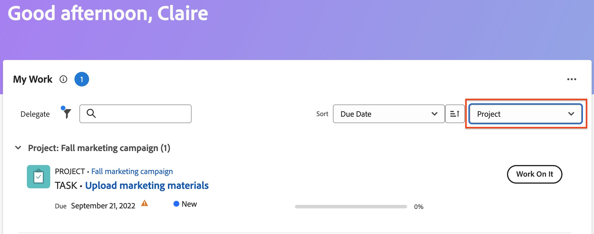
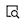

# Hantera ditt arbete med widgeten Mitt arbete

Widgeten Mitt arbete visar alla dina tilldelade uppgifter, utgåvor och förfrågningar på ett och samma ställe. Här kan du filtrera och ordna ditt arbete, logga tid, göra uppdateringar och markera arbetsobjekten som slutförda.

## Åtkomstkrav

+++ Expandera om du vill visa åtkomstkrav för funktionerna i den här artikeln.

Du måste ha följande åtkomst för att kunna utföra stegen i den här artikeln:

<table style="table-layout:auto"> 
 <col> 
 </col> 
 <col> 
 </col> 
 <tbody> 
  <tr> 
   <td role="rowheader"><strong>[!DNL Adobe Workfront plan]</strong></td> 
   <td> 
Alla
 </td> 
  </tr> 
  <tr> 
   <td role="rowheader"><strong>[!DNL Adobe Workfront] licens</strong></td> 
   <td> 
Aktuell: Contribute

   
eller
 
   
Nytt:[!UICONTROL Light] eller senare
 
  </td> 
  </tr> </ul>
  <tr> 
   <td role="rowheader"><strong>Konfigurationer på åtkomstnivå</strong></td> 
   <td> 
[!UICONTROL View] eller högre tillgång till projekt, uppgifter, ärenden och dokument
 </td> 
  </tr>  
  <tr> 
   <td role="rowheader"><strong>Objektbehörigheter</strong></td> 
   <td> 
Contribute behörigheter eller högre för de uppgifter och problem som du behöver arbeta med
  </td> 
  </tr> 
 </tbody> 
</table>

Mer information om informationen i den här tabellen finns i [Åtkomstkrav i Workfront-dokumentationen](/help/quicksilver/administration-and-setup/add-users/access-levels-and-object-permissions/access-level-requirements-in-documentation.md).

+++

## Hitta ditt material med filter

Du kan finjustera filtren Mitt arbete för att fokusera på specifika objekt i din lista över arbeten:

### Filterinformation

<table>
  <tbody>
    <tr>
      <td>Arbetar på</td>
      <td>Visar objekt som du arbetar med</td>
    </tr>
    <tr>
      <td>Klar att börja</td>
      <td>Visar objekt med 
      <ul>
      <li>Inga ofullständiga föregångare eller aktivitetsbegränsningar</li>
      
och

      <li>Det planerade startdatumet har passerat eller är upp till två veckor i framtiden</li>
      </ul>
      </td>
    </tr>
    <tr>
      <td>Inte klar</td>
      <td>Visar objekt som har
       <ul>
      <li>Ofullständiga föregående aktiviteter eller aktivitetsbegränsningar som förhindrar att objektet bearbetas</li>
      
eller

      <li>Det planerade startdatumet är mer än två veckor i framtiden</li>
      </ul>
       </td>
    </tr>
    <tr>
      <td>Begärd</td>
      <td>Visar problem som du inte har börjat arbeta med</td>
    </tr>
    <tr>
      <td>Delegerad av mig</td>
      <td>Visar objekt som du har delegerat till andra användare</td>
    </tr>
    <tr>
      <td>Delegerat till mig</td>
      <td>Visar objekt som användare har delegerat till dig</td>
    </tr>
    <tr>
      <td>Slutförd</td>
      <td>Visar det arbete som utförts de senaste två veckorna. Det här filteralternativet inkluderar inte godkännanden.</td>
    </tr>
  </tbody>
</table>

>[!TIP]
>
>Om du letar efter mer specifika filtreringsalternativ kan du använda widgetarna Min uppgift eller Mitt problem. Mer information om filtren Min aktivitet och Mitt problem finns i [Översikt över filtren för den nya hemwidgeten](/help/quicksilver/workfront-basics/using-home/new-home/widget-filter-overview-new-home.md).

## Ordna ditt arbete

Du kan använda sorterings- och gruppfunktionerna i widgeten Mitt arbete för att ordna ditt arbete på ett sätt som passar dig.

### Sortera

Du kan sortera arbetslistan efter

* Förfallodatum
För förfallna objekt visas en varningsikon bredvid datumet. Workfront använder det planerade slutförandedatumet för att avgöra om uppgifter och ärenden har förfallit.
* Namn
* Procent färdigt
* Status

>[!TIP]
>
>Om du vill skapa en lista som visar alla förfallna objekt högst upp i widgeten Mitt arbete sorterar du efter förfallodatum och tillämpar ingen gruppering.

### Grupp

Du kan gruppera arbetslistan efter

* Projekt
* Status
* Förfallodatum
Förfallodatumet bestäms av det planerade slutförandedatumet.

>[!NOTE]
>
>När du tillämpar en gruppering bestäms ordningen i grupperingen av det du väljer på menyn Sortera.

## Uppdatera information om arbetsuppgift i sammanfattningen

Du kan öppna panelen Sammanfattning för att snabbt uppdatera information i en uppgift eller ett problem. I Sammanfattning kan du

* Uppdatera procent färdigt
* Lägg till en uppdatering
* Navigera till dokumentområdet för att överföra ett dokument
* Visa information om arbetsuppgift och uppdatera anpassade fält
Workfront-administratörer kan anpassa vilka fält som ska visas i sammanfattningen i layoutmallen. Mer information finns i [Anpassa hem och sammanfattning med hjälp av en layoutmall](/help/quicksilver/administration-and-setup/customize-workfront/use-layout-templates/customize-home-summary-layout-template.md).
* Ändra arbetsuppgiftens status
* Visa underaktiviteter
* Loggtid
* Visa bifogade godkännandeprocesser

Håll markören över arbetsobjektet och klicka sedan på ikonen **Sammanfattning**  för att öppna sammanfattningen.

Mer information om hur du använder panelen Sammanfattning finns i [Översikt över sammanfattning](/help/quicksilver/workfront-basics/the-new-workfront-experience/summary-overview.md).

## Använd snabbåtgärder för att uppdatera arbetsposter

Du kan använda snabbåtgärdsmenyn för att

* Loggtid
* Lägg till en uppdatering
* Uppdatera ett anpassat formulär
* Överföra en fil

Håll markören över arbetsobjektet för att hitta snabbåtgärdsmenyn. Listan med snabbåtgärder visas nära knappen **Arbeta med den** eller **Klar**.

## Visa godkännanden och teamförfrågningar

Godkännanden och teamförfrågningar visas inte i widgeten Mitt arbete. Om du regelbundet arbetar med godkännanden och teamförfrågningar rekommenderar vi att du lägger till följande widgetar på din nya hemsida:

* Väntar på mitt godkännande
* Alla godkännanden
* Teamförfrågningar

Mer information om hur du lägger till widgetar på din nya hemsida finns i [Lägg till, redigera eller ta bort widgetar i Nytt hem](/help/quicksilver/workfront-basics/using-home/new-home/add-edit-remove-widgets-in-new-home.md).

