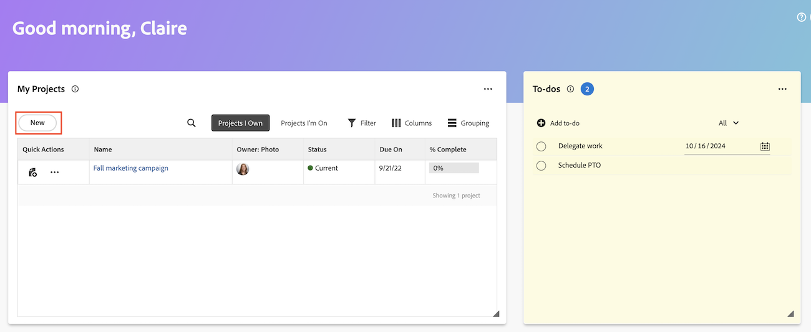

# Skapa arbetsobjekt och projekt från Hem-området

Du kan skapa arbetsobjekt och projekt från området [!UICONTROL Home].

Från Hem kan du

* Skicka begäranden
* Lägga till uppgifter och problem i specifika projekt
* Skapa projekt från en mall, ett tomt projekt eller importera ett MS-projekt.

## Åtkomstkrav

+++ Expandera om du vill visa åtkomstkrav för funktionerna i den här artikeln.

Du måste ha följande åtkomst för att kunna utföra stegen i den här artikeln:

<table style="table-layout:auto"> 
 <col> 
 <col> 
 <tbody> 
  <tr> 
   <td role="rowheader"><strong>[!DNL Adobe Workfront plan*]</strong></td> 
   <td> 
Alla
 </td> 
  </tr> 
  <tr> 
   <td role="rowheader"><strong>[!DNL Adobe Workfront] licens*</strong></td> 
   <td> 
[!UICONTROL Work] eller högre
 </td> 
  </tr> 
  <tr> 
   <td role="rowheader"><strong>Konfigurationer på åtkomstnivå*</strong></td> 
   <td> 
[!UICONTROL Worker]
 
<b>ANMÄRKNING</b>
 
   
Om du fortfarande inte har åtkomst frågar du [!DNL Workfront]-administratören om de anger ytterligare begränsningar för din åtkomstnivå. Mer information om hur en [!DNL Workfront]-administratör kan ändra din åtkomstnivå finns i <a href="../../../administration-and-setup/add-users/configure-and-grant-access/create-modify-access-levels.md" class="MCXref xref">Skapa eller ändra anpassade åtkomstnivåer</a>.
 </td> 
  </tr> 
  <tr> 
   <td role="rowheader"><strong>Objektbehörigheter</strong></td> 
   <td> 
[!UICONTROL Edit] behörighet eller högre för uppgifter
 
Mer information om hur du begär ytterligare åtkomst finns i <a href="../../../workfront-basics/grant-and-request-access-to-objects/request-access.md" class="MCXref xref">Begär åtkomst till objekt </a>.
 </td> 
  </tr> 
 </tbody> 
</table>

&#42;Kontakta [!DNL Workfront]-administratören om du vill ta reda på vilken plan, licenstyp eller åtkomst du har.

+++

## Skapa ett personligt att göra-objekt

Du kan skapa ett personligt att göra-objekt i Att göra-widgeten i området [!UICONTROL Home]. Att göra-objekten är personliga uppgifter som du själv skapar.

Du och andra användare kan visa dina personliga uppgifter i en personlig uppgiftsrapport. Därifrån kan de vid behov lägga till dem i projekt.

>[!TIP]
>
>Arbetsobjekt som du skickar till andra användare eller till dig själv från användarprofilsidan visas också i Att göra-widgeten i hemområdet för användaren. Mer information finns i [Skapa personliga uppgifter](/help/quicksilver/workfront-basics/updating-work-items-and-viewing-updates/create-personal-tasks.md).

Så här skapar du ett att göra-objekt:

1. Klicka på ikonen **[!UICONTROL Main Menu]**  i det övre högra hörnet eller på ikonen **Huvudmeny**  i det övre vänstra hörnet, om den är tillgänglig, och klicka sedan på **[!UICONTROL Home]**.
1. (Villkorligt) Klicka på **Anpassa** och sedan på **Att göra** för att lägga till Att göra-widgeten på hemskärmen.
1. Gå till widgeten **Att göra** och klicka sedan på **Lägg till att göra**.
1. Skriv namnet på ditt personliga att göra-objekt och klicka sedan på Enter.
1. (Valfritt) Klicka på ikonen **Datum**  för att lägga till ett förfallodatum för objektet.
   
1. (Valfritt) Skapa en personlig uppgiftsrapport eller ett filter. Mer information om hur du skapar ett personligt uppgiftsfilter finns i [Filter: personlig uppgift](/help/quicksilver/reports-and-dashboards/reports/custom-view-filter-grouping-samples/filter-personal-tasks.md).
Du kan visa dina att göra-uppgifter och andra användares att göra-uppgifter i den personliga uppgiftsrapporten.

## Lägga till en uppgift i ett projekt

Du kan lägga till en uppgift i ett befintligt projekt direkt från Hem-området:

1. Klicka på ikonen **[!UICONTROL Main Menu]**  i det övre högra hörnet och klicka sedan på **[!UICONTROL Home]**.
1. (Villkorligt) Lägg till widgeten **Mina uppgifter** på hemskärmen. Klicka på **Anpassa** och sök efter **Mina uppgifter**.
1. Gå till widgeten **Mina uppgifter** och klicka sedan på **Nytt**.
   
1. Ange aktivitetsnamnet i dialogrutan **Ny aktivitet**.
1. Börja skriva ett projektnamn och välj sedan namnet i listan.
1. (Valfritt) Ange information i följande fält:

   | Fält | Instruktioner |
   |----------|----------|
   | **Beskrivning** | Ange en beskrivning. |
   | **Uppdrag** | Tilldela användare. |
   | **Varaktighet** | Ange längden. |
   | **Planerat slutförandedatum** | Välj ett planerat slutförandedatum. |
   | **Fler alternativ** | Välj fler alternativ för att konfigurera fler inställningar för aktiviteten. Mer information om hur du skapar uppgifter finns i [Redigera uppgifter](/help/quicksilver/manage-work/tasks/manage-tasks/edit-tasks.md). |

1. Klicka på **Skapa uppgift**.

## Lägga till en utgåva i ett projekt

Du kan lägga till ett problem i ett befintligt projekt direkt från Hem-området:

1. Klicka på ikonen **[!UICONTROL Main Menu]**  i det övre högra hörnet och klicka sedan på **[!UICONTROL Home]**.
1. (Villkorligt) Lägg till widgeten **Mina problem** på hemskärmen. Klicka på **Anpassa** och sök efter **Mina problem**.
1. Gå till widgeten **Mina problem** och klicka sedan på **Nytt**.
   
1. I dialogrutan **Nytt problem** börjar du skriva ett projektnamn och väljer sedan namnet i listan.
1. Ange ett problemnamn.
1. (Valfritt) Ange information i följande fält:

   | Fält | Instruktioner |
   |----------|----------|
   | **Beskrivning** | Ange en beskrivning. |
   | **Uppdrag** | Tilldela användare. |
   | **Prioritet** | Välj en prioritetsnivå. |
   | **Dokument** | Överför ett dokument. |

1. Klicka på **Spara nytt problem**.

## Skapa en förfrågan

Du kan skapa en begäran direkt från Hem-området:

1. Klicka på ikonen **[!UICONTROL Main Menu]**  i det övre högra hörnet och klicka sedan på **[!UICONTROL Home]**.
1. (Villkorligt) Lägg till widgeten **Mina förfrågningar** på hemskärmen. Klicka på **Anpassa** och sök efter **Mina förfrågningar**.
1. Gå till widgeten **Mina förfrågningar** och klicka sedan på **Nytt**.
   

1. I dialogrutan **Ny begäran** börjar du skriva namnet på begärandekön.
1. Fyll i relevanta fält.
1. Klicka på **Skicka**.

Mer information om hur du skickar begäranden finns i [Skapa och skicka begäranden](/help/quicksilver/manage-work/requests/create-requests/create-submit-requests.md).

## Skapa ett projekt

Du kan skapa ett projekt direkt från Hem-området:

1. Klicka på ikonen **[!UICONTROL Main Menu]**  i det övre högra hörnet och klicka sedan på **[!UICONTROL Home]**.
1. (Villkorligt) Lägg till widgeten **Mina projekt** på startskärmen. Klicka på **Anpassa** och sök efter **Mina projekt**.
1. Gå till widgeten **Mina projekt** och klicka sedan på **Nytt**.
   
1. Välj något av följande alternativ:

   | Fält | Instruktioner |
   |----------|----------|
   | Från en mall | Gå till [Skapa ett projekt med en mall](/help/quicksilver/manage-work/projects/create-projects/create-project-from-template.md) om du vill ha detaljerade anvisningar om hur du skapar ett projekt från en mall. |
   | Tomt projekt | Gå till [Skapa ett projekt från grunden](/help/quicksilver/manage-work/projects/create-projects/create-project.md#create-a-project-from-scratch) om du vill ha detaljerade anvisningar om hur du skapar ett tomt projekt. |
   | Importera MS-projekt | Gå till [Importera ett projekt från Microsoft Project](/help/quicksilver/manage-work/projects/create-projects/import-project-from-ms-project.md) om du vill ha detaljerade anvisningar om hur du importerar ett MS-projekt. |

<!--
## Create a board

You can create a board directly from the Home area:

1. Click the **[!UICONTROL Main Menu]**  in the upper-right corner, then click **[!UICONTROL Home]**.
1. (Conditional) Add the **Boards** widget to your home screen. Click **Customize**, and find **Boards**. -->

<!--
## Delete a to-do item

1. Click the **[!UICONTROL Main Menu]**  in the upper-right corner, then click **[!UICONTROL Home]**.
1. Go to the to-do widget.
1. Hover over the item, then click the **Delete** icon . 

## Edit a to-do item

1. Click the **[!UICONTROL Main Menu]**  in the upper-right corner, then click **[!UICONTROL Home]**.
1. Go to the to-do widget.
1. Edit the item name.
1. Click on the **Date** icon  to add or adjust a due date. -->