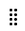

# Visa objekt i [!UICONTROL worklist] i området [!UICONTROL Home]

<!-- Audited: 1/2024 -->

Varje widget innehåller en egen arbetslista. Arbetslister visar alla arbetsobjekt som är tilldelade dig. Du kan styra vilka objekt som ska visas i [!UICONTROL worklist] genom att använda filter och grupperingar.

>[!IMPORTANT]
>
>* Om du vill visa uppgifter och problem i Home-widgetarna måste det överordnade projektet ha statusen Aktuell eller en status som motsvarar aktuell.
>* Projekt måste också ha statusen Aktuell eller en status som är lika med aktuell att visa i Hem.

## Åtkomstkrav

+++ Expandera om du vill visa åtkomstkrav för funktionerna i den här artikeln.

Du måste ha följande åtkomst för att kunna utföra stegen i den här artikeln:

<table style="table-layout:auto"> 
 <col> 
 </col> 
 <col> 
 </col> 
 <tbody> 
  <tr> 
   <td role="rowheader"><strong>[!DNL Adobe Workfront plan]</strong></td> 
   <td> 
Alla
 </td> 
  </tr> 
  <tr> 
   <td role="rowheader"><strong>[!DNL Adobe Workfront] licens</strong></td> 
   <td> 
Nytt:
<ul><li>[!UICONTROL Contributor] endast för godkännanden</li> <li>[!UICONTROL Standard] eller högre för alla andra objekt</li> 
eller
 
  </ul>
Aktuell:
<ul><li>[!UICONTROL Review] endast för godkännanden</li> <li>[!UICONTROL Work] eller högre för alla andra objekt</li> </td> 
  </tr> </ul>
  <tr> 
   <td role="rowheader"><strong>Konfigurationer på åtkomstnivå</strong></td> 
   <td> 
[!UICONTROL View] eller högre tillgång till projekt, uppgifter, ärenden och dokument
 </td> 
  </tr> 
  <tr> 
   <td role="rowheader"><strong>Objektbehörigheter</strong></td> 
   <td> 
Contribute behörigheter eller högre för de uppgifter och problem som du behöver arbeta med
  </td> 
  </tr> 
 </tbody> 
</table>

Mer information om informationen i den här tabellen finns i [Åtkomstkrav i Workfront-dokumentationen](/help/quicksilver/administration-and-setup/add-users/access-levels-and-object-permissions/access-level-requirements-in-documentation.md).

+++

## Filtrera ditt arbete

Du kan filtrera objekt i [!UICONTROL Worklist] för en widget så att endast vissa typer av objekt visas. Du kan t.ex. filtrera arbetsytan [!UICONTROL Worklist] så att endast problem eller förfrågningar visas.

>[!NOTE]
>
>Filteralternativen lagras i webbläsaren. Om du använder samma webbläsare på samma dator (och inte rensar platsdata) på samma sätt, ska du inte ändra det. Om du byter webbläsare eller dator återställs standardalternativet, vilket innebär att alla filter är avmarkerade.

Så här filtrerar du ditt arbete:

1. Klicka på **[!UICONTROL Main Menu]**  i det övre högra hörnet och klicka sedan på **[!UICONTROL Home]**.
1. (Villkorligt) Klicka på **Anpassa** om du vill lägga till någon av följande widgetar:

   | Widget | Beskrivning |
   |--------------|---------------------------------------------------------------------------------------------------|
   | Varumärkena | Visar alla anslagstavlor som du har skapat eller har bjudits in att använda |
   | Mitt arbete | Visar uppgifter och ärenden som du har tilldelats |
   | Mina projekt | Visar projekt som du äger eller projekt som du arbetar med |
   | Mina uppgifter | Visar uppgifter som tilldelats dig |
   | Mina problem | Visar problem som du har tilldelats |
   | Mina förfrågningar | Visar alla begäranden som du har skickat in |
   | Mina godkännanden | Visar alla väntande, tilldelade, delegerade och inskickade godkännanden |

1. Klicka på ikonen **Filter**  i det övre högra hörnet av widgetens arbetslista.
1. Välj ett **föreslaget**-filter eller ett filter som du har skapat.
Mer information om föreslagna filter finns i [Översikt över filter för hemwidget](/help/quicksilver/workfront-basics/using-home/using-the-home-area/widget-filter-overview-home.md).
1. (Valfritt) Aktivera **Staplingsfilter** om du vill välja flera filteralternativ.

   

## Gruppera ditt arbete

Du kan gruppera widgeten [!UICONTROL worklist] för att ordna dina arbetsobjekt.

Så här grupperar du din arbetslista:

1. Klicka på **[!UICONTROL Main Menu]**  i det övre högra hörnet och klicka sedan på **[!UICONTROL Home]**.
1. (Villkorligt) Klicka på **Anpassa** om du vill lägga till någon av följande widgetar:

   | Widget | Beskrivning |
   |--------------|---------------------------------------------------------------------------------------------------|
   | Varumärkena | Visar alla anslagstavlor som du har skapat eller har bjudits in att använda |
   | Mitt arbete | Visar uppgifter och ärenden som du har tilldelats |
   | Mina projekt | Visar projekt som du äger eller projekt som du arbetar med |
   | Mina uppgifter | Visar uppgifter som tilldelats dig |
   | Mina problem | Visar problem som du har tilldelats |
   | Mina förfrågningar | Visar alla begäranden som du har skickat in |
   | Mina godkännanden | Visar alla väntande, tilldelade, delegerade och inskickade godkännanden |

1. Klicka på ikonen **Grupp**  i det övre högra hörnet av widgetens arbetslista.
1. Välj en **föreslagen** gruppering eller en gruppering som du har skapat.
   

## Anpassa kolumner för arbetslistor

Du kan välja vilka kolumner som ska visas i widgetens arbetslista:

1. Klicka på **[!UICONTROL Main Menu]**  i det övre högra hörnet och klicka sedan på **[!UICONTROL Home]**.
1. (Villkorligt) Klicka på **Anpassa** om du vill lägga till någon av följande widgetar:

   | Widget | Beskrivning |
   |--------------|---------------------------------------------------------------------------------------------------|
   | Varumärkena | Visar alla anslagstavlor som du har skapat eller har bjudits in att använda |
   | Mitt arbete | Visar uppgifter och ärenden som du har tilldelats |
   | Mina projekt | Visar projekt som du äger eller projekt som du arbetar med |
   | Mina uppgifter | Visar uppgifter som tilldelats dig |
   | Mina problem | Visar problem som du har tilldelats |
   | Mina förfrågningar | Visar alla begäranden som du har skickat in |
   | Mina godkännanden | Visar alla väntande, tilldelade, delegerade och inskickade godkännanden |

1. Klicka på ikonen **Kolumn**  i det övre högra hörnet av widgetens arbetslista.
1. Aktivera och inaktivera kolumnerna beroende på dina inställningar.
1. (Valfritt) Klicka på ikonen **Dra**  om du vill ändra ordning på kolumnerna.
   

## Visa sena artiklar

[!DNL Adobe Workfront] använder följande datum för att avgöra om arbetsförfrågningar är sena:

* **Uppgifter**: [!UICONTROL Planned Completion Date]
* **Problem**: [!UICONTROL Planned Completion Date]
* **Dokument**: [!UICONTROL Submitted date]
* **Tidrapporter**: [!UICONTROL Submitted date]
* **Godkännanden**: [!UICONTROL Submitted date]
* **Korrektur för godkännanden**: [!UICONTROL Proof deadline]

