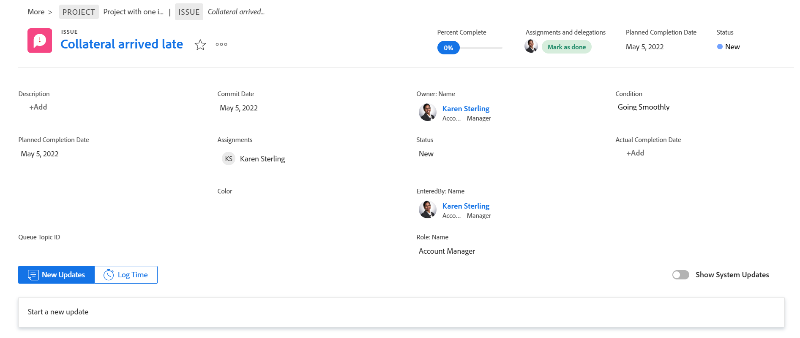
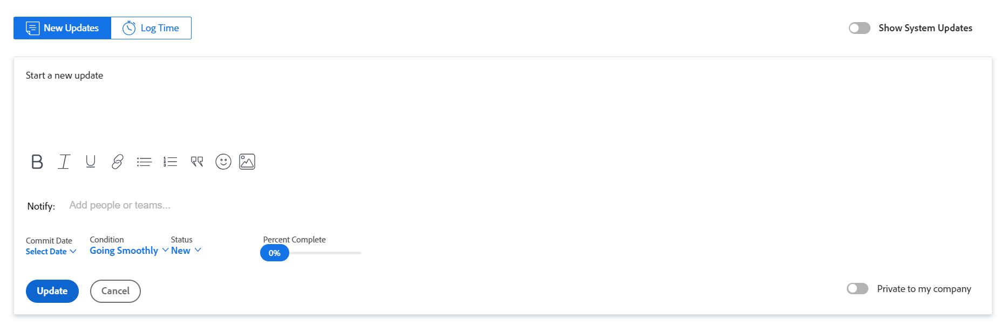
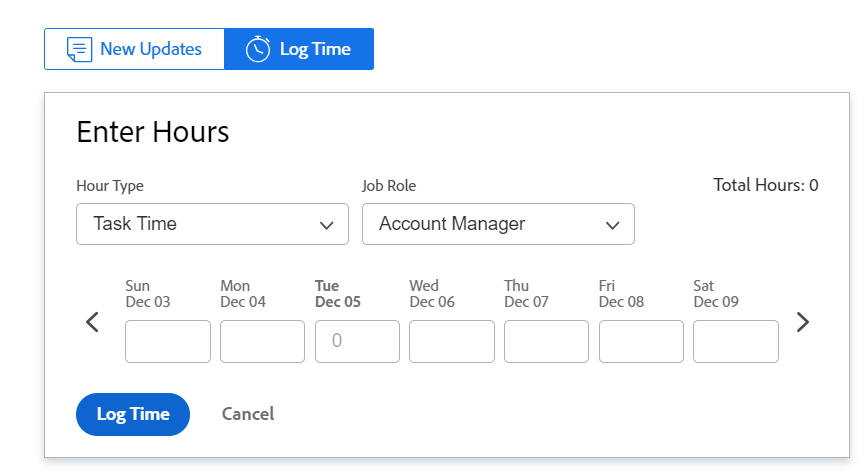

# Kom igång med [!UICONTROL Home]

Det finns två sätt att visa ditt arbete i [!UICONTROL Home] område, antingen från [!UICONTROL Work List] eller kalendern.

## Arbetslista

The [!UICONTROL Work List] kan du visa allt ditt tilldelade arbete på ett och samma ställe:

![[!UICONTROL Work List] paneler](assets/worklist-and-right-panel-home.png)

S. Använd den vänstra panelen för att filtrera, sortera och välja arbete som du har tilldelats.

B. När du har markerat ett arbetsobjekt i den vänstra panelen kan du använda den högra panelen för att interagera med anpassade fält, göra uppdateringar och logga tid.

Mer information om hur du använder [!UICONTROL Home Work List]finns i följande artiklar:

* [Visa objekt i [!UICONTROL Work List] i [!UICONTROL Home] area](../../../workfront-basics/using-home/using-the-home-area/display-items-in-home-work-list.md)
* [Skapa arbetsobjekt från [!UICONTROL Home] area](../../../workfront-basics/using-home/using-the-home-area/create-work-items-in-home.md)

## Kalender

I kalendern kan du visualisera arbetet genom att visa när arbetsobjekten förfaller och blockera tid för att slutföra dem:

S. Använd [!UICONTROL Calendar] för att skapa en visuell karta över det arbete du behöver utföra. Klicka och dra arbetsobjekten från [!UICONTROL Work List] till kalendern för att blockera arbetstid.

B. Synkronisera med din [!DNL Outlook] kalender. Hantera möten och arbeta på ett och samma ställe.

C. Använd [!UICONTROL Details] om du vill öppna en ny högerpanel där du kan visa mer information om arbetsposten.

D. Använd förfallofältet för att hålla reda på när arbete som tilldelats dig förfaller.

Mer information om hur du använder hemkalendern finns i [Använd [!UICONTROL Home Calendar] visa](../../../workfront-basics/using-home/using-the-home-area/use-home-calendar-view.md).

## Hitta ditt arbete

The [!UICONTROL Home] är den enda butik du behöver för att hitta uppgifter, utgåvor och godkännanden som du har tilldelats. Filtrerings- och sorteringsalternativen finns inbyggda i [!UICONTROL Home] arbetar tillsammans för att hjälpa dig att arbeta som du vill. Du kan använda [!UICONTROL Sort by] om du vill gruppera objekt och sedan använda filtret för att fokusera på det arbete som behöver slutföras.

>[!NOTE]
>
>Filtrerings- och sorteringsalternativen lagras i webbläsaren. Om du konsekvent använder samma webbläsare på samma dator (och inte rensar platsdata) ändras inte filtren och sorteringen, men om du byter webbläsare eller dator ändras filtren och sorteringen.

### Gruppera liknande arbetsobjekt tillsammans med &#39;[!UICONTROL Group by]Alternativet

The [!UICONTROL Sort by] kan du gruppera liknande objekt i arbetslistan. Du kan sortera efter:

* [!UICONTROL Planned Completion]
* [!UICONTROL Planned Start]
* [!UICONTROL Commit Date]
* [!UICONTROL Project]
* [!UICONTROL My Priority]

Mer information om hur du använder grupperingar finns i [Visa objekt i [!UICONTROL Work List] i [!UICONTROL Home] area](../../../workfront-basics/using-home/using-the-home-area/display-items-in-home-work-list.md).

### Begränsa fokus med filter

The [!UICONTROL Work List] Med filtret kan du begränsa ditt fokus till specifika arbetsobjekt.

Nedan följer exempel på hur du kan filtrera objekt som du visar i Hem:

* Filtrera efter objekttyp och tillstånd.

   Om du till exempel vill visa alla uppgifter kan du välja [!UICONTROL Tasks] filter. Om du vill vara mer specifik än den här och bara visa uppgifter som du kan börja arbeta med, väljer du [!UICONTROL Ready to Start] filter under [!UICONTROL Tasks] filter.

* Filtrera endast efter objekttyp.

   Du kan till exempel välja [!UICONTROL Issues] för att se alla problem i alla lägen ([!UICONTROL Working On] eller [!UICONTROL Requested]), eller [!UICONTROL Approvals] om du vill se alla arbetsobjekt, förfrågningar om åtkomst, tidrapport, dokument och korrekturgodkännanden.

* Filtrera endast efter status.

   Du kan till exempel välja [!UICONTROL Completed] för att visa uppgifter och ärenden som har slutförts. Detta inkluderar personliga uppgifter men inte godkännanden.

Mer information om hur du använder filter finns i [Visa objekt i [!UICONTROL Work List] i [!UICONTROL Home] area](../../../workfront-basics/using-home/using-the-home-area/display-items-in-home-work-list.md).

### Få tillgång till arbete som tilldelats ditt team

The [!UICONTROL Home] -området har en permanent gruppering som är dedikerad till gruppförfrågningar med en direktlänk till teamets begärandesida. Använd den här grupperingen för att visa och komma åt begäranden för alla team du är i.

>[!NOTE]
>
>The [!UICONTROL Filter] och [!UICONTROL Sort by] alternativen påverkar inte [!UICONTROL Team Requests] gruppering. Grupperingen visas så länge du har arbete tilldelat ditt team.

Mer information om hur du får åtkomst till teamförfrågningar finns i artikeln [[!UICONTROL Manage] arbets- och teamförfrågningar i [!UICONTROL Home] area](../../../workfront-basics/using-home/using-the-home-area/manage-work-and-team-requests-home.md).

### Övervaka material som du har skickat in

Håll reda på material som du har skickat in för godkännande direkt från [!UICONTROL Work List]. Du kan påminna godkännaren om arbetet som behöver godkännas. Du kan även återkalla godkännandet om det behövs.

>[!NOTE]
>
>The [!UICONTROL Filter] och [!UICONTROL Sort by] alternativen påverkar inte [!UICONTROL Approvals I've Submitted] gruppering. Den här grupperingen visas så länge du väntar på godkännande.

## Prioritera det som är viktigt för dig

The [!UICONTROL Work List] gör att du kan identifiera och prioritera arbete som är viktigt för dig med [!UICONTROL My Priority Sort by] alternativ. Du kan lägga till upp till 20 objekt i [!UICONTROL My Priority] lista. Använd [!UICONTROL More] om du vill lägga till arbetsobjekt i prioriteringslistan.

>[!NOTE]
>
>Alla arbetsobjekt som lagts till i [!UICONTROL My Priority] är bara synliga för dig och ingen kan prioritera arbetet åt dig.

Mer information om hur du använder [!UICONTROL My Priority], se [Prioritera arbetet i [!UICONTROL Home] area](../../../workfront-basics/using-home/using-the-home-area/prioritize-work-in-home.md).

## Få det gjort

Använd den högra panelen i [!UICONTROL Home] för att uppdatera och slutföra arbetet.

### Arbeta i ett utrymme som passar dig

Dina [!DNL Adobe Workfront] kan lägga till upp till 16 anpassade fält så att det blir enklare att hitta och uppdatera informationen. De flesta fälten kan redigeras, så du behöver inte navigera till arbetsposten.

Om du vill uppdatera något av fälten i det här området klickar du bara på fältet.

>[!NOTE]
>
>Du kan inte uppdatera [!UICONTROL Commit Date] i det här området.

### Uppdatera medarbetare med viktig information

Kommunicera snabbt och effektivt med medarbetare från [!UICONTROL Home] område. Du ställer frågor till dina medarbetare, underrättar dem om de senaste uppdateringarna eller svarar på direkta kommentarer. Dessutom kan du uppdatera andra om de framsteg du gör genom att:

* Uppdaterar [!UICONTROL Commit Date]

   <!--
  <note type="note">
  This is the only place you can update the Commit Date in Home.
   
  </note>
  -->

* Rapportera hur du känner att saker och ting går
* Uppdaterar fältet Procent färdigt

Mer information om kommunikation finns i [!UICONTROL Home] område, se [Uppdatera arbete](../../../workfront-basics/updating-work-items-and-viewing-updates/update-work.md).

### Logga din tid

Håll koll på de timmar du har arbetat med enskilda arbetsuppgifter. Du kan välja en allmän timtyp, till exempel [!UICONTROL Task Time]eller så kan du välja en projektspecifik timtyp som har konfigurerats av [!DNL Workfront] administratör.

Mer information om hur du loggar tid i [!UICONTROL Home] -området, se avsnittet [Startsida](../../../timesheets/create-and-manage-timesheets/log-time.md#home) i artikeln [Loggtid](../../../timesheets/create-and-manage-timesheets/log-time.md).

