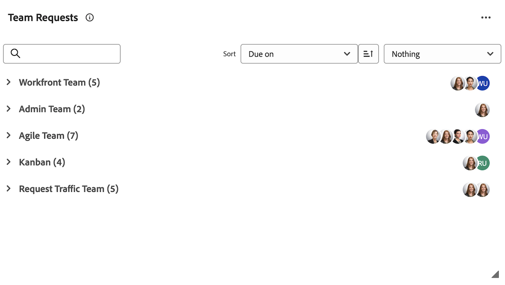

# Hantera arbetsobjekt och teamförfrågningar i [!UICONTROL Home]-området

När arbetsuppgifter och ärenden tilldelas till dig visas de i widgeten Mitt arbete, widgeten Mina uppgifter och widgeten Mina problem.  Du kan visa, arbeta med eller ta bort arbetsposter och förfrågningar.

+++ Expandera om du vill visa åtkomstkrav för funktionerna i den här artikeln.

## Åtkomstkrav

Du måste ha följande åtkomst för att kunna utföra stegen i den här artikeln:

<table style="table-layout:auto"> 
 <col> 
 </col> 
 <col> 
 </col> 
 <tbody> 
  <tr> 
   <td role="rowheader"><strong>[!DNL Adobe Workfront plan*]</strong></td> 
   <td> 
Alla
 </td> 
  </tr> 
  <tr> 
   <td role="rowheader"><strong>[!DNL Adobe Workfront] licens*</strong></td> 
   <td> 
[!UICONTROL Work] eller högre
 </td> 
  </tr> 
  <tr> 
   <td role="rowheader"><strong>Konfigurationer på åtkomstnivå*</strong></td> 
   <td> 
[!UICONTROL Edit] tillgång till uppgifter och ärenden
 
Obs! Om du fortfarande inte har åtkomst frågar du [!DNL Workfront]-administratören om de anger ytterligare begränsningar för din åtkomstnivå. Mer information om hur en [!DNL Workfront]-administratör kan ändra din åtkomstnivå finns i <a href="../../../administration-and-setup/add-users/configure-and-grant-access/create-modify-access-levels.md" class="MCXref xref">Skapa eller ändra anpassade åtkomstnivåer</a>.
 </td> 
  </tr> 
  <tr> 
   <td role="rowheader"><strong>Objektbehörigheter</strong></td> 
   <td> 
Contribute-behörigheter eller högre för de uppgifter och ärenden du behöver arbeta med
 
Mer information om hur du begär ytterligare åtkomst finns i <a href="../../../workfront-basics/grant-and-request-access-to-objects/request-access.md" class="MCXref xref">Begär åtkomst till objekt </a>.
 </td> 
  </tr> 
 </tbody> 
</table>

&#42;Kontakta [!DNL Workfront]-administratören om du vill ta reda på vilken plan, licenstyp eller åtkomst du har.

+++

## Visa en arbetsuppgift i widgeten Mitt arbete

Arbetsobjekt som har tilldelats dig visas i widgeten Mitt arbete i [!UICONTROL Home]. Du kan konfigurera vilka arbetsobjekt som ska visas i widgeten Mitt arbete med hjälp av filtret längst upp i widgeten [!UICONTROL worklist].

Du kan välja filter som visar objekt som du kan arbeta med, eller objekt som du redan arbetar med.

I den här artikeln beskrivs hur du använder filtren i området [!UICONTROL Home] för att visa objekt som du för närvarande arbetar med eller kan överväga att börja arbeta med. Mer information om hur du använder filter i området [!UICONTROL Home] finns i [Visa objekt i [!UICONTROL worklist] i området [!UICONTROL Home] &#x200B;](/help/quicksilver/workfront-basics/using-home/using-the-home-area/display-items-in-home-work-list.md).

Så här visar du ett arbetsobjekt i widgeten Mitt arbete:

1. Klicka på ikonen **[!UICONTROL Main Menu]**  i det övre högra hörnet och klicka sedan på **[!UICONTROL Home]**.
1. (Villkorligt) Klicka på **Anpassa** för att lägga till widgeten **Mitt arbete**.

1. Klicka på ikonen **Filter**  i det övre vänstra hörnet i widgetens arbetslista.

1. Klicka på något eller båda av följande alternativ för uppgifter:

   **[!UICONTROL Ready to Start]:** Visar endast aktiviteter och problem som är klara att starta. Båda följande programsatser måste vara sanna:

   * Aktiviteterna och deras föräldrar har inga föregående aktiviteter eller uppgiftsbegränsningar som hindrar dem från att arbeta.
   * [!UICONTROL Planned Start Date] av aktiviteterna eller problemen har inträffat tidigare eller upp till två veckor i framtiden.

   **[!UICONTROL Not Ready]**: Visar endast aktiviteter och problem som inte är klara att starta än. Någon av följande programsatser måste vara true:

   * Aktiviteterna och deras överordnade kan ha föregångare eller uppgiftsbegränsningar som förhindrar att de bearbetas.
   * Aktiviteterna eller problemen har en [!UICONTROL Planned Start Date] som är mer än två veckor i framtiden.

1. Klicka på **[!UICONTROL Working On]** under [!UICONTROL Tasks] eller [!UICONTROL Issues] om du vill visa uppgifter och problem som du arbetar med just nu.
1. Klicka **[!UICONTROL Requested]** under [!UICONTROL Issues] om du vill visa problem som har begärts från dig (du har tilldelats dem), men som du ännu inte har godkänt för arbete.

## Få åtkomst till en teamförfrågan i widgeten för gruppförfrågningar

Du kan komma åt en begäran som tilldelats ditt team direkt från widgeten för gruppförfrågningar i [!UICONTROL Home]-området. Mer information om gruppförfrågningar finns i [Översikt över gruppförfrågningar](../../../people-teams-and-groups/work-with-team-requests/team-requests-overview.md).

Så här får du åtkomst till en teamförfrågan:

1. Klicka på ikonen **[!UICONTROL Main Menu]**  i det övre högra hörnet och klicka sedan på **[!UICONTROL Home]**.
1. (Villkorligt) Klicka på **Anpassa** för att lägga till widgeten **Gruppförfrågningar**.

   Widgeten visar gruppförfrågningar under grupperingar. Widgeten **[!UICONTROL Team Requests]** visar och visar alla förfrågningar som tilldelats till det team du är i. Mer information om hur du arbetar med teamförfrågningar finns i [Hantera arbets- och teamförfrågningar](../../../people-teams-and-groups/work-with-team-requests/manage-work-and-team-requests.md).

   

## Arbeta med en arbetsuppgift i widgeten Mitt arbete

När du klickar på knappen [!UICONTROL Work On It] anger du för den användare som skickade arbetsposten och för alla andra användare som kan ha tilldelats arbetsposten att du ska börja arbeta.

Så här arbetar du med en arbetsuppgift:

1. Klicka på ikonen **[!UICONTROL Main Menu]**  i det övre högra hörnet och klicka sedan på **[!UICONTROL Home]**.
1. (Villkorligt) Klicka på **Anpassa** för att lägga till widgeten **Mitt arbete**.

1. I området **[!UICONTROL worklist]** i widgeten väljer du den förfrågan du vill arbeta med och klickar sedan på **[!UICONTROL Work On It]**.
1. Håll markören över arbetsobjektet och klicka sedan på ikonen **Sammanfattning** för att visa information om arbetsobjektet.

   

## Ta bort en arbetsuppgift

Om du bestämmer dig för att du inte ska arbeta med arbetsuppgiften kan du ta bort den från listan.

Så här tar du bort en arbetsuppgift:

1. Klicka på ikonen **[!UICONTROL Main Menu]**  i det övre högra hörnet och klicka sedan på **[!UICONTROL Home]**.
1. (Villkorligt) Klicka på **Anpassa** för att lägga till widgeten **Mitt arbete**.

1. Håll markören över arbetsobjektet i widgetens arbetslista och klicka sedan på ikonen **Sammanfattning** för att visa information om arbetsobjektet.
   
1. i avsnittet **Uppdrag** tar du bort ditt namn.
   

<!--
## Reassign a request

1. Click the **[!UICONTROL Main Menu]**  in the upper-right corner, then click **[!UICONTROL Home]**.
1. In the **[!UICONTROL Work List]** area, select the request you want to reassign.

1. Click on the **[!UICONTROL Assignments]** widget and remove yourself from the request, then type the name of the user you want to reassign the request to.

   >[!TIP]
   >
   >If the work request is still in the Ready to Start or Not Ready state, you can use the **[!UICONTROL Reassign]** button in the **[!UICONTROL More]** menu in the [!UICONTROL Work List].\
   >

1. If a task's status is changed to [!UICONTROL New] or [!UICONTROL In Progress] after it was completed, you must unassign the user, save the task, then reassign the user in order for the task to reappear in their Home Work List.

## Reply to a request

You can reply to a request to further clarify the request or to propose a new date.

1. Click the **[!UICONTROL Main Menu]**  in the upper-right corner, then click **[!UICONTROL Home]**.
1. In the **[!UICONTROL Work List]** area, select the request you want to reply to.
1. Locate the individual who assigned the request to you.

   You can find this information on the [!UICONTROL Updates] tab of the task. Make sure the option to **[!UICONTROL Show System Updates]** is enabled.

1. Click **[!UICONTROL Start new update]** and begin typing your reply.
1. Enter the name of the recipient in the **[!UICONTROL Notify]** box, then click **[!UICONTROL Update]**.

   >[!TIP]
   >
   >If the work request is still in the Ready to Start or [!UICONTROL Not Ready] state, you can use the **[!UICONTROL Reply]** button in the **[!UICONTROL More]** menu in the [!UICONTROL Work List].\
   >![[!UICONTROL Reply button]](assets/reassign-in-left-panel-350x204.png)   

   -->
