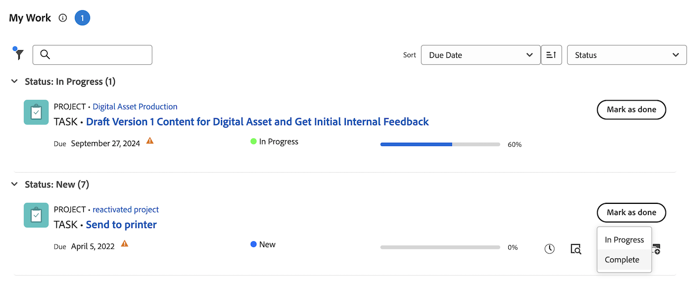

# Markera ett objekt som [!UICONTROL Done] i området [!UICONTROL Home]

Du kan markera en uppgift eller ett problem som Klar om du är den som tilldelats uppgiften eller utgåvan. När du markerar en aktivitet eller ett problem som [!UICONTROL Done] ändras aktivitetens eller problemets status till [!UICONTROL Complete].

>[!NOTE]
>
>Du kan inte se knappen [!UICONTROL Done] om du inte är en av de resurser som har tilldelats uppgiften eller problemet.

+++ Expandera om du vill visa åtkomstkrav för funktionerna i den här artikeln.

## Åtkomstkrav

+++ Expandera om du vill visa åtkomstkrav för funktionerna i den här artikeln. 

<table style="table-layout:auto"> 
 <col> 
 </col> 
 <col> 
 </col> 
 <tbody> 
  <tr> 
   <td role="rowheader"><strong>[!DNL Adobe Workfront package]</strong></td> 
   <td> 
Alla
 </td> 
  </tr> 
  <tr> 
   <td role="rowheader"><strong>[!DNL Adobe Workfront] licens</strong></td> 
   <td> 
   
Standard

   
Arbeta eller högre
 </td> 
  </tr> 
  <tr> 
   <td role="rowheader"><strong>Konfigurationer på åtkomstnivå</strong></td> 
   <td> 
[!UICONTROL Edit] tillgång till uppgifter och ärenden
</td> 
  </tr> 
  <tr> 
   <td role="rowheader"><strong>Objektbehörigheter</strong></td> 
   <td> 
Contribute-behörigheter eller högre för de uppgifter och ärenden du behöver arbeta med
</td> 
  </tr> 
 </tbody> 
</table>

Mer information finns i [Åtkomstkrav i Workfront-dokumentationen](/help/quicksilver/administration-and-setup/add-users/access-levels-and-object-permissions/access-level-requirements-in-documentation.md).

+++

## Markera en arbetsuppgift som Klar i widgeten Mitt arbete

1. Klicka på ikonen **[!UICONTROL Main Menu]**  i det övre högra hörnet och klicka sedan på **[!UICONTROL Home]**.
1. (Villkorligt) Klicka på **Anpassa** för att lägga till widgeten **Mitt arbete**.
1. Sök efter arbetsobjektet och klicka sedan på **[!UICONTROL Mark as Done]** på arbetsobjektet.
Mer information om hur knappen kan visas finns i [Förstå alternativen för knappen [!UICONTROL Done]](#understand-the-options-of-the-done-button).
   

## Markera ett arbetsobjekt som färdigt på sammanfattningspanelen

Du kan markera ett arbetsobjekt som Klar i widgeten Mina uppgifter och Mina problem med hjälp av panelen Sammanfattning.

1. Klicka på ikonen **[!UICONTROL Main Menu]**  i det övre högra hörnet och klicka sedan på **[!UICONTROL Home]**.
1. (Villkorligt) Klicka på **Anpassa** för att lägga till widgetarna **Mina uppgifter** eller **Mina problem**.
1. Håll markören över arbetsobjektet och klicka sedan på ikonen **Sammanfattning** .
   
1. Klicka på **Markera som färdig** längst upp på sammanfattningspanelen.

## Förstå alternativen för knappen [!UICONTROL Done]

Som standard ändras objektets status till [!UICONTROL Done] (för uppgifter) eller [!UICONTROL Complete] (för problem) när du klickar på knappen [!UICONTROL Resolved] för ett arbetsobjekt.

Din [!DNL Adobe Workfront]-administratör kan anpassa vilka statusvärden som är associerade med knappen [!UICONTROL Done] och använda anpassningarna på ditt hemteam.

Beroende på hur många statusvärden som är associerade med knappen [!UICONTROL Done] eller hur många resurser som är tilldelade till aktiviteten eller problemet kan utseendet på knappen [!UICONTROL Done] ändras.

* [[!UICONTROL Done]-knapp associerad med en status](#done-button-associated-with-one-status)
* [Knappen [!UICONTROL Done] som är associerad med flera statusar](#done-button-associated-with-multiple-statuses)
* [[!UICONTROL Done]-knapp för objekt som tilldelats flera resurser](#done-button-for-items-assigned-to-multiple-resources)

### [!UICONTROL Done]-knapp associerad med en status

När knappen [!UICONTROL Done] är kopplad till en status och arbetsobjektet endast är tilldelat dig, läses **[!UICONTROL Done]** in. När du klickar på den ändras aktivitetens eller problemets status till den status som är associerad med knappen [!UICONTROL Done].

Om du vill veta vilken status som är associerad med knappen [!UICONTROL Done] kan du kontrollera [!UICONTROL Team Settings] för ditt hemteam för avsnittet [!UICONTROL Done Button], vilket beskrivs i [Redigera teaminställningar](../../../people-teams-and-groups/create-and-manage-teams/edit-team-settings.md).

Om du inte är tilldelad ett hemteam väljs standardstatus när du klickar på [!UICONTROL Done], vilket beskrivs ovan i [Förstå alternativen för knappen [!UICONTROL Done]](#understand-the-options-of-the-done-button).

### Knappen [!UICONTROL Done] som är associerad med flera statusar

När knappen [!UICONTROL Done] är associerad med mer än en status visar knappen ordet **[!UICONTROL Done]** som följs av en nedrullningsbar meny. I det här scenariot kan du inte bara klicka på [!UICONTROL Done]. Du måste välja en status i listrutan. Välj den status som bäst passar för slutförandet av arbetsuppgiften. Genom att göra detta ändrar du status för arbetsobjektet.

Mer information om hur du kan associera flera statusar med knappen [!UICONTROL Done] finns i [Konfigurera knappen [!UICONTROL Done] för aktiviteter](../../../people-teams-and-groups/create-and-manage-teams/configure-the-done-button-for-tasks.md) och [Konfigurera knappen [!UICONTROL Done] för problem](../../../people-teams-and-groups/create-and-manage-teams/configure-the-done-button-for-issues.md).

### [!UICONTROL Done]-knapp för objekt som tilldelats flera resurser

När aktiviteten eller problemet tilldelas till mer än en resurs visar knappen ordet **[!UICONTROL Done]** som följs av en nedrullningsbar meny. I den nedrullningsbara menyn kan du välja mellan **[!UICONTROL Done with my part]** (vilket gör att teammedlemmarna vet att du är klar med din del av uppgiften) eller den status som är associerad med knappen [!UICONTROL Done] (som slutför objektet). När du har valt **[!UICONTROL Done with my part]** tas arbetsobjektet bort från din arbetslista, men finns kvar i arbetslistan för de som fortfarande är tilldelade arbetsobjektet.\
Om Klar-knappen är kopplad till flera statusar visas de under **Klar med min del**.

>[!NOTE]
>
>När det gäller en uppgift eller ett problem med flera tilldelningar är varje användare ansvarig för att ange att deras egen tilldelning av uppgiften eller utgåvan har slutförts. Därför måste varje tilldelad klicka på [!UICONTROL Done] för att visa att de har slutfört det arbete som tilldelats dem för artikeln.

