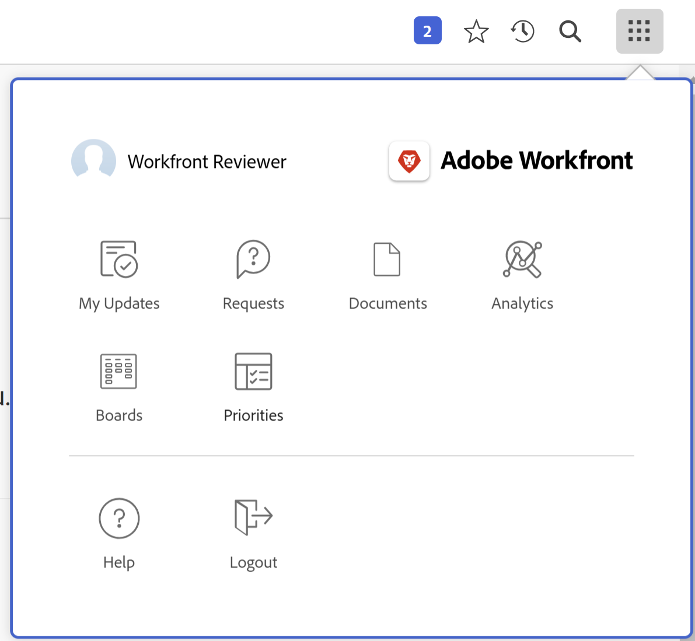
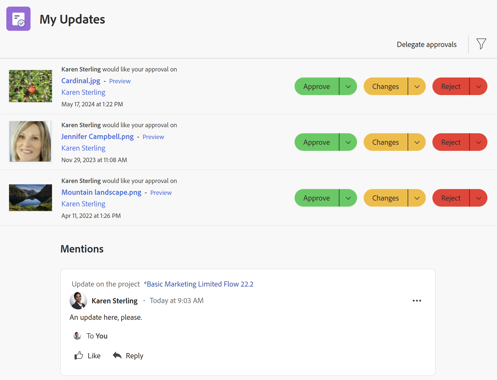
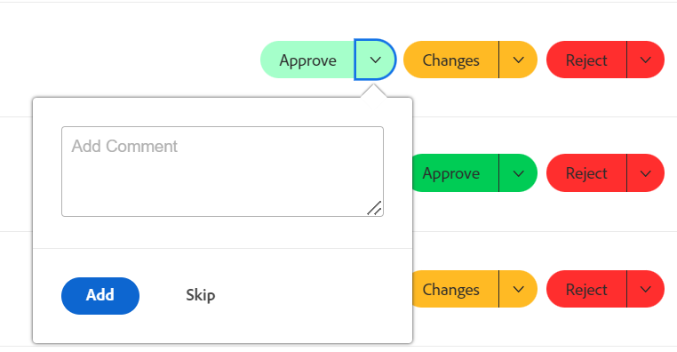
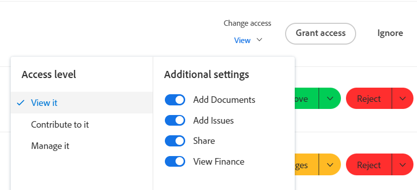

# Använd området [!UICONTROL My Updates]

Du kan använda området [!UICONTROL My Updates] för att snabbt granska godkännanden som väntar på ditt beslut eller konversationer som du har inkluderats i.

Som användare med en [!UICONTROL Review]-licens kan du hitta [!UICONTROL My Updates]-området i [!UICONTROL Main Menu] som standard och [!UICONTROL My Updates]-området är standardlandningssidan för dig.

Mer information om [!DNL Adobe Workfront] licenser finns i [[!DNL Adobe Workfront] licensöversikt](../../../administration-and-setup/add-users/access-levels-and-object-permissions/wf-licenses.md).

Om du har en annan licenstyp än Granska måste [!DNL Workfront]- eller gruppadministratören lägga till området [!UICONTROL My Updates] i layoutmallen för att kunna visa det på huvudmenyn. Mer information finns i [Anpassa [!UICONTROL Main Menu] med en layoutmall](../../../administration-and-setup/customize-workfront/use-layout-templates/customize-main-menu.md).

## Åtkomstkrav

+++ Expandera om du vill visa åtkomstkrav för funktionerna i den här artikeln.

Du måste ha följande åtkomst för att kunna utföra stegen i den här artikeln:

<table style="table-layout:auto"> 
 <col> 
 <col> 
 <tbody> 
  <tr> 
   <td role="rowheader"><strong>[!DNL Adobe Workfront plan]</strong></td> 
   <td> 
Alla
 </td> 
  </tr> 
  <tr> 
   <td role="rowheader"><strong>[!DNL Adobe Workfront] licens*</strong></td> 
   <td> 
Nytt: Medarbetare eller högre

   eller   
   
Aktuell: [!UICONTROL Request] eller högre
 </td> 
  </tr> 
  <tr> 
   <td role="rowheader"><strong>Åtkomstnivåkonfiguration</strong></td> 
   <td> 
Visa åtkomst eller högre till objekt som du har taggat i en konversation eller behöver lösa ett godkännande (Projekt, Åtgärder, Problem, Dokument)
 </td> 
  </tr> 
  <tr> 
   <td role="rowheader"><strong>Objektbehörigheter</strong></td> 
   <td> 
[!UICONTROL View] behörigheter eller högre till projekt, uppgifter, problem, dokument där du är taggad i en konversation eller behöver lösa ett godkännande
 </td> 
  </tr> 
 </tbody> 
</table>

*Kontakta [!DNL Workfront]-administratören om du vill ta reda på vilken plan, licenstyp eller åtkomst du har. Mer information finns i [Åtkomstkrav i Workfront-dokumentation](/help/quicksilver/administration-and-setup/add-users/access-levels-and-object-permissions/access-level-requirements-in-documentation.md).

+++

## Förutsättningar

Du måste ha följande innan du börjar:

* Om du har en annan [!DNL Workfront]-licens än [!UICONTROL Review] måste [!DNL Workfront]- eller gruppadministratören lägga till [!UICONTROL My Updates]-området i [!UICONTROL Main Menu] med hjälp av en layoutmall och tilldela dig till den mallen.

* Granska licensanvändare kan som standard visa området [!UICONTROL My Updates] i sina [!UICONTROL Main Menu].

## Åtkomst till området [!UICONTROL My Updates]

1. Klicka på **[!UICONTROL My Updates]** i **[!UICONTROL Main Menu]**.

   

   Området [!UICONTROL My Updates] öppnas.

   Godkännanden och åtkomstbegäranden som tilldelats dig visas på den första halvan av sidan under **Mina uppdateringar**.

   

1. (Valfritt) Bläddra till nederkanten av området [!UICONTROL My Updates] och klicka på högerpilen för att visa fler godkännanden som visas på ytterligare sidor.

   >[!TIP]
   >
   >De första fem godkännandena eller förfrågningarna om åtkomst visas som standard. Återstående godkännanden visas på ytterligare sidor. Du kan visa högst 2 000 godkännanden i området [!UICONTROL My Updates].

   

1. (Valfritt) Expandera den nedrullningsbara menyn **[!UICONTROL Filter]**  i det övre högra hörnet av avsnittet **[!UICONTROL My Updates]** och välj något av följande:

   <table style="table-layout:auto"> 
    <col> 
    </col> 
    <col> 
    </col> 
    <tbody> 
     <tr> 
      <td role="rowheader"><strong>[!UICONTROL All]</strong></td> 
      <td>Godkännanden som har skickats till dig eller delegerats till dig av en annan användare. Mer information om delegering av godkännanden finns i <a href="../../../review-and-approve-work/manage-approvals/delegate-approval-requests.md" class="MCXref xref">Delegera godkännandebegäran</a>. </td> 
     </tr> 
     <tr> 
      <td role="rowheader"><strong>[!UICONTROL Delegated Approvals]</strong></td> 
      <td>Godkännanden som delegerats till dig av en annan användare. </td> 
     </tr> 
     <tr> 
      <td role="rowheader"><strong>[!UICONTROL My Approvals]</strong></td> 
      <td> 
Godkännanden har skickats till dig. 
 
Mer information om att godkänna objekt finns i <a href="../../../review-and-approve-work/manage-approvals/approving-work.md" class="MCXref xref">Godkänna arbete </a>.
 </td> 
     </tr> 
    </tbody> 
   </table>

1. Så här godkänner eller avvisar du ett objekt eller föreslår ändringar i ett dokument innan du godkänner:

   1. (Valfritt) Klicka på listrutan ****  bredvid ditt godkännandebeslut (**[!UICONTROL Approve]**, **[!UICONTROL Changes]**,**[!UICONTROL Reject]**) och lägg till en kommentar. Klicka sedan på **[!UICONTROL Add]**.

      eller

      Klicka på **[!UICONTROL Skip]** om du inte vill ange en kommentar.

      

      >[!NOTE]
      >
      >Alternativet [!UICONTROL Changes] visas endast för dokumentgodkännanden.

      Beroende på vilken listruteikon du har valt godkänns, avvisas eller, om dokumentet godkänns, godkänns med en begäran om ytterligare ändringar.

      >[!TIP]
      >
      >Om du inte vill lägga till en kommentar till ditt beslut kan du klicka på knappen **[!UICONTROL Approve]**, **[!UICONTROL Reject]** eller **[!UICONTROL Changes]** så beviljas godkännandebeslutet omedelbart.
      >
      >
      >
      >
      >Mer information om hur du godkänner arbete finns i [Godkänna arbete](../../../review-and-approve-work/manage-approvals/approving-work.md).

1. Klicka på **[!UICONTROL Grant access]** för att bevilja den åtkomstbegäran som skickats till dig

   eller

   Expandera den nedrullningsbara menyn **[!UICONTROL Change access]** om du vill ändra den begärda åtkomsten innan du beviljar den.

   

1. (Valfritt) Klicka på **[!UICONTROL Ignore]** för att rensa åtkomstbegäran från din godkännandelista utan att bevilja den.
1. Klicka på **[!UICONTROL Delegate my approvals]** om du vill delegera de godkännanden som skickas till dig om du inte kan fatta några beslut om godkännande under en tid. Mer information om delegering av godkännanden finns i [Delegera godkännandebegäran](../../../review-and-approve-work/manage-approvals/delegate-approval-requests.md).
1. Bläddra till området **[!UICONTROL Mentions]** under dina godkännanden. Här kan du visa alla objekt där du har inkluderats i en konversation.

   

   >[!TIP]
   >
   >De första 50 omnämnandena visas som standard.

1. (Valfritt) Klicka på **[!UICONTROL Show More Updates]** om du vill visa fler omnämnanden.
1. (Valfritt) Klicka på **[!UICONTROL Reply]** om du vill svara på en kommentar och gör något av följande:
   * Börja skriva ett svar
   * Använd verktygsfältet RTF för att formatera text, lägga till länkar, listor, känslolägesikoner, citattecken eller bilder i meddelandet
   * Lägg till användare eller team för att meddela dem ditt svar.

     När du är klar med att lägga till svaret klickar du på **[!UICONTROL Reply]** igen.

     
1. (Valfritt) Klicka på **[!UICONTROL Pin current page]** om du vill fästa området [!UICONTROL My Updates] i den övre navigeringen.
