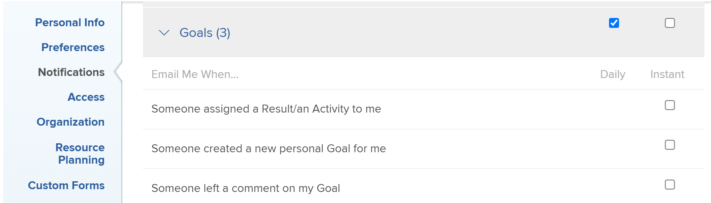

# Meddelanden: Mål

Du kan aktivera e-postmeddelanden för händelser som inträffar i [!DNL Adobe Workfront Goals] i din profil. En användare med en [!UICONTROL Plan]-licens kan även aktivera dem för andra användare. Mer information finns i [[!DNL Adobe Workfront] meddelanden](../../workfront-basics/using-notifications/wf-notifications.md).

## Åtkomstkrav

<!--

(NOTE: because there are conditions for who sees this, I added this from the How To articles/ template although this is not a How To. But I like the format, so I thought keeping it consistent might help users. We may decide to update this when we have access and prereq for overview-type articles)

-->

+++ Expandera om du vill visa åtkomstkrav för funktionerna i den här artikeln. 

<table style="table-layout:auto"> 
 <col> 
 <col> 
 <tbody> 
  <tr> 
   <td role="rowheader"><strong>[!DNL Adobe Workfront package]</strong></td> 
   <td> 
Alla
 </td> 
  </tr> 
  <tr> 
   <td role="rowheader"><strong>[!DNL Adobe Workfront] licens</strong></td> 
   <td>
   
Medarbetare eller högre

    
Begäran eller senare
 </td> 
  </tr> 
  <tr> 
   <td role="rowheader"><strong>Ytterligare produkter</strong></td> 
   <td>[!DNL Workfront Goals] 
Mer information om [!DNL Workfront Goals] finns i <a href="../../workfront-goals/goal-management/wf-goals-overview.md" class="MCXref xref">[!DNL Adobe Workfront Goals] översikt</a>.
 </td> 
  </tr> 
  <tr> 
   <td role="rowheader"><strong>Konfigurationer på åtkomstnivå*</strong></td> 
   <td> 
[!UICONTROL View] behörighet till [!DNL Goals] eller senare
</td> 
  </tr>
 </tbody> 
</table>

Mer information finns i [Åtkomstkrav i Workfront-dokumentationen](/help/quicksilver/administration-and-setup/add-users/access-levels-and-object-permissions/access-level-requirements-in-documentation.md).

+++

## Förutsättningar

* Användaren vars [!DNL Goals]-meddelanden du vill uppdatera måste ha en layoutmall som innehåller området [!DNL Goals] i [!UICONTROL Main Menu].

## [!DNL Goals] meddelanden i området [!UICONTROL user profile]

Meddelandena i följande tabell varnar dig om händelser som inträffar i [!DNL Workfront Goals], t.ex. någon som tilldelar dig ett mål, resultat eller en aktivitet eller någon som gör en uppdatering av ett mål, resultat eller en aktivitet som du äger. Mer information om hur du konfigurerar vilka meddelanden du får finns i [Ändra dina egna e-postmeddelanden](../../workfront-basics/using-notifications/activate-or-deactivate-your-own-event-notifications.md).

>[!NOTE]
>
>Snabbmeddelanden för [!DNL Goals] är inaktiverade som standard. Du kan inte aktivera eller inaktivera dagliga meddelanden och du får inte dagliga sammandrag via e-post för händelserna i den här kategorin. Du kan aktivera eller inaktivera enskilda snabbmeddelanden för kategorin [!DNL Goals].

Se även [Händelsemeddelanden](../../workfront-basics/using-notifications/event-notifications.md).

<table style="table-layout:auto"> 
 <col> 
 <col> 
 <tbody> 
  <tr> 
   <td><strong>Meddelande</strong></td> 
   <td> 
<strong>Fält som ingår</strong> 
 
<strong>*Endast snabbmeddelanden</strong>
 </td> 
  </tr> 
  <tr> 
   <td><strong>Någon tilldelade mig ett resultat/en aktivitet</strong></td> 
   <td> 
Namnet på den person som tilldelade resultatet eller aktiviteten till dig
 
Målets period för resultatet eller aktiviteten
 
Namnet på resultatet eller aktiviteten
 
Knappen <strong>[!UICONTROL Open in web app]</strong> som öppnar panelen [!UICONTROL Goal Details]
 
Knappen <strong>[!UICONTROL Change Notifications Settings]</strong> som gör att du kan hantera dina meddelanden.
 </td> 
  </tr> 
  <tr> 
   <td><strong>Någon har skapat ett nytt personligt mål för mig</strong> </td> 
   <td> 
Namnet på den person som tilldelade målet
 
Målets period
 
Målets namn
 
Knappen <strong>[!UICONTROL Open in web app]</strong> som öppnar panelen [!UICONTROL Goal Details]
 
Knappen <strong>[!UICONTROL Change Notifications Settings]</strong> som gör att du kan hantera dina meddelanden.
 </td> 
  </tr> 
  <tr> 
   <td><strong>Någon lämnade en kommentar om mitt mål</strong></td> 
   <td> 
Namnet på personen som lämnade kommentaren
 
Målets period 
 
Målets namn
 
Texten i kommentaren
 
Knappen <strong>[!UICONTROL Open in web app]</strong> som öppnar panelen [!UICONTROL Goal Details]
 
Knappen <strong>[!UICONTROL Change Notifications Settings]</strong> som gör att du kan hantera dina meddelanden.
 </td> 
  </tr> 
  <tr> 
  </tbody> 
</table>

<!--these were removed at some point: 

   <td><strong>Someone liked my comment on a Goal</strong></td> 
   <td> 
The name of the person who liked the comment
 
The Period of the goal 
 
The name of the goal
 
The text of the comment 
 
The <strong>[!UICONTROL Open in web app]</strong> button which opens the [!UICONTROL Goal Details] panel
 
The <strong>[!UICONTROL Change Notifications Settings]</strong> button which allows you to manage your notifications.
 </td> 
  </tr> 
  <tr> 
   <td><strong>Someone liked an update on my Goal</strong></td> 
   <td> 
You receive an email when someone likes a comment you made on a goal or when you update the progress of your results or activities on the goal. 
 
The name of the person who liked the update
 
The Period of the goal 
 
The name of the goal
 
The <strong>[!UICONTROL Open in web app]</strong> button which opens the [!UICONTROL Goal Details] panel
 
The <strong>[!UICONTROL Change Notifications Settings]</strong> button which allows you to manage your notifications.
 </td> 
  </tr> 
 -->

<!--
NOTE FOR NAME OF GOAL IN LAST TABLE CELL: check this. Is this true? Didn't triggger when this was written; add anything else? Maybe the type of the update is mentioned?!
-->
