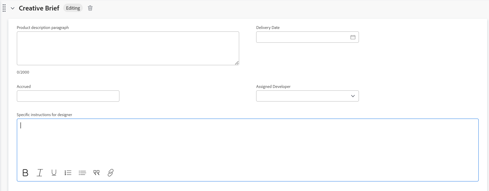

# Redigera information i anpassade formulärfält

{{preview-fast-release-general}}

<!--Audited: 10/2025-->

Du kan redigera information i ett anpassat formulär när formuläret har kopplats till ett objekt. Mer information om hur du lägger till anpassade formulär till objekt finns i [Lägga till ett anpassat formulär till ett objekt](../../workfront-basics/work-with-custom-forms/add-a-custom-form-to-an-object.md).

## Åtkomstkrav

+++ Expandera om du vill visa åtkomstkrav för funktionerna i den här artikeln.

<table style="table-layout:auto"> 
 <col> 
 <col> 
 <tbody> 
  <tr> 
   <td role="rowheader"> 
Adobe Workfront package
 </td> 
   <td>Alla</td> 
  </tr> 
  <tr> 
   <td role="rowheader"> 
Adobe Workfront-licens
 </td> 
   <td> 
Medarbetare eller högre
 
   
Begäran eller senare
 </td> 
  </tr> 
  <tr data-mc-conditions=""> 
   <td role="rowheader">Konfigurationer på åtkomstnivå</td> 
   <td> 
Redigera åtkomst till objektet som du vill redigera det anpassade formuläret för
 </td> 
  </tr> 
  <tr data-mc-conditions=""> 
   <td role="rowheader"> 
Objektbehörigheter
 </td> 
   <td> 
    <ul> 
     <li> 
Contribute eller högre behörigheter för det objekt som du vill redigera det anpassade formuläret för
 </li> 
     <li>
Visa behörigheter för de fält som du vill redigera.
</li> 
     <li>
Redigera behörigheter för de avsnitt i formuläret där fälten som du vill redigera finns
</li> 
    </ul></td> 
  </tr> 
 </tbody> 
</table>

Mer information finns i [Åtkomstkrav i Workfront-dokumentationen](/help/quicksilver/administration-and-setup/add-users/access-levels-and-object-permissions/access-level-requirements-in-documentation.md).

+++

<!--Old:
<table style="table-layout:auto"> 
 <col> 
 <col> 
 <tbody> 
  <tr> 
   <td role="rowheader"> 
Adobe Workfront plan*
 </td> 
   <td>Team or higher</td> 
  </tr> 
  <tr> 
   <td role="rowheader"> 
Adobe Workfront licenses*
 </td> 
   <td> 
Request or higher
 </td> 
  </tr> 
  <tr data-mc-conditions=""> 
   <td role="rowheader">Access level*</td> 
   <td> 
Edit access to the object for which you want to edit the custom form
 
Note: If you still don't have access, ask your Workfront administrator if they set additional restrictions in your access level. For information on how a Workfront administrator can change your access level, see <a href="../../administration-and-setup/add-users/configure-and-grant-access/create-modify-access-levels.md" class="MCXref xref">Create or modify custom access levels</a>.
 </td> 
  </tr> 
  <tr data-mc-conditions=""> 
   <td role="rowheader"> 
Object permissions
 </td> 
   <td> 
    <ul> 
     <li> 
Contribute or higher permissions on the object for which you want to edit the custom form
 </li> 
     <li>View permissions on the fields you want to edit. For information about sharing permissions for custom fields, see <a href="/help/quicksilver/administration-and-setup/customize-workfront/create-manage-custom-forms/form-designer/manage-a-form/share-custom-fields.md" class="MCXref xref">Configure sharing for custom fields and widgets</a>.</li> 
     <li> 
Edit permissions for the sections on the form where the fields you want to edit are located
 </li> 
    </ul> 
For information on requesting additional access for objects, see <a href="../../workfront-basics/grant-and-request-access-to-objects/request-access.md" class="MCXref xref">Request access to objects </a>.
 </td> 
  </tr> 
 </tbody> 
</table>-->

## Förutsättningar

* Din Workfront-administratör eller en plananvändare med administrativ åtkomst till anpassade formulär måste skapa anpassade formulär i din miljö. Mer information finns i [Skapa ett anpassat formulär](/help/quicksilver/administration-and-setup/customize-workfront/create-manage-custom-forms/form-designer/design-a-form/design-a-form.md).
* Du måste ha anpassade formulär kopplade till ett objekt.

  Mer information om hur du använder anpassade formulär för ett objekt finns i [Lägga till ett anpassat formulär för ett objekt](../../workfront-basics/work-with-custom-forms/add-a-custom-form-to-an-object.md).

## Redigera information i ett anpassat formulär

Att redigera information i ett anpassat formulär som är kopplat till ett objekt är identiskt för alla objekt. Mer information om vilka objekt som kan ha ett anpassat formulär finns i [Översikt över anpassade formulär](../../administration-and-setup/customize-workfront/create-manage-custom-forms/custom-forms-overview.md).

1. Gå till ett objekt som du vill redigera information om det anpassade formuläret för.
1. Klicka på **`<Object type>`Information** i den vänstra panelen.

   Om du till exempel redigerar information i ett anpassat projektformulär klickar du på **Projektinformation**.

1. Bläddra till det anpassade formuläret. När det finns ett anpassat formulär kopplat till objektet visas formulärets namn som ett område i informationsavsnittet.
1. Klicka vid behov på pilen  till vänster om namnet på det anpassade formuläret för att expandera det.
1. Klicka på redigeringsikonen  i sidans övre högra hörn.
1. Börja ange information i alla fält som du har åtkomst till.

   

   eller

   Om ingen information har angetts i formuläret ännu klickar du på **Lägg till+** för fält som du har tillgång till och börjar ange information.

   

   Om flera anpassade formulär är kopplade till objektet kan du göra detta för alla formulär.

   Beroende på vilken typ av fält du arbetar i kan du tänka på följande:

   * Du kan bara välja ett alternativ för alternativknappsfält.
   * Du kan välja ett eller flera alternativ i ett kryssrutefält, beroende på hur formulärskaparen konfigurerade fältet.
   * Du kan välja ett eller flera alternativ i ett flervalsfält, beroende på hur formulärskaparen konfigurerade fältet.
   * Du kan bara formatera textfält (fet, kursiv eller understruken) om användaren som skapade formuläret har ställt in dem som ett textfält med fälttypen Formatering. Det går inte att formatera textfält med en rad och textfält för stycken.
   * Du kan bara uppdatera tiden på dagen i en datumfälttyp om användaren som skapade formuläret har inkluderat den när fältet skapades.

   >[!NOTE]
   >
   >Fält som tillåter flera markeringar kan begränsa hur många alternativ du kan välja. Kryssrutor och flervalslistrutor är begränsade till 5 000 markeringar.

   Mer information om alla fälttyper finns i [Skapa ett anpassat formulär](/help/quicksilver/administration-and-setup/customize-workfront/create-manage-custom-forms/form-designer/design-a-form/design-a-form.md).

1. Klicka på **Spara ändringar**.

   >[!IMPORTANT]
   >
   >Du måste fylla i alla obligatoriska fält i formuläret innan du kan spara formuläret. Namnet på ett obligatoriskt fält följs av en asterisk.
   >
   >

   När någon ändrar data i ett annat objekt som refereras av beräknade anpassade fält i objektet, återspeglas inte ändringarna automatiskt i objektet. Mer information om hur du uppdaterar alla beräknade anpassade fält i objektet manuellt finns i [Beräkna om alla beräknade anpassade fält för ett objekt](#recalculate-all-calculated-custom-fields-for-an-object) i den här artikeln.

   När beroende fält på sidan ändras, beräknas beräkningsfält i det anpassade formuläret dynamiskt om i realtid. Du kan se det nya beräknade fältvärdet utan att spara formuläret, men det används inte i själva verket i formuläret och objektet förrän du sparar ändringarna. Detta gäller även beräkningsfält i standardformulär och anpassade formulär.

   Du kan även uppdatera alla beräknade anpassade fält manuellt för ett objekt när du redigerar objektet gruppvis tillsammans med andra objekt i en lista. Instruktioner finns i [Beräkna om alla beräknade anpassade fält för flera objekt i en lista när du redigerar objekten](#recalculate-all-calculated-custom-fields-for-multiple-objects-in-a-list-when-editing-the-objects) i den här artikeln.

## Beräkna om alla beräknade anpassade fält för ett objekt  {#recalculate-all-calculated-custom-fields-for-an-object}

>[!IMPORTANT]
>
>Du måste ha ett eget formulär med beräknade fält kopplade till objektet innan du kan följa stegen i det här avsnittet.

1. Gå till huvudsidan för det objekt vars anpassade fält du vill beräkna om.
1. Klicka på menyn **Mer**  till höger om objektets namn och klicka sedan på **Beräkna om uttryck**.

   Detta beräknar om alla anpassade fält i objektets formulär.

## Beräkna om alla beräknade anpassade fält för flera objekt i en lista när objekten redigeras {#recalculate-all-calculated-custom-fields-for-multiple-objects-in-a-list-when-editing-the-objects}

<!--

(NOTE: this will need to be edited when the bulk edit for objects update in NW)

-->

Beroende på vilka objekt du vill beräkna om de anpassade uttrycken för kan du göra det i följande områden:

* I en lista med objekt går du till menyn Mer längst upp i listan.
* När du markerar och redigerar flera objekt samtidigt i rutan Redigera.

Så här beräknar du manuellt om anpassade fält för flera objekt genom att redigera dem i grupp från en lista eller rapport:

1. Gå till en lista med objekt som innehåller anpassade formulär med beräkningsfält.
1. Markera de objekt vars beräknade anpassade fält du vill uppdatera.
1. Klicka på ikonen **Redigera**.
1. Klicka på **Anpassad Forms** på den vänstra menyn och välj sedan **Beräkna om anpassade uttryck**.
1. Klicka på **Spara** **Ändringar**.

   Workfront beräknar alla anpassade fält för alla markerade objekt.

Så här beräknar du om anpassade uttryck från en objektlista:

1. Gå till en projektlista eller rapport och välj ett eller flera projekt.
1. Klicka på menyn **Mer**  och sedan på **Beräkna om anpassade uttryck**.

Workfront beräknar omedelbart alla anpassade fält för alla valda projekt.
Alla listor med objekt har inte den här funktionen.

>[!NOTE]
>
>Beroende på hur komplexa dina projekt är rekommenderar vi att du inte väljer ett stort antal projekt när du beräknar om beräknade anpassade fält i grupp för att få optimala prestanda. Vissa saker som kan göra ett projekt för komplext kan vara flera beroenden, tilldelningar eller ett stort antal anpassade fält.

