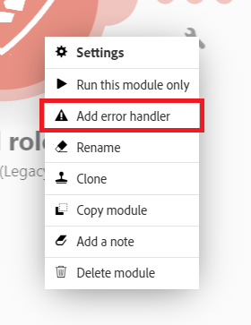

# Felhantering i [!DNL Adobe Workfront Fusion]

>[!IMPORTANT]
>
>Adobe Workfront Fusion-dokumentationen har flyttats till en ny plats.
>
>Informationen i den här artikeln finns nu i artikeln:
>
>* [Lägg till felhantering](https://experienceleague.adobe.com/docs/workfront-fusion/using/create-scenarios/configure-error-handling/error-handling.html)
>
>Uppdatera eventuella bokmärken.
>
>Artikeln uppdateras inte längre och kommer att tas bort inom den närmaste framtiden.

När fel inträffar under körningen av ett scenario beror det oftast på att en tjänst inte är tillgänglig på grund av ett fel, att en tjänst svarar med oväntade data eller att valideringen av indata misslyckas.

Om en modul genererar ett fel under scenariokörningen och det inte finns någon felhanteringsväg kopplad till modulen, körs standardfelhanteringslogiken, vilket beskrivs i [Felbearbetning i [!DNL Adobe Workfront Fusion]](../../workfront-fusion/errors/error-processing.md).

Genom att lägga till en felhanterarväg till en modul kan du ersätta standardfelhanteringslogiken med din egen. [!DNL Adobe Workfront Fusion] erbjuder fem olika direktiv som kan infogas i slutet av felhanteringsrutterna.

Mer information finns i [Direktiv om felhantering i [!DNL Adobe Workfront Fusion]](../../workfront-fusion/errors/directives-for-error-handling.md).

## Åtkomstkrav

Du måste ha följande åtkomst för att kunna använda funktionerna i den här artikeln:

<table style="table-layout:auto">
 <col> 
 <col> 
 <tbody> 
  <tr> 
   <td role="rowheader">[!DNL Adobe Workfront] plan*</td> 
   <td> 
[!DNL Pro] eller högre
 </td> 
  </tr> 
  <tr data-mc-conditions=""> 
   <td role="rowheader">[!DNL Adobe Workfront] licens*</td> 
   <td> 
[!UICONTROL Plan], [!UICONTROL Work]
 </td> 
  </tr> 
  <tr> 
   <td role="rowheader">[!UICONTROL Adobe Workfront Fusion] licens**</td> 
   <td>
   
Aktuellt licenskrav: Inget [!DNL Workfront Fusion]-licenskrav.

   
eller

   
Gammalt licenskrav: [!UICONTROL [!DNL Workfront Fusion] för Automatisering och integrering av arbetet] 

   </td> 
  </tr> 
  <tr> 
   <td role="rowheader">Produkt</td> 
   <td>
   
Aktuellt produktkrav: Om du har planen [!UICONTROL Select] eller [!UICONTROL Prime] [!DNL Adobe Workfront] måste din organisation köpa både [!DNL Adobe Workfront Fusion] och [!DNL Adobe Workfront] för att kunna använda de funktioner som beskrivs i den här artikeln. [!DNL Workfront Fusion] ingår i planen [!UICONTROL Ultimate] [!DNL Workfront].

   
eller

   
Äldre produktkrav: Din organisation måste köpa [!DNL Adobe Workfront Fusion] och [!DNL Adobe Workfront] för att kunna använda de funktioner som beskrivs i den här artikeln.

   </td> 
  </tr> 
 </tbody> 
</table>

Kontakta [!DNL Workfront]-administratören om du vill ta reda på vilken plan, licenstyp eller åtkomst du har.

Mer information om [!DNL Adobe Workfront Fusion] licenser finns i [[!DNL Adobe Workfront Fusion] licenser](../../workfront-fusion/get-started/license-automation-vs-integration.md).

## Felhanterarflöde

Så här lägger du till en felhanterarväg i en modul:

1. Högerklicka på modulen och välj **[!UICONTROL Add error handler]**:

   

   I modulen visas en lista med direktiv samt de program som används i ditt scenario.

1. Om modulen som du har lagt till en felhanterare i är den sista modulen i ditt flöde väljer du ett av direktiven.

   eller

   Lägg till en eller flera moduler i felhanterarflödet.

   Om du lägger till fler moduler i flödet används direktivet [!UICONTROL Ignore] som standard, och om ett fel inträffar bearbetas efterföljande moduler på det flödet.

>[!INFO]
>
>I det här exemplet, om ett fel inträffar när modulen [!UICONTROL Create a folder] körs, kommer direktivet [!UICONTROL Ignore] att tillämpas automatiskt och scenariot flyttas till nästa modul i felhanterarvägen.
>
>Om det inte finns något fel flyttas scenariot till [!UICONTROL List all files in a folder module] på den vanliga vägen.
>
>

Observera att en felhanterarväg består av genomskinliga cirklar, medan en vanlig väg består av heldragna cirklar.

## Felhanteringsdirektiv

Direktiven förklaras kortfattat nedan. Mer information finns i [Direktiv om felhantering i [!DNL Adobe Workfront Fusion]](../../workfront-fusion/errors/directives-for-error-handling.md).

Det finns totalt fem direktiv som kan grupperas i följande kategorier baserat på om ett scenario ska fortsätta eller inte.

Följande direktiv ser till att en scenariokörning fortsätter:

* **[!UICONTROL Resume]**: Gör att du kan ange en ersättningsutmatning för modulen med felet. Scenariots körningsstatus har markerats som Slutfört
* **[!UICONTROL Ignore]**: ignorerar felet. Scenariots körningsstatus har markerats som Slutfört
* **[!UICONTROL Break]**: Lagrar indata till kön med ofullständiga körningar. Scenariots körningsstatus är markerad som varning. Mer information finns i [Visa och lösa ofullständiga körningar i [!DNL Adobe Workfront Fusion]](../../workfront-fusion/scenarios/view-and-resolve-incomplete-executions.md).

Om en scenariokörning ska stoppas när ett fel inträffar, ska du använda något av följande direktiv:

* **[!UICONTROL Rollback]**: Stoppar scenariokörningen omedelbart och anger dess status som fel
* **[!UICONTROL Commit]**: Stoppar scenariokörningen omedelbart och anger att den har lyckats

Mer information om felhantering finns i:

* [Direktiv för felhantering i  [!DNL Adobe Workfront Fusion]](../../workfront-fusion/errors/directives-for-error-handling.md)
* [Avancerad felhantering i [!DNL Adobe Workfront Fusion]](../../workfront-fusion/errors/advanced-error-handling.md)