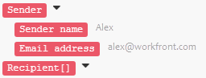

# Mappa information från en modul till en annan i [!DNL Adobe Workfront Fusion]

Mappning är processen att tilldela en moduls utdata, strukturerade till objekt, till en annan moduls indatafält.

Mappningspanelen visas när du klickar på ett fält där du vill infoga ett värde från en föregående modul i ett scenario. I en modul kan du, i alla fält som är tillgängliga för mappning, skapa en formel med valfri kombination av funktioner och mappade objekt från mappningspanelen med statisk text som du skriver. Dessa element kan kapslas i varandra.

## Åtkomstkrav

Du måste ha följande åtkomst för att kunna använda funktionerna i den här artikeln:

<table style="table-layout:auto">
 <col> 
 <col> 
 <tbody> 
  <tr> 
    <td role="rowheader">[!DNL Adobe Workfront] plan*</td> 
   <td> 
[!DNL Pro] eller högre
 </td> 
  </tr> 
  <tr data-mc-conditions=""> 
   <td role="rowheader">[!DNL Adobe Workfront] licens*</td> 
   <td> 
[!UICONTROL Plan], [!UICONTROL Work]
 </td> 
  </tr> 
  <tr> 
   <td role="rowheader">[!UICONTROL Adobe Workfront Fusion] licens**</td> 
   <td>
   
Aktuellt licenskrav: Nej [!DNL Workfront Fusion] krav på licens.

   
eller

   
Gammalt licenskrav: [!UICONTROL [!DNL Workfront Fusion] för automatisering och integrering av arbetet] 

   </td> 
  </tr> 
  <tr> 
   <td role="rowheader">Produkt</td> 
   <td>
   
Aktuellt produktbehov: Om du har [!UICONTROL Select] eller [!UICONTROL Prime] [!DNL Adobe Workfront] Planera, din organisation måste köpa [!DNL Adobe Workfront Fusion] och [!DNL Adobe Workfront] om du vill använda de funktioner som beskrivs i den här artikeln. [!DNL Workfront Fusion] ingår i [!UICONTROL Ultimate] [!DNL Workfront] plan.

   
eller

   
Krav för äldre produkter: Din organisation måste köpa [!DNL Adobe Workfront Fusion] och [!DNL Adobe Workfront] om du vill använda de funktioner som beskrivs i den här artikeln.

   </td> 
  </tr> 
 </tbody> 
</table>

Kontakta din [!DNL Workfront] administratör.

För information om [!DNL Adobe Workfront Fusion] licenser, se [[!DNL Adobe Workfront Fusion] licenser](../../workfront-fusion/get-started/license-automation-vs-integration.md).

## Paket och artiklar

Funktionen för en modul ger noll, ett eller flera paket som utdata. Ett paket består av ett eller flera objekt.

Så här utforskar du en moduls utdata:

1. Klicka **[!UICONTROL Run once]** för att köra modulen.
1. Klicka på bubblan ovanför modulen.

   En logg som innehåller alla modulens faser visas. Du kan hitta paketet eller paketen som matas ut av en moduls operationsfas under **[!UICONTROL Output]** rubrik. Varje paket innehåller dess objekt och varje objekts värden.

>[!INFO]
>
>**Exempel:** I det här exemplet visas modulen [!UICONTROL Email] > [!UICONTROL Watch emails]. Du kan se att den utförde 1 åtgärd som producerade ett enda paket som innehåller olika objekt, som `Date`, `Email ID (UID)`, `size`och så vidare.
>
>

>[!NOTE]
>
>Utdata från moduler som omsluts mellan en [!UICONTROL Iterator] och [!UICONTROL Aggregator] är inte tillgängliga utanför [!UICONTROL Aggregator] -modul.

## Mappa ett objekt

När du har skapat en sekvens med moduler genom att länka två eller flera av dem, kan varje modul bearbeta värden för objekt som matats ut av modulerna som föregår den.

Så här tilldelar du objekt till indatafält för en modul:

1. Klicka på den modul som ska bearbeta utdata från föregående modul eller moduler.
1. Klicka i ett fält på panelen Modulinställningar där du vill använda värdet för ett objekt som skapats från en eller flera tidigare moduler.

   Mappningspanelen öppnas.

1. Klicka på ett objekt på mappningspanelen för att infoga det i fältet.
1. (Valfritt) Om du vill söka efter ett visst fält på mappningspanelen klickar du på mappningspanelens sökfält och skriver in den term du vill söka efter. Klicka på fältet när det visas i listan.

   Sökresultaten innehåller söktermen och är inte skiftlägeskänsliga.

Mer information finns i [Konfigurera en moduls inställningar i [!DNL Adobe Workfront Fusion]](../../workfront-fusion/modules/configure-a-modules-settings.md).

## Formler

Du kan mappa flera objekt till ett fält, kombinera dem med litteraler (fasta värden) och använda operatorer och funktioner för att skapa komplexa formler:

Du hittar funktionerna och operatorerna på mappningspanelen under någon av dess flikar.

Den första fliken  (visas när panelen öppnas) visar objekt som du kan mappa från andra moduler.

De andra flikarna innehåller följande typer av funktioner:

* **Allmänna funktioner**  - Se [Allmänna funktioner i [!DNL Adobe Workfront Fusion]](../../workfront-fusion/functions/general-functions.md) för mer information.

* **Matematiska funktioner**  - Se [Matematiska funktioner i [!DNL Adobe Workfront Fusion]](../../workfront-fusion/functions/math-functions.md) för mer information.

* **Text- och binärfunktioner**  - Se [Strängfunktioner i [!DNL Adobe Workfront Fusion]](../../workfront-fusion/functions/string-functions.md) för mer information.

* **Datum och tid**  - Se [Datum- och tidsfunktioner i [!DNL Adobe Workfront Fusion]](../../workfront-fusion/functions/date-and-time-functions.md) och artiklarna nedan för mer information.

   * [Token för datum- och tidsformatering i [!DNL Adobe Workfront Fusion]](../../workfront-fusion/functions/tokens-for-date-and-time-formatting.md)
   * [Token för datum- och tidsanalys i Adobe Workfront Fusion](../../workfront-fusion/functions/tokens-for-date-and-time-parsing.md)

* **Funktioner för att arbeta med arrayer**  - Se [Array-funktioner i [!DNL Adobe Workfront Fusion]](../../workfront-fusion/functions/array-functions.md) för mer information.

>[!TIP]
>
>När du skapar en komplex formel som du vill återanvända i ett annat fält kan du klicka på fältet som innehåller kombinationen, använda Kommando-A eller Ctrl-A för att markera den och sedan kopiera och klistra in den i det andra fältet.

Mer information om hur du mappar objekt med funktioner finns i [Mappa objekt med funktioner i [!DNL Adobe Workfront Fusion]](../../workfront-fusion/functions/map-using-functions.md).

## Samlingar

Vissa objekt kan innehålla flera värden av olika typer. Det här är samlingstypsobjekt.

Du kan identifiera [!UICONTROL collection] textobjekt av den lilla svarta rektangeln som visas till höger om objektets etikett och dess automatiskt utökade lista över underobjekt:

>[!NOTE]
>
>I de flesta fall mappar du samlingens underobjekt i stället för det objekt som representerar hela samlingen.

Mer information om samlingar finns i [Artikeldatatyper i [!UICONTROL Adobe Workfront Fusion]](../../workfront-fusion/mapping/item-data-types.md)

## Arrayer

Vissa objekt kan innehålla flera element av samma typ. Detta är arraytypsobjekt.

Du kan identifiera ett arraytypobjekt med hakparenteser i slutet av objektets etikett. Klicka på den lilla svarta rektangeln till höger om objektets etikett för att visa elementets objekt:

Mer information om arrayer finns i [Artikeldatatyper i [!DNL Adobe Workfront Fusion]](../../workfront-fusion/mapping/item-data-types.md)

### Mappa en arrays första element

Om du mappar en arrays `Recipient name` -objektet, visas i fältet så här:

Siffran inom hakparenteser är ett index som bestämmer vilket element i arrayen som ska användas. Som standard är den inställd på 1.

### Mappa en arrays n:te element

Om du vill komma åt ett annat element klickar du på hakparenteserna och redigerar indexvärdet:

### Mappa ett arrayelement med en given nyckel

Vissa arrayer innehåller flera samlingar med nyckel- och värdeobjekt. Dessa är vanligtvis olika metadata, attribut och så vidare.

I följande exempel visas utdata för [!DNL Jira] App.

I det här exemplet får vi ett filnamn från en array med bilagor för den specifika bilagan med ID 10108.

Utdata från [!DNL Jira] ser ut så här:

Det typiska kravet är att söka efter ett element med dess angivna nyckelvärde och hämta motsvarande värde från värdeobjektet. Detta kan uppnås med en formel som innehåller en kombination av `map()` och `get()` funktioner.

Här följer en detaljerad beskrivning av formeln:

1. Den första parametern i `map()` function är hela arrayobjektet.
1. Den andra parametern är värdobjektets raw-namn. Om du vill få Raw-namnet för du pekaren över objektet i dialogrutan [!UICONTROL mapping] panel:

   

   >[!NOTE]
   >
   >Alla parametrar är versalkänsliga. Även om objektets etikett i det här exemplet skiljer sig från dess Raw-namn endast med versaler, är det nödvändigt att använda raw-namnet, som alla är gemener i motsats till etikettvärdet.

1. Den tredje parametern är nyckelobjektets raw-namn:

   

1. Den fjärde parametern är det angivna nyckelvärdet.

På grund av `map()` funktionen returnerar en array (eftersom det kan finnas fler element med det angivna nyckelvärdet), måste du använda `get()` funktion för att hämta dess första element:

* Den första parametern i `get()` -funktionen är resultatet av `map()` funktion.

* Den andra parametern är elementets index - ett.

Mer information om `map()` funktion, se [Array-funktioner i [!DNL Adobe Workfront Fusion]](../../workfront-fusion/functions/array-functions.md).

Mer information om `get()` funktion, se [Allmänna funktioner i [!DNL Adobe Workfront Fusion]](../../workfront-fusion/functions/general-functions.md).

## Konvertera element till en serie paket

Arrayer kan konverteras till en serie paket med [!UICONTROL Iterator] -modul. Mer information finns i [[!UICONTROL Iterator] modulen i [!UICONTROL Adobe Workfront Fusion]](../../workfront-fusion/modules/iterator-module.md).

## Felsökning

### Saknade objekt på mappningspanelen

För varje modul visar mappningspanelen alla utdataobjekt, som anges av modulens författare. I vissa fall är listan ofullständig av olika anledningar och vissa objekt kanske saknas. [!DNL Workfront Fusion] kan automatiskt identifiera saknade utdataobjekt när du kör modulen i scenarioredigeraren. Den exakta proceduren varierar något beroende på modulens typ:

#### Direktutlösare

1. Högerklicka på modulen och klicka sedan på **[!UICONTROL Run this module only]** på menyn som visas.

   Om det inte finns några webhooks i kö väntar modulen på att en ny webkrok ska bearbetas.

1. Skapa en webkrok.

   Till exempel webbkrokmodulen **[!DNL Slack]>[!UICONTROL Listen for new events]** (som letar efter nya kanalmeddelanden i en kanal) skickar ett meddelande till kanalen.

1. När modulen är klar klickar du på bubblan ovanför modulen för att utforska dess fullständiga utdata.

   Mappningspanelen innehåller alla objekt som upptäcktes i modulens utdata.

#### Avsökningsutlösare

1. Högerklicka på modulen och klicka sedan på **[!UICONTROL Run this module only]** på menyn som visas.
1. Om det inte finns några utdata klickar du på **[!UICONTROL Choose where to start]** och justera inställningarna.
1. Om det inte finns någon händelse att bearbeta skapar du en och går tillbaka till steg 2.

   Till exempel webbkrokmodulen **[!UICONTROL Gmail]>[!UICONTROL Watch emails]** skickar ett e-postmeddelande till den mapp som modulen tittar på.

1. När modulen är klar klickar du på bubblan ovanför modulen för att utforska dess fullständiga utdata.

   Mappningspanelen innehåller nu alla objekt som upptäcktes i modulens utdata.

#### Andra moduler

Du kan välja att köra:

* Hela scenariot (eller bara den del som innehåller modulen)

  Om ditt scenario börjar med en utlösare, se [Direktutlösare](#instant-trigger) eller [Avsökningsutlösare](#polling-trigger) ovan.

* Bara en modul

Om du väljer att bara köra en enda modul:

1. Högerklicka på modulen och klicka sedan på **[!UICONTROL Run this module only]** på menyn som visas.
1. Ange exempelvärden för indataobjekten och klicka sedan på **[!UICONTROL OK]** .
1. När modulen är klar klickar du på bubblan ovanför modulen för att utforska dess fullständiga utdata.

   Mappningspanelen innehåller nu alla objekt som upptäcktes i modulens utdata.
