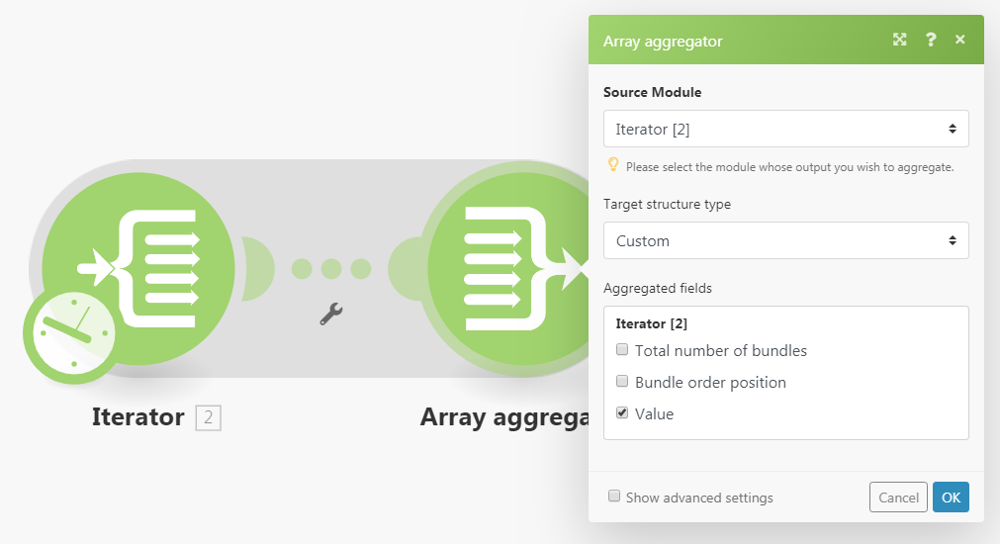
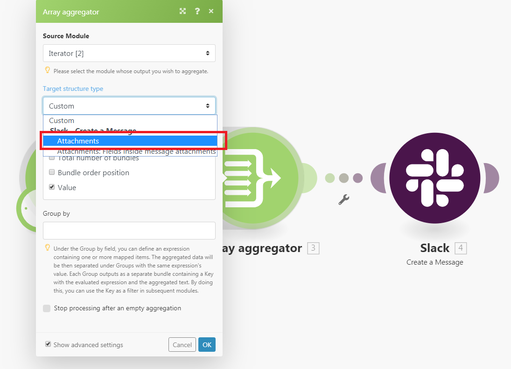
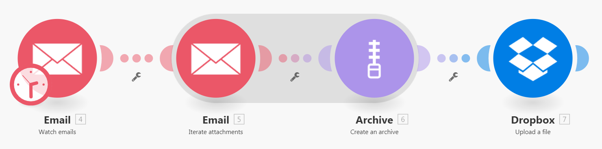
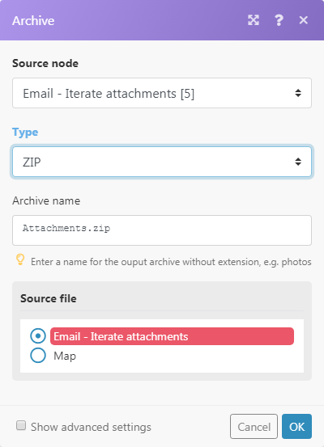

# [!UICONTROL Aggregator] modulen i [!DNL Adobe Workfront Fusion]

En aggregeringsmodul är en typ av modul som utformats för att sammanfoga flera datapaket till ett enda paket.

Mer information om modultyper finns i [Typer av moduler](../../workfront-fusion/modules/module-types.md).

## Åtkomstkrav

Du måste ha följande åtkomst för att kunna använda funktionerna i den här artikeln:

<table style="table-layout:auto">
 <col> 
 <col> 
 <tbody> 
  <tr> 
    <td role="rowheader">[!DNL Adobe Workfront] plan*</td> 
   <td> 
[!DNL Pro] eller högre
 </td> 
  </tr> 
  <tr data-mc-conditions=""> 
   <td role="rowheader">[!DNL Adobe Workfront] licens*</td> 
   <td> 
[!UICONTROL Plan], [!UICONTROL Work]
 </td> 
  </tr> 
  <tr> 
   <td role="rowheader">[!UICONTROL Adobe Workfront Fusion] licens**</td> 
   <td> 
[!UICONTROL [!DNL Workfront Fusion] för automatisering och integrering av arbetet] 
  </td> 
  </tr> 
  <tr> 
   <td role="rowheader">Produkt</td> 
   <td>Din organisation måste köpa [!DNL Adobe Workfront Fusion] och [!DNL Adobe Workfront] om du vill använda de funktioner som beskrivs i den här artikeln.</td> 
  </tr> 
 </tbody> 
</table>

Kontakta [!DNL Workfront] administratör.

För information om [!DNL Adobe Workfront Fusion] licenser, se [[!DNL Adobe Workfront Fusion] licenser](../../workfront-fusion/get-started/license-automation-vs-integration.md).

## [!UICONTROL Aggregator] modul

När en [!UICONTROL Aggregator] -modulen körs, den gör följande:

* Ackumulerar alla paket som tas emot under en enda källmoduls åtgärd.
* Ger ett paket med en array som innehåller ett objekt per ackumulerat paket. Innehållet i arrayens objekt beror på [!UICONTROL Aggregator] och dess inställningar.

Följande bild visar en typisk inställning för [!UICONTROL Aggregator] module :

<table style="table-layout:auto">
 <col> 
 <col> 
 <tbody> 
  <tr> 
   <td> 
[!UICONTROL Source Module]
 </td> 
   <td> 
Modulen från vilken paketaggregeringen börjar. Källmodulen är vanligtvis en iterator eller en sökmodul som matar ut en serie paket. När du ställer in aggregatorns källmodul (och stänger aggregatorns inställning), kommer rutten mellan källmodulen och aggregatormodulen att kapslas in i ett grått område så att du tydligt kan se början och slutet av aggregeringen. 
   
 
Mer information om iteratorer finns i <a href="../../workfront-fusion/modules/iterator-module.md" class="MCXref xref">[!UICONTROL Iterator] modulen i [!DNL Adobe Workfront Fusion]</a>
 
Mer information om sökmoduler finns i sökmodulerna i <a href="../../workfront-fusion/modules/module-types.md" class="MCXref xref">Typer av moduler</a>.
 </td> 
  </tr> 
  <tr> 
   <td> 
[!UICONTROL Target structure type]
 </td> 
   <td> 
(Gäller endast för [!UICONTROL Array aggregator] modul.) Den målstruktur i vilken data ska aggregeras. Standardalternativet, [!UICONTROL Custom]gör att du kan välja objekt som ska läggas samman i A[!UICONTROL rray aggregator]'s output bundle's <code>Array </code>objekt:
 
  
 
När du har anslutit fler moduler efter [!UICONTROL Array aggregator] och återgå till modulens konfiguration, [!UICONTROL Target] listrutan med strukturtyper innehåller alla följande moduler och deras fält som är av typen Array med samlingar, vilket visas i [!UICONTROL Attachments] fält för [!DNL Slack] &gt;[!UICONTROL Create a Message] modul:
 
  
 </td> 
  </tr> 
  <tr> 
   <td>[!UICONTROL Aggregated fields]</td> 
   <td>Markera de fält som du vill inkludera i aggregeringsmodulens utdata.</td> 
  </tr> 
  <tr> 
   <td> 
[!UICONTROL Group by]
 </td> 
   <td> 
Aggregatorns utdata kan delas upp i flera grupper med hjälp av [!UICONTROL Group by] fält. The [!UICONTROL Group by] kan innehålla en formel som utvärderas för varje aggregators indatapaket. Aggregeringsvärdet genererar sedan ett paket per värde för varje distinkt formel. Varje paket innehåller två objekt:
 
    <ul> 
     <li><code>Key </code>innehåller det distinkta värdet.</li> 
     <li><code>Array </code>innehåller aggregerade data från de paket för vilka formeln utvärderades för <code>Key </code>värde.</li> 
    </ul> </td> 
  </tr> 
  <tr> 
   <td> 
Stoppa bearbetning efter en tom aggregering
 </td> 
   <td> 
Som standard är [!UICONTROL Aggregator] returnerar aggregeringsresultatet även om inga paket har nåtts [!UICONTROL Aggregator] -modul (till exempel eftersom de har filtrerats bort på väg). Om alternativet [!UICONTROL Stop processing after an empty aggregation] är aktiverat, [!UICONTROL Aggregator] i det här fallet skapas inga utdatapaket och flödet stoppas.
 </td> 
  </tr> 
 </tbody> 
</table>

>[!NOTE]
>
>Paket som genereras av moduler mellan källmodulen och [!UICONTROL Aggregator] modulen skrivs inte ut av [!UICONTROL Aggregator] så att de inte är tillgängliga för modulerna i flödet efter [!UICONTROL Aggregator]. Om du behöver data från ett paket som skapats av en modul mellan källmodulen och [!UICONTROL Aggregator] ska du se till att inkludera det angivna objektet i [!UICONTROL Aggregator] modulens inställningar (som i [!UICONTROL Aggregated fields] i inställningarna för [!UICONTROL Array aggregator] modul).

>[!INFO]
>
>**Exempel:** Användningsfall: Zippa alla e-postbilagor och ladda upp ZIP till [!DNL Dropbox]
>
>Scenariot nedan visar hur man gör:
>
>* Titta på en postlåda för inkommande e-post: [!UICONTROL Email] >[!UICONTROL Watch emails] utlösaren returnerar ett paket med objektet `Attachments[]`, som är en array som innehåller alla e-postbilagor.
>
>* Ange e-postmeddelandets bilagor: [!UICONTROL Email] >[!UICONTROL Iterate attachments] iteratorn tar objekt från `Attachments[]` matris en i taget och skickar dem vidare som separata paket.
>
>* Sammanställ de paket som levereras av [!UICONTROL Email] >[!UICONTROL Iterate attachments] modul: [!UICONTROL Archive] >[!UICONTROL Create an archive aggregator] samlar alla paket som den tar emot och producerar ett enda paket som innehåller ZIP-filen.
>
>* Överför den resulterande ZIP-filen till [!DNL Dropbox]: [!DNL Dropbox] > [!UICONTROL Upload a file] hämtar ZIP-filen från [!UICONTROL Archive] > [!UICONTROL Create an archive] modulen och överför den till [!DNL Dropbox].
>
>
>
>Nedan visas ett exempel på hur [!UICONTROL Archive] > [!UICONTROL Create an archive] aggregator:
>
>
