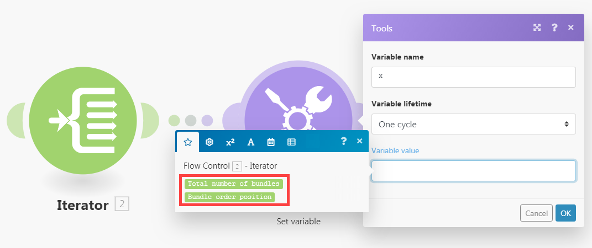
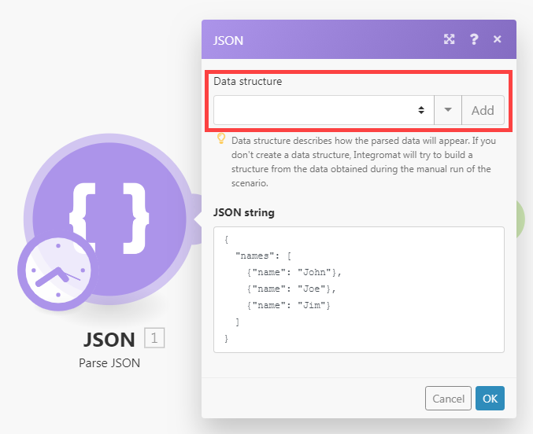
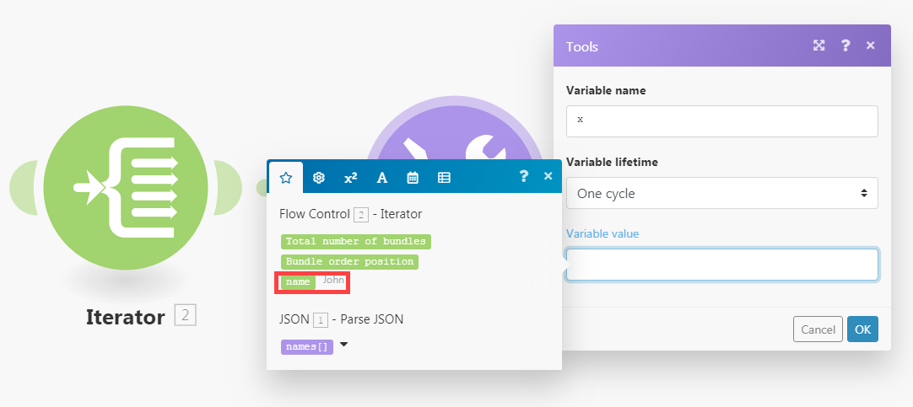

# [!UICONTROL Iterator] modulen i [!DNL Adobe Workfront Fusion]

An [!UICONTROL Iterator] är en särskild typ av modul som konverterar en array till en serie paket. Varje arrayobjekt genereras som ett separat paket.

Mer information finns i [Typer av moduler](../../workfront-fusion/modules/module-types.md) och [Mappa en array i Adobe Workfront Fusion](../../workfront-fusion/mapping/map-an-array.md).

## Åtkomstkrav

Du måste ha följande åtkomst för att kunna använda funktionerna i den här artikeln:

<table style="table-layout:auto">
 <col> 
 <col> 
 <tbody> 
  <tr> 
    <td role="rowheader">[!DNL Adobe Workfront] plan*</td> 
   <td> 
[!DNL Pro] eller högre
 </td> 
  </tr> 
  <tr data-mc-conditions=""> 
   <td role="rowheader">[!DNL Adobe Workfront] licens*</td> 
   <td> 
[!UICONTROL Plan], [!UICONTROL Work]
 </td> 
  </tr> 
  <tr> 
   <td role="rowheader">[!UICONTROL Adobe Workfront Fusion] licens**</td> 
   <td> 
[!UICONTROL [!DNL Workfront Fusion] för automatisering och integrering av arbetet] 
  </td> 
  </tr> 
  <tr> 
   <td role="rowheader">Produkt</td> 
   <td>Din organisation måste köpa både Adobe Workfront Fusion och Adobe Workfront för att kunna använda de funktioner som beskrivs i den här artikeln.</td> 
  </tr> 
 </tbody> 
</table>

Kontakta Workfront-administratören om du vill veta vilken plan, licenstyp eller åtkomst du har.

För information om [!DNL Adobe Workfront Fusion] licenser, se [[!DNL Adobe Workfront Fusion] licenser](../../workfront-fusion/get-started/license-automation-vs-integration.md).

## [!UICONTROL Iterator] modulkonfiguration

Du skapar en [!UICONTROL Iterator] -modulen på samma sätt som du konfigurerar andra moduler. The [!UICONTROL Array] fältet innehåller den array som ska konverteras eller delas upp i separata paket.

Mer information finns i [Konfigurera en moduls inställningar i Adobe Workfront Fusion](../../workfront-fusion/modules/configure-a-modules-settings.md).

>[!INFO]
>
>**Exempel:**
>
>* I scenariot nedan visas hur du hämtar e-postmeddelanden med bilagor och sparar de bifogade filerna som enskilda filer i ett valt [!DNL Dropbox] mapp.
   >
   >   E-postmeddelanden kan innehålla en array med bilagor. The [!UICONTROL Iterator] som infogats efter den första modulen gör att du kan hantera varje bifogad fil separat. The [!UICONTROL Iterator] delar upp arrayen med bilagor i enskilda paket. Varje paket, med en bifogad fil, sparas sedan en i taget i ett markerat [!DNL Dropbox] mapp. The [!UICONTROL Iterator] moduluppsättningen visas ovan: den [!UICONTROL Array] fältet ska innehålla `Attachments` array.
   >
   >   
>
>* För enkelhetens skull: [!DNL Workfront Fusion] appar erbjuder specialiserad [!UICONTROL Iterator] moduler med förenklad konfiguration. Till exempel [!UICONTROL Email] -appen innehåller [!UICONTROL Iterator] modul [!UICONTROL Email] > [!UICONTROL Iterate attachments] som ger samma resultat som [!UICONTROL Iterator] -modul.
   >
   >   

## Felsökning: Mappningspanelen visar inte mappningsbara objekt under [!UICONTROL Iterator] modul

När en [!UICONTROL Iterator] modulen saknar information om strukturen för arrayens objekt, mappningspanelen i modulerna efter [!UICONTROL Iterator] modulen visar endast två objekt under [!UICONTROL Iterator] module :`Total number of bundles` och `Bundle order position`:

Detta beror på att varje modul ansvarar för att tillhandahålla information om de objekt den matar ut, så att dessa objekt kan visas korrekt på mappningspanelen i efterföljande moduler. Det kan dock hända att flera moduler inte kan lämna denna information i vissa fall. till exempel [!UICONTROL JSON] > [!UICONTROL Parse JSON] eller [!UICONTROL Webhooks] > [!UICONTROL Custom Webhook] moduler som saknar datastruktur.

Lösningen är att manuellt köra scenariot för att få modulen att lära sig mer om de objekt den matar ut så att den kan ge information till följande moduler.

Om du till exempel har en [!UICONTROL JSON] > [!UICONTROL Parse JSON] modul utan datastruktur enligt nedan:

Och sedan om du ansluter en [!UICONTROL Iterator] för att mappa modulens utdata till fältet Array på inställningspanelen i [!UICONTROL Iterator] module :

Du löser detta genom att starta scenariot manuellt i scenarioredigeraren. Du kan bryta länken till modulerna efter [!UICONTROL JSON] > [!UICONTROL Parse JSON] för att förhindra att flödet fortsätter. Du kan även högerklicka på [!UICONTROL JSON] > [!UICONTROL Parse JSON] och välja **[!UICONTROL Run this module only]** på snabbmenyn för att endast köra [!UICONTROL JSON] > [!UICONTROL Parse JSON] -modul.

När [!UICONTROL JSON] > [!UICONTROL Parse JSON] exekverar, lär sig om de objekt som genereras och ger denna information till alla efterföljande moduler, inklusive Iterator-modulen. Mappningspanelen i Iteratorns inställningar visar sedan objekten:

Mappningspanelen i modulerna som är anslutna efter [!UICONTROL Iterator] -modulen visar de objekt som finns i arrayens objekt:

Om du inte kan se vissa objekt på mappningspanelen i en modul kör du scenariot en gång så att alla moduler kan lära sig mer om de objekt de genererar och ge den här informationen till följande moduler.
