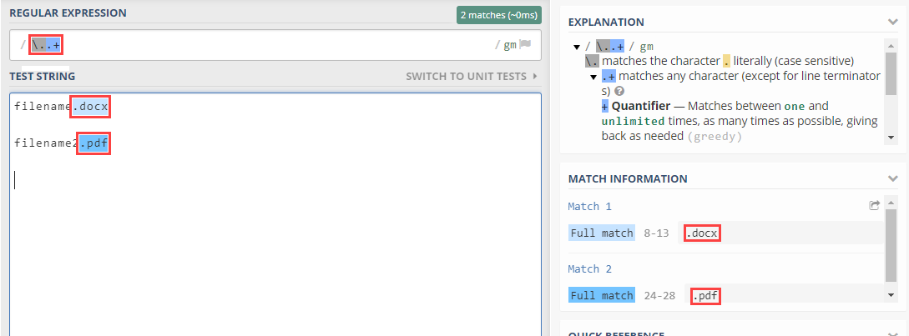
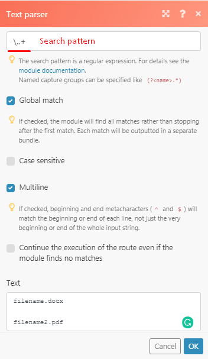
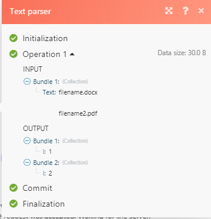
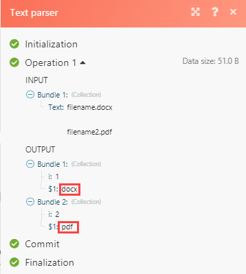

# Felsökning av textparser i [!DNL Adobe Workfront Fusion]

Använd den här informationen om du inte kan hämta en texttolk för att skapa utdata.

## Åtkomstkrav

Du måste ha följande åtkomst för att kunna använda funktionerna i den här artikeln:

<table style="table-layout:auto">
 <col> 
 <col> 
 <tbody> 
  <tr> 
    <td role="rowheader">[!DNL Adobe Workfront] plan*</td> 
   <td> 
[!DNL Pro] eller högre
 </td> 
  </tr> 
  <tr data-mc-conditions=""> 
   <td role="rowheader">[!DNL Adobe Workfront] licens*</td> 
   <td> 
[!UICONTROL Plan], [!UICONTROL Work]
 </td> 
  </tr> 
  <tr> 
   <td role="rowheader">[!UICONTROL Adobe Workfront Fusion] licens**</td> 
   <td>
   
Aktuellt licenskrav: Nej [!DNL Workfront Fusion] krav på licens.

   
eller

   
Gammalt licenskrav: [!UICONTROL [!DNL Workfront Fusion] för automatisering och integrering av arbetet] 

   </td> 
  </tr> 
  <tr> 
   <td role="rowheader">Produkt</td> 
   <td>
   
Aktuellt produktbehov: Om du har [!UICONTROL Select] eller [!UICONTROL Prime] [!DNL Adobe Workfront] Planera, din organisation måste köpa [!DNL Adobe Workfront Fusion] och [!DNL Adobe Workfront] om du vill använda de funktioner som beskrivs i den här artikeln. [!DNL Workfront Fusion] ingår i [!UICONTROL Ultimate] [!DNL Workfront] plan.

   
eller

   
Krav för äldre produkt: Din organisation måste köpa [!DNL Adobe Workfront Fusion] och [!DNL Adobe Workfront] om du vill använda de funktioner som beskrivs i den här artikeln.

   </td> 
  </tr> 
 </tbody> 
</table>

Kontakta [!DNL Workfront] administratör.

För information om [!DNL Adobe Workfront Fusion] licenser, se [[!DNL Adobe Workfront Fusion] licenser](../../workfront-fusion/get-started/license-automation-vs-integration.md).

## Felsökning

Exempel: du vill analysera filtypen för ett fildokument &quot;filename.docx&quot; och filnamnets filtillägg varierar alltid från DOCX till PDF till CSV.

Uttrycket som du kan välja att använda i det här fallet är [!DNL \..+]

Om du skulle använda detta för regex-uttrycket på regex101.com får du en fullständig matchning.

På bilden ovan matchades filtillägget korrekt. Om du tar detta och försöker implementera det i texttolken:

du får ingen matchning:

Anledningen till detta är att &quot;i&quot; endast visar antalet matchningar per matchning, så i det här fallet har vi två matchningar, och efter &quot;i&quot; finns därför ett numeriskt värde på 1 och 2. I det här exemplet används det om du någon gång behöver matcha eller skicka data via ett filter endast med det andra matchade värdet. Du kan ange vilket värde som representeras av det numeriska värdet.

För att kunna hämta de matchningsvärden som du behöver lägga till hakparenteser i den del som du vill analysera (till exempel för att extrahera från&quot;filename.docx&quot; -&quot;docx&quot; enbart), ska hakparenteserna tillämpas på \, enligt det regex-uttryck som vi använder för det här scenariot.(.+)

Detta hämtar DOCX-filen, placerar den i en grupp och lämnar &quot;.&quot; ur det.

I utdata som visas i bilden nedan kommer den hämtade gruppen att matcha alla tecken (förutom radavslutningar).

En annan tillfällig lösning som även innehåller regex är att använda funktionen replace

`{{replace("abcdefghijklmno pqr stuvw xyz.docx"; "/.\./"; ".")}}`

Ersätt sedan `abcdefghijklmno pqr stuvw xyz.docx` med den faktiska filnamnsvariabeln.
