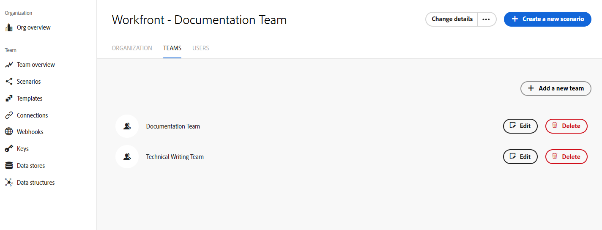

# [!DNL Adobe Workfront Fusion] organisationer och team

Med funktionerna för organisation och team i [!DNL Adobe Workfront Fusion] kan företag styra åtkomsten till scenarier och andra funktioner i Fusion.

## Åtkomstkrav

Du måste ha följande åtkomst för att kunna använda funktionerna i den här artikeln:

<table style="table-layout:auto"> 
 <col> 
 <col> 
 <tbody> 
  <tr> 
    <td role="rowheader">[!DNL Adobe Workfront] plan*</td> 
   <td> 
[!DNL Pro] eller högre
 </td> 
  </tr> 
  <tr> 
   <td role="rowheader">[!UICONTROL Adobe Workfront Fusion] licens**</td> 
   <td>
   
Aktuellt licenskrav: Inget [!DNL Workfront Fusion]-licenskrav.

   
eller

   
Gammalt licenskrav: [!UICONTROL [!DNL Workfront Fusion] för Automatisering och integrering av arbetet], [!UICONTROL [!DNL Workfront Fusion] för Automatisering av arbete]

   </td> 
  </tr> 
  <tr> 
   <td role="rowheader">Produkt</td> 
   <td>
   
Aktuellt produktkrav: Om du har planen [!UICONTROL Select] eller [!UICONTROL Prime] [!DNL Adobe Workfront] måste din organisation köpa både [!DNL Adobe Workfront Fusion] och [!DNL Adobe Workfront] för att kunna använda de funktioner som beskrivs i den här artikeln. [!DNL Workfront Fusion] ingår i planen [!UICONTROL Ultimate] [!DNL Workfront].

   
eller

   
Äldre produktkrav: Din organisation måste köpa [!DNL Adobe Workfront Fusion] och [!DNL Adobe Workfront] för att kunna använda de funktioner som beskrivs i den här artikeln.

   </td> 
  </tr> 
  <tr data-mc-conditions=""> 
   <td role="rowheader">Konfigurationer på åtkomstnivå*</td> 
   <td> 
     
Du måste vara administratör för [!DNL Workfront Fusion] för din organisation.

     
Du måste vara administratör för [!DNL Workfront Fusion] för ditt team.

   </td> 
  </tr> 
 </tbody> 
</table>

Kontakta [!DNL Workfront]-administratören om du vill ta reda på vilken plan, licenstyp eller åtkomst du har.

**Mer information om [!DNL Adobe Workfront Fusion] licenser finns i <a href="../../workfront-fusion/get-started/license-automation-vs-integration.md" class="MCXref xref">[!DNL Adobe Workfront Fusion] licenser </a>

## Organisationer

[!DNL Workfront Fusion] användare tillhör en organisation.

* [Organisationsroller](#organization-roles)
* [Bjuda in användare till en organisation](#inviting-users-to-an-organization)
* [Växla mellan organisationer](#switch-between-organizations)

### Organisationsroller

En användare har en av följande roller i en organisation:

* **[!UICONTROL Owner]**: Ägaren har alla behörigheter som är tillgängliga i organisationen.
* **[!UICONTROL Admin]**: Med administratörsrollen kan en användare skapa och hantera team och användare för organisationen.
* **[!UICONTROL Member]**: Medlemmar kan använda [!DNL Workfront Fusion] men kan inte göra organisatoriska ändringar.
* **[!UICONTROL Accountant]**: En revisorsroll tillåter bara användare att se licensinformation på kontrollpanelen för organisationen.
* **[!UICONTROL App Developer]**: Funktionerna för den här rollen är inte tillgängliga just nu och kommer att göras tillgängliga inom den närmaste framtiden. Vi rekommenderar för närvarande inte att du tilldelar användare till den här rollen.

Mer information om specifika åtgärder som är tillgängliga för användare i respektive organisationsroll finns i [Organisations- och teamroller](/help/quicksilver/workfront-fusion/organizations/organization-roles.md).

### Bjuda in användare till en organisation

Som standard kan en organisationsägare (eller behörig användare) bjuda in en annan person att gå med i organisationen.

Så här bjuder du in en användare till en organisation:

1. Klicka på **[!UICONTROL Change details]** i skärmens övre högra hörn.
1. Välj **[!UICONTROL Invite a new user]**.

   

1. Ange användarens e-postadress och namn.
1. Välj en roll för användaren. Mer information om roller finns i [Organisationsroller](#organization-roles) i det här dokumentet.
1. (Valfritt) Lägg till en anteckning. Den här anteckningen visas i e-postmeddelandet med inbjudan som användaren får.
1. Klicka på **[!UICONTROL Save]**.

[!DNL Fusion] skickar ett e-postmeddelande med en inbjudan till den specifika organisationen och en [!UICONTROL Accept The Role]-knapp.

När mottagaren klickar på knappen dirigeras de om till inbjudningssidan där han/hon kan acceptera inbjudan.

Inbjudan går ut om en dag.

>[!NOTE]
>
>Om användaren inte har använt [!DNL Fusion] tidigare skapar [!DNL Fusion] automatiskt ett konto åt dem och skickar ett e-postmeddelande med ett tillfälligt lösenord som uppmanar den nya användaren att logga in och ändra sitt lösenord.

### Växla mellan organisationer

Du kanske ingår i mer än en organisation i Fusion. Resurser delas inte mellan organisationer.

Du kan växla mellan olika organisationer i Adobe Unified Experience genom att klicka på organisationsnamnet i det övre högra hörnet och välja den nya organisationen i listrutan. Endast organisationer som har ett Fusion-konto visas i listrutan, även om du är medlem i andra organisationer i Adobe.

## Team

Team är grupper av användare som delar åtkomst till särskilda resurser. Resurserna kan omfatta:

* Scenarier
* Anslutningar
* Webhooks
* Tangenter
* Datalager
* Datastrukturer
* Inställningar för e-postmeddelanden

>[!NOTE]
>
>Eftersom team kontrollerar åtkomsten till resurser kan det vara praktiskt att bara ha en medlem. Användare i utbildning kan till exempel skapa anslutningar till sina enskilda [!DNL Google]-konton. Alla teammedlemmar kan också ansluta till det enskilda [!DNL Google]-kontot, så i det här fallet är det bäst att användaren är den enda medlemmen i ett utbildningsteam.

Organisationer kan ha så många team de behöver, och användarna kan tillhöra ett eller flera team.

Användarna kan välja sitt team i listrutan i den vänstra navigeringspanelen. Användare ser bara team som de är medlemmar i. Om du väljer ett team kan användaren komma åt teamets resurser.

* [Teamroller](#team-roles)
* [Teamhantering](#team-management)

### Teamroller

En användare har en av följande roller i varje team:

* **[!UICONTROL Team Admin]**: Förutom funktionerna för de andra teamrollerna kan användaren lägga till, ta bort eller ändra rollen för en teammedlem med administratörsrollen.
* **[!UICONTROL Team Member]**: Teammedlemsrollen tillåter användare att skapa och köra scenarier.
* **[!UICONTROL Team Monitoring]**: Med rollen [!UICONTROL monitoring] kan användare få åtkomst till körningsinformation för scenarier, men de kan inte utforma scenarier eller ändra statusen Aktiv.
* **[!UICONTROL Team Operator]**: Med rollen [!UICONTROL operator] kan användare se körningsdata och ändra statusen Aktiv för scenarier.
* **[!UICONTROL Team Restricted Member]**: Funktionerna för den här rollen är inte tillgängliga just nu och kommer att göras tillgängliga inom den närmaste framtiden. Vi rekommenderar för närvarande inte att du tilldelar användare till den här rollen.

Mer information om specifika åtgärder som är tillgängliga för användare i varje teamroll finns i [Organisations- och teamroller](/help/quicksilver/workfront-fusion/organizations/organization-roles.md).

### Teamhantering

* [Skapa ett team](#create-a-team)
* [Ange alternativ för teammeddelanden](#set-team-notification-options)

#### Skapa ett team

Organisationsägare och administratörer kan skapa team.

Så här skapar du ett team:

1. Klicka på **[!UICONTROL Organization]** i den vänstra navigeringspanelen
1. Välj fliken **[!UICONTROL Team]**.
1. Klicka på **[!UICONTROL Add a new team]** i listan över team.
1. Ange ett namn för det nya teamet och klicka på **Lägg till**.

#### Ange alternativ för teammeddelanden

>[!NOTE]
>
>Om din organisation har flyttats till Enhetligt gränssnitt får du meddelanden via meddelandeområdet i Adobe. Du måste använda gränssnittet Enhetligt gränssnitt för att kunna se meddelanden i meddelandeområdet i Adobe.
>
>Om du vill använda Unified Shell Experience, inklusive meddelandeområdet i Adobe, klickar du på knappen Testa nytt Fusion-gränssnitt i Unified Experience i den övre delen av sidan. Den här knappen är bara tillgänglig om din organisation har flyttat till det enhetliga skalet.
>
>Mer information finns i [Få åtkomst till dina meddelanden](/help/quicksilver/workfront-fusion/fusion-in-admin-console/fusion-unified-experience.md#access-your-notifications) i [!DNL Adobe Unified Experience] för [!DNL Workfront Fusion].

Alternativen för e-postmeddelanden anges på teamnivå.

1. Klicka på **[!UICONTROL Team]** i den vänstra navigeringspanelen
1. Välj fliken **[!UICONTROL Notification Options]**.
1. Aktivera de meddelanden som du vill att teamet ska ta emot.

   <table style="table-layout:auto"> 
    <col> 
    <col> 
    <tbody> 
     <tr> 
      <td role="rowheader">[!UICONTROL Warning in scenario run]</td> 
      <td> 
Få ett e-postmeddelande när det finns en varning i en scenariokörning
 </td> 
     </tr> 
     <tr> 
      <td role="rowheader">[!UICONTROL Errors in scenario run]</td> 
      <td>Få ett e-postmeddelande när ett fel uppstår i en scenariokörning.</td> 
     </tr> 
     <tr> 
      <td role="rowheader"> 
[!UICONTROL Scenario deactivation]
 </td> 
      <td>
Få ett e-postmeddelande när ett scenario inaktiveras.

<b>Obs!</b> Du meddelas bara om scenarioinaktivering när scenariot har inaktiverats automatiskt på grund av fel. Du får inga meddelanden om scenarier som inaktiveras manuellt.

I vissa fall kan ett scenario inaktiveras av [!DNL Workfront Fusion]-tekniker eftersom scenariot orsakar prestandaproblem eller andra problem. I dessa fall får du inga meddelanden i [!DNL Workfront Fusion]. 
</td>

</tr>
</tbody>
</table>

Ändringar av meddelandealternativen sparas automatiskt

#### Växla mellan team

Du kanske ingår i mer än ett team i Fusion. Eftersom team inte delar resurser kan du behöva byta team för att få tillgång till specifika scenarier eller andra resurser.

Om din organisation inte är med i Adobe Unified Experience kan du byta team genom att klicka på teamnamnet i den vänstra navigeringen och sedan välja ett team i listrutan.

Om ditt team är med i Adobe Unified Experience kan du välja ett nytt team genom att klicka på teamnamnet i huvudet och sedan välja ett team i listrutan. Det här alternativet är tillgängligt från alla sidor som är specifika för ett visst team, till exempel en scenariosida eller sidan Anslutningar.

<!--

  

-->