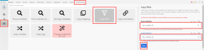

# Lägga till ett filter i ett scenario i [!DNL Adobe Workfront Fusion]

I vissa scenarier behöver du bara arbeta med paket som uppfyller specifika kriterier. Med filter kan du välja dessa paket.

<!--

For example, you could create a scenario with the [!UICONTROL Watch records] trigger for [!DNL Salesforce] to capture only records containing a specific word written by a specific author.

-->

Du kan lägga till ett filter mellan två moduler och kontrollera om paket som tagits emot från de föregående modulerna uppfyller specifika filtervillkor:

* Om de gör det skickas paketen vidare till nästa modul i scenariot.
* Om de inte gör det avslutas behandlingen för paketen.

## Åtkomstkrav

Du måste ha följande åtkomst för att kunna använda funktionerna i den här artikeln:

<table style="table-layout:auto">
 <col> 
 <col> 
 <tbody> 
  <tr> 
    <td role="rowheader">[!DNL Adobe Workfront] plan*</td> 
   <td> 
[!DNL Pro] eller högre
 </td> 
  </tr> 
  <tr data-mc-conditions=""> 
   <td role="rowheader">[!DNL Adobe Workfront] licens*</td> 
   <td> 
[!UICONTROL Plan], [!UICONTROL Work]
 </td> 
  </tr> 
  <tr> 
   <td role="rowheader">[!UICONTROL Adobe Workfront Fusion] licens**</td> 
  <td> 
[!UICONTROL [!DNL Workfront Fusion] för automatisering och integrering av arbetet] 

[!UICONTROL [!DNL Workfront Fusion] for Work Automation] 
  </td>    </tr> 
  </tr> 
  <tr> 
   <td role="rowheader">Produkt</td> 
   <td>Din organisation måste köpa [!DNL Adobe Workfront Fusion] och [!DNL Adobe Workfront] om du vill använda de funktioner som beskrivs i den här artikeln.</td> 
  </tr> 
 </tbody> 
</table>

Kontakta [!DNL Workfront] administratör.

För information om [!DNL Adobe Workfront Fusion] licenser, se [[!DNL Adobe Workfront Fusion] licenser](../../workfront-fusion/get-started/license-automation-vs-integration.md).

## Förutsättningar

Du måste lägga till båda modulerna i ett scenario innan du kan lägga till ett filter mellan dem.

## Lägg till ett filter mellan två moduler:

1. Klicka **[!UICONTROL Scenarios]**  i den vänstra panelen markerar du scenariot för att öppna det.
1. Klicka i fönstrets övre högra hörn på **[!UICONTROL Edit]**.
1. Klicka på kopplingslinjen mellan modulerna.
1. I rutan som visas skriver du **[!UICONTROL Label]** för filtret.
1. Definiera ett filter **[!UICONTROL Condition]**.

   Du kan ange en eller två operander i de två rutorna. Om du anger operander i båda rutorna kan du välja en operator i listrutan mellan dem för att ange relationen mellan dem.

   >[!TIP]
   >
   >I operandfälten kan du ange värden på samma sätt som du skulle mappa dem, vilket beskrivs i [Mappa information från en modul till en annan i [!DNL Adobe Workfront Fusion]](../../workfront-fusion/mapping/map-information-between-modules.md).

   Om du till exempel vill att filtret ska söka efter filer i [!DNL Adobe Workfront] avsluta med XML och skicka vidare dem till [!DNL Dropbox]ska du skriva **[!UICONTROL File name]** i den första rutan och .**[!UICONTROL xml]** i den andra rutan. I listrutan mellan dem väljer du **[!UICONTROL Ends with (case insensitive)]**. Det här filtret gäller inkommande paket från den första modulen (Workfront). Endast paket som innehåller XML-filer överförs till nästa modul ([!DNL Dropbox]).

   

1. Klicka på **[!DNL OK]**.

## Kopiera ett filter

Scenarioredigeraren innehåller för närvarande ingen funktion för att kopiera ett filter.

>[!NOTE]
>
>Om du kopierar modulerna på någon sida av filtret kopieras även filtret.
>
>Mer information om att kopiera moduler finns i [Kopiera moduler eller scenarier i [!DNL Adobe Workfront Fusion]](../../workfront-fusion/scenarios/copy-modules-or-scenarios.md)

Om du vill kopiera ett filter utan att kopiera moduler kan du använda [!DNL Google] Krom för följande lösning:

1. Installera [!UICONTROL [!DNL Adobe Workfront Fusion] DevTool Chrome] tillägg.
1. I [!DNL Workfront Fusion]öppnar du scenariot.
1. Klicka på Chrome-menyn med tre punkter och klicka sedan på **[!UICONTROL More tools*]* > **[!UICONTROL Developer tools]**.

1. I [!UICONTROL Developer tools] som visas på menyraden längst upp klickar du på [!UICONTROL Workfront Fusion] -fliken.

   

1. Klicka på **[!UICONTROL Tools]** icon  till vänster.

1. Klicka **[!UICONTROL Copy Filter]** och sedan konfigurera **[!UICONTROL Copy Filter]** i den högra panelen:

   1. Ange **[!UICONTROL Source Module]** som modulen direkt efter det filter du vill kopiera.
   1. Ange **[!UICONTROL Target Module]** som modulen precis före det filter du vill kopiera.

1. Klicka på **[!UICONTROL Run]**.
