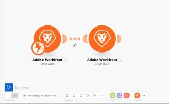

# Scenarioredigeraren i [!DNL Adobe Workfront Fusion]

Med scenarioredigeraren kan du skapa och redigera scenarier i ett visuellt gränssnitt.

## Åtkomstkrav

Du måste ha följande åtkomst för att kunna använda funktionerna i den här artikeln:

<table style="table-layout:auto"> 
 <col> 
 <col> 
 <tbody> 
  <tr> 
    <td role="rowheader">[!DNL Adobe Workfront] plan*</td> 
   <td> 
[!DNL Pro] eller högre
 </td> 
  </tr> 
  <tr data-mc-conditions=""> 
   <td role="rowheader">[!DNL Adobe Workfront] licens*</td> 
   <td> 
[!UICONTROL Plan], [!UICONTROL Work]
 </td> 
  </tr> 
  <tr> 
   <td role="rowheader">[!UICONTROL Adobe Workfront Fusion] licens**</td> 
   <td> 
[!UICONTROL [!DNL Workfront Fusion] för automatisering och integrering av arbetet] 

[!UICONTROL [!DNL Workfront Fusion] for Work Automation]
  </td> 
  </tr> 
  <tr> 
   <td role="rowheader">Produkt</td> 
   <td>Din organisation måste köpa [!DNL Adobe Workfront Fusion] och [!DNL Adobe Workfront] om du vill använda de funktioner som beskrivs i den här artikeln.</td> 
  </tr> 
 </tbody> 
</table>

Kontakta [!DNL Workfront] administratör.

För information om [!DNL Adobe Workfront Fusion] licenser, se [[!DNL Adobe Workfront Fusion] licenser](../../workfront-fusion/get-started/license-automation-vs-integration.md).

## Öppna scenarioredigeraren:

1. Klicka **[!UICONTROL Scenarios]**  i den vänstra panelen.

1. Om du vill skapa ett scenario klickar du på **[!UICONTROL Create a new scenario]** i det övre högra hörnet på sidan.

   eller

   Om du vill redigera ett befintligt scenario klickar du på scenariot.

1. (Villkorligt) Om du skapar ett nytt scenario, under **[!UICONTROL What services do you want to integrate]**, välj de program du vill arbeta med i scenariot och klicka sedan på **[!UICONTROL Continue]**.

   eller

   Klicka **[!UICONTROL Skip]** om du hellre vill välja programmen i scenarioredigeraren.

   I scenarioredigeraren som visas kan du göra allt som anges i tabellen nedan. Mer information finns i [Skapa ett scenario i [!DNL Adobe Workfront Fusion]](../../workfront-fusion/scenarios/create-a-scenario.md).

1. När du är klar med redigeringen av ett scenario (eller när som helst medan du redigerar) klickar du på knappen [!UICONTROL Save] ikon. 

   >[!NOTE]
   >
   >När du har sparat ditt scenario kommer en ny version att finnas tillgänglig under menyn med tre punkter om du behöver komma åt den i framtiden. Tidigare sparade versioner är endast tillgängliga i 60 dagar.

## Tillgängliga scenarioredigeringsåtgärder

<table style="table-layout:auto"> 
<tbody>
  <tr>
     <td role="rowheader">Lägg till den första modulen</td>
     <td> 
Klicka på frågetecknet. 
 
 Leta reda på och klicka sedan på programmet eller tjänsten som du vill börja med. Om du valde några appar i steg 2 visas de här för enkel åtkomst (och i <strong>[!UICONTROL Favorites]</strong> längst ned på skärmen).
 </td>
  </tr>
  <tr>
     <td role="rowheader">Lägga till en modul</td>
     <td>Håll pekaren över en modul, klicka på plusikonen till höger och klicka sedan på den modul du vill använda på menyn som visas.</td>
  </tr>  
  <tr>   
     <td role="rowheader">Ange när och hur ofta scenariot ska köras</td>  
      <td> 
Klicka på klockikonen. 
 
  
 
Mer information finns i <a href="../../workfront-fusion/scenarios/schedule-a-scenario.md" class="MCXref xref">Schemalägg ett scenario i [!DNL Adobe Workfront Fusion]</a>.
 </td>
  </tr>  
  <tr>
     <td role="rowheader">Ställ in ett flöde</td>   
     <td> 
Klicka på [!UICONTROL wrench] icon  mellan de två modulerna och använd något av följande alternativ:
    
       <ul>
         <li><strong>[!UICONTROL Set up a filter]</strong>: Kontrollera vilka paket som används vid vissa punkter i scenariot. Mer information finns i <a href="../../workfront-fusion/scenarios/add-a-filter-to-a-scenario.md" class="MCXref xref">Lägga till ett filter i ett scenario i [!DNL Adobe Workfront Fusion]</a>.</li>     
         <li><strong>[!UICONTROL Unlink]</strong>: Tar bort en väg.</li>     
         <li><strong>[!UICONTROL Add a router]</strong>: Lägger till en router mellan moduler. </li>     
         <li><strong>[!UICONTROL Add a module]</strong>: Lägger till en ny modul mellan moduler.</li>     
         <li><strong>[!UICONTROL Add a note]</strong>: Lägger till en anteckning i flödet.</li>   
       </ul> 
     </td>  
  </tr>  
  <tr>  
     <td role="rowheader">Ta bort en modul</td>   
     <td>Högerklicka på modulen och klicka sedan på <strong>[!UICONTROL Delete module]</strong>.</td>  
   </tr>  
   <tr> 
     <td role="rowheader">Visa en logg över händelser som inträffar är ett scenario</td>     
     <td> 
       
Kör ett scenario. När scenariot är klart visas loggen i det nedre högra hörnet av [!UICONTROL Scenario Editor]. 
 
  
 
Beroende på scenariot kan loggen innehålla information om svårigheterna i varje fas och eventuella fel som uppstått under körningen av scenariot.
 
     </td>  
   </tr>  
   <tr>   
     <td role="rowheader">Konfigurera scenarioinställningarna</td>   
     <td>Klicka på [!UICONTROL Scenario settings] ikon.  De här inställningarna är främst avsedda för avancerade användare.</td>  
   </tr>  
   <tr>   
     <td role="rowheader">Skriv eller visa anteckningar om scenariot</td>   
     <td>Klicka på [!UICONTROL Notes] ikon. </td>  
   </tr>  
   <tr> 
     <td role="rowheader">Justera modulernas layout automatiskt </td>   
     <td>Klicka på [!UICONTROL Auto-align] ikon. </td>  </tr>  <tr>   <td role="rowheader">Visa en animering som visar hur data flödar genom scenariot</td>   <td>Klicka på [!UICONTROL Explain Flow] ikon. </td>  
   </tr>  
   <tr> 
     <td role="rowheader">Exportera scenariot till datorn som en plan</td>   
     <td>Klicka på [!UICONTROL More] meny och sedan klicka [!UICONTROL Export Blueprint].</td>  
   </tr>  
   <tr>   
     <td role="rowheader">Importera en scenarioplan från datorn</td>   
     <td>Klicka på [!UICONTROL More] meny och sedan klicka [!UICONTROL Import Blueprint].</td>  
   </tr>  
   <tr>   
     <td role="rowheader">Återställa en tidigare version av scenariot</td>   
     <td>Se artikeln <a href="../../workfront-fusion/scenarios/restore-a-scenario-version.md" class="MCXref xref">Återställa en scenarioversion i [!DNL Adobe Workfront Fusion]</a>.</td>  
   </tr>  
   <tr> 
     <td role="rowheader">Konfigurera [!UICONTROL Flow Control] inställningar</td>   
     <td> 
Klicka på [!UICONTROL Flow Control] ikon.  Du kan ställa in en uppgift så att den upprepas ett visst antal gånger, konvertera en array till en serie paket och sammanfoga flera paket till ett enda paket. Mer information finns i <a href="../../workfront-fusion/apps-and-their-modules/flow-control.md" class="MCXref xref">Flödeskontroll in [!DNL Adobe Workfront Fusion]</a>.
 </td>  
   </tr>  
   <tr> 
     <td role="rowheader">Förbättra scenariot med avancerade verktyg</td>   
     <td>Klicka på [!UICONTROL Tools] ikon.  Du kan skapa utlösare, åtgärder, aggregatorer och transformatorer. Mer information finns i <a href="../../workfront-fusion/apps-and-their-modules/tools-modules.md" class="MCXref xref">verktyg</a>.</td>  
   </tr>  
   <tr> 
     <td role="rowheader">Använda textanalysverktyg</td>   
     <td>Klicka på [!UICONTROL Text parser] ikon.  Du kan hämta element från HTML-kod, söka efter och extrahera strängelement som matchar ett sökmönster, söka efter och ersätta text och"skrapa" data från en webbplats. Mer information finns i <a href="../../workfront-fusion/apps-and-their-modules/tools-modules.md" class="MCXref xref">verktyg</a>.</td>  
   </tr>  
   <tr> 
     <td role="rowheader">Få tillgång till de mest använda programmen och tjänsterna</td>   
     <td> Klicka på en ikon i <strong>[!UICONTROL Favorites]</strong> längst ned på skärmen. Ikoner visas automatiskt i det här avsnittet när du lägger till program och tjänster i ditt scenario. Du kan också klicka på ikonen Lägg till  om du vill lägga till program och tjänster i det här området manuellt.</td>  
   </tr>  
   <tr> 
     <td role="rowheader">Testkör scenariot</td>   
     <td>Klicka <strong>[!UICONTROL Run once]</strong> för att verifiera att scenariot fungerar som du tänkt dig innan du aktiverar det. När det är aktiverat körs scenariot enligt dess schema. Om allt inte fungerar som det ska kan du gå till avsnittet Felhantering och lära dig hur du hanterar fel.</td> 
   </tr> 
</tbody>
