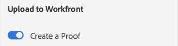

# Överför [!DNL XD] ritytor som korrektur till [!DNL Workfront]

Du kan överföra ritytorna som korrektur direkt till [!DNL Adobe Workfront] för en grundlig granskning och godkännande.

## Åtkomstkrav

Du måste ha följande åtkomst för att kunna utföra stegen i den här artikeln:

<table style="table-layout:auto"> 
 <col> 
 <col> 
 <tbody> 
  <tr> 
   <td role="rowheader">[!DNL Adobe Workfront] plan*</td> 
   <td> 
Aktuell plan: [!UICONTROL Pro] eller högre
 
eller
 
Äldre plan: [!UICONTROL Premium]
 
Mer information om åtkomst till korrektur med olika planer finns i .
 </td> 
  </tr> 
  <tr> 
   <td role="rowheader">[!DNL Adobe Workfront] licens*</td> 
   <td> 
Aktuell plan: [!UICONTROL Work] eller [!UICONTROL Proof]
 
Äldre plan: Valfritt (Du måste ha språkkontroll aktiverat för användaren)
 </td> 
  </tr> 
  <tr> 
   <td role="rowheader">Produkt</td> 
   <td>Du måste ha en [!DNL Adobe Creative Cloud] utöver en [!DNL Workfront] licens.</td> 
  </tr> 
  <tr> 
   <td role="rowheader">Behörighetsprofil för korrektur </td> 
   <td>[!UICONTROL Manager] eller högre</td> 
  </tr> 
  <tr> 
   <td role="rowheader">Objektbehörigheter</td> 
   <td> 
Redigera åtkomst till [!UICONTROL Documents]
 
Mer information om hur du begär ytterligare åtkomst finns i <a href="../../workfront-basics/grant-and-request-access-to-objects/request-access.md" class="MCXref xref">Begär åtkomst till objekt </a>.
 </td> 
  </tr> 
 </tbody> 
</table>

&#42;Kontakta din [!DNL Workfront] eller [!DNL Workfront Proof] administratör.

## Förutsättningar

* Du måste installera [!DNL Adobe Workfront for XD] plugin-program innan du kan överföra korrektur i [!DNL Adobe XD].

   Instruktioner finns i [Installera [!DNL Adobe Workfront for XD]](/help/quicksilver/workfront-integrations-and-apps/adobe-workfront-for-creative-cloud/wf-adobe-xd-install.md).

## Överför ett statiskt korrektur

1. Klicka på **[!UICONTROL Menu]** ikonen i det övre högra hörnet och välj **[!UICONTROL Work List]**. Du kan också använda menyn för att navigera till överordnade objekt.

   

1. Gå till arbetsuppgiften där du vill överföra ett statiskt korrektur.
1. Klicka på **[!UICONTROL Document]** icon  i navigeringsfältet.

1. Klicka **[!UICONTROL New File]** nära plug-ins nederkant.
1. Markera de ritytor som du vill överföra.

   >[!TIP]
   >
   >Om du vill markera mer än en rityta klickar du och drar musen över de ritytor du vill använda.

1. Aktivera **[!UICONTROL Create a Proof]**.

1. Ge korrekturet ett namn.

1. Välj vilken typ av korrekturgodkännande du vill ha:

   <table style="table-layout:auto"> 
    <col> 
    <col> 
    <tbody> 
     <tr> 
      <td role="rowheader">[!UICONTROL Basic]: </td> 
      <td> 
De grundläggande godkännandeprocesserna är tillfälliga och kan omfatta olika granskare efter behov: 
 
       <ul> 
        <li> 
(Valfritt) Lägg till <strong>Godkännare</strong> i lådan.
 </li> 
       </ul> </td> 
     </tr> 
     <tr> 
      <td role="rowheader">[!UICONTROL Automated]</td> 
      <td> 
Automatiska godkännandeprocesser är färdiga av administratörer och innehåller specifika granskare och faser. Mer information finns i <a href="../../review-and-approve-work/proofing/proofing-overview/automated-workflow.md" class="MCXref xref">Översikt över automatiserat arbetsflöde</a>.
 
       <ul> 
        <li> 
Välj en [!UICONTROL Workflow Template] i listrutan.
 </li> 
       </ul> </td> 
     </tr> 
    </tbody> 
   </table>

1. (Valfritt) Skriv en kommentar i **[!UICONTROL Updates]** område.

   

1. Välj exportformat på menyn **[!UICONTROL Asset Type]** nedrullningsbar meny.

1. (Valfritt) Om du väljer PDF som resurstyp och har markerat mer än en rityta väljer du om du vill exportera ritytorna som **[!UICONTROL Single PDF file]s** eller **M[!UICONTROL ultiple PDF files]**.

1. (Valfritt) Ge PDF ett namn.

   

1. Klicka på **[!UICONTROL Upload]**.\
   Dokumentet visas i [!UICONTROL Documents] i plugin-programmet och datorprogrammet.

## Överför ett interaktivt korrektur {#upload-an-interactive-proof}

Du kan skapa ett interaktivt korrektur för ritytorna med [!DNL Workfront for Adobe] plugin. Det är en tvåstegsprocess. Först måste du skapa en interaktiv länk, sedan måste du överföra korrekturet till en arbetsuppgift.

### Skapa en interaktiv länk för ritytan  {#create-an-interactive-link-for-your-art-board}

1. Öppna ritytan och klicka sedan **[!UICONTROL Share]** i skärmens övre vänstra del.
1. Ange länkinställningarna:

   1. Namnge länken.
   1. Välj en visningsinställning.
   1. I **[!UICONTROL Link Access]** -sektion, kontrollera **[!UICONTROL Anyone with this link]** är markerat.

      Du måste aktivera den här typen av åtkomst för att kunna generera ett interaktivt korrektur.

   1. Klicka på **[!UICONTROL Create Link]**.

1. Klicka tillbaka till **[!UICONTROL Design]** i skärmens övre vänstra del. Fortsätt till [Överför ett interaktivt korrektur](#upload-an-interactive-proof) nedan.

   >[!NOTE]
   >
   >Du kan behöva öppna plugin-panelen igen i det nedre vänstra hörnet av skärmen.

### Överför ett interaktivt korrektur

1. Klicka på **[!UICONTROL Menu]** ikonen i det övre högra hörnet och välj **[!UICONTROL Work List]**. Du kan också använda menyn för att navigera till överordnade objekt.

   

1. Gå till arbetsuppgiften där du vill ladda upp ett interaktivt korrektur.
1. Klicka på **[!UICONTROL Document]** icon  i navigeringsfältet.

1. Klicka **[!UICONTROL New File]** nära plug-ins nederkant.
1. Aktivera **[!UICONTROL Create a Proof]**.

1. Välj vilken typ av korrekturgodkännande du vill ha:

   <table style="table-layout:auto"> 
    <col> 
    <col> 
    <tbody> 
     <tr> 
      <td role="rowheader">[!UICONTROL Basic]: </td> 
      <td> 
De grundläggande godkännandeprocesserna är tillfälliga och kan omfatta olika granskare efter behov: 
 
       <ul> 
        <li> 
(Valfritt) Lägg till <strong>Godkännare</strong> i lådan.
 </li> 
       </ul> </td> 
     </tr> 
     <tr> 
      <td role="rowheader">[!UICONTROL Automated]</td> 
      <td> 
Automatiska godkännandeprocesser är färdiga av administratörer och innehåller specifika granskare och faser. Mer information finns i <a href="../../review-and-approve-work/proofing/proofing-overview/automated-workflow.md" class="MCXref xref">Översikt över automatiserat arbetsflöde</a>.
 
       <ul> 
        <li> 
Välj en [!UICONTROL Workflow Template] i listrutan.
 </li> 
       </ul> </td> 
     </tr> 
    </tbody> 
   </table>

1. (Valfritt) Skriv en kommentar i **[!UICONTROL Updates]** område.

   

1. I **[!UICONTROL Asset Type]** väljer du länken som du nyss skapade i listrutan **Delade länkar** -fliken. Mer information finns i [Skapa en interaktiv länk för ritytan](#create-an-interactive-link-for-your-artboard).\
   

1. Klicka på **[!UICONTROL Upload]**.

   Dokumentet visas i [!UICONTROL Documents] i plugin-programmet och datorprogrammet.

   >[!IMPORTANT]
   >
   >Användarna måste ha tillgång till [!UICONTROL Desktop Proofing Viewer] för att granska och godkänna interaktiva korrektur. Mer information finns i [Installera [!UICONTROL Desktop Proofing Viewer]](../../review-and-approve-work/proofing/use-the-desktop-proofing-viewer/installing-desktop-proofing-viewer.md).

## Överför en ny korrekturversion

Du kan överföra en ny version av ett korrektur. Plugin-programmet kommer ihåg det korrekturinställda arbetsflödet som angetts i den tidigare versionen, men du kan ändra det om du vill.

1. Klicka på **[!UICONTROL Menu]** ikonen i det övre högra hörnet och välj **[!UICONTROL Work List]**. Du kan också använda menyn för att navigera till överordnade objekt.

   

1. Gå till den arbetsuppgift som du behöver överföra ett dokument till.
1. Klicka på **[!UICONTROL Document]** icon i navigeringsfältet.

1. Klicka **[!UICONTROL New Version]** nära plug-ins nederkant.
1. Aktivera **[!UICONTROL Create a Proof]**.
1. Markera de ritytor som du vill överföra.

   >[!NOTE]
   >
   >Om du vill överföra en ny version av en svg-, png- eller jpg-fil kan du bara överföra en rityta.

1. Välj vilken typ av korrekturgodkännande du vill ha:

   <table style="table-layout:auto"> 
    <col> 
    <col> 
    <tbody> 
     <tr> 
      <td role="rowheader">[!UICONTROL Basic]: </td> 
      <td> 
De grundläggande godkännandeprocesserna är tillfälliga och kan omfatta olika granskare efter behov: 
 
       <ul> 
        <li> 
(Valfritt) Lägg till <strong>Godkännare</strong> i lådan.
 </li> 
       </ul> </td> 
     </tr> 
     <tr> 
      <td role="rowheader">[!UICONTROL Automated]</td> 
      <td> 
Automatiska godkännandeprocesser är färdiga av administratörer och innehåller specifika granskare och faser. Mer information finns i <a href="../../review-and-approve-work/proofing/proofing-overview/automated-workflow.md" class="MCXref xref">Översikt över automatiserat arbetsflöde</a>.
 
       <ul> 
        <li> 
Välj en [!UICONTROL Workflow Template] i listrutan.
 </li> 
       </ul> </td> 
     </tr> 
    </tbody> 
   </table>

1. Välj exportformat på menyn **[!UICONTROL Asset Type]** nedrullningsbar meny.

   

1. (Valfritt) Skriv en kommentar i **[!UICONTROL Updates]** område.

   

1. (Valfritt) Om du väljer PDF som resurstyp och har markerat mer än en rityta väljer du om du vill exportera ritytorna som **[!UICONTROL Single PDF file]s** eller **M[!UICONTROL ultiple PDF files]**.

1. (Valfritt) Ge PDF ett namn.

   

1. Klicka på **[!UICONTROL Upload]**.\
   Dokumentet visas i [!UICONTROL Documents] i plugin-programmet och datorprogrammet.
