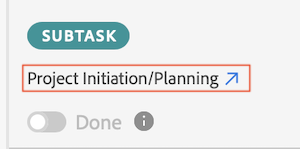

# Markera arbetsobjekt som slutförda med plugin-programmet [!DNL Adobe Workfront]

Du kan stanna i följande [!DNL Adobe Creative Cloud]-program och slutföra ditt arbete i [!DNL Adobe Workfront] med plugin-programmet:

{{cc-app-list}}

## Åtkomstkrav

+++ Expandera om du vill visa åtkomstkrav för funktionerna i den här artikeln.

<table style="table-layout:auto"> 
 <col> 
 <col> 
 <tbody> 
  <tr> 
   <!-- <td role="rowheader">[!DNL Adobe Workfront] package</td> 
   <td> 
Any
 </td> 
  </tr> 
  <tr data-mc-conditions=""> 
   <td role="rowheader">[!DNL Adobe Workfront] license</td> 
   <td> 
   
Standard

   
Work or higher
 </td> 
  </tr> 
  <tr> -->
   <td role="rowheader">Ytterligare produkter</td> 
   <td>Du måste ha en [!DNL Adobe Creative Cloud]-licens förutom en [!DNL Workfront]-licens.</td> 
  </tr> 
  <tr> 
   <td role="rowheader">Konfigurationer på åtkomstnivå</td> 
   <td> 
Redigera åtkomst till [!UICONTROL Documents]
 </td> 
  </tr> 
  <tr> 
   <td role="rowheader">Objektbehörigheter</td> 
   <td> 
[!UICONTROL View] åtkomst eller högre till objektet där du vill överföra ett dokument.
 </td> 
  </tr> 
 </tbody> 
</table>

Mer information finns i [Åtkomstkrav i Workfront-dokumentationen](/help/quicksilver/administration-and-setup/add-users/access-levels-and-object-permissions/access-level-requirements-in-documentation.md).

+++

## Förutsättningar

{{cc-install-prereq}}

## Slutför en arbetsuppgift

1. Klicka på ikonen **[!UICONTROL Menu]** i det övre högra hörnet och välj sedan **[!UICONTROL Work List]**. Du kan också använda menyn för att navigera till överordnade objekt.

   

1. Välj den uppgift eller det problem som du vill markera som slutförd i **[!UICONTROL Work List]**.
1. Klicka på **[!UICONTROL Done]**.  Om du är den enda användaren som är tilldelad den här uppgiften eller utgåvan markeras objektet [!UICONTROL Complete] eller [!UICONTROL Resolved] i [!DNL Workfront].
1. (Villkorligt) Om flera användare har tilldelats till den här uppgiften eller problemet, öppnas en listruta när du klickar på [!UICONTROL Done]. Då kan du:

   Klicka på **[!UICONTROL Done with my part]** om andra användare också måste göra sitt arbete för att uppgiften eller utgåvan ska kunna slutföras.

   eller

   Klicka på **[!UICONTROL Complete]** (för aktiviteter) eller **[!UICONTROL Resolved]** (för problem) om ingen ytterligare åtgärd behöver utföras för uppgiften eller problemet. Detta markerar objektet [!UICONTROL Complete] eller [!UICONTROL Resolved] i [!DNL Workfront].

   >[!NOTE]
   >
   >Om arbetsposten har föregångare är knappen Klar grå tills dessa föregångare har markerats som slutförda. Om du vill visa föregående aktiviteter i [!DNL Workfront] klickar du på aktivitetsnamnet.
   >

<!-- I dont think we need this one  -->
