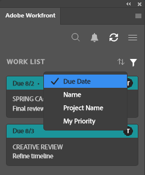
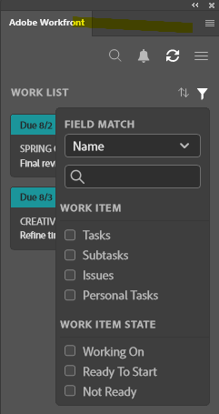

# Hitta ditt arbete med plugin-programmet [!DNL Adobe Workfront]

Hitta det arbete du har tilldelats i [!DNL Adobe Workfront] utan att lämna följande [!DNL Adobe Creative Cloud]-program:

{{cc-app-list}}

## Åtkomstkrav

+++ Expandera om du vill visa åtkomstkrav för funktionerna i den här artikeln.

<table style="table-layout:auto"> 
 <col> 
 <col> 
 <tbody> 
 <!-- <tr> 
   <td role="rowheader">[!DNL Adobe Workfront] package</td> 
   <td> Any</td> 
  </tr> 
  <tr data-mc-conditions=""> 
   <td role="rowheader">[!DNL Adobe Workfront] license</td> 
   <td> 
   
Standard

   
Work or higher
 </td> 
  </tr> -->
  <tr> 
   <td role="rowheader">Ytterligare produkter</td> 
   <td>Du måste ha en [!DNL Adobe Creative Cloud]-licens förutom en [!DNL Workfront]-licens.</td> 
  </tr> 
 </tbody> 
</table>

Mer information finns i [Åtkomstkrav i Workfront-dokumentationen](/help/quicksilver/administration-and-setup/add-users/access-levels-and-object-permissions/access-level-requirements-in-documentation.md).

+++

## Förutsättningar

{{cc-install-prereq}}

## Använd [!UICONTROL Work List] för att komma åt viktig information

Med [!UICONTROL Work List] kan du visa alla uppgifter och utgåvor som tilldelats dig på ett och samma ställe. Du kan använda alternativet [!UICONTROL Sort by] för att gruppera objekt och sedan använda [!UICONTROL Filter] för att fokusera på arbete som behöver slutföras.

### Gruppera liknande arbetsobjekt tillsammans med alternativet [!DNL Sort By]

Använd alternativet [!UICONTROL Sort by] om du vill gruppera liknande objekt i [!UICONTROL Work List]. Du kan sortera efter:

<table style="table-layout:auto"> 
 <col> 
 <col> 
 <tbody> 
  <tr> 
   <td> 
    <ul> 
     <li>[!UICONTROL Due Date]</li> 
     <li>[!UICONTROL Name]</li> 
     <li>[!UICONTROL Project Name]</li> 
     <li>[!UICONTROL My Priority]</li> 
    </ul> </td> 
   <td>  </td> 
  </tr> 
 </tbody> 
</table>

### Begränsa fokus med filter

Använd [!UICONTROL Filter] för att begränsa ditt fokus till specifika arbetsobjekt. Det finns några sätt att använda filtret på:

 

<table style="table-layout:auto"> 
 <col> 
 <col> 
 <tbody> 
  <tr> 
   <td> 
Den första filtreringen baseras enbart på arbetsobjekttyp eller attribut:
 
    <ul> 
     <li><strong>Arbetsobjekt</strong>: Uppgifter, underaktiviteter, ärenden eller personliga uppgifter</li> 
     <li><strong>Tillstånd för arbetsobjekt</strong>: [!UICONTROL Working On], [!UICONTROL Ready to Start] eller [!UICONTROL Not Ready]</li> 
    </ul> 
Det andra är att filtrera med hjälp av arbetsuppgiftens och arbetsuppgiftens tillstånd tillsammans. Du kan till exempel välja Uppgifter och [!UICONTROL Ready to Start] för att hitta alla uppgifter i din arbetslista som är klara för arbete.
 
Du kan också använda [!UICONTROL Field Match] för att söka efter ett visst objekt i filteruppsättningen. 
 </td> 
   <td>  </td> 
  </tr> 
 </tbody> 
</table>

## Sök efter ditt arbete

Använd fältet [!UICONTROL Search] för att hitta projekt, uppgifter, utgåvor och dokument som du behöver.

<table style="table-layout:auto"> 
 <col> 
 <col> 
 <tbody> 
  <tr> 
   <td> 
    <ul> 
     <li>Se de senaste objekten: Du kan visa upp till 5 av de senaste arbetsuppgifterna som du fått tillgång till via Workfront eller plugin-programmen.</li> 
     <li>Hitta fästa objekt: Du kan komma åt projekt, uppgifter, utgåvor och dokument som du har fastnat i den nya Adobe Workfront-upplevelsen.</li> 
     <li>Hitta dina favoriter: Du kan visa projekt, uppgifter, utgåvor eller dokument som du sparat som favoriter.</li> 
    </ul> </td> 
   <td>  </td> 
  </tr> 
 </tbody> 
</table>

## Använd [!UICONTROL Menu] för att navigera i projekt

Du kan använda ikonen [!UICONTROL Menu] för att navigera till överordnade objekt i ett projekt.

