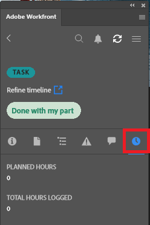

# Loggtid med plugin-programmet [!DNL Adobe Workfront]

Du kan logga tid för projekt, uppgifter och problem som du arbetar med direkt i något av följande [!DNL Adobe Creative Cloud]-program:

{{cc-app-list}}

## Åtkomstkrav

+++ Expandera om du vill visa åtkomstkrav för funktionerna i den här artikeln.

Du måste ha följande åtkomst för att kunna utföra stegen i den här artikeln:

<table style="table-layout:auto"> 
 <col> 
 <col> 
 <tbody> 
  <tr> 
   <!--<td role="rowheader">[!DNL Adobe Workfront] plan*</td> 
   <td> 
[!UICONTROL Pro] or higher
 </td> 
  </tr> 
  <tr data-mc-conditions=""> 
   <td role="rowheader">[!DNL Adobe Workfront] license*</td> 
   <td> 
[!UICONTROL Work] or [!UICONTROL Plan]
 </td> 
  </tr> 
  <tr> 
   <td role="rowheader">Product</td> 
   <td>You must have an [!DNL Adobe Creative Cloud] license in addition to a [!DNL Workfront] license.</td> 
  </tr> -->
  <tr> 
   <td role="rowheader">Konfigurationer på åtkomstnivå*</td> 
   <td> 
[!UICONTROL Edit] behörighet till uppgifter eller problem
 
Obs! Om du fortfarande inte har åtkomst frågar du [!DNL Workfront]-administratören om de anger ytterligare begränsningar för din åtkomstnivå. Mer information om hur en [!DNL Workfront]-administratör kan ändra din åtkomstnivå finns i <a href="../../administration-and-setup/add-users/configure-and-grant-access/create-modify-access-levels.md" class="MCXref xref">Skapa eller ändra anpassade åtkomstnivåer</a>.
 </td> 
  </tr> 
  <tr> 
   <td role="rowheader">Objektbehörigheter</td> 
   <td> 
[!UICONTROL Log Hours] behörighet till uppgiften eller utfärdandet
 
Mer information om hur du begär ytterligare åtkomst finns i <a href="../../workfront-basics/grant-and-request-access-to-objects/request-access.md" class="MCXref xref">Begär åtkomst till objekt </a>.
 </td> 
  </tr> 
 </tbody> 
</table>

&#42;Kontakta [!DNL Workfront]-administratören om du vill ta reda på vilken plan, licenstyp eller åtkomst du har.

+++

## Förutsättningar

{{cc-install-prereq}}

## Loggtid med Adobe Workfront plugin

Administratören [!DNL Workfront] avgör vilka projektspecifika timtyper som är tillgängliga enligt beskrivningen i [Hantera timtyper](../../administration-and-setup/set-up-workfront/configure-timesheets-schedules/hour-types.md).

Så här loggar du tid med Workfront-plugin-programmet:

1. Klicka på ikonen **[!UICONTROL Menu]** i det övre högra hörnet och välj sedan **[!UICONTROL Work List]**. Du kan också använda menyn för att navigera till överordnade objekt.

   

1. I **[!UICONTROL Work List]** väljer du det arbetsobjekt du vill logga in på.
1. Klicka på **[!UICONTROL Time]** i navigeringsfältet.

   

1. (Valfritt) Välj **[!UICONTROL Hour Type]** i listrutan.
1. Ange tiden i timmar för den dag du behöver.

   

1. Klicka på **[!UICONTROL Submit]**.
