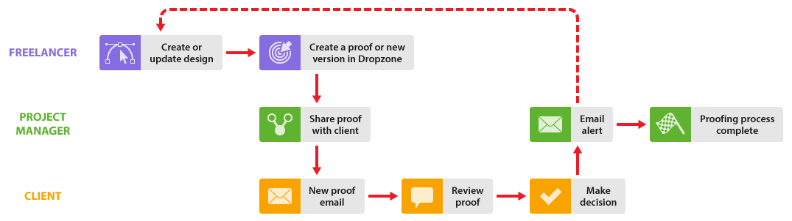

# Arbeta med frilansare i [!DNL Workfront Proof]

>[!IMPORTANT]
>
>Den här artikeln hänvisar till funktionalitet i den fristående produkten [!DNL Workfront Proof]. Mer information om korrektur i [!DNL Adobe Workfront] finns i [Korrektur](../../../review-and-approve-work/proofing/proofing.md).

Om din organisation arbetar med frilansare kan du även inkludera dem i din [!DNL Workfront Proof]-process.

Det finns några sätt att göra detta beroende på om du vill att frilansaren ska vara en del av din organisation i [!DNL Workfront Proof] eller inte:

## Lägg till frilansare till ditt [!DNL Workfront Proof]-konto

Du kan bara lägga till dina frilansare som användare i ditt konto i [!DNL Workfront Proof], precis som du gör med dina kollegor, så kan de ingå i alla arbetsflöden som beskrivs i det här avsnittet.

Du kan använda de olika användarprofilerna samt mappsekretessreglerna för att hantera din Freelancers synlighet och åtkomst i ditt konto.

Läs artiklarna [Användarprofiler och behörigheter](https://support.workfront.com/hc/https://support.workfront.com/hc/en-us/articles/115004087428-User-profiles-and-permissions) och [Förstå mappbehörigheter i [!DNL Workfront Proof]](../../../workfront-proof/wp-work-proofsfiles/organize-your-work/folder-permissions.md) innan du lägger till en frilansare som användare i ditt konto.

Mer information om hur du lägger till en frilansare i ditt team finns i [Skapa användare med  [!DNL Workfront Proof]](../../../workfront-proof/wp-mnguserscontacts/users/create-users.md).

>[!NOTE]
>
>Frilansare som har lagts till i ditt konto som användare kommer att ha synlighet i ditt konto och kan även se klientinformation (beroende på deras användarprofil). Det här kanske inte är vad du vill, så det kanske är bättre att konfigurera ett satellitkonto för dina frilansare. Se [Konfigurera ett satellitkonto för dina frilansare](https://support.workfront.com/knowledge/articles/115004259868/en-us?brand_id=662728&return_to=%2Fhc%2Fen-us%2Farticles%2F115004259868#Option-B---set-up-a-satellite-account-for-your-freelancers) nedan.

## Konfigurera ett satellitkonto för dina frilansare

Om du inte vill att klienter och frilansare ska se varandra i [!DNL Workfront Proof] kan du konfigurera satellitkonton för dina frilansare.

Det innebär att de får en egen kontrollpanel där alla objekt som de arbetar med visas på ett och samma ställe. Dessutom kan de skicka filer till dig via [!DNL Workfront Proof], som du kan konvertera till korrektur ([!UICONTROL Enterprise]- och [!UICONTROL Unlimited]-planer). Mer information finns i [Hantera filer i [!DNL Workfront Proof]](../../../workfront-proof/wp-work-proofsfiles/manage-your-work/manage-files.md).

Det innebär också att om frilansaren behöver skapa nya versioner av korrekturet under granskningsprocessen kan du lägga till dem explicit i korrekturet som en [!UICONTROL Author], vilket gör att de kan delta i granskningsprocessen och skapa nya versioner vid behov. Mer information finns i och [Hantera korrekturroller i [!DNL Workfront Proof]](../../../workfront-proof/wp-work-proofsfiles/share-proofs-and-files/manage-proof-roles.md).

1. Frilansaren loggar in på sitt satellitkonto.
1. Frilansaren överför filen och delar den med dig. Se [Överför filer och webbinnehåll till [!DNL Workfront Proof]](../../../workfront-proof/wp-work-proofsfiles/create-proofs-and-files/upload-files-web-content.md) och [Dela filer i [!DNL Workfront Proof]](../../../workfront-proof/wp-work-proofsfiles/share-proofs-and-files/share-files.md).

1. Du får ett e-postmeddelande om att en fil har delats med dig.
1. Du loggar in på ditt konto och söker efter filen som har delats med dig.
1. Du använder knappen [!UICONTROL convert to proof] för att konvertera filen till ett korrektur. Mer information finns i [Hantera filer i [!DNL Workfront Proof]](../../../workfront-proof/wp-work-proofsfiles/manage-your-work/manage-files.md).
1. Sedan hanterar du korrekturarbetsflödet med dina kunder på normalt sätt. Om du vill lägga till din Freelancer explicit i korrekturet kan du göra det med delningsfunktionen. Mer information finns i [Dela ett korrektur i [!DNL Workfront Proof]](../../../workfront-proof/wp-work-proofsfiles/share-proofs-and-files/share-proof.md).
1. Om du inte vill lägga till din Freelancer explicit i korrekturet, men du vill meddela dem när det har godkänts. Du kan meddela din frilansare när korrekturprocessen är slut genom att dela en länk till korrekturet med dem.

   Det innebär att de inte ingår i granskningsteamet och att dina kunder inte ser sitt namn på korrekturet.

Mer information om hur du konfigurerar ett satellitkonto för dina frilansare finns i [Konfigurera ett satellitkonto i [!DNL Workfront Proof]](../../../workfront-proof/wp-acct-admin/satellite-accounts/configure-sat-acct-in-wp.md).

## Använd [!UICONTROL Dropzone]

Det här alternativet är användbart om du inte vill att klienter och frilansare ska se varandra i [!DNL Workfront Proof]. Du kan ge dina frilansare åtkomst till din [!UICONTROL Dropzone] (endast tillgänglig för [!UICONTROL Enterprise]- och [!UICONTROL Unlimited]-planer). Mer information finns i [The [!UICONTROL Dropzone]](../../../workfront-proof/wp-work-proofsfiles/create-proofs-and-files/dropzone.md).

1. Frilansaren går till din offentliga [!UICONTROL Dropzone]-sida.
1. De använder [!UICONTROL Dropzone] för att skapa ett nytt bevis i ditt konto.
1. Du får ett e-postmeddelande om att det finns ett nytt korrektur i [!UICONTROL Dropzone].
1. Du loggar in på ditt konto och hittar beviset i din [!UICONTROL Dropzone].
1. Du låser upp korrekturet, lägger till granskare, anger korrekturinställningarna och hanterar korrekturarbetsflödet med dina kunder på det normala sättet. Din frilansare visas som skapare av beviset (och kan inte tas bort).

* Du kan hantera din frilansares åtkomst till korrekturet med dina [!UICONTROL Dropzone]-inställningar. Mer information finns i [Konfigurera dropzone i [!DNL Workfront Proof]](../../../workfront-proof/wp-acct-admin/account-settings/configure-dropzone-in-wp.md).
* Du kan också hantera rollen som de ges på beviset, t.ex. [!UICONTROL Read Only], samt e-postkommunikation med dem när det gäller beviset. Mer information finns i [Hantera korrekturroller i [!DNL Workfront Proof]](../../../workfront-proof/wp-work-proofsfiles/share-proofs-and-files/manage-proof-roles.md).
* Om du inte vill att din frilansare ska delta i granskningsprocessen, men du vill att de ska meddelas om det slutliga beslutet, kan du ange standardkorrekturrollen i inställningarna för [!UICONTROL Dropzone] och en e-postavisering för alla [!UICONTROL Dropzone] som skickar in [Hantera korrekturroller i  [!DNL Workfront Proof]](../../../workfront-proof/wp-work-proofsfiles/share-proofs-and-files/manage-proof-roles.md) respektive [Konfigurera e-postaviseringsinställningar i  [!DNL Workfront Proof]](../../../workfront-proof/wp-emailsntfctns/email-alerts/config-email-notification-settings-wp.md). Mer information finns i [E-postaviseringar,](https://support.workfront.com/hc/en-us/sections/115000911867-Email-alerts) [Hantera korrekturroller i [!DNL Workfront Proof]](../../../workfront-proof/wp-work-proofsfiles/share-proofs-and-files/manage-proof-roles.md) och [Konfigurera e-postaviseringsinställningar i [!DNL Workfront Proof]](../../../workfront-proof/wp-emailsntfctns/email-alerts/config-email-notification-settings-wp.md).
* Om du vill att din frilansare aktivt ska delta i granskningsprocessen kan du justera deras korrekturroller och e-postaviseringsinställningar efter behov genom att redigera dessa uppgifter på sidan Korrekturinformation. Mer information om den sidan finns i [Hantera korrekturinformation i [!DNL Workfront Proof]](../../../workfront-proof/wp-work-proofsfiles/manage-your-work/manage-proof-details.md)
