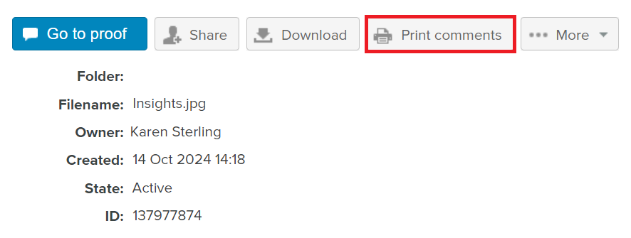
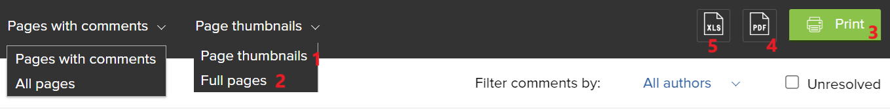

# Skriv ut och exportera kommentarer i [!DNL Workfront Proof]

<!-- Audited: 4/2025 -->

>[!IMPORTANT]
>
>Den här artikeln hänvisar till funktionalitet i den fristående produkten [!DNL Workfront Proof]. Mer information om korrektur i [!DNL Adobe Workfront] finns i [Korrektur](../../../review-and-approve-work/proofing/proofing.md).

## Skriva ut kommentarer

Kommentarssammanfattningen kan nås direkt från följande områden:

* [Proof Viewer](#the-proof-viewer)
* [Sidan med korrekturinformation](#the-proof-details-page)
* [Menyn  [!DNL Proof] Åtgärder](#the-proof-actions-menu)

### Proof Viewer {#the-proof-viewer}

Du kan skriva ut korrekturets kommentarsammanfattning, inklusive miniatyrbilder eller en fullbildsbild av korrekturet, genom att klicka på ikonen **[!UICONTROL Print]** i korrekturläsaren.

Du öppnar korrekturläsaren genom att klicka på knappen **Gå till korrektur** på sidan med korrekturinformation.

### Sidan med korrekturinformation {#the-proof-details-page}

Du kan skriva ut korrekturens kommentarsammanfattning genom att klicka på ikonen **[!UICONTROL Print]** på sidan Korrekturinformation.

Om du vill få åtkomst till sidan med korrekturinformation för ett visst korrektur klickar du på korrekturets namn i listvyn.

### Menyn [!DNL Proof]-åtgärder {#the-proof-actions-menu}

Du kan skriva ut korrekturens kommentarsammanfattning genom att klicka på ikonen **[!UICONTROL Print]** på menyn [!UICONTROL Proof actions].

Så här kommer du åt sidan [!UICONTROL Comments Summary] från en listvy:

1. Klicka på menyn **[!UICONTROL Actions]**.
1. Välj **[!UICONTROL Print comments]**.

   

   På sidan Sammanfattning av kommentarer väljer du bland följande utskriftsalternativ:

   * Miniatyrbildsvy (1)
   * Helsidesvy (2)
   * Skriv ut sidan (3)
   * Exportera korrekturet med kommentarer till en PDF-fil (4)
   * Exportera korrekturkommentarerna till en [!DNL Excel]-fil (5)

### Miniatyrbildsvisning

I miniatyrbildsvyn visas varje kommentar i ordning med den fullständiga tråden för varje kommentar. Du kan också sortera kommentarer och se miniatyrbilden för varje kommentar med tillagda markeringar.

Om du vill skriva ut miniatyrbildsvyn klickar du på ikonen **[!UICONTROL Printer]** i det övre högra hörnet på sidan och väljer något av följande:

* Sortera efter kommentar-ID eller sida (1)
* Miniatyrbild för varje kommentar med tillagda markeringar (2)

### Helsidesvy

I helsidesvyn visas varje sida i ordning med kommentarerna på den sidan och ett häftstift som anger var kommentaren finns.

Om du vill skriva ut helsidesvyn klickar du på ikonen **[!UICONTROL Printer]** i det övre högra hörnet på sidan.

## Exportera en [!DNL Excel]-sammanfattning

Så här exporterar du sammanfattningen [!DNL Excel] från menyn Korrekturåtgärder:

1. Klicka på ikonen **Åtgärder** till höger om korrekturet och välj sedan **[!UICONTROL [!DNL Excel] summary]**.
   

Så här hämtar du sammanfattningen [!DNL Excel] från sidan Korrekturinformation:

1. Klicka på knappen **Mer** och välj sedan **Exportera till Excel**.

   

## Exportera till PDF

När du exporterar till en PDF-fil visas alla kommentarer i PDF Reader. Om en kommentar har flera kopplade markeringar visas kommentaren flera gånger i kommentarlistan (en gång för varje markering).

>[!IMPORTANT]
>
>Funktionen Exportera till PDF är bara tillgänglig för statiska filer.

Så här exporterar du ett korrektur med markeringar och kommentarer till PDF:

1. Klicka på **[!UICONTROL Views]** till vänster på skärmen.
1. Klicka på knappen **[!UICONTROL More]** i linje med det specifika korrekturet och välj sedan **[!UICONTROL Print comments]**.

1. Klicka på knappen **Exportera till PDF** längst upp till höger på sidan. PDF börjar ladda ned och mejlas till dig när allt är klart.
